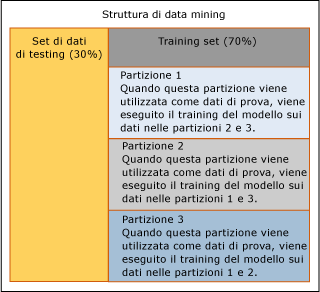

# Convalida incrociata (Analysis Services - Data mining)
  *Convalida incrociata* è un strumento standard di analisi e costituisce un'importante funzionalità per lo sviluppo e l'ottimizzazione dei modelli di data mining. Viene utilizzata dopo la creazione di una struttura di data mining e dei relativi modelli per determinare la validità del modello e  prevede le applicazioni seguenti:  
  
-   Convalida dell'affidabilità di un determinato modello di data mining.  
  
-   Valutazione di più modelli da una sola istruzione.  
  
-   Compilazione di più modelli e successiva identificazione del miglior modello in base alle statistiche.  
  
 In questa sezione viene descritto come utilizzare le funzionalità della convalida incrociata per il data mining e come interpretarne i risultati per un singolo modello o per più modelli basati su un solo set di dati.  
  
## Panoramica del processo di convalida incrociata  
 La convalida incrociata è costituita da due fasi, training e generazione dei risultati. Queste fasi includono i passaggi seguenti:  
  
-   Selezionare una struttura di data mining di destinazione.  
  
-   Specificare i modelli da testare. Questo passaggio è facoltativo; è possibile testare anche solo la struttura di data mining.  
  
-   Specificare i parametri per il test dei modelli di cui è stato eseguito il training.  
  
    -   Attributo stimabile, valore stimato e soglia di accuratezza.  
  
    -   Numero di riduzioni in cui partizionare i dati della struttura o del modello.  
  
-   [!INCLUDE[ssASnoversion](../../includes/ssasnoversion-md.md)] crea un numero di modelli equivalente al numero di riduzioni e ne esegue il training.  
  
-   [!INCLUDE[ssASnoversion](../../includes/ssasnoversion-md.md)] restituisce un set di metriche di accuratezza per ogni riduzione di ogni modello o per l'intero set di dati.  
  
## Configurazione della convalida incrociata  
 È possibile personalizzare la modalità di funzionamento della convalida incrociata per controllare il numero di sezioni incrociate, i modelli testati e la barra di accuratezza per le stime. Se si utilizzano le stored procedure della convalida incrociata, è anche possibile specificare il set di dati utilizzato per la convalida dei modelli. Queste numerose possibilità indicano che è possibile produrre facilmente molti set di risultati differenti che devono quindi essere confrontati e analizzati.  
  
 In questa sezione vengono fornite informazioni per consentire una configura appropriata della convalida incrociata.  
  
### Impostazione del numero di partizioni  
 Specificando il numero di partizioni, determinare il numero di modelli temporanei che verrà creato. Per ogni partizione, una sezione incrociata dei dati viene contrassegnata per l'utilizzo come set di test e viene creato un nuovo modello eseguendo il training sui dati rimanenti non presenti nella partizione. Questo processo viene ripetuto finché in [!INCLUDE[ssASnoversion](../../includes/ssasnoversion-md.md)] non viene creato e testato il numero specificato di modelli. I dati specificati come disponibili per la convalida incrociata vengono distribuiti in modo uniforme in tutte le partizioni.  
  
 Nell'esempio nel diagramma viene illustrato l'utilizzo dei dati se vengono specificate tre riduzioni.  
  
   
  
 Nello scenario nel diagramma, la struttura di data mining contiene un set di dati di controllo utilizzato per il testing, ma il set di dati di test non è stato incluso per la convalida incrociata. Di conseguenza, per la convalida incrociata vengono utilizzati tutti i dati nel set di dati di training, ovvero il 70% dei dati nella struttura di data mining. Il report della convalida incrociata mostra il numero totale di case utilizzato in ogni partizione.  
  
 È anche possibile specificare la quantità di dati utilizzata durante la convalida incrociata, specificando il numero totale di case da utilizzare. I case vengono distribuiti in modo uniforme in tutte le riduzioni.  
  
 Per le strutture di data mining archiviate in un'istanza di SQL Server [!INCLUDE[ssASnoversion](../../includes/ssasnoversion-md.md)], il valore massimo che è possibile impostare per il numero di riduzioni è 256 o il numero di case, a seconda del valore minore. Se si sta utilizzando una struttura di data mining della sessione, il numero massimo di riduzioni è 10.  
  
> [!NOTE]  
>  Aumentando il numero di riduzioni, il tempo necessario per eseguire la convalida incrociata aumenta di conseguenza, poiché è necessario generare e testare un modello per ogni riduzione. Si possono verificare problemi di prestazioni se il numero di riduzioni è troppo elevato.  
  
### Impostazione della soglia di accuratezza  
 La soglia di stato consente di impostare la barra di accuratezza per le stime. Per ogni caso, il modello calcola una probabilità, denominata *probabilità di stima*di correttezza dello stato stimato. Se la probabilità di stima supera la barra di accuratezza, la stima viene conteggiata come corretta. In caso contrario, viene conteggiata come scorretta. Questo valore viene controllato impostando la **Soglia di stato** su un numero compreso tra 0,0 e 1,0, dove i numeri più vicini a 1 indicano un alto livello di confidenza nelle stime, mentre i numeri più vicini a 0 indicano che è meno probabile che la stima sia vera. Il valore predefinito della soglia di stato è NULL, che indica che lo stato stimato con la probabilità più elevata viene considerato come valore di destinazione.  
  
 È necessario tenere presente che l'impostazione per la soglia di stato influisce sulle misure di accuratezza del modello. Ad esempio, si supponga di avere tre modelli da sottoporre a test. Tutti sono basati sulla stessa struttura di data mining e tutti stimano la colonna [Bike Buyer]. Si desidera stimare inoltre un solo valore di 1, per indicare che "sì, comprerà". I tre modelli restituiscono stime con probabilità di 0,05, 0,15 e 0,8. Se si imposta la soglia di stato su 0,10, due delle stime vengono conteggiate come corrette. Se si imposta la soglia di stato su 0,5, solo un modello viene conteggiato come modello che ha restituito una stima corretta. Se si utilizza il valore predefinito, null, la stima più probabile viene conteggiata come corretta. In questo caso, tutte e tre le stime verrebbero conteggiate come corrette.  
  
> [!NOTE]  
>  È possibile impostare un valore di 0,0 per la soglia, ma il valore non è significativo, in quanto ogni stima verrà conteggiata come corretta, anche quelle con probabilità zero. Fare attenzione a non impostare inavvertitamente la **Soglia di stato** su 0,0.  
  
### Scelta di modelli e colonne da convalidare  
 Quando si usa la scheda **Convalida incrociata** in Progettazione modelli di data mining, è necessario innanzitutto selezionare la colonna stimabile da un elenco. In genere, una struttura di data mining può supportare numerosi modelli di data mining, che non utilizzano tutti la stessa colonna stimabile. Quando si esegue la convalida incrociata, solo i modelli che utilizzano la stessa colonna stimabile possono essere inclusi nel report.  
  
 Per scegliere un attributo stimabile, fare clic su **Attributo di destinazione** e selezionare la colonna dall'elenco. Se l'attributo di destinazione è una colonna nidificata o una colonna in una tabella nidificata, è necessario digitare il nome della colonna nidificata utilizzando il formato \<nome tabella nidificata > (chiave).\< Colonna nidificata >. Se l'unica colonna utilizzata della tabella nidificata è la colonna chiave, è possibile utilizzare \<nome tabella nidificata > (chiave).  
  
 Dopo che l'attributo stimabile è stato selezionato, in [!INCLUDE[ssASnoversion](../../includes/ssasnoversion-md.md)] vengono testati automaticamente tutti i modelli che utilizzano lo stesso attributo. Se l'attributo di destinazione contiene valori discreti, dopo avere selezionato la colonna stimabile è possibile digitare uno stato di destinazione nel caso sia presente un valore specifico da stimare.  
  
 La selezione dello stato di destinazione influisce sulle misure restituite. Se si specifica un attributo di destinazione, ovvero un nome di colonna, e non si sceglie un valore specifico che il modello dovrebbe stimare, per impostazione predefinita il modello verrà valutato in base alla stima dello stato più probabile.  
  
 Quando si usa la convalida incrociata con modelli di clustering, non è disponibile alcuna colonna stimabile ma è necessario selezionare **#Cluster** dall'elenco nella casella di riepilogo **Attributo di destinazione** . Dopo avere selezionato questa opzione, altre opzioni non attinenti ai modelli di clustering, ad esempio **Stato di destinazione**, sono disabilitate. [!INCLUDE[ssASnoversion](../../includes/ssasnoversion-md.md)] eseguirà quindi il test di tutti i modelli di clustering associati alla struttura di data mining.  
  
## Strumenti per la convalida incrociata  
 È possibile utilizzare la convalida incrociata da Progettazione modelli di data mining oppure eseguire la convalida incrociata tramite l'esecuzione di stored procedure.  
  
 Se si utilizzano gli strumenti di Progettazione modelli di data mining per eseguire la convalida incrociata, è possibile configurare i parametri di training e risultati di accuratezza in una sola finestra di dialogo. Ciò semplifica la configurazione e la visualizzazione dei risultati. È possibile misurare l'accuratezza di tutti i modelli di data mining correlati a una sola struttura di data mining, quindi visualizzare immediatamente i risultati in un report HTML. Tuttavia, le stored procedure offrono alcuni vantaggi, ad esempio le personalizzazioni aggiunte e la possibilità di inserire il processo in uno script.  
  
### Convalida incrociata nella Progettazione modelli di data mining  
 È possibile eseguire la convalida incrociata tramite la scheda **Convalida incrociata** della vista Grafico accuratezza modello di data mining in [!INCLUDE[ssManStudioFull](../../includes/ssmanstudiofull-md.md)] o SQL Server Development Studio.  
  
 Per un esempio della creazione di un report di convalida incrociata utilizzando l'interfaccia utente, vedere [Creare un report di convalida incrociata](../../analysis-services/data-mining/create-a-cross-validation-report.md).  
  
### Stored procedure di convalida incrociata  
 Per gli utenti esperti, la convalida incrociata è anche disponibile sotto forma di stored procedure di sistema con parametri completi. È possibile eseguire le stored procedure connettendosi a un'istanza da [!INCLUDE[ssManStudioFull](../../includes/ssmanstudiofull-md.md)], o da qualsiasi applicazione in codice gestito.  
  
 Le stored procedure sono raggruppate per tipo di modello di data mining. Un set di stored procedure può essere utilizzato solo con modelli di clustering. L'altro set di stored procedure può essere utilizzato con altri modelli di data mining.  
  
 Per ogni tipo di modello di data mining, cluster o non cluster, le stored procedure eseguono la convalida incrociata in due fasi separate.  
  
 **Partizionamento dei dati e generazione delle metriche per le partizioni**  
  
 Per la prima fase, viene chiamata una stored procedure di sistema che crea tante partizioni quante specificate nel set di dati e restituisce i risultati di accuratezza per ciascuna partizione. Per ciascuna metrica, viene quindi calcolata la media e la deviazione standard per le partizioni.  
  
-   [SystemGetCrossValidationResults &#40;Analysis Services - Data mining&#41;](../../analysis-services/data-mining/systemgetcrossvalidationresults-analysis-services-data-mining.md)  
  
-   [SystemGetClusterCrossValidationResults &#40;Analysis Services - Data mining&#41;](../../analysis-services/data-mining/systemgetclustercrossvalidationresults-analysis-services-data-mining.md)  
  
 **Generazione delle metriche per l'intero set di dati**  
  
 Nella seconda fase, viene chiamato un set diverso di stored procedure. Queste stored procedure non partizionano il set di dati, bensì generano risultati di accuratezza per l'intero set di dati specificato. Se una struttura di data mining è già stata partizionata ed elaborata, è possibile chiamare questo secondo set di stored procedure per ottenere i risultati.  
  
-   [SystemGetAccuracyResults &#40;Analysis Services - Data mining&#41;](../../analysis-services/data-mining/systemgetaccuracyresults-analysis-services-data-mining.md)  
  
-   [SystemGetClusterAccuracyResults &#40;Analysis Services - Data mining&#41;](../../analysis-services/data-mining/systemgetclusteraccuracyresults-analysis-services-data-mining.md)  
  
#### Definizione dei dati di testing  
 Quando si eseguono le stored procedure di convalida incrociata che calcolano l'accuratezza, SystemGetAccuracyResults o SystemGetClusterAccuracyResults, è possibile specificare l'origine dei dati utilizzata per il testing durante la convalida incrociata. Questa opzione non è disponibile nell'interfaccia utente.  
  
 È possibile specificare come origine dati di test qualsiasi delle opzioni seguenti:  
  
-   Utilizzare solo i dati di training.  
  
-   Includere un set di dati di testing esistente.  
  
-   Utilizzare solo il set di dati di testing.  
  
-   Applicare i filtri esistenti a ogni modello.  
  
-   Qualsiasi combinazione di set di training, set di testing e filtri dei modelli.  
  
 Per specificare un'origine dati di testing, fornire un valore intero per il parametro **DataSet** della stored procedure. Per un elenco dei valori di argomento, vedere la sezione Osservazioni dell'argomento di riferimento della stored procedure in questione.  
  
 Se si esegue la convalida incrociata usando il report **Convalida incrociata** in Progettazione modelli di data mining, non è possibile modificare il set di dati usato. Per impostazione predefinita, vengono utilizzati i case di training per ogni modello. Se un filtro è associato a un modello, il filtro viene applicato.  
  
## Risultati della convalida incrociata  
 Se si utilizza Progettazione modello di data mining, questi risultati vengono visualizzati in un visualizzatore Web di tipo griglia. Se si utilizzano le stored procedure di convalida incrociata, gli stessi risultati sono restituiti sotto forma di tabella.  
  
 Il report contiene due tipi di misure: aggregazioni che indicano la variabilità del set di dati quando è diviso in riduzioni e misure specifiche del modello di accuratezza per ogni riduzione. Negli argomenti seguenti vengono fornite ulteriori informazioni su tali metriche.  
  
 [Formule per la convalida incrociata](../../analysis-services/data-mining/cross-validation-formulas.md)  
  
 Vengono elencate tutte le misure in base al tipo di test. Viene descritto in generale come è possibile interpretare le misure.  
  
 [Misure nel report di convalida incrociata](../../analysis-services/data-mining/measures-in-the-cross-validation-report.md)  
  
 Vengono descritte le formule per calcolare ogni misura e viene elencato il tipo di attributo a cui è possibile applicare ogni misura.  
  
## Restrizioni sulla convalida incrociata  
 Se si esegue la convalida incrociata utilizzando il report relativo disponibile in SQL Server Development Studio, occorre considerare alcune limitazioni che si applicano ai modelli che è possibile testare e ai parametri che è possibile impostare.  
  
-   Per impostazione predefinita, su tutti i modelli associati alla struttura di data mining selezionata viene eseguita la convalida incrociata. Non è possibile specificare il modello o un elenco di modelli.  
  
-   La convalida incrociata non è supportata da modelli basati sull'algoritmo Microsoft Time Series o Microsoft Sequence Clustering.  
  
-   Non è possibile creare il report se la struttura di data mining non contiene alcun modello che possa essere testato dalla convalida incrociata.  
  
-   Se la struttura di data mining contiene sia modelli di clustering che modelli non cluster e non si sceglie l'opzione **#Cluster** , i risultati per entrambi i tipi di modelli vengono visualizzati nello stesso report, anche se l'attributo, lo stato e le impostazioni della soglia potrebbero non essere adatti per i modelli di clustering.  
  
-   Alcuni valori dei parametri sono limitati. Se il numero di riduzioni è maggiore di 10, ad esempio, viene visualizzato un avviso perché la generazione di un numero elevato di modelli può provocare un rallentamento nella visualizzazione del report.  
  
 Se si stanno testando più modelli di data mining e i modelli dispongono di filtri, ogni modello viene filtrato separatamente. Non è possibile aggiungere un filtro a un modello o modificare il filtro per un modello durante la convalida incrociata.  
  
 Poiché per impostazione predefinita la convalida incrociata testa tutti i modelli di data mining associati a una struttura, si potrebbero ottenere risultati incoerenti se alcuni modelli dispongono di un filtro e altri no. Per confrontare solo i modelli che hanno lo stesso filtro, è necessario utilizzare le stored procedure e specificare un elenco di modelli di data mining. In alternativa, utilizzare solo il set di test della struttura di data mining senza filtri per assicurare che venga utilizzato un set di dati coerente per tutti i modelli.  
  
 Se si esegue la convalida incrociata tramite le stored procedure, è inoltre possibile scegliere l'origine dei dati di testing. Se si esegue la convalida incrociata tramite Progettazione modello di data mining, è necessario utilizzare il set di dati di testing associato al modello o alla struttura, se presente. In genere, se si desidera specificare impostazioni avanzate, è necessario utilizzare le stored procedure di convalida incrociata.  
  
 Non è possibile utilizzare la convalida incrociata con modelli di tipo Time Series o Sequence Clustering. In particolare, nessun modello che contiene una colonna KEY TIME o KEY SEQUENCE può essere incluso nella convalida incrociata.  
  
## Contenuto correlato  
 Per ulteriori informazioni sulla convalida incrociata o sui metodi correlati per il test di modelli di data mining, ad esempio i grafici di accuratezza, vedere gli argomenti seguenti.  
  
|Argomento|Collegamenti|  
|------------|-----------|  
|Viene descritto come impostare i parametri di convalida incrociata in SQL Server Sviluppo Studio.|[Scheda Convalida incrociata &#40;Grafico accuratezza modello di data mining&#41;](http://msdn.microsoft.com/library/bd215a68-1ad7-4046-9c44-ec8e2be13a64)|  
|Viene descritta la metrica fornita dalla convalida incrociata.|[Formule per la convalida incrociata](../../analysis-services/data-mining/cross-validation-formulas.md)|  
|Viene illustrato il formato del report di convalida incrociata e vengono definite le misure statistiche fornite per ogni tipo di modello.|[Misure nel report di convalida incrociata](../../analysis-services/data-mining/measures-in-the-cross-validation-report.md)|  
|Vengono elencate le stored procedure per il calcolo delle statistiche di convalida incrociata.|[Stored procedure di data mining &#40;Analysis Services - Data mining&#41;](../../analysis-services/data-mining/data-mining-stored-procedures-analysis-services-data-mining.md)|  
|||  
|Viene descritto come creare un set di dati di testing per le strutture di data mining e i modelli correlati.|[Set di dati di training e di testing](../../analysis-services/data-mining/training-and-testing-data-sets.md)|  
|Vedere gli esempi di altri tipi di grafici di accuratezza.|[Matrice di classificazione &#40;Analysis Services - Data mining&#41;](../../analysis-services/data-mining/classification-matrix-analysis-services-data-mining.md)   [Grafico di accuratezza &#40;Analysis Services - Data mining&#41;](../../analysis-services/data-mining/lift-chart-analysis-services-data-mining.md)   [Grafico dei profitti &#40;Analysis Services - Data mining&#41;](../../analysis-services/data-mining/profit-chart-analysis-services-data-mining.md)   [Grafico a dispersione &#40;Analysis Services - Data mining&#41;](../../analysis-services/data-mining/scatter-plot-analysis-services-data-mining.md)|  
|Vengono descritti i passaggi per la creazione di vari grafici di accuratezza.|[Attività e procedure di test e convalida &#40;data mining&#41;](../../analysis-services/data-mining/testing-and-validation-tasks-and-how-tos-data-mining.md)|  
  
## Vedere anche  
 [Test e convalida &#40;Data mining&#41;](../../analysis-services/data-mining/testing-and-validation-data-mining.md)  
  
  
