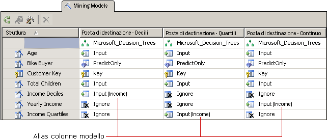

# Personalizzare struttura e modelli di data mining
  Dopo avere selezionato un algoritmo adatto alle esigenze aziendali, è possibile personalizzare il modello di data mining nei modi seguenti per migliorarne potenzialmente i risultati.  
  
-   Utilizzare colonne di dati diverse nel modello o modificare l'utilizzo, il tipo di contenuto o il metodo di discretizzazione delle colonne.  
  
-   Creare filtri per il modello di data mining per limitare i dati utilizzati per il training del modello.  
  
-   Modificare l'algoritmo utilizzato per analizzare dati.  
  
-   Impostare i parametri dell'algoritmo per determinare soglie, divisioni dell'albero e altre condizioni importanti.  
  
 In questo argomento vengono descritte queste opzioni.  
  
## Modifica dei dati utilizzati dal modello  
 Le decisioni adottate in relazione alle colonne di dati da utilizzare nel modello e alle modalità di utilizzo e di elaborazione dei dati possono influire significativamente sui risultati dell'analisi. Negli argomenti seguenti vengono fornite informazioni che semplificano la comprensione di tali scelte.  
  
### Utilizzo della selezione delle funzionalità  
 Nella maggior parte degli algoritmi di data mining di [!INCLUDE[ssASnoversion](../../includes/ssasnoversion-md.md)] viene usato un processo denominato *selezione delle caratteristiche* per selezionare solo gli attributi più utili da aggiungere a un modello. La riduzione del numero di colonne e di attributi può migliorare le prestazione e la qualità del modello. I metodi disponibili per la selezione delle funzionalità differiscono a seconda dell'algoritmo scelto.  
  
 [Selezione delle caratteristiche &#40;Data mining&#41;](../../analysis-services/data-mining/feature-selection-data-mining.md).  
  
### Modifica dell'utilizzo  
 È possibile modificare le colonne incluse in un modello di data mining e la modalità di utilizzo di ciascuna colonna. Se non si ottengono i risultati previsti, è necessario esemplificare le colonne utilizzate come input e considerare se si tratta della scelta corretta e se è possibile migliorare la gestione dei dati, ad esempio:  
  
-   Individuare variabili di categoria etichettate erroneamente come numeri.  
  
-   Aggiungere categorie per comprimere il numero di attributi e semplificare l'individuazione delle correlazioni.  
  
-   Modificare la modalità in cui i numeri sono suddivisi in contenitori, o discretizzati.  
  
-   Rimuovere le colonne che dispongono di molti valori univoci o quelle che contengono in realtà dati di riferimento non utili per l'analisi, ad esempio indirizzi o secondi nomi.  
  
 Non è necessario rimuovere fisicamente le colonne dalla struttura di data mining, ma è sufficiente contrassegnarle come **Ignora**. La colonna viene rimossa dal modello di data mining, ma continuerà a essere utilizzata da altri modelli di data mining della struttura o come riferimento in una query drill-through.  
  
### Creazione di alias per le colonne del modello  
 Quando [!INCLUDE[ssASnoversion](../../includes/ssasnoversion-md.md)] crea il modello di data mining, usa gli stessi nomi di colonna presenti nella struttura di data mining. È possibile aggiungere un alias a qualsiasi colonne del modello di data mining. Questo può facilitare la comprensione del contenuto o dell'utilizzo della colonna oppure rendere il nome più corto per semplificare la creazione delle query. Gli alias sono anche utili quando si desidera creare una copia di una colonna e assegnarle un nome descrittivo.  
  
 Per creare un alias modificare la proprietà **Name** della colonna del modello di data mining. [!INCLUDE[ssASnoversion](../../includes/ssasnoversion-md.md)] continua a usare il nome originale come ID della colonna e il nuovo valore digitato come **Nome** diventa l'alias della colonna e viene visualizzato nella griglia tra parentesi accanto all'uso della colonna.  
  
   
  
 Nell'illustrazione vengono mostrati i modelli correlati che dispongono di più copie di una colonna della struttura di data mining, tutti correlati a Income. Ogni copia della colonna della struttura è stata discretizzata in modo diverso. I modelli nel diagramma usano ciascuno una colonna diversa dalla struttura di data mining. Tuttavia, per facilitare il confronto delle colonne attraverso i modelli, la colonna in ogni modello è stata rinominata come [**Income**].  
  
### Aggiunta di filtri  
 È possibile aggiungere un filtro a un modello di data mining. Un filtro è un set di condizioni di WHERE che limitano i dati nei case del modello ad alcuni subset. Il filtro viene utilizzato durante il training del modello e può essere utilizzata facoltativamente durante il test del modello o durante la creazione dei grafici di accuratezza.  
  
 L'aggiunta di filtri consente di riutilizzare le strutture di data mining, ma creare modelli basati su subset di dati molto diversi. In alternativa, è possibile utilizzare i filtri semplicemente per eliminare determinate righe e migliorare la qualità dell'analisi.  
  
 Per altre informazioni, vedere [Filtri per i modelli di data mining &#40;Analysis Services - Data mining&#41;](../../analysis-services/data-mining/filters-for-mining-models-analysis-services-data-mining.md).  
  
## Modifica dell'algoritmo  
 Anche se i nuovi modelli aggiunti a una struttura di data mining condividono lo stesso set di dati, è possibile ottenere risultati diversi utilizzando un algoritmo diverso (se supportato dai dati) o modificando i parametri per l'algoritmo. Inoltre, è possibile impostare i flag di modellazione.  
  
 La scelta dell'algoritmo determina il tipo di risultati ottenuto. Per informazioni generali sul funzionamento di un algoritmo specifico o gli scenari aziendali in cui l'uso di un determinato algoritmo può rivelarsi utile, vedere [Algoritmi di data mining &#40;Analysis Services - Data mining&#41;](../../analysis-services/data-mining/data-mining-algorithms-analysis-services-data-mining.md).  
  
 Vedere l'argomento di riferimento tecnico relativo a ogni algoritmo per una descrizione dei requisiti e delle restrizioni, nonché per informazioni dettagliate sulle personalizzazioni supportate da ciascun algoritmo.  
  
|||  
|-|-|  
|[Algoritmo Microsoft Decision Trees](../../analysis-services/data-mining/microsoft-decision-trees-algorithm.md)|[Algoritmo Microsoft Time Series](../../analysis-services/data-mining/microsoft-time-series-algorithm.md)|  
|[Algoritmo Microsoft Clustering](../../analysis-services/data-mining/microsoft-clustering-algorithm.md)|[Algoritmo Microsoft Neural Network](../../analysis-services/data-mining/microsoft-neural-network-algorithm.md)|  
|[Algoritmo Microsoft Naive Bayes](../../analysis-services/data-mining/microsoft-naive-bayes-algorithm.md)|[Algoritmo Microsoft Logistic Regression](../../analysis-services/data-mining/microsoft-logistic-regression-algorithm.md)|  
|[Algoritmo Microsoft Association Rules](../../analysis-services/data-mining/microsoft-association-algorithm.md)|[Algoritmo Microsoft Linear Regression](../../analysis-services/data-mining/microsoft-linear-regression-algorithm.md)|  
|[Algoritmo Microsoft Sequence Clustering](../../analysis-services/data-mining/microsoft-sequence-clustering-algorithm.md)||  
  
## Personalizzazione dei parametri dell'algoritmo  
 Ogni algoritmo supporta parametri che è possibile utilizzare per personalizzare il comportamento dell'algoritmo e ottimizzare i risultati del modello. Per una descrizione di come utilizzare ciascun parametro, vedere gli argomenti seguenti:  
  
 L'argomento per ogni tipo di algoritmo include inoltre le funzioni di stima che possono essere utilizzate con i modelli basati sull'algoritmo specifico.  
  
|Nome proprietà|Applicabile a|  
|-------------------|----------------|  
|AUTO_DETECT_PERIODICITY|[Riferimento tecnico per l'algoritmo Microsoft Time Series](../../analysis-services/data-mining/microsoft-time-series-algorithm-technical-reference.md)|  
|CLUSTER_COUNT|[Riferimento tecnico per l'algoritmo Microsoft Clustering](../../analysis-services/data-mining/microsoft-clustering-algorithm-technical-reference.md)   [Riferimento tecnico per l'algoritmo Microsoft Sequence Clustering](../../analysis-services/data-mining/microsoft-sequence-clustering-algorithm-technical-reference.md)|  
|CLUSTER_SEED|[Riferimento tecnico per l'algoritmo Microsoft Clustering](../../analysis-services/data-mining/microsoft-clustering-algorithm-technical-reference.md)|  
|CLUSTERING_METHOD|[Riferimento tecnico per l'algoritmo Microsoft Clustering](../../analysis-services/data-mining/microsoft-clustering-algorithm-technical-reference.md)|  
|COMPLEXITY_PENALTY|[Guida di riferimento tecnico per l'algoritmo Microsoft Decision Trees](../../analysis-services/data-mining/microsoft-decision-trees-algorithm-technical-reference.md)   [Riferimento tecnico per l'algoritmo Microsoft Time Series](../../analysis-services/data-mining/microsoft-time-series-algorithm-technical-reference.md)|  
|FORCE_REGRESSOR|[Guida di riferimento tecnico per l'algoritmo Microsoft Decision Trees](../../analysis-services/data-mining/microsoft-decision-trees-algorithm-technical-reference.md)   [Riferimento tecnico per l'algoritmo Microsoft Linear Regression](../../analysis-services/data-mining/microsoft-linear-regression-algorithm-technical-reference.md)   [Flag di modellazione &#40;data mining&#41;](../../analysis-services/data-mining/modeling-flags-data-mining.md)|  
|FORECAST_METHOD|[Riferimento tecnico per l'algoritmo Microsoft Time Series](../../analysis-services/data-mining/microsoft-time-series-algorithm-technical-reference.md)|  
|HIDDEN_NODE_RATIO|[Microsoft Neural Network Algorithm Technical Reference](../../analysis-services/data-mining/microsoft-neural-network-algorithm-technical-reference.md)|  
|HISTORIC_MODEL_COUNT|[Riferimento tecnico per l'algoritmo Microsoft Time Series](../../analysis-services/data-mining/microsoft-time-series-algorithm-technical-reference.md)|  
|HISTORICAL_MODEL_GAP|[Riferimento tecnico per l'algoritmo Microsoft Time Series](../../analysis-services/data-mining/microsoft-time-series-algorithm-technical-reference.md)|  
|HOLDOUT_PERCENTAGE|[Riferimento tecnico per l'algoritmo Microsoft Logistic Regression](../../analysis-services/data-mining/microsoft-logistic-regression-algorithm-technical-reference.md)   [Microsoft Neural Network Algorithm Technical Reference](../../analysis-services/data-mining/microsoft-neural-network-algorithm-technical-reference.md)   Nota: questo parametro è diverso dal valore della percentuale di controllo che si applica a una struttura di data mining.|  
|HOLDOUT_SEED|[Riferimento tecnico per l'algoritmo Microsoft Logistic Regression](../../analysis-services/data-mining/microsoft-logistic-regression-algorithm-technical-reference.md)   [Microsoft Neural Network Algorithm Technical Reference](../../analysis-services/data-mining/microsoft-neural-network-algorithm-technical-reference.md)   Nota: questo parametro è diverso dal valore di inizializzazione di controllo che si applica a una struttura di data mining.|  
|INSTABILITY_SENSITIVITY|[Riferimento tecnico per l'algoritmo Microsoft Time Series](../../analysis-services/data-mining/microsoft-time-series-algorithm-technical-reference.md)|  
|MAXIMUM_INPUT_ATTRIBUTES|[Riferimento tecnico per l'algoritmo Microsoft Clustering](../../analysis-services/data-mining/microsoft-clustering-algorithm-technical-reference.md)   [Guida di riferimento tecnico per l'algoritmo Microsoft Decision Trees](../../analysis-services/data-mining/microsoft-decision-trees-algorithm-technical-reference.md)   [Riferimento tecnico per l'algoritmo Microsoft Linear Regression](../../analysis-services/data-mining/microsoft-linear-regression-algorithm-technical-reference.md)   [Riferimento tecnico per l'algoritmo Microsoft Naive Bayes](../../analysis-services/data-mining/microsoft-naive-bayes-algorithm-technical-reference.md)   [Microsoft Neural Network Algorithm Technical Reference](../../analysis-services/data-mining/microsoft-neural-network-algorithm-technical-reference.md)   [Riferimento tecnico per l'algoritmo Microsoft Logistic Regression](../../analysis-services/data-mining/microsoft-logistic-regression-algorithm-technical-reference.md)|  
|MAXIMUM_ITEMSET_COUNT|[Riferimento tecnico per l'algoritmo Microsoft Association Rules](../../analysis-services/data-mining/microsoft-association-algorithm-technical-reference.md)|  
|MAXIMUM_ITEMSET_SIZE|[Riferimento tecnico per l'algoritmo Microsoft Association Rules](../../analysis-services/data-mining/microsoft-association-algorithm-technical-reference.md)|  
|MAXIMUM_OUTPUT_ATTRIBUTES|[Guida di riferimento tecnico per l'algoritmo Microsoft Decision Trees](../../analysis-services/data-mining/microsoft-decision-trees-algorithm-technical-reference.md)   [Riferimento tecnico per l'algoritmo Microsoft Linear Regression](../../analysis-services/data-mining/microsoft-linear-regression-algorithm-technical-reference.md)   [Riferimento tecnico per l'algoritmo Microsoft Logistic Regression](../../analysis-services/data-mining/microsoft-logistic-regression-algorithm-technical-reference.md)   [Riferimento tecnico per l'algoritmo Microsoft Naive Bayes](../../analysis-services/data-mining/microsoft-naive-bayes-algorithm-technical-reference.md)   [Microsoft Neural Network Algorithm Technical Reference](../../analysis-services/data-mining/microsoft-neural-network-algorithm-technical-reference.md)|  
|MAXIMUM_SEQUENCE_STATES|[Riferimento tecnico per l'algoritmo Microsoft Sequence Clustering](../../analysis-services/data-mining/microsoft-sequence-clustering-algorithm-technical-reference.md)|  
|MAXIMUM_SERIES_VALUE|[Riferimento tecnico per l'algoritmo Microsoft Time Series](../../analysis-services/data-mining/microsoft-time-series-algorithm-technical-reference.md)|  
|MAXIMUM_STATES|[Riferimento tecnico per l'algoritmo Microsoft Clustering](../../analysis-services/data-mining/microsoft-clustering-algorithm-technical-reference.md)   [Microsoft Neural Network Algorithm Technical Reference](../../analysis-services/data-mining/microsoft-neural-network-algorithm-technical-reference.md)   [Riferimento tecnico per l'algoritmo Microsoft Sequence Clustering](../../analysis-services/data-mining/microsoft-sequence-clustering-algorithm-technical-reference.md)|  
|MAXIMUM_SUPPORT|[Riferimento tecnico per l'algoritmo Microsoft Association Rules](../../analysis-services/data-mining/microsoft-association-algorithm-technical-reference.md)|  
|MINIMUM_IMPORTANCE|[Riferimento tecnico per l'algoritmo Microsoft Association Rules](../../analysis-services/data-mining/microsoft-association-algorithm-technical-reference.md)|  
|MINIMUM_ITEMSET_SIZE|[Riferimento tecnico per l'algoritmo Microsoft Association Rules](../../analysis-services/data-mining/microsoft-association-algorithm-technical-reference.md)|  
|MINIMUM_DEPENDENCY_PROBABILITY|[Riferimento tecnico per l'algoritmo Microsoft Naive Bayes](../../analysis-services/data-mining/microsoft-naive-bayes-algorithm-technical-reference.md)|  
|MINIMUM_PROBABILITY|[Riferimento tecnico per l'algoritmo Microsoft Association Rules](../../analysis-services/data-mining/microsoft-association-algorithm-technical-reference.md)|  
|MINIMUM_SERIES_VALUE|[Riferimento tecnico per l'algoritmo Microsoft Time Series](../../analysis-services/data-mining/microsoft-time-series-algorithm-technical-reference.md)|  
|MINIMUM_SUPPORT|[Riferimento tecnico per l'algoritmo Microsoft Association Rules](../../analysis-services/data-mining/microsoft-association-algorithm-technical-reference.md)   [Riferimento tecnico per l'algoritmo Microsoft Clustering](../../analysis-services/data-mining/microsoft-clustering-algorithm-technical-reference.md)   [Guida di riferimento tecnico per l'algoritmo Microsoft Decision Trees](../../analysis-services/data-mining/microsoft-decision-trees-algorithm-technical-reference.md)   [Riferimento tecnico per l'algoritmo Microsoft Sequence Clustering](../../analysis-services/data-mining/microsoft-sequence-clustering-algorithm-technical-reference.md)   [Riferimento tecnico per l'algoritmo Microsoft Time Series](../../analysis-services/data-mining/microsoft-time-series-algorithm-technical-reference.md)|  
|MISSING_VALUE_SUBSTITUTION|[Riferimento tecnico per l'algoritmo Microsoft Time Series](../../analysis-services/data-mining/microsoft-time-series-algorithm-technical-reference.md)|  
|MODELLING_CARDINALITY|[Riferimento tecnico per l'algoritmo Microsoft Clustering](../../analysis-services/data-mining/microsoft-clustering-algorithm-technical-reference.md)|  
|PERIODICITY_HINT|[Riferimento tecnico per l'algoritmo Microsoft Time Series](../../analysis-services/data-mining/microsoft-time-series-algorithm-technical-reference.md)|  
|PREDICTION_SMOOTHING|[Riferimento tecnico per l'algoritmo Microsoft Time Series](../../analysis-services/data-mining/microsoft-time-series-algorithm-technical-reference.md)|  
|SAMPLE_SIZE|[Riferimento tecnico per l'algoritmo Microsoft Clustering](../../analysis-services/data-mining/microsoft-clustering-algorithm-technical-reference.md)   [Riferimento tecnico per l'algoritmo Microsoft Logistic Regression](../../analysis-services/data-mining/microsoft-logistic-regression-algorithm-technical-reference.md)   [Microsoft Neural Network Algorithm Technical Reference](../../analysis-services/data-mining/microsoft-neural-network-algorithm-technical-reference.md)|  
|SCORE_METHOD|[Guida di riferimento tecnico per l'algoritmo Microsoft Decision Trees](../../analysis-services/data-mining/microsoft-decision-trees-algorithm-technical-reference.md)|  
|SPLIT_METHOD|[Guida di riferimento tecnico per l'algoritmo Microsoft Decision Trees](../../analysis-services/data-mining/microsoft-decision-trees-algorithm-technical-reference.md)|  
|STOPPING_TOLERANCE|[Riferimento tecnico per l'algoritmo Microsoft Clustering](../../analysis-services/data-mining/microsoft-clustering-algorithm-technical-reference.md)|  
  
## Vedere anche  
 [Algoritmi di data mining &#40;Analysis Services - Data mining&#41;](../../analysis-services/data-mining/data-mining-algorithms-analysis-services-data-mining.md)   
 [Architettura fisica &#40;Analysis Services - Data mining&#41;](../../analysis-services/data-mining/physical-architecture-analysis-services-data-mining.md)  
  
  