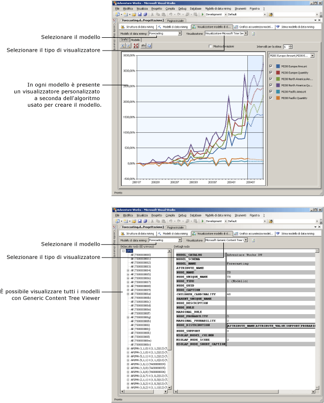

# Visualizzatori modello di data mining
  Dopo aver eseguito il training di un modello di data mining in [!INCLUDE[msCoName](../../includes/msconame-md.md)] [!INCLUDE[ssNoVersion](../../includes/ssnoversion-md.md)] [!INCLUDE[ssASnoversion](../../includes/ssasnoversion-md.md)], è possibile esplorare tale modello per cercare tendenze interessanti. Poiché i risultati dei modelli di data mining sono complessi e disponibili in un formato non elaborato di difficile interpretazione, l'esame visivo dei dati rappresenta spesso il modo più semplice per comprendere le regole e le relazioni individuate dall'algoritmo all'interno dei dati.  
  
 Ogni algoritmo utilizzato per compilare un modello restituisce un tipo di risultati diverso. Per tale motivo, in [!INCLUDE[ssASnoversion](../../includes/ssasnoversion-md.md)] è disponibile un visualizzatore separato per ogni algoritmo. Per la visualizzazione di un modello di data mining in [!INCLUDE[ssBIDevStudioFull](../../includes/ssbidevstudiofull-md.md)]viene usato il visualizzatore appropriato nella scheda **Visualizzatore modello di data mining** di Progettazione modelli di data mining.  
  
## Modalità di utilizzo dei visualizzatori modello  
 Prima si seleziona il modello di data mining, quindi si seleziona un visualizzatore. In ogni modello sono sempre presenti due visualizzatori: un visualizzatore personalizzato in cui possono essere incluse più schede e il visualizzatore generico.  
  
 A seconda del tipo di modello selezionato, le opzioni per l'esplorazione del modello visualizzate saranno molto diverse. I visualizzatori personalizzati associati a ogni tipo di modello vengono adattati all'algoritmo utilizzato per creare il modello di data mining selezionato. Ogni visualizzatore personalizzato dispone di una varietà di strumenti e finestre di dialogo per consentire di esplorare le statistiche e gli schemi nel modello, visualizzare i grafici o in modo interattivo utilizzare soglie di probabilità o filtrare elementi in base al nome.  
  
 Nel diagramma seguente viene illustrata la differenza tra la scelta di un visualizzatore personalizzato e del visualizzatore generico per lo stesso modello.  
  
1.  Innanzitutto, viene mostrato il visualizzatore personalizzato che viene visualizzato quando si seleziona un modello di data mining basato sull'algoritmo Microsoft Time Series.  
  
     Questo particolare visualizzatore personalizzato consente di creare automaticamente un grafico della serie temporale e fornisce cinque stime.  
  
2.  Successivamente, viene visualizzato lo stesso modello mediante **Microsoft Generic Content Tree Viewer**.  
  
     A sinistra il visualizzatore generico mostra un elenco dei nodi nel modello. È possibile fare clic su un nodo per visualizzarne il contenuto nel riquadro di destra.  
  
   
  
## Ulteriori informazioni su Microsoft Generic Content Tree Viewer  
 È possibile visualizzare ciascun modello anche mediante [Microsoft Generic Content Tree Viewer &#40;Data mining&#41;](http://msdn.microsoft.com/library/751b4393-f6fd-48c1-bcef-bdca589ce34c). Questo visualizzatore presenta il contenuto del modello di data mining in base a un formato di tabella HTML standard. Tuttavia, la disposizione dei nodi e il contenuto di ciascun nodo varia notevolmente a seconda dell'algoritmo utilizzato per generare i risultati.  
  
 Mentre i visualizzatori personalizzati sono progettati per navigare e comprendere il modello, il visualizzatore generico è più utile quando il modello è già stato compreso e si desidera estrarre le statistiche o le regole da un nodo specifico. È consigliabile usare il visualizzatore generico per visualizzare informazioni dettagliate sui modelli e le statistiche acquisite da [!INCLUDE[ssASnoversion](../../includes/ssasnoversion-md.md)] durante l'analisi, ad esempio la probabilità di un nodo o una formula di regressione.  
  
 È inoltre possibile scrivere *query sul contenuto* usando DMX per ottenere tutte le informazioni presentate in questo visualizzatore. Per altre informazioni, vedere [Query sul contenuto &#40;Data mining&#41;](../../analysis-services/data-mining/content-queries-data-mining.md).  
  
## Contenuto della sezione  
 Negli argomenti seguenti vengono descritti in modo dettagliato i visualizzatori e viene illustrata la modalità di interpretazione delle informazioni che contengono.  
  
 [Visualizzare un modello utilizzando il Visualizzatore Microsoft Decision Trees](../../analysis-services/data-mining/browse-a-model-using-the-microsoft-tree-viewer.md)  
 Viene descritto il Visualizzatore [!INCLUDE[msCoName](../../includes/msconame-md.md)] Decision Trees, che consente di visualizzare i modelli di data mining compilati con gli algoritmi [!INCLUDE[msCoName](../../includes/msconame-md.md)] Decision Trees e [!INCLUDE[msCoName](../../includes/msconame-md.md)] Linear Regression.  
  
 [Visualizzare un modello utilizzando il Visualizzatore Microsoft Clustering](../../analysis-services/data-mining/browse-a-model-using-the-microsoft-cluster-viewer.md)  
 Descrive il Visualizzatore [!INCLUDE[msCoName](../../includes/msconame-md.md)] Clustering, che consente di visualizzare i modelli di data mining compilati con l'algoritmo [!INCLUDE[msCoName](../../includes/msconame-md.md)] Clustering.  
  
 [Visualizzare un modello utilizzando il Visualizzatore Microsoft Times Series](../../analysis-services/data-mining/browse-a-model-using-the-microsoft-time-series-viewer.md)  
 Descrive il Visualizzatore [!INCLUDE[msCoName](../../includes/msconame-md.md)] Time Series, che consente di visualizzare i modelli di data mining compilati con l'algoritmo [!INCLUDE[msCoName](../../includes/msconame-md.md)] Time Series.  
  
 [Visualizzare un modello utilizzando il Visualizzatore Microsoft Naive Bayes](../../analysis-services/data-mining/browse-a-model-using-the-microsoft-naive-bayes-viewer.md)  
 Descrive il Visualizzatore [!INCLUDE[msCoName](../../includes/msconame-md.md)] Naive Bayes, che consente di visualizzare i modelli di data mining compilati con l'algoritmo [!INCLUDE[msCoName](../../includes/msconame-md.md)] Naive Bayes.  
  
 [Visualizzare un modello utilizzando il Visualizzatore Microsoft Sequence Clustering](../../analysis-services/data-mining/browse-a-model-using-the-microsoft-sequence-cluster-viewer.md)  
 Descrive il Visualizzatore [!INCLUDE[msCoName](../../includes/msconame-md.md)] Sequence Clustering, che consente di visualizzare i modelli di data mining compilati con l'algoritmo [!INCLUDE[msCoName](../../includes/msconame-md.md)] Sequence Clustering.  
  
 [Visualizzare un modello utilizzando il Visualizzatore Microsoft Association Rules](../../analysis-services/data-mining/browse-a-model-using-the-microsoft-association-rules-viewer.md)  
 Descrive il Visualizzatore [!INCLUDE[msCoName](../../includes/msconame-md.md)] Association Rules, che consente di visualizzare i modelli di data mining compilati con l'algoritmo [!INCLUDE[msCoName](../../includes/msconame-md.md)] Association Rules.  
  
 [Visualizzare un modello utilizzando il Visualizzatore Microsoft Neural Network](../../analysis-services/data-mining/browse-a-model-using-the-microsoft-neural-network-viewer.md)  
 Descrive il Visualizzatore [!INCLUDE[msCoName](../../includes/msconame-md.md)] Neural Network, Questo visualizzatore consente di visualizzare i modelli di data mining compilati con l'algoritmo [!INCLUDE[msCoName](../../includes/msconame-md.md)] Neural Network, inclusi i modelli che utilizzano l'algoritmo [!INCLUDE[msCoName](../../includes/msconame-md.md)] Logistic Regression.  
  
 [Visualizzare un modello utilizzando Microsoft Generic Content Tree Viewer](../../analysis-services/data-mining/browse-a-model-using-the-microsoft-generic-content-tree-viewer.md)  
 Vengono descritte le informazioni dettagliate disponibili nel visualizzatore generico per tutti i modelli di data mining e vengono forniti esempi su come interpretare le informazioni per ogni algoritmo.  
  
## Vedere anche  
 [Algoritmi di data mining &#40;Analysis Services - Data mining&#41;](../../analysis-services/data-mining/data-mining-algorithms-analysis-services-data-mining.md)   
 [Progettazione di Data Mining](../../analysis-services/data-mining/data-mining-designer.md)  
  
  

