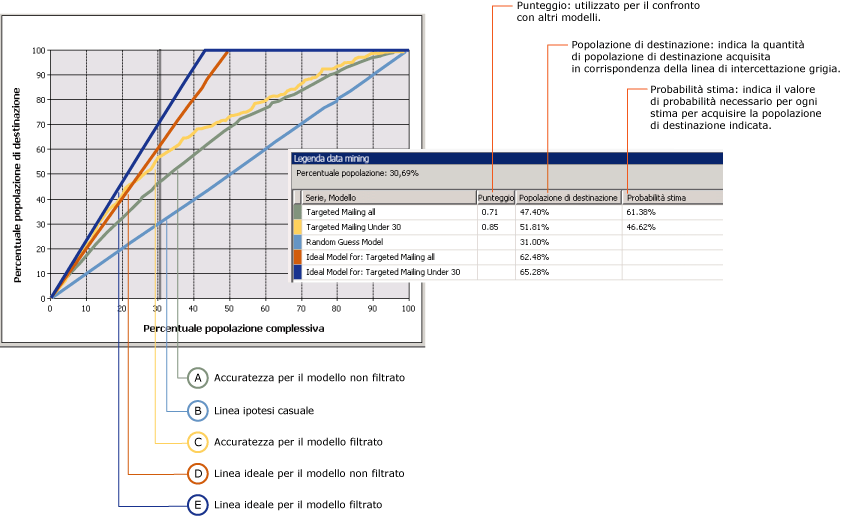
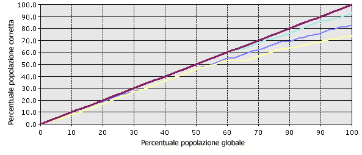

# Grafico di accuratezza (Analysis Services - Data mining)
[!INCLUDE[ssas-appliesto-sqlas](../../includes/ssas-appliesto-sqlas.md)]
  Un *grafico di accuratezza* rappresenta graficamente i miglioramenti forniti da un modello di data mining rispetto a un'ipotesi casuale. Inoltre, consente di misurare la modifica in termini di punteggio di *accuratezza* . Confrontando i punteggi di accuratezza per modelli differenti, è possibile determinare qual è il modello migliore. È possibile anche determinare il punto in cui le stime del modello diventano meno utili. Ad esempio, esaminando il grafico di accuratezza, si potrebbe accorgersi che una campagna promozionale ha probabilità di essere efficace solo sul 30% dei clienti e usare questa cifra per limitare l'ambito della campagna.  
  
 In [!INCLUDE[ssNoVersion](../../includes/ssnoversion-md.md)] Data Mining un grafico di accuratezza può confrontare l'accuratezza di più modelli aventi lo stesso attributo stimabile. Inoltre, è possibile valutare l'accuratezza della stima per un singolo risultato (un solo valore dell'attributo stimabile) o per tutti i risultati (tutti i valori dell'attributo specificato).  
  
 Un grafico dei profitti è un tipo di grafico correlato contenente le stesse informazioni di un grafico di accuratezza, ma consente di visualizzare anche l'aumento di profitto previsto associato all'utilizzo di ogni modello.  
  
##   Utilizzo del grafico di accuratezza  
 Può essere difficile capire i grafici di accuratezza in astratto. Pertanto, per illustrare l'utilizzo degli strumenti del grafico di accuratezza e le informazioni nel grafico, in questa sezione viene presentato uno scenario in cui un grafico di accuratezza viene utilizzato per stimare la risposta a una campagna di mailing diretto.  
  
 Il reparto Marketing in questo scenario sa che la percentuale di risposta tipica delle campagne di mailing è pari più o meno al 10%. In una tabella del database è archiviato un elenco di 10.000 potenziali clienti. In base alla percentuale di risposta tipica, è possibile prevedere che risponderanno solo circa 1.000 di questi clienti. Si consideri inoltre che il budget del progetto non è sufficiente per raggiungere tutti i 10.000 clienti archiviati nel database e che si desidera migliorare la percentuale di risposta. Si supponga che per questo scenario sia disponibile un budget che consente di inviare un annuncio pubblicitario solo a 5.000 clienti. Il reparto Marketing ha due opzioni:  
  
-   Selezionare come destinatari 5.000 clienti in modo casuale.  
  
-   Utilizzare un modello di data mining per selezionare come destinatari i 5.000 clienti che con maggiore probabilità risponderanno.  
  
 Utilizzando un grafico di accuratezza, è possibile confrontare i risultati previsti di entrambe le opzioni. Se la società seleziona ad esempio 5.000 clienti in modo casuale, è possibile prevedere di ricevere solo 500 risposte in base alla percentuale di risposta tipica. Questo scenario è rappresentato dalla linea *casuale* del grafico di accuratezza. Se invece il reparto Marketing ha utilizzato un modello di data mining per selezionare i destinatari del mailing, si potrebbe prevedere una percentuale di risposta migliore in quanto il modello consentirebbe di identificare i clienti che con maggiore probabilità risponderanno. Se il modello fosse perfetto, consentirebbe di creare stime che non sono mai errate e la società potrebbe prevedere di ricevere 1.000 risposte inviando il mailing solo ai 1.000 potenziali clienti indicati dal modello. Questo scenario è rappresentato dalla linea *ideale* del grafico di accuratezza.  
  
 In realtà, è più probabile che il modello di data mining sia compreso tra i due estremi, ovvero tra l'ipotesi casuale e una stima perfetta. Qualsiasi miglioramento dell'ipotesi casuale viene considerato un livello di accuratezza.  
  
 Quando si crea un grafico di accuratezza, è possibile destinare un valore specifico e misurare l'accuratezza solo per tale risultato. In alternativa, è possibile effettuare una valutazione generale del modello che consente di misurare le accuratezze per tutti i possibili risultati. Queste selezioni influiscono sul grafico finale, come descritto nelle sezioni seguenti.  
  
 [Torna all'inizio](#bkmk_Top)  
  
### Grafico di accuratezza con valore di destinazione  
 Di seguito è riportato un grafico di accuratezza per il modello **Targeted Mailing** creato in [Esercitazione di base sul data mining](http://msdn.microsoft.com/library/6602edb6-d160-43fb-83c8-9df5dddfeb9c). In questo grafico, l'attributo di destinazione è [Bike Buyer] e il valore di destinazione è 1, pertanto il cliente è stimato come acquirente di una bicicletta. Il grafico di accuratezza evidenzia quindi come il modello garantisca una migliore individuazione di clienti potenziali.  
  
 In questo grafico sono inclusi più modelli basati sugli stessi dati. Uno di questi modelli è stato personalizzato per essere destinato a clienti specifici. È possibile personalizzare un modello aggiungendo filtri sui dati utilizzati per eseguire il training della modalità. Questo filtro consente di limitare i case utilizzati nel training e nella valutazione di clienti al di sotto dei 30 anni. Si noti che un effetto del filtro è che nel modello di base e in quello filtrato vengono utilizzati set di dati diversi e, pertanto, anche il numero di case utilizzati per la valutazione nel grafico di accuratezza è diverso. È importante ricordare questo punto durante l'interpretazione dei risultati della stima e di altre statistiche.  
  
   
  
 L'asse x del grafico rappresenta la percentuale del set di dati di test utilizzata per confrontare le stime. L'asse y del grafico rappresenta la percentuale di valori stimati.  
  
 La linea retta diagonale, visualizzata in blu, è presente in ogni grafico. Rappresenta i risultati della stima casuale ed è la linea di base rispetto alla quale valutare l'accuratezza. Per ogni modello aggiunto a un grafico di accuratezza, si ottengono due linee aggiuntive: una rappresenta i risultati ideali per il set di dati di training se fosse possibile creare un modello in grado di fornire sempre stime perfette, mentre la seconda rappresenta l'accuratezza effettiva, o il miglioramento nei risultati, per il modello.  
  
 In questo esempio, la linea ideale del modello filtrato è visualizzata in blu scuro, mentre la linea dell'accuratezza effettiva è visualizzata in giallo. Osservando il grafico è possibile notare che la linea ideale ha un picco intorno al 40%. Ciò significa che se il modello fosse perfetto sarebbe possibile raggiungere il 100% dei clienti di destinazione inviando il mailing solo al 40% della popolazione totale. L'accuratezza effettiva per il modello filtrato per l'invio del mailing al 40% della popolazione è compresa tra il 60 e il 70%. Ciò significa che è possibile raggiungere il 60-70% dei clienti di destinazione inviando il mailing solo al 40% della popolazione totale dei clienti.  
  
 In **Legenda data mining** sono presentati i valori effettivi in qualsiasi punto delle curve. È possibile modificare la posizione misurata facendo clic sulla barra grigia verticale e spostandola. Nel grafico, la linea grigia è stata spostata sul 30%, perché è il punto in cui sia il modello filtrato sia quello non filtrato sembrano essere più efficienti, mentre dopo questo punto il grado di accuratezza diminuisce.  
  
 In **Legenda data mining** sono inoltre presenti i punteggi e le statistiche che agevolano l'interpretazione del grafico. Questi risultati rappresentano l'accuratezza del modello in corrispondenza della linea grigia, che qui è posizionata in modo da includere il 30% dei test case complessivi.  
  
|Serie e modello|Punteggio|Popolazione target|Probabilità di stima|  
|-----------------------|-----------|-----------------------|-------------------------|  
|Targeted mailing all|0.71|47.40%|61.38%|  
|Targeted mailing under 30|0.85|51.81%|46.62%|  
|Modello di stima casuale||31.00%||  
|Modello ideale per: Targeted mailing all||62.48%||  
|Modello ideale per: Targeted mailing under 30||65.28%||  
  
 [Torna all'inizio](#bkmk_Top)  
  
#### Interpretazione dei risultati  
 Da questi risultati si nota che, se misurato sul 30% di tutti i case, il modello generale [Targeted mailing all] può consentire di stimare il comportamento relativo all'acquisto di biciclette del 47,40% della popolazione di destinazione. In altre parole, se si invia un mailing diretto solo al 30% dei clienti presenti nel database, è possibile raggiungere poco meno della metà dei destinatari. Se si utilizza il modello filtrato, è possibile ottenere risultati leggermente migliori e raggiungere circa il 51% dei clienti di destinazione.  
  
 Il valore di **Probabilità stima** rappresenta la soglia richiesta per includere un cliente tra i case di acquisto probabile. Per ogni case, il modello valuta l'accuratezza di ogni stima e archivia il valore, che sarà possibile utilizzare per filtrare o individuare i clienti di destinazione. Ad esempio, per individuare i potenziali acquirenti dal modello di base è possibile utilizzare una query per recuperare i case con un valore di Probabilità stima pari almeno al 61%. Per ottenere i clienti di destinazione del modello filtrato, è possibile usare una query per recuperare i case che soddisfano tutti i criteri: età e valore di **PredictProbability** pari almeno al 46%.  
  
 È interessante confrontare i modelli. Il modello filtrato sembra acquisire un maggior numero di clienti potenziali, ma quando si individuano come destinatari i clienti con un punteggio di probabilità di stima del 46% esiste anche il 53% di possibilità di inviare un mailing a una persona che non acquisterà una bicicletta. Pertanto, per decidere quale sia il modello migliore è opportuno trovare un equilibrio tra la maggiore precisione e il minor numero di destinatari offerti dal modello filtrato rispetto alla selettività del modello di base.  
  
 Il valore di **Punteggio** consente di confrontare i modelli calcolandone l'efficacia in una popolazione normalizzata. Poiché un punteggio superiore garantisce maggiore efficacia, in questo caso la strategia ottimale potrebbe essere quella di destinare il mailing ai clienti sotto i 30 anni, nonostante la probabilità di stima inferiore.  
  
#### Come viene calcolato il punteggio?  
 Il punteggio viene calcolato come media geometrica di tutti i punti che costituiscono un grafico a dispersione in cui l'asse X contiene i valori effettivi, l'asse Y contiene il valore stimato e ogni punto ha una probabilità associata.  
  
 Il significato statistico di ogni singolo punteggio è l'accuratezza predittiva per il modello misurata in quel punto. La media di tutti i punti costituisce il punteggio per il modello.  
  
 [Torna all'inizio](#bkmk_Top)  
  
### Grafico di accuratezza per modello senza valore di destinazione  
 Se non si specifica lo stato della colonna stimabile, viene creato il tipo di grafico illustrato nel diagramma seguente. In questo grafico vengono illustrate le prestazioni del modello per tutti gli stati dell'attributo stimabile. Ad esempio, nel grafico viene illustrata la correttezza con cui il modello esegue la stima dei clienti che probabilmente acquisteranno una bicicletta e di quelli che probabilmente non l'acquisteranno.  
  
 L'asse x è lo stesso del grafico con la colonna stimabile specificata, ma in questo caso l'asse y rappresenta la percentuale di stime corrette. La linea ideale pertanto è la diagonale che indica che in corrispondenza del 50% dei dati il modello stima correttamente il 50% dei case, il massimo che è possibile aspettarsi.  
  
   
  
 È possibile fare clic sul grafico per spostare la barra grigia verticale in modo da visualizzare in **Legenda data mining** la percentuale di case complessivi e la percentuale di case stimati correttamente. Ad esempio, se si posiziona la barra di scorrimento grigia in corrispondenza del contrassegno del 50%, in **Legenda data mining** vengono visualizzati i punteggi di accuratezza riportati di seguito. Le cifre sono basate sul modello TM_Decision Tree creato nell'Esercitazione di base sul data mining.  
  
|Serie, modello|Punteggio|Popolazione target|Probabilità di stima|  
|-------------------|-----------|-----------------------|-------------------------|  
|TM_DecisionTree|0.77|40.50%|72.91%|  
|Modello ideale||50,00%||  
  
 In questa tabella si osserva che in corrispondenza del 50% della popolazione, il modello creato consente di stimare correttamente il 40% dei case. Questo modello può essere considerato ragionevolmente accurato. Si noti tuttavia che questo particolare modello stima tutti i valori dell'attributo stimabile. È pertanto probabile che il modello sia accurato nello stimare che il 90% dei clienti non acquisterà una bicicletta.  
  
 [Torna all'inizio](#bkmk_Top)  
  
### Restrizioni sui grafici di accuratezza  
 Per i grafici di accuratezza è richiesto che l'attributo stimabile sia un valore discreto. In altre parole, non è possibile utilizzare grafici di accuratezza per misurare l'accuratezza di modelli che consentono di stimare valori numerici continui.  
  
 L'accuratezza della stima per tutti i valori discreti dell'attributo stimabile è visualizzata in una sola linea. Se si desidera vedere le linee di accuratezza della stima per ogni singolo valore dell'attributo stimabile, è necessario creare un grafico di accuratezza separato per ciascun valore di destinazione.  
  
 È possibile aggiungere più modelli a un grafico di accuratezza, purché tutti i modelli dispongano dello stesso attributo stimabile. I modelli che non consentono la condivisione dell'attributo non saranno disponibili per la selezione nella scheda **Input** .  
  
 Non è possibile visualizzare modelli Time Series in un grafico di accuratezza o un grafico dei profitti. Una pratica comune per misurare l'accuratezza delle stime basate su serie temporali consiste nel riservare una parte dei dati cronologici e paragonarli con le stime. Per altre informazioni, vedere [Algoritmo Microsoft Time Series](../../analysis-services/data-mining/microsoft-time-series-algorithm.md).  
  
### Contenuto correlato  
 [Torna all'inizio](#bkmk_Top)  
  
## Vedere anche  
 [Test e convalida & #40; Data Mining & #41;](../../analysis-services/data-mining/testing-and-validation-data-mining.md)  
  
  
