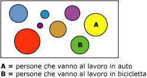

# Algoritmo Microsoft Clustering
  L'algoritmo [!INCLUDE[msCoName](../../includes/msconame-md.md)] Clustering è un algoritmo di *segmentazione* o *clustering* che esegue l'iterazione dei case in un set di dati per raggrupparli in cluster con caratteristiche simili. Tali raggruppamenti sono utili per l'esplorazione dei dati, l'identificazione delle relative anomalie e la creazione di stime.  
  
 I modelli di clustering identificano in un set di dati le relazioni che non è possibile derivare mediante l'osservazione casuale. Ad esempio, è possibile desumere per logica che le persone che si recano sul posto di lavoro in bicicletta in genere non abitano lontano. Tuttavia l'algoritmo può individuare altre caratteristiche non altrettanto ovvie sulle persone che si recano a lavoro in bicicletta. Nel diagramma seguente, il cluster A rappresenta i dati relativi alla persone che tendono a usare l'automobile per recarsi a lavoro, mentre il cluster B rappresenta i dati relativi alle persone che tendono a recarsi a lavoro in bicicletta.  
  
   
  
 L'algoritmo di clustering si differenzia dagli altri algoritmi di data mining, ad esempio dall'algoritmo [!INCLUDE[msCoName](../../includes/msconame-md.md)] Decision Trees, per il fatto che non è necessario designare una colonna stimabile per compilare un modello di clustering. L'algoritmo di clustering esegue il training del modello rigorosamente in base alle relazioni esistenti tra i dati e ai cluster identificati.  
  
## Esempio  
 Si consideri un gruppo di persone con informazioni demografiche simili che acquistano prodotti analoghi dall'azienda [!INCLUDE[ssSampleDBCoShort](../../includes/sssampledbcoshort-md.md)] . Tale gruppo di persone rappresenta un cluster di dati. Un database può contenere vari cluster di questo tipo. Se si osservano le colonne che costituiscono un cluster, è possibile individuare più chiaramente le relazioni reciproche esistenti tra i record di un set di dati.  
  
## Funzionamento dell'algoritmo  
 L'algoritmo [!INCLUDE[msCoName](../../includes/msconame-md.md)] Clustering identifica innanzitutto le relazioni esistenti in un set di dati e genera una serie di cluster basati su tali relazioni. Un grafico a dispersione costituisce un metodo utile per rappresentare visivamente il modo in cui l'algoritmo raggruppa i dati, come illustrato nel diagramma seguente. Tale grafico rappresenta tutti i case del set di dati e ogni case corrisponde a un punto del grafico. I cluster corrispondono ai raggruppamenti dei punti nel grafico e illustrano le relazioni identificate dall'algoritmo.  
  
   
  
 Dopo aver definito i cluster, l'algoritmo calcola l'accuratezza con cui i cluster rappresentano i raggruppamenti dei punti e quindi tenta di ridefinire tali raggruppamenti per creare cluster in grado di rappresentare i dati con maggiore accuratezza. L'algoritmo esegue l'iterazione di questo processo fino a quando non è più possibile migliorare ulteriormente i risultati mediante la ridefinizione dei cluster.  
  
 È possibile personalizzare il funzionamento dell'algoritmo specificando una tecnica di clustering, limitando il numero massimo di cluster o modificando la quantità di supporto necessaria per creare un cluster. Per altre informazioni, vedere [Riferimento tecnico per l'algoritmo Microsoft Clustering](../../analysis-services/data-mining/microsoft-clustering-algorithm-technical-reference.md). questo algoritmo include due metodi di clustering diffusi: clustering K-means ed Expectation Maximization.  
  
## Dati richiesti per i modelli di clustering  
 Quando si preparano i dati da utilizzare nel training di un modello di clustering, verificare che siano chiari i requisiti per l'algoritmo specifico, tra cui la quantità di dati necessari e la modalità di utilizzo dei dati.  
  
 I requisiti per un modello di clustering sono i seguenti:  
  
-   **Una colonna a chiave singola** Ogni modello deve contenere una colonna numerica o di testo che identifichi in modo univoco ogni record. Le chiavi composte non sono consentite.  
  
-   **Colonne di input** Ogni modello deve contenere almeno una colonna di input che contiene i valori usati per compilare i cluster. È possibile includere tutte le colonne di input desiderate, ma a seconda del numero di valori in ciascuna colonna, l'aggiunta di colonne supplementari può implicare un aumento del tempo necessario per il training del modello.  
  
-   **Colonna stimabile facoltativa** L'algoritmo non richiede una colonna stimabile per compilare il modello, ma è possibile aggiungere una colonna stimabile di qualsiasi tipo di dati. I valori della colonna stimabile possono essere considerati come input per il modello di clustering oppure è possibile specificare che devono essere utilizzati solo per la stima. Se ad esempio si vuole stimare il reddito dei clienti creando cluster in base a dati demografici come l'area geografica o l'età, specificare il reddito come **PredictOnly** e aggiungere tutte le altre colonne, ad esempio area geografica o età, come input.  
  
 Per informazioni più dettagliate sui tipi di contenuto e i tipi di dati supportati per i modelli di clustering, vedere la sezione Requisiti di [Riferimento tecnico per l'algoritmo Microsoft Clustering](../../analysis-services/data-mining/microsoft-clustering-algorithm-technical-reference.md).  
  
## Visualizzazione di un modello di clustering  
 Per esplorare il modello, è possibile usare il **Visualizzatore Microsoft Clustering**. Quando si visualizza un modello di clustering, [!INCLUDE[ssASnoversion](../../includes/ssasnoversion-md.md)] mostra i cluster in un diagramma che indica le relazioni tra essi, oltre a fornire un profilo dettagliato di ogni cluster, un elenco degli attributi che distinguono ogni cluster dagli altri e le caratteristiche dell'intero set di dati di training. Per altre informazioni, vedere [Visualizzare un modello usando il Visualizzatore Microsoft Clustering](../../analysis-services/data-mining/browse-a-model-using-the-microsoft-cluster-viewer.md).  
  
 Per maggiori dettagli, è possibile esplorare il modello in [Microsoft Generic Content Tree Viewer](../../analysis-services/data-mining/browse-a-model-using-the-microsoft-generic-content-tree-viewer.md). Il contenuto archiviato per il modello include la distribuzione per tutti i valori in ogni nodo, la probabilità di ogni cluster e altre informazioni. Per altre informazioni, vedere [Contenuto dei modelli di data mining per i modelli di clustering &#40;Analysis Services - Data mining&#41;](../../analysis-services/data-mining/mining-model-content-for-clustering-models-analysis-services-data-mining.md).  
  
## Creazione di stime  
 In seguito al training del modello, i risultati vengono archiviati come set di modelli, esplorabili o utilizzabili per eseguire stime.  
  
 È possibile creare query per restituire stime sulla probabilità che si ottenga il fit dei nuovi dati nei cluster individuati o per ottenere statistiche descrittive sui cluster.  
  
 Per informazioni sulla creazione di query in base a un modello di data mining, vedere [Query di data mining](../../analysis-services/data-mining/data-mining-queries.md). Per alcuni esempi su come usare le query con un modello di clustering, vedere [Esempi di query sul modello di clustering](../../analysis-services/data-mining/clustering-model-query-examples.md).  
  
## Osservazioni  
  
-   Supporta l'utilizzo del linguaggio PMML (Predictive Model Markup Language) per la creazione di modelli di data mining.  
  
-   Supporta il drill-through.  
  
-   Supporta l'utilizzo di modelli di data mining OLAP e la creazione di dimensioni di data mining.  
  
## Vedere anche  
 [Algoritmi di data mining &#40;Analysis Services - Data mining&#41;](../../analysis-services/data-mining/data-mining-algorithms-analysis-services-data-mining.md)   
 [Riferimento tecnico per Microsoft Clustering algoritmo](../../analysis-services/data-mining/microsoft-clustering-algorithm-technical-reference.md)   
 [Contenuto del modello di data mining per il Clustering modelli &#40; Analysis Services - Data Mining &#41;](../../analysis-services/data-mining/mining-model-content-for-clustering-models-analysis-services-data-mining.md)   
 [Esempi di query sul modello di clustering](../../analysis-services/data-mining/clustering-model-query-examples.md)  
  
  

