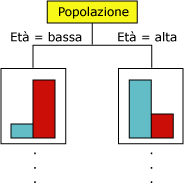
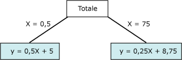

# Algoritmo Microsoft Decision Trees
[!INCLUDE[ssas-appliesto-sqlas](../../includes/ssas-appliesto-sqlas.md)]
  L'algoritmo [!INCLUDE[msCoName](../../includes/msconame-md.md)] Decision Trees è un algoritmo di classificazione e di regressione per la modellazione predittiva di attributi sia discreti che continui.  
  
 Per gli attributi discreti, l'algoritmo esegue le stime in base alle relazioni tra le colonne di input in un set di dati. I valori, noti come stati, di tali colonne vengono utilizzati per stimare gli stati di una colonna designata come stimabile. In particolare, l'algoritmo identifica le colonne di input correlate alla colonna stimabile. Se ad esempio, in uno scenario finalizzato alla stima dei clienti che probabilmente acquisteranno una bicicletta, nove su dieci tra i clienti più giovani acquistano la bicicletta mentre solo due su dieci tra i clienti meno giovani la acquistano, l'algoritmo desume che l'età rappresenta un criterio di stima valido per l'acquisto di biciclette. L'albero delle decisioni esegue le stime in base alla tendenza verso un determinato risultato.  
  
 Per gli attributi continui, l'algoritmo utilizza una regressione lineare per determinare le divisioni dell'albero delle decisioni.  
  
 Se più colonne vengono impostate come stimabili o i dati di input contengono una tabella nidificata impostata come stimabile, l'algoritmo compilare un albero delle decisioni separato per ogni colonna stimabile  
  
## Esempio  
 Il reparto marketing dell'azienda [!INCLUDE[ssSampleDBCoFull](../../includes/sssampledbcofull-md.md)] desidera identificare le caratteristiche dei clienti precedenti che potrebbero indicare se è probabile che tali clienti acquisteranno un prodotto in futuro. Nel database [!INCLUDE[ssSampleDBnormal](../../includes/sssampledbnormal-md.md)] vengono archiviate informazioni demografiche che descrivono i clienti precedenti. Grazie all'analisi di tali informazioni tramite l'algoritmo [!INCLUDE[msCoName](../../includes/msconame-md.md)] Decision Trees, il reparto marketing può compilare un modello che consente di stimare se un cliente specifico acquisterà prodotti, in base agli stati delle colonne note su tale cliente, ad esempio quelle relative a informazioni demografiche o alle tendenze di acquisto passate.  
  
## Funzionamento dell'algoritmo  
 L'algoritmo [!INCLUDE[msCoName](../../includes/msconame-md.md)] Decision Trees compila un modello di data mining creando una serie di divisioni nell'albero. Queste divisioni sono rappresentate come *nodi*. L'algoritmo aggiunge un nodo al modello ogni volta che rileva una colonna di input correlata in modo significativo alla colonna stimabile. Il modo in cui l'algoritmo determina una divisione varia a seconda che venga stimata una colonna continua o discreta.  
  
 L'algoritmo [!INCLUDE[msCoName](../../includes/msconame-md.md)] Decision Trees usa la *selezione delle caratteristiche* come guida per la selezione degli attributi più utili. La selezione delle caratteristiche è usata da tutti gli algoritmi di data mining di [!INCLUDE[ssNoVersion](../../includes/ssnoversion-md.md)] per migliorare le prestazioni e la qualità dell'analisi. La caratteristica di selezione degli attributi è importante per impedire agli attributi poco importanti di utilizzare il processore. Se si utilizza un numero eccessivo di input o di attributi stimabili quando si progetta un modello di data mining, l'elaborazione del modello può richiedere molto tempo oppure la memoria potrebbe risultare insufficiente. I metodi usati per determinare se dividere l'albero includono le metriche standard del settore per *entropia* e le reti bayesiane *.* Per altre informazioni sui metodi usati per selezionare attributi significativi e quindi assegnare un punteggio e classificare gli attributi, vedere [Selezione delle caratteristiche &#40;Data mining&#41;](../../analysis-services/data-mining/feature-selection-data-mining.md).  
  
 Un problema comune nei modelli di data mining è l'eccessiva sensibilità del modello alle piccole differenze nei dati di training. In tal caso, il modello viene detto *con overfitting* o *con overtraining*. Non è possibile generalizzare un modello overfitted agli altri set di dati. Per evitare l'overfitting di un particolare set di dati, nell'algoritmo [!INCLUDE[msCoName](../../includes/msconame-md.md)] Decision Trees vengono utilizzate tecniche per il controllo della crescita dell'albero. Per una spiegazione più dettagliata del funzionamento dell'algoritmo [!INCLUDE[msCoName](../../includes/msconame-md.md)] Decision Trees, vedere [Guida di riferimento tecnico per l'algoritmo Microsoft Decision Trees](../../analysis-services/data-mining/microsoft-decision-trees-algorithm-technical-reference.md).  
  
### Stima di colonne discrete  
 Per illustrare il modo in cui l'algoritmo [!INCLUDE[msCoName](../../includes/msconame-md.md)] Decision Trees compila un albero per una colonna stimabile discreta, è possibile usare un istogramma. Nel diagramma seguente viene illustrato un istogramma che traccia la colonna stimabile Bike Buyers in base alla colonna di input Age. L'istogramma mostra che l'età consente di determinare se una persona acquisterà o meno una bicicletta.  
  
   
  
 In base alla correlazione illustrata nel diagramma, l'algoritmo [!INCLUDE[msCoName](../../includes/msconame-md.md)] Decision Trees crea un nuovo nodo nel modello.  
  
   
  
 Quando l'algoritmo aggiunge nuovi nodi a un modello, viene formata una struttura ad albero. Il nodo superiore dell'albero descrive la suddivisione della colonna stimabile per la popolazione complessiva di clienti. Mano a mano che il modello continua a espandersi, l'algoritmo considera tutte le colonne.  
  
### Stima di colonne continue  
 Quando l'algoritmo [!INCLUDE[msCoName](../../includes/msconame-md.md)] Decision Trees compila un albero basato su una colonna stimabile continua, ogni nodo contiene una formula di regressione. Nella formula di regressione viene eseguita una divisione in corrispondenza di un punto di non linearità. Si consideri ad esempio il diagramma seguente.  
  
   
  
 In un modello di regressione standard, si tenterebbe di derivare una singola formula che rappresenta la tendenza e le relazioni per i dati nel suo complesso.  Una singola formula, tuttavia, potrebbe non essere appropriata per acquisire la discontinuità in dati complessi. Al contrario, l'algoritmo [!INCLUDE[msCoName](../../includes/msconame-md.md)] Decision Trees cerca i segmenti dell'albero che sono in gran parte lineari e crea formule separate per questi segmenti. Suddividendo i dati in segmenti diversi, il modello consentirà di ottenere una migliore approssimazione.  
  
 Il diagramma seguente rappresenta il diagramma dell'albero per il modello nel grafico a dispersione precedente.  Per stimare il risultato, il modello fornisce due formule diverse: una per il ramo sinistro, con la formula y = 0,5x x 5 e una per il ramo destro, con la formula y = 0,25x + 8,75. Il punto di unione delle due linee nel grafico a dispersione è il punto di non linearità, ovvero il punto di divisione di un nodo in un modello di albero decisionale.  
  
   
  
 Si tratta di un modello semplice con solo due equazioni lineari. La divisione nell'albero si trova subito dopo il nodo **Tutti** . La divisione può tuttavia avvenire su qualsiasi livello dell'albero. Questo significa che in un albero che contiene più livelli e nodi, in cui ogni nodo è caratterizzato da una raccolta di attributi diversi, una formula può essere condivisa tra più nodi o essere applicabile solo a un singolo nodo. Ad esempio, si potrebbe ottenere una formula per un nodo definito come "clienti appartenenti a una fascia di età e reddito specifica" e un altro nodo che rappresenta i "clienti pendolari su lunghe distanze". Per visualizzare la formula per un singolo nodo o segmento, è sufficiente fare clic sul nodo.  
  
## Dati richiesti per i modelli di albero delle decisioni  
 Quando si preparano i dati da utilizzare in un modello di albero delle decisioni, verificare che siano chiari i requisiti per l'algoritmo specifico, tra cui la quantità di dati necessari e la modalità di utilizzo dei dati.  
  
 I requisiti per un modello di albero delle decisioni sono i seguenti:  
  
-   **Una colonna a chiave singola** Ogni modello deve contenere una colonna numerica o di testo che identifichi in modo univoco ogni record. Le chiavi composte non sono consentite.  
  
-   **Una colonna stimabile** Richiede almeno una colonna stimabile. È possibile includere più attributi stimabili in un modello e tali attributi possono essere di tipi diversi, numerici o discreti. Tuttavia, aumentando il numero di attributi stimabili può aumentare il tempo di elaborazione.  
  
-   **Colonne di input** Richiede colonne di input, che possono essere discrete o continue. L'aumento del numero di attributi di input influisce sul tempo di elaborazione.  
  
 Per informazioni più dettagliate sui tipi di contenuto e i tipi di dati supportati per i modelli di albero delle decisioni, vedere la sezione Requisiti di [Guida di riferimento tecnico per l'algoritmo Microsoft Decision Trees](../../analysis-services/data-mining/microsoft-decision-trees-algorithm-technical-reference.md).  
  
## Visualizzazione di un modello di albero delle decisioni  
 Per esplorare il modello, è possibile usare il **Visualizzatore Microsoft Decision Trees**. Se il modello genera più alberi, è possibile selezionare un albero per visualizzare dettagli sulla classificazione dei case per ciascun attributo stimabile. È inoltre possibile visualizzare l'interazione degli alberi utilizzando il Visualizzatore rete di dipendenze. Per altre informazioni, vedere [Visualizzare un modello usando il Visualizzatore Microsoft Decision Trees](../../analysis-services/data-mining/browse-a-model-using-the-microsoft-tree-viewer.md).  
  
 Per ulteriori dettagli sui nodi o sui rami dell'albero, è anche possibile esplorare il modello in [Microsoft Generic Content Tree Viewer](../../analysis-services/data-mining/browse-a-model-using-the-microsoft-generic-content-tree-viewer.md). Il contenuto memorizzato per il modello include la distribuzione per tutti i valori in ogni nodo, le probabilità di ogni livello dell'albero e le formule di regressione degli attributi continui. Per altre informazioni, vedere [Mining Model Content for Decision Tree Models &#40;Analysis Services - Data Mining&#41;](../../analysis-services/data-mining/mining-model-content-for-decision-tree-models-analysis-services-data-mining.md).  
  
## Creazione di stime  
 In seguito all'elaborazione del modello, i risultati vengono archiviati come un set di modelli e statistiche che è possibile utilizzare per esplorare le relazioni o per eseguire stime.  
  
 Per gli esempi di query da usare con un modello di albero delle decisioni, vedere [Esempi di query sul modello di alberi delle decisioni](../../analysis-services/data-mining/decision-trees-model-query-examples.md).  
  
 Per informazioni generali sulla creazione di query in base ai modelli di data mining, vedere [Query di data mining](../../analysis-services/data-mining/data-mining-queries.md).  
  
## Osservazioni  
  
-   Supporta l'utilizzo del linguaggio PMML (Predictive Model Markup Language) per la creazione di modelli di data mining.  
  
-   Supporta il drill-through.  
  
-   Supporta l'utilizzo di modelli di data mining OLAP e la creazione di dimensioni di data mining.  
  
## Vedere anche  
 [Algoritmi di Data Mining & #40; Analysis Services - Data Mining & #41;](../../analysis-services/data-mining/data-mining-algorithms-analysis-services-data-mining.md)   
 [Microsoft Decision Trees riferimento tecnico per l'algoritmo](../../analysis-services/data-mining/microsoft-decision-trees-algorithm-technical-reference.md)   
 [Esempi di Query modello di alberi delle decisioni](../../analysis-services/data-mining/decision-trees-model-query-examples.md)   
 [Contenuto del modello di data mining per i modelli di albero delle decisioni & #40; Analysis Services - Data Mining & #41;](../../analysis-services/data-mining/mining-model-content-for-decision-tree-models-analysis-services-data-mining.md)  
  
  
