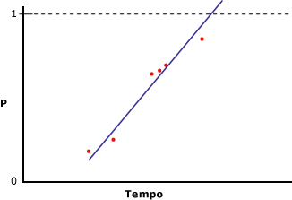
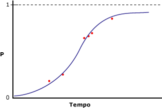

# <a name="microsoft-logistic-regression-algorithm-technical-reference"></a>Riferimento tecnico per l'algoritmo Microsoft Logistic Regression
  L'algoritmo [!INCLUDE[msCoName](../../includes/msconame-md.md)] Logistic Regression è una variante dell'algoritmo [!INCLUDE[msCoName](../../includes/msconame-md.md)] Neural Network, in cui il parametro *HIDDEN_NODE_RATIO* è impostato su 0. Questa impostazione creerà un modello di rete neurale che non contiene un livello nascosto e che pertanto è equivalente alla regressione logistica.  
  
## <a name="implementation-of-the-microsoft-logistic-regression-algorithm"></a>Implementazione dell'algoritmo Microsoft Logistic Regression  
 Si supponga che la colonna stimabile contenga solo due stati e che tuttavia si intenda eseguire comunque un'analisi di regressione, stabilendo una relazione tra le colonne di input e la probabilità che la colonna stimabile includa uno stato specifico. Nel diagramma seguente sono illustrati i risultati che si otterranno se si assegnano i valori 1 e 0 agli stati della colonna stimabile, si calcola la probabilità che la colonna contenga uno stato specifico e si esegue una regressione lineare in base a una variabile di input.  
  
   
  
 L'asse x contiene i valori di una colonna di input. L'asse y contiene le probabilità che la colonna stimabile includa solo uno stato o l'altro. In questo caso, il problema è che la regressione lineare non vincola la colonna a valori compresi tra 0 e 1, anche se questi sono rispettivamente il valore minimo e massimo della colonna. Uno dei modi per risolvere tale problema consiste nell'esecuzione della regressione logistica. Anziché creare una linea retta, l'analisi di regressione logistica crea una curva a forma di "S" che contiene i vincoli minimi e massimi. Ad esempio, nel diagramma seguente sono illustrati i risultati che si otterranno se si esegue una regressione logistica in base agli stessi dati utilizzati nell'esempio precedente.  
  
   
  
 Si noti che la curva non si sposta mai su valori maggiori di 1 o minori di 0. È possibile utilizzare la regressione logistica per descrivere le colonne di input significative ai fini della determinazione dello stato della colonna stimabile.  
  
### <a name="feature-selection"></a>Selezione funzionalità  
 Tutti gli algoritmi di data mining di Analysis Services utilizzano automaticamente la caratteristica di selezione degli attributi per migliorare l'analisi e ridurre il carico di elaborazione. Il metodo utilizzato per la caratteristica di selezione degli attributi in un modello di regressione logistica dipende dal tipo di dati dell'attributo. Poiché è basata sull'algoritmo Microsoft Neural Network, la regressione logistica utilizza un subset dei metodi relativi alla caratteristica di selezione degli attributi che si applicano alle reti neurali. Per altre informazioni, vedere [Selezione delle funzionalità &#40;Data mining&#41;](../../analysis-services/data-mining/feature-selection-data-mining.md).  
  
### <a name="scoring-inputs"></a>Valutazione degli input  
 Per*assegnazione di punteggi* nel contesto di un modello di rete neurale o di un modello di regressione logistica si intende la conversione dei valori presenti nei dati in un set di valori che usano la stessa scala e possono quindi essere confrontati tra loro. Si supponga ad esempio che l'intervallo degli input per Income sia compreso tra 0 e 100.000 mentre quello degli input per [Number of Children] sia compreso tra 0 e 5. Questo processo di conversione permette di confrontare l'importanza di ogni input indipendentemente dalla differenza dei valori.  
  
 Per ogni stato visualizzato nel set di training, il modello genera un input. Per gli input discreti o discretizzati, viene creato un input aggiuntivo per rappresentare lo stato Missing, se tale stato è visualizzato almeno una volta nel set di training. Per gli input continui vengono creati al massimo due nodi di input: uno per i valori Missing, se presenti nei dati di training, e uno per tutti i valori esistenti o non Null. Ogni input viene ridimensionato in base a un formato numerico usando il metodo di normalizzazione del punteggio z, `(x – μ)\StdDev`.  
  
 Durante la normalizzazione del punteggio z, si ottengono la media (μ) e la deviazione standard sul set di training completo.  
  
 **Valori continui**  
  
 Il valore è presente:   `(X – μ)/σ ` (X è l'effettivo valore codificato)  
  
 Il valore è assente:    `-   μ/σ `  (mu negativo diviso sigma)  
  
 **Valori discreti**  
  
 `μ = p`  (probabilità precedente di uno stato)  
  
 StdDev  `= sqrt(p\(1-p))`  
  
 Il valore è presente:     `\(1 – μ)/σ` (1 meno mu diviso sigma)  
  
 Il valore è assente:     `(– μ)/σ` (mu negativo diviso sigma)  
  
### <a name="understanding-logistic-regression-coefficients"></a>Informazioni sui coefficienti di regressione logistica  
 Sono disponibili vari metodi nella letteratura statistica per l'esecuzione della regressione logistica, tuttavia un aspetto importante comune a tutti i metodi è la valutazione dell'adattamento del modello. Sono state proposte statistiche con vari livelli di adattamento, tra cui i rapporti di disparità e i criteri covariati. Una descrizione dettagliata delle modalità di misurazione dell'adattamento di un modello esula dall'ambito del presente argomento, tuttavia è possibile recuperare il valore dei coefficienti nel modello e utilizzarli per progettare misure di adattamento personalizzate.  
  
> [!NOTE]  
>  I coefficienti creati come parte di un modello di regressione logistica non rappresentano rapporti di disparità e non devono essere interpretati come tali.  
  
 I coefficienti per ogni nodo nel grafico del modello rappresentano una somma ponderata dei rispettivi input. In un modello di regressione logistica il livello nascosto è vuoto, pertanto è presente un solo set di coefficienti, archiviato nei nodi di output. È possibile recuperare i valori dei coefficienti utilizzando la query seguente:  
  
```  
SELECT FLATTENED [NODE_UNIQUE NAME],  
(SELECT ATTRIBUTE_NAME< ATTRIBUTE_VALUE  
FROM NODE_DISTRIBUTION) AS t  
FROM <model name>.CONTENT  
WHERE NODE_TYPE = 23  
```  
  
 Per ogni valore di output, questa query restituisce i coefficienti e un ID che punta nuovamente al nodo di input correlato. Restituisce anche una riga che contiene il valore dell'output e l'intercetta. Ogni input X dispone di un proprio coefficiente (Ci), ma nella tabella nidificata è contenuto anche un coefficiente (Co) "libero" calcolato sulla base della formula seguente:  
  
 `F(X) = X1*C1 + X2*C2 + … +Xn*Cn + X0`  
  
 Attivazione: `exp(F(X)) / (1 + exp(F(X)) )`  
  
 Per altre informazioni, vedere [Esempi di query sul modello di regressione logica](../../analysis-services/data-mining/logistic-regression-model-query-examples.md).  
  
## <a name="customizing-the-logistic-regression-algorithm"></a>Personalizzazione dell'algoritmo Logistic Regression  
 L'algoritmo [!INCLUDE[msCoName](../../includes/msconame-md.md)] Logistic Regression supporta vari parametri che influiscono sul comportamento, sulle prestazioni e sull'accuratezza del modello di data mining risultante. È inoltre possibile modificare il comportamento del modello impostando flag di modellazione nelle colonne utilizzate come input.  
  
### <a name="setting-algorithm-parameters"></a>Impostazione dei parametri dell'algoritmo  
 Nella tabella seguente sono descritti i parametri che possono essere utilizzati con l'algoritmo Microsoft Logistic Regression.  
  
 HOLDOUT_PERCENTAGE  
 Specifica la percentuale di case all'interno dei dati di training utilizzata per calcolare l'errore dei dati di controllo. HOLDOUT_PERCENTAGE viene utilizzato come parte dei criteri di arresto durante il training del modello di data mining.  
  
 Il valore predefinito è 30.  
  
 HOLDOUT_SEED  
 Specifica un numero da utilizzare come valore di inizializzazione per il generatore pseudocasuale durante la determinazione casuale dei dati di controllo. Se HOLDOUT_SEED è impostato su 0, l'algoritmo genera il valore di inizializzazione in base al nome del modello di data mining per garantire che il contenuto del modello rimanga invariato durante la rielaborazione.  
  
 Il valore predefinito è 0.  
  
 MAXIMUM_INPUT_ATTRIBUTES  
 Definisce il numero di attributi di input che l'algoritmo è in grado di gestire prima di richiamare la funzionalità di selezione degli attributi. Impostare questo valore su 0 per disabilitare la funzionalità di selezione degli attributi.  
  
 Il valore predefinito è 255.  
  
 MAXIMUM_OUTPUT_ATTRIBUTES  
 Definisce il numero di attributi di output che l'algoritmo è in grado di gestire prima di richiamare la funzionalità di selezione degli attributi. Impostare questo valore su 0 per disabilitare la funzionalità di selezione degli attributi.  
  
 Il valore predefinito è 255.  
  
 MAXIMUM_STATES  
 Specifica il numero massimo di stati degli attributi supportati dall'algoritmo. Se il numero di stati di un attributo è maggiore del numero massimo, l'algoritmo utilizza gli stati più frequenti dell'attributo e ignora gli stati rimanenti.  
  
 Il valore predefinito è 100.  
  
 SAMPLE_SIZE  
 Specifica il numero di case da utilizzare per eseguire il training del modello. Il provider dell'algoritmo utilizza questo numero o la percentuale del numero totale di case non inclusi nella percentuale di controllo specificata dal parametro HOLDOUT_PERCENTAGE, a seconda del valore minore.  
  
 In altre parole, se il parametro HOLDOUT_PERCENTAGE è impostato su 30, l'algoritmo userà il valore di questo parametro o un valore pari al 70% del numero totale di case, a seconda del valore minore.  
  
 L'impostazione predefinita è 10000.  
  
### <a name="modeling-flags"></a>Flag di modellazione  
 Di seguito sono indicati i flag di modellazione il cui uso è supportato con l'algoritmo [!INCLUDE[msCoName](../../includes/msconame-md.md)] Logistic Regression.  
  
 NOT NULL  
 Indica che la colonna non può contenere un valore Null. Se Analysis Services rileva un valore Null durante il training del modello, viene generato un errore.  
  
 Si applica alle colonne della struttura di data mining.  
  
 MODEL_EXISTENCE_ONLY  
 Indica che la colonna verrà considerata come se presentasse due stati possibili: **Missing** e **Existing**. Un valore Null è un valore mancante.  
  
 Si applica alla colonna del modello di data mining.  
  
## <a name="requirements"></a>Requisiti  
 Un modello di regressione logistica deve contenere una colonna chiave, le colonne di input e almeno una colonna stimabile.  
  
### <a name="input-and-predictable-columns"></a>Colonne di input e stimabili  
 L'algoritmo [!INCLUDE[msCoName](../../includes/msconame-md.md)] Logistic Regression supporta i tipi di contenuto delle colonne di input, i tipi di contenuto delle colonne stimabili e i flag di modellazione specifici elencati nella tabella seguente. Per altre informazioni sul significato dei tipi di contenuto usati in un modello di data mining, vedere [Tipi di contenuto &#40;Data mining&#41;](../../analysis-services/data-mining/content-types-data-mining.md).  
  
|Colonna|Tipi di contenuto|  
|------------|-------------------|  
|Attributo di input|Continuous, Discrete, Discretized, Key, Table|  
|Attributo stimabile|Continuous, Discrete, Discretized|  
  
## <a name="see-also"></a>Vedere anche  
 [Algoritmo Microsoft Logistic Regression](../../analysis-services/data-mining/microsoft-logistic-regression-algorithm.md)   
 [Esempi di Query del modello di regressione lineare](../../analysis-services/data-mining/linear-regression-model-query-examples.md)   
 [Contenuto dei modelli di data mining per i modelli di regressione logistica &#40;Analysis Services - Data mining&#41;](../../analysis-services/data-mining/mining-model-content-for-logistic-regression-models.md)   
 [Algoritmo Microsoft Neural Network](../../analysis-services/data-mining/microsoft-neural-network-algorithm.md)  
  
  

