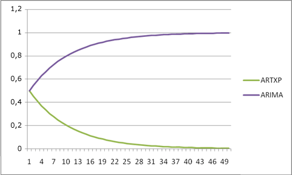
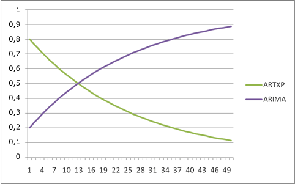

# Riferimento tecnico per l'algoritmo Microsoft Time Series
  Nell'algoritmo [!INCLUDE[msCoName](../../includes/msconame-md.md)] Time Series sono inclusi due algoritmi distinti per l'analisi delle serie temporali:  
  
-   L'algoritmo ARTXP, introdotto in [!INCLUDE[ssVersion2005](../../includes/ssversion2005-md.md)], è ottimizzato per stimare il successivo valore probabile in una serie.  
  
-   L'algoritmo ARIMA è stato aggiunto in [!INCLUDE[ssKatmai](../../includes/sskatmai-md.md)] per migliorare la precisione per la stima a lungo termine.  
  
 Per impostazione predefinita, in [!INCLUDE[ssASnoversion](../../includes/ssasnoversion-md.md)] ciascun algoritmo viene utilizzato separatamente per il training del modello, quindi vengono combinati i risultati per produrre la stima migliore per un numero variabile di stime. È anche possibile scegliere di usare solo uno degli algoritmi, in base ai requisiti relativi a dati e stime. In [!INCLUDE[ssEnterpriseEd10](../../includes/ssenterpriseed10-md.md)]è anche possibile personalizzare il punto di riferimento che controlla l'unione di algoritmi durante la stima.  
  
 In questo argomento sono incluse informazioni aggiuntive sulla modalità di implementazione di ciascun algoritmo e su come personalizzare un algoritmo impostando parametri per ottimizzare i risultati di analisi e stima.  
  
## Implementazione dell'algoritmo Microsoft Time Series  
 [!INCLUDE[msCoName](../../includes/msconame-md.md)] Research ha sviluppato l'algoritmo ARTXP originale, usato in SQL Server 2005, basandone l'implementazione sull'algoritmo [!INCLUDE[msCoName](../../includes/msconame-md.md)] Decision Trees. Pertanto, l'algoritmo ARTXP può essere descritto come modello di albero autoregressivo per la rappresentazione di una serie temporale periodica. Questo algoritmo consente di correlare un numero variabile di elementi precedenti a ciascun elemento corrente stimato. Il nome ARTXP (Autoregressive Tree with Cross Prediction, albero autoregressivo a stima incrociata) deriva dal fatto che il metodo dell'albero autoregressivo (un algoritmo ART) viene applicato a più stati precedenti non noti. Per una descrizione dettagliata dell'algoritmo ARTXP, vedere l'articolo relativo ai [modelli di albero autoregressivi per l'analisi delle serie temporali](http://go.microsoft.com/fwlink/?LinkId=45966).  
  
 L'algoritmo ARIMA è stato aggiunto all'algoritmo Microsoft Time Series in SQL Server 2008 per migliorare l'accuratezza della stima a lungo termine. Si tratta di un'implementazione del processo di calcolo delle medie mobili integrate autoregressive descritto da Box e Jenkins. La metodologia ARIMA consente di determinare le dipendenze in osservazioni effettuate in sequenza nel tempo e può incorporare nel modello shock casuali. Il metodo ARIMA supporta inoltre la stagionalità moltiplicativa. Per ulteriori informazioni sull'algoritmo ARIMA, si consiglia la lettura degli studi originari di Box e Jenkins. Le informazioni fornite in questa sezione sono orientate esclusivamente a una descrizione dell'implementazione della metodologia ARIMA nell'algoritmo Microsoft Time Series.  
  
 Per impostazione predefinita, l'algoritmo Microsoft Time Series utilizza entrambi i metodi, ARIMA e ARTXP, e ne combina i risultati per migliorare l'accuratezza della stima. Se si desidera utilizzare un solo metodo, è possibile impostare i parametri dell'algoritmo per l'utilizzo del solo metodo ARTXP o ARIMA o per il controllo della combinazione dei risultati degli algoritmi. Si noti che, mentre l'algoritmo ARTXP supporta la stima incrociata, questa non è supportata dall'algoritmo ARIMA. La stima incrociata è pertanto disponibile solo quando si utilizza una combinazione di algoritmi o quando il modello viene configurato per l'utilizzo del solo algoritmo ARTXP.  
  
## Informazioni sull'ordine di differenza nel modello ARIMA  
 Questa sezione introduce alcuni termini necessari per comprendere il modello ARIMA e illustra l'implementazione specifica della *differenziazione* nell'algoritmo Microsoft Time Series. Per una descrizione dettagliata dei termini e concetti menzionati, si consiglia la consultazione degli studi di Box e Jenkins.  
  
-   Un termine è un componente di un'equazione matematica. Ad esempio, un termine in un'equazione polinomiale può includere una combinazione di variabili e di costanti.  
  
-   La formula ARIMA inclusa nell'algoritmo Microsoft Time Series usa sia i termini *autoregressivi* sia i termini a *media mobile* .  
  
-   I modelli Time Series possono essere *stazionari* o *non stazionari*. Sono*modelli stazionari* quelli che restituiscono una media, anche se possono contenere cicli, mentre sono *modelli non stazionari* quelli che non dispongono di un punto di equilibrio e sono soggetti a scostamento o a cambiamenti di entità maggiore introdotti da *shock*o da variabili esterne.  
  
-   L'obiettivo della *differenziazione* è rendere una serie temporale stabile e stazionaria.  
  
-   L'  *ordine di differenza* rappresenta il numero di volte in cui viene calcolata la differenza tra i valori di una serie temporale.  
  
 L'algoritmo Microsoft Time Series utilizza i valori di una serie di dati e tenta di adattare i dati a un modello. Se la serie di dati non è ancora stazionaria, l'algoritmo applica un ordine di differenza. Ogni incremento dell'ordine di differenza tende a rendere la serie temporale più stabile.  
  
 Ad esempio, se si dispone della serie temporale (z1, z2, ..., zn) e si eseguono i calcoli usando un ordine di differenza, si ottiene una nuova serie (y1, y2, ..., yn-1), dove `yi = zi+1-zi`. Quando l'ordine di differenza è 2, l'algoritmo genera un'altra serie \`(x1, x2, ..., xn-2)`, basata sulla serie y derivata dall'equazione del primo ordine. La quantità precisa di differenziazione dipende dai dati. Un singolo ordine di differenziazione è più comune nei modelli che mostrano una tendenza costante, mentre un secondo ordine di differenziazione può indicare una tendenza che varia nel tempo.  
  
 Per impostazione predefinita, l'ordine di differenziazione utilizzato nell'algoritmo Microsoft Time Series è -1, ovvero il valore ottimale per l'ordine di differenza verrà rilevato automaticamente dall'algoritmo. In genere, il valore ottimale è 1 (quando è richiesta la differenziazione), ma in certe circostanze l'algoritmo aumenterà tale valore a un massimo di 2.  
  
 L'algoritmo Microsoft Time Series determina l'ordine di differenza ARIMA ottimale mediante i valori di autoregressione. L'algoritmo esamina i valori AR e imposta un parametro nascosto, ARIMA_AR_ORDER, che rappresenta l'ordine dei valori AR. Questo parametro nascosto, ARIMA_AR_ORDER, accetta valori compresi tra -1 e 8. In corrispondenza del valore predefinito, -1, l'algoritmo seleziona automaticamente l'ordine di differenza appropriato.  
  
 Quando il valore di ARIMA_AR_ORDER è maggiore di 1, l'algoritmo moltiplica la serie temporale per un termine polinomiale. Se un termine della formula polinomiale restituisce una radice di 1 o un valore prossimo a 1, l'algoritmo tenta di preservare la stabilità del modello rimuovendo il termine e aumentando l'ordine di differenza di 1. Se l'ordine di differenza è già pari al valore massimo, il termine viene rimosso e l'ordine di differenza non cambia.  
  
 Ad esempio, se il valore di AR è uguale a 2, il termine polinomiale AR risultante potrebbe essere il seguente: `1 – 1.4B + .45B^2 = (1- .9B) (1- 0.5B)`. Si noti il termine `(1- .9B)` , il quale ha una radice di circa 0,9. L'algoritmo elimina questo termine dalla formula polinomiale, ma non può aumentare l'ordine di differenza di uno, in quanto ha già raggiunto il valore massimo di 2.  
  
 È importante notare che l'unico modo per **forzare** una modifica dell'ordine di differenza consiste nell'usare il parametro non supportato ARIMA_DIFFERENCE_ORDER. Questo parametro nascosto consente di controllare il numero di volte in cui l'algoritmo esegue la differenziazione della serie temporale e può essere impostato digitando un parametro di algoritmo personalizzato. Tuttavia, non è consigliabile modificare questo valore se non si è preparati a sperimentare le varie possibilità e non si conoscono a sufficienza i tipi di calcoli richiesti. Si noti inoltre che non esiste al momento alcun meccanismo, compresi i parametri nascosti, che consenta di controllare la soglia in corrispondenza della quale viene attivato l'aumento dell'ordine di differenza.  
  
 Infine, si consideri che la formula precedentemente illustrata rappresenta il caso più semplice, privo di hint di stagionalità. Se sono presenti hint di stagionalità, viene aggiunto per ciascuno di essi un termine polinomiale AR distinto alla sinistra dell'equazione e il medesimo approccio viene utilizzato per eliminare i termini che potrebbero destabilizzare le serie differenziate.  
  
## Personalizzazione dell'algoritmo Microsoft Time Series  
 L'algoritmo [!INCLUDE[msCoName](../../includes/msconame-md.md)] Time Series supporta i parametri seguenti che influiscono su comportamento, prestazioni e precisione del modello di data mining risultante.  
  
> [!NOTE]  
>  L'algoritmo Microsoft Time Series è disponibile in tutte le versioni di [!INCLUDE[ssNoVersion](../../includes/ssnoversion-md.md)], tuttavia alcune funzionalità avanzate, tra cui i parametri per la personalizzazione dell'analisi della serie temporale sono supportate solo in versioni specifiche di [!INCLUDE[ssNoVersion](../../includes/ssnoversion-md.md)]. Per un elenco delle funzionalità supportate dalle edizioni di [!INCLUDE[ssNoVersion](../../includes/ssnoversion-md.md)], vedere [Funzionalità supportate dalle edizioni di SQL Server](../../analysis-services/analysis-services-features-supported-by-the-editions-of-sql-server-2016.md).  
  
### Rilevamento della stagionalità  
 Sia l'algoritmo ARIMA sia quello ARTXP supportano il rilevamento della stagionalità o della periodicità. [!INCLUDE[ssASnoversion](../../includes/ssasnoversion-md.md)] Viene usata la trasformazione Fast Fourier per rilevare la stagionalità prima del training. Tuttavia, è possibile influire sul rilevamento della stagionalità e sui risultati dell'analisi della serie temporale, impostando parametri dell'algoritmo.  
  
-   Modificando il valore di *AUTODETECT_SEASONALITY*, è possibile influenzare il possibile numero di segmenti temporali generati.  
  
-   Impostando un valore o più valori per *PERIODICITY_HINT*, è possibile fornire all'algoritmo informazioni sui cicli previsti nei dati e aumentare potenzialmente la precisione di rilevamento.  
  
> [!NOTE]  
>  Gli algoritmi ARTXP e ARIMA sono entrambi molto sensibili agli hint di stagionalità. Un hint errato può pertanto influire negativamente sui risultati.  
  
### Scelta di un algoritmo e specifica della combinazione di algoritmi  
 Per impostazione predefinita o quando si seleziona l'opzione MIXED, in [!INCLUDE[ssASnoversion](../../includes/ssasnoversion-md.md)] gli algoritmi vengono combinati e associati a un fattore di ponderazione equivalente. In Enterprise Edition, tuttavia, è possibile specificare un algoritmo particolare o personalizzare la proporzione di ogni algoritmo nei risultati impostando un parametro per ponderare i risultati rispetto a stime a breve o a lungo termine. Per impostazione predefinita, il parametro *FORECAST_METHOD* è impostato su MIXED e [!INCLUDE[ssASnoversion](../../includes/ssasnoversion-md.md)] usa entrambi gli algoritmi, quindi ne vengono ponderati i valori per ottimizzare l'attendibilità di ogni algoritmo.  
  
-   Per controllare la scelta dell'algoritmo, impostare il parametro *FORECAST_METHOD* .  
  
-   Se si desidera utilizzare la stima incrociata, è necessario utilizzare l'opzione ARTXP o MIXED, in quanto ARIMA non supporta la stima incrociata.  
  
-   Impostare il parametro *FORECAST_METHOD* su ARTXP per favorire una stima a breve termine.  
  
-   Impostare il parametro *FORECAST_METHOD* su ARIMA per migliorare una stima a lungo termine.  
  
 In Enterprise Edition è anche possibile personalizzare il modo in cui gli algoritmi ARIMA e ARTXP vengono combinati da [!INCLUDE[ssASnoversion](../../includes/ssasnoversion-md.md)] . È possibile determinare sia il punto di inizio della combinazione sia la frequenza di modifica impostando il parametro *PREDICTION_SMOOTHING* :  
  
-   Se si imposta *PREDICTION_SMOOTHING* su 0, il modello usa solo ARTXP.  
  
-   Se si imposta *PREDICTION_SMOOTHING* su 1, il modello usa solo ARIMA.  
  
-   Se si imposta *PREDICTION_SMOOTHING* su un valore compreso tra 0 e 1, il modello consente di ponderare l'algoritmo ARTXP come funzione esponenzialmente decrescente degli intervalli per la stima. Il modello, inoltre, pondera l'algoritmo ARIMA come complemento 1 rispetto al fattore di ponderazione di ARTXP. Il modello utilizza la normalizzazione e una costante di stabilizzazione per smussare le curve.  
  
 In generale, per stime di fino a cinque intervalli di tempo, ARTXP rappresenta quasi sempre la scelta migliore. Se, tuttavia, si aumenta il numero di intervalli di tempo da stimare, le prestazioni dell'algoritmo ARIMA risultano in genere migliori.  
  
 La figura seguente illustra il modo in cui il modello combina gli algoritmi quando *PREDICTION_SMOOTHING* è impostato sul valore predefinito, ovvero 0,5. ARIMA e ARTXP vengono innanzitutto ponderati in modo equivalente, ma, con l'aumentare del numero di stime, all'algoritmo ARIMA viene assegnato un fattore di ponderazione maggiore.  
  
   
  
 Al contrario, la figura seguente illustra la combinazione degli algoritmi quando *PREDICTION_SMOOTHING* è impostato su 0,2. Per il passaggio [!INCLUDE[tabValue](../../includes/tabvalue-md.md)], il modello assegna all'algoritmo ARIMA un fattore di ponderazione pari a 0,2 e all'algoritmo ARTXP un fattore di ponderazione pari a 0,8. Successivamente, il fattore di ponderazione dell'algoritmo ARIMA aumenta in misura esponenziale, mentre quello di ARTXP diminuisce in misura esponenziale.  
  
   
  
### Impostazione dei parametri dell'algoritmo  
 La tabella seguente descrive i parametri che è possibile usare con l'algoritmo [!INCLUDE[msCoName](../../includes/msconame-md.md)] Time Series.  
  
|Parametro|Description|  
|---------------|-----------------|  
|*AUTO_DETECT_PERIODICITY*|Specifica un valore numerico compreso tra [!INCLUDE[tabValue](../../includes/tabvalue-md.md)] e 1 per il rilevamento della periodicità. Il valore predefinito è 0,6.   Se il valore è prossimo a [!INCLUDE[tabValue](../../includes/tabvalue-md.md)], la periodicità viene rilevata solo per dati fortemente periodici.   L'impostazione di un valore prossimo a 1 favorisce l'individuazione di numerosi modelli quasi periodici e la generazione automatica di hint di periodicità.   Nota: è probabile che la gestione di un numero elevato di hint di periodicità comporti tempi di training del modello significativamente più lunghi, ma modelli più accurati.|  
|*COMPLEXITY_PENALTY*|Controlla la crescita dell'albero delle decisioni. Il valore predefinito è 0,1.   La riduzione di questo valore comporta una maggiore probabilità di una divisione. L'aumento di questo valore comporta una minore probabilità di una divisione.   Nota: questo parametro è disponibile solo in alcune edizioni di [!INCLUDE[ssNoVersion](../../includes/ssnoversion-md.md)].|  
|*FORECAST_METHOD*|Specifica l'algoritmo da utilizzare per l'analisi e la stima. I valori possibili sono ARTXP, ARIMA e MIXED. L'impostazione predefinita è MIXED.|  
|*HISTORIC_MODEL_COUNT*|Specifica il numero di modelli cronologici che verranno generati. Il valore predefinito è 1.   Nota: questo parametro è disponibile solo in alcune edizioni di [!INCLUDE[ssNoVersion](../../includes/ssnoversion-md.md)].|  
|*HISTORICAL_MODEL_GAP*|Specifica l'intervallo di tempo tra due modelli cronologici consecutivi. Il valore predefinito è 10. Il valore rappresenta un numero di unità di tempo, in cui l'unità è definita dal modello.   Se si imposta questo valore su g, ad esempio, verranno generati modelli cronologici per i dati suddivisi in periodi di tempo in corrispondenza degli intervalli g, 2*g, 3\*g e così via.   Nota: questo parametro è disponibile solo in alcune edizioni di [!INCLUDE[ssNoVersion](../../includes/ssnoversion-md.md)].|  
|*INSTABILITY_SENSITIVITY*|Viene controllato il punto in cui la varianza della stima supera una certa soglia dopo la quale l'algoritmo ARTXP disattiva le stime. Il valore predefinito è 1.   Nota: questo parametro non si applica a modelli che usano solo l'algoritmo ARIMA.   Il valore predefinito 1 presenta lo stesso comportamento come in [!INCLUDE[ssVersion2005](../../includes/ssversion2005-md.md)]. [!INCLUDE[ssASnoversion](../../includes/ssasnoversion-md.md)] consente di monitorare la deviazione standard normalizzata per ogni stima. Quando questo valore supera la soglia di una stima, tramite l'algoritmo Time Series viene restituito un valore NULL e il processo di stima viene arrestato.   Un valore [!INCLUDE[tabValue](../../includes/tabvalue-md.md)] comporta l'arresto del rilevamento dell'instabilità. È pertanto possibile creare un numero infinito di stime, indipendentemente dalla varianza.   Nota: questo parametro può essere modificato solo in [!INCLUDE[ssNoVersion](../../includes/ssnoversion-md.md)] Enterprise. In [!INCLUDE[ssNoVersion](../../includes/ssnoversion-md.md)] Standard [!INCLUDE[ssASnoversion](../../includes/ssasnoversion-md.md)] utilizza solo il valore predefinito 1.|  
|*MAXIMUM_SERIES_VALUE*|Specifica il valore massimo da utilizzare per le stime. Questo parametro viene usato, insieme a *MINIMUM_SERIES_VALUE*, per vincolare le stime a un intervallo previsto. È possibile, ad esempio, specificare che la quantità stimata per le vendite per qualsiasi giorno non deve mai superare il numero di prodotti in inventario.   Nota: questo parametro è disponibile solo in alcune edizioni di [!INCLUDE[ssNoVersion](../../includes/ssnoversion-md.md)].|  
|*MINIMUM_SERIES_VALUE*|Specifica il valore minimo che può essere stimato. Questo parametro viene usato, insieme a *MAXIMUM_SERIES_VALUE*, per vincolare le stime a un intervallo previsto. È possibile specificare, ad esempio, che la quantità prevista per le vendite non sia mai un numero negativo.   Nota: questo parametro è disponibile solo in alcune edizioni di [!INCLUDE[ssNoVersion](../../includes/ssnoversion-md.md)].|  
|*MINIMUM_SUPPORT*|Specifica il numero minimo di intervalli di tempo necessari per generare una divisione in ogni albero di serie temporali. Il valore predefinito è 10.|  
|*MISSING_VALUE_SUBSTITUTION*|Specifica il modo in cui riempire i gap nei dati cronologici. Per impostazione predefinita, non sono consentiti gap nei dati. Nella tabella seguente sono inclusi i valori possibili per questo parametro:   **Previous**: ripete il valore dal periodo di tempo precedente.   **Mean**: usa una media mobile dei periodi di tempo usati nel training.   Numeric constant: usa il numero specificato per sostituire tutti i valori mancanti.   **None**: impostazione predefinita. Sostituisce i valori mancanti con quelli tracciati lungo la curva del modello di cui è stato eseguito il training.      Se i dati contengono più serie, queste non possono avere margini discontinui, ovvero tutte le serie devono avere gli stessi punti di inizio e di fine.                      [!INCLUDE[ssASnoversion](../../includes/ssasnoversion-md.md)] usa inoltre il valore di questo parametro per riempire i gap nei nuovi dati quando si esegue un'istruzione **PREDICTION JOIN** nel modello Time Series.|  
|*PERIODICITY_HINT*|Fornisce un hint all'algoritmo in riferimento alla periodicità dei dati. Se, ad esempio, le vendite variano in base all'anno e l'unità di misura utilizzata nella serie è il mese, la periodicità è 12. Questo parametro viene espresso nel formato {n [, n]}, dove n è qualsiasi numero positivo.   Il valore n all'interno delle parentesi quadre [] è facoltativo e può essere ripetuto con la frequenza desiderata. Per specificare, ad esempio, più hint di periodicità per i dati forniti ogni mese, è possibile immettere {12, 3 1} per rilevare modelli per l'anno, il trimestre e il mese. La periodicità, tuttavia, influisce significativamente sulla qualità del modello. Se l'hint specificato è diverso dalla periodicità effettiva, i risultati possono subire conseguenze negative.   Il valore predefinito è {1}.   Le parentesi graffe sono obbligatorie. I dati di questo parametro, inoltre, sono di tipo stringa. Se pertanto questo parametro viene digitato come parte di un'istruzione DMX (Data Mining Extensions), è necessario racchiudere il numero e le parentesi graffe tra virgolette.|  
|*PREDICTION_SMOOTHING*|Specifica il modo in cui combinare il modello per ottimizzare la previsione. È possibile digitare qualsiasi valore compreso tra [!INCLUDE[tabValue](../../includes/tabvalue-md.md)] e 1 o utilizzare uno dei valori seguenti:   [!INCLUDE[tabValue](../../includes/tabvalue-md.md)]:                           Specifica che la stima utilizza solo l'algoritmo ARTXP. La previsione è ottimizzata per un numero minore di stime.   1: specifica che la stima usa solo l'algoritmo ARIMA. La previsione è ottimizzata per un numero elevato di stime.   0,5: valore predefinito. Specifica che per la stima devono essere usati entrambi gli algoritmi e che i risultati devono essere combinati.      Quando si esegue l'arrotondamento delle stime, usare il parametro *FORECAST_METHOD* per controllare il training.   Questo parametro è disponibile solo in alcune edizioni di [!INCLUDE[ssNoVersion](../../includes/ssnoversion-md.md)].|  
  
### Flag di modellazione  
 L'algoritmo [!INCLUDE[msCoName](../../includes/msconame-md.md)] Time Series supporta i flag di modellazione seguenti. Quando si crea la struttura o il modello di data mining, i flag di modellazione vengono definiti per specificare la modalità di gestione dei valori presenti in ogni colonna durante l'analisi. Per altre informazioni, vedere [Flag di modellazione &#40;data mining&#41;](../../analysis-services/data-mining/modeling-flags-data-mining.md).  
  
|Flag di modellazione|Description|  
|-------------------|-----------------|  
|NOT NULL|Indica che la colonna non può contenere un valore Null. Se Analysis Services rileva un valore Null durante il training del modello, viene generato un errore.   Si applica alle colonne della struttura di data mining.|  
|MODEL_EXISTENCE_ONLY|Indica che la colonna verrà considerata come se presentasse due stati possibili, ovvero Missing ed Existing. Un valore Null è un valore mancante.   Si applica alle colonne del modello di data mining.|  
  
## Requisiti  
 Un modello Time Series deve includere una colonna chiave temporale contenente valori univoci, colonne di input e almeno una colonna stimabile.  
  
### Colonne di input e stimabili  
 L'algoritmo [!INCLUDE[msCoName](../../includes/msconame-md.md)] Time Series supporta i tipi di contenuto specifici delle colonne di input, i tipi di contenuto specifici delle colonne stimabili e i flag di modellazione elencati nella tabella seguente.  
  
|Colonna|Tipi di contenuto|  
|------------|-------------------|  
|Attributo di input|Continuous, Key, Key Time e Table|  
|Attributo stimabile|Continuous e Table|  
  
> [!NOTE]  
>  Sono supportati i tipi di contenuto Cyclical e Ordered ma l'algoritmo li considera come valori discreti e non esegue un'elaborazione speciale.  
  
## Vedere anche  
 [Algoritmo Microsoft Time Series](../../analysis-services/data-mining/microsoft-time-series-algorithm.md)   
 [Tempo Series Model Query Examples](../../analysis-services/data-mining/time-series-model-query-examples.md)   
 [Contenuto dei modelli di data mining per i modelli Time Series &#40;Analysis Services - Data mining&#41;](../../analysis-services/data-mining/mining-model-content-for-time-series-models-analysis-services-data-mining.md)  
  
  
