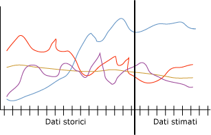

# Algoritmo Microsoft Time Series
  L'algoritmo [!INCLUDE[msCoName](../../includes/msconame-md.md)] Time Series rende disponibili numerosi algoritmi ottimizzati per prevedere valori continui, ad esempio vendite di prodotti, nel corso del tempo. Altri algoritmi [!INCLUDE[msCoName](../../includes/msconame-md.md)] , come ad esempio gli alberi delle decisioni, richiedono colonne aggiuntive di nuove informazioni come input per stimare una tendenza contrariamente a quanto accade con un modello Time Series. Un modello Time Series può stimare le tendenze basate solo sul set di dati originale utilizzato per creare il modello. È anche possibile aggiungere nuovi dati al modello quando viene eseguita una stima e vengono incorporati automaticamente i nuovi dati nell'analisi della tendenza.  
  
 Nel diagramma seguente viene illustrato un modello tipico per la previsione delle vendite di un prodotto nel tempo, in quattro diverse regioni di vendita. Il modello visualizzato nel diagramma illustra le vendite di ogni regione rappresentate con righe rosse, gialle, viola e blu. La riga per ogni regione è composta da due parti:  
  
-   Le informazioni cronologiche vengono visualizzate alla sinistra della riga verticale e rappresentano i dati utilizzati dall'algoritmo per creare il modello.  
  
-   Le informazioni stimate vengono visualizzate alla destra della riga verticale e rappresentano la previsione del modello.  
  
 La combinazione di dati di origine e dati stimati sono chiamati *serie*.  
  
   
  
 Una caratteristica importante dell'algoritmo [!INCLUDE[msCoName](../../includes/msconame-md.md)] Time Series è la possibilità di eseguire stime incrociate. Se si esegue il training dell'algoritmo con due serie separate ma correlate, è possibile utilizzare il modello risultante per eseguire la stima dei risultati di una serie in base al comportamento dell'altra. Ad esempio, le vendite osservate di un prodotto possono influenzare le vendite previste di un altro prodotto.  Incrociare la stima è anche utile per la creazione di un modello generale che possa essere applicato a più serie. Ad esempio, le stime per una particolare regione sono instabili perché i dati della serie non sono di buona qualità.  È possibile eseguire il training di un modello generale su una media di tutte le quattro regioni e quindi applicare il modello alla serie singola per creare più stime stabili per ogni regione.  
  
## Esempio  
 Il team di gestione di [!INCLUDE[ssSampleDBCoFull](../../includes/sssampledbcofull-md.md)] desidera eseguire la stima delle vendite mensili di biciclette per l'anno successivo. In particolare, l'azienda intende stabilire se è possibile utilizzare le vendite di un modello di biciclette per eseguire la stima delle vendite di un altro modello. Mediante l'utilizzo dell'algoritmo [!INCLUDE[msCoName](../../includes/msconame-md.md)] Time Series sui dati cronologici dei tre anni precedenti, l'azienda può generare un modello di data mining che prevede le vendite di biciclette future. Inoltre, l'azienda può eseguire stime incrociate per stabilire se le tendenze di vendita dei singoli modelli di biciclette sono correlate.  
  
 Ogni trimestre, l'azienda intende aggiornare il modello con i recenti dati di vendita e aggiornare le stime in base alle tendenze recenti. Per correggere i dati dei punti vendita che non aggiornano i dati in modo accurato o costante, creeranno un modello di previsione generale e lo utilizzeranno per creare previsioni per tutte le regioni.  
  
## Funzionamento dell'algoritmo  
 In [!INCLUDE[ssVersion2005](../../includes/ssversion2005-md.md)], l'algoritmo [!INCLUDE[msCoName](../../includes/msconame-md.md)] Time Series usava un unico modello di serie temporale autoregressivo, denominato ARTXP. L'algoritmo ARTXP è stato ottimizzato per le stime a breve termine e, pertanto, è in grado di stimare il probabile valore successivo in una serie. A partire da [!INCLUDE[ssKatmai](../../includes/sskatmai-md.md)], l'algoritmo [!INCLUDE[msCoName](../../includes/msconame-md.md)] Time Series ha aggiunto un secondo algoritmo, ARIMA, ottimizzato per la stima a lungo termine. Per una spiegazione dettagliata sull'implementazione degli algoritmi ARTXP e ARIMA, vedere [Riferimento tecnico per l'algoritmo Microsoft Time Series](../../analysis-services/data-mining/microsoft-time-series-algorithm-technical-reference.md).  
  
 Per impostazione predefinita, nell'algoritmo [!INCLUDE[msCoName](../../includes/msconame-md.md)] Time Series viene usata una combinazione di algoritmi quando consente di analizzare modelli ed eseguire stime. L'algoritmo esegue il training di due modelli separati sugli stessi dati: un modello usa l'algoritmo ARTXP, mentre l'altro usa l'algoritmo ARIMA. L'algoritmo mescola quindi i risultati dei due modelli per produrre la migliore stima per un numero variabile di intervalli di tempo. Poiché ARTXP è ottimale per le stime a breve termine, riceve un peso molto maggiore all'inizio di una serie di stime. Tuttavia, con il procedere degli intervalli di tempo stimati nel futuro, ARIMA riceve un peso maggiore.  
  
 È anche possibile controllare la combinazione di algoritmi per favorire le stime a lungo o breve termine nella serie temporale. A partire da [!INCLUDE[ssKatmai](../../includes/sskatmai-md.md)] Standard, è possibile specificare l'algoritmo da usare:  
  
-   Per una stima a breve termine utilizzare solo ARTXP.  
  
-   Per una stima a lungo termine utilizzare solo ARIMA.  
  
-   Utilizzare la combinazione predefinita dei due algoritmi.  
  
 A partire da [!INCLUDE[ssEnterpriseEd10](../../includes/ssenterpriseed10-md.md)], è anche possibile personalizzare la combinazione dell'algoritmo Time Series di [!INCLUDE[msCoName](../../includes/msconame-md.md)] e dei modelli per la stima. Quando si usa un modello misto, l'algoritmo [!INCLUDE[msCoName](../../includes/msconame-md.md)] Time Series consente di combinare i due algoritmi nella modalità seguente:  
  
-   Per eseguire la prima coppia di stime viene sempre utilizzato solo ARTXP.  
  
-   Dopo la prima coppia di stime, viene utilizzata una combinazione di ARIMA e ARTXP.  
  
-   Con l'aumento del numero delle stime, le stime si basano sempre più su ARIMA fino a che ARTXP non viene più utilizzato.  
  
-   L'utente controlla il punto di combinazione, la frequenza di riduzione dello spessore di ARTXP e di aumento dello spessore di ARIMA impostando il parametro PREDICTION_SMOOTHING.  
  
 Entrambi algoritmi possono rilevare la stagionalità nei dati a più livelli. Ad esempio, i dati potrebbero contenere cicli mensili nidificati all'interno di cicli annuali. Per rilevare questi cicli stagionali è possibile fornire un hint di periodicità o specificare che l'algoritmo deve rilevare automaticamente la periodicità.  
  
 In aggiunta alla periodicità, esistono molti altri parametri che controllano il comportamento dell'algoritmo Time Series di [!INCLUDE[msCoName](../../includes/msconame-md.md)] quando rileva la periodicità, esegue le stime o analizza i casi. Per altre informazioni sull'impostazione dei parametri dell'algoritmo, vedere [Riferimento tecnico per l'algoritmo Microsoft Time Series](../../analysis-services/data-mining/microsoft-time-series-algorithm-technical-reference.md).  
  
## Dati necessari per i modelli Time Series  
 Quando si preparano dati per il training di qualsiasi modello di data mining, verificare che siano chiari i requisiti per il modello specifico e il modo in cui devono essere utilizzati i dati.  
  
 Ogni modello di previsione deve contenere una serie di casi, ossia la colonna che specifica gli intervalli di tempo o le altre serie in cui si verifica la modifica. Ad esempio, i dati del diagramma precedente mostrano la serie relativa alla cronologia e alle stime di vendite di biciclette per un periodo di tempo di diversi mesi. Per questo modello, ogni regione è una serie e la colonna relativa alla data contiene la serie temporale che rappresenta anche la serie di casi. In altri modelli le serie di case possono essere un campo di testo o un identificatore, ad esempio un ID cliente o un ID transazione. Tuttavia, un modello Time Series deve utilizzare sempre una data, un'ora o un qualsiasi valore numerico univoco per la serie di case.  
  
 I requisiti per un modello della serie temporale sono i seguenti:  
  
-   **Una singola colonna chiave temporale** Ogni modello deve contenere una colonna numerica o data usata come serie di case che definisce gli intervalli di tempo che il modello utilizzerà. Il tipo di dati per la colonna chiave temporale può essere un tipo di dati del datetime o un tipo di dati numerici. Tuttavia, la colonna deve contenere valori continui e i valori devono essere univoci per ogni serie. Impossibile archiviare le serie di casi per un modello della serie temporale in due colonne, ad esempio una colonna annua e una colonna mensile.  
  
-   **Una colonna stimabile** Ogni modello deve contenere almeno una colonna stimabile che verrà usata dall'algoritmo per compilare il modello della serie temporale. Il tipo di dati della colonna stimabile deve avere valori continui. Ad esempio, è possibile stimare la modifica degli attributi numerici nel tempo, ad esempio reddito, vendite o temperatura. Tuttavia, non è possibile utilizzare una colonna contenente valori discreti, ad esempio stato di acquisto o livello di istruzione, come colonna stimabile.  
  
-   **Una colonna chiave della serie facoltativa** Ogni modello può avere una colonna chiave aggiuntiva contenente valori univoci che identificano una serie. La colonna chiave della serie facoltativa deve contenere valori univoci. Ad esempio, un solo modello può contenere vendite per molti modelli del prodotto, a condizione che esista un solo record per ogni nome di prodotto di ogni intervallo di tempo.  
  
 È possibile definire i dati di input per il modello Time Series di [!INCLUDE[msCoName](../../includes/msconame-md.md)] in diversi modi. Tuttavia, poiché il formato dei casi di input influisce sulla definizione del modello di data mining, è necessario considerare le esigenze e prepararsi di conseguenza ai dati. I due esempi seguenti illustrano il modo in cui i dati di input influiscono sul modello. In entrambi gli esempi, il modello di data mining completato contiene modelli per quattro serie distinte:  
  
-   Vendite del prodotto A  
  
-   Vendite del prodotto B  
  
-   Volume del prodotto A  
  
-   Volume del prodotto B  
  
 In entrambi gli esempi, è possibile stimare le nuove vendite future e il volume di ogni prodotto. Non è possibile stimare valori nuovi relativi al prodotto o all'ora.  
  
### Esempio 1: Set di dati della serie temporale con serie rappresentate come valori di colonna  
 In questo esempio viene utilizzata la tabella seguente di casi di input:  
  
|TimeID|Product|Sales|Volume|  
|------------|-------------|-----------|------------|  
|1/2001|A|1000|600|  
|2/2001|A|1100|500|  
|1/2001|B|500|900|  
|2/2001|B|300|890|  
  
 La colonna TimeID della tabella contiene un identificatore temporale e include due voci per ogni giorno. La colonna TimeID diviene la serie di casi. Pertanto, è necessario definire questa colonna come colonna chiave temporale per il modello della serie temporale.  
  
 La colonna Product definisce un prodotto del database. In questa colonna è contenuta la serie del prodotto. Pertanto, è necessario definire questa colonna come seconda chiave per il modello della serie temporale.  
  
 La colonna Sales descrive i profitti lordi del prodotto specificato per un giorno e la colonna Volume descrive la quantità del prodotto specificato che rimane nel warehouse. In queste due colonne sono contenuti i dati utilizzati per il training del modello. Sia Sales che Volume possono essere attributi stimabili per ogni serie nella colonna Product.  
  
### Esempio 2: Set di dati della serie temporale con ogni serie in una colonna separata  
 Anche se in questo esempio vengono utilizzati fondamentalmente gli stessi dati di input del primo esempio, i dati di input vengono strutturati in modo diverso, come illustrato nella tabella seguente:  
  
|TimeID|A_Sales|A_Volume|B_Sales|B_Volume|  
|------------|--------------|---------------|--------------|---------------|  
|1/2001|1000|600|500|900|  
|2/2001|1100|500|300|890|  
  
 In questa tabella, la colonna TimeID contiene ancora la serie di casi per il modello Time Series che viene definito come colonna chiave temporale. Tuttavia, le colonne precedenti relative alle vendite e al volume sono suddivise in due colonne, ognuna preceduta dal nome del prodotto. Di conseguenza, la colonna TimeID include una singola voce per ogni giorno. In questo modo viene creato un modello Time Series contenente quattro colonne stimabili: A_Sales, A_Volume, B_Sales e B_Volume.  
  
 Inoltre, poiché i prodotti sono stati separati in colonne diverse, non è necessario specificare una colonna chiave della serie aggiuntiva. Tutte le colonne del modello sono colonne della serie di casi o colonne stimabili.  
  
## Visualizzazione di un modello Time Series  
 In seguito al training del modello, i risultati vengono archiviati come set di modelli, esplorabili o utilizzabili per eseguire stime.  
  
 Per esplorare il modello è possibile usare il [Visualizzatore Time Series](../../analysis-services/data-mining/browse-a-model-using-the-microsoft-time-series-viewer.md). Il visualizzatore include un grafico che illustra le stime future e una visualizzazione ad albero delle strutture periodiche dei dati.  
  
 Per altre informazioni sul calcolo delle stime, è possibile esplorare il modello in [Microsoft Generic Content Tree Viewer](../../analysis-services/data-mining/browse-a-model-using-the-microsoft-generic-content-tree-viewer.md). Nel contenuto archiviato per il modello sono inclusi dettagli, ad esempio le strutture periodiche rilevate dagli algoritmi ARIMA e ARTXP, l'equazione utilizzata per combinare gli algoritmi e altre statistiche.  
  
## Creazione di stime basate su serie temporali  
 Per impostazione predefinita, quando si visualizza un modello Time Series, [!INCLUDE[ssASnoversion](../../includes/ssasnoversion-md.md)] mostra cinque stime per la serie. Tuttavia, è possibile creare query per restituire un numero variabile di stime e colonne aggiuntive nelle stime per restituire statistiche descrittive. Per informazioni sulla creazione di query in base a un modello Time Series, vedere [Esempi di query sul modello di serie temporale](../../analysis-services/data-mining/time-series-model-query-examples.md). Per esempi su come usare DMX (Data Mining Extensions) ed eseguire stime basate su serie temporali, vedere [PredictTimeSeries &#40;DMX&#41;](../../dmx/predicttimeseries-dmx.md).  
  
 Quando si utilizza l'algoritmo [!INCLUDE[msCoName](../../includes/msconame-md.md)] Time Series per fare delle stime, è opportuno considerare i requisiti e i limiti seguenti:  
  
-   La stima incrociata è disponibile solo quando si usa un modello misto o un modello basato esclusivamente sull'algoritmo ARTXP. La stima incrociata non è disponibile quando si utilizza un modello basato sull'algoritmo ARIMA.  
  
-   Un modello Time Series può eseguire stime che differiscono, a volte in modo significativo, a seconda del sistema operativo a 64 bit utilizzato dal server. Queste differenze sono dovute al modo in cui un sistema basato su [!INCLUDE[vcpritanium](../../includes/vcpritanium-md.md)]rappresenta e gestisce i numeri per operazioni aritmetiche a virgola mobile, che è diverso dal modo in cui tali calcoli vengono eseguiti in un sistema basato su [!INCLUDE[vcprx64](../../includes/vcprx64-md.md)]. Poiché i risultati della stima possono essere specifici nel sistema operativo, si consiglia di valutare i modelli dello stesso sistema operativo che verrà utilizzato in produzione.  
  
## Osservazioni  
  
-   Non supporta l'utilizzo del linguaggio PMML (Predictive Model Markup Language) per la creazione di modelli di data mining.  
  
-   Supporta l'utilizzo di modelli di data mining OLAP.  
  
-   Non supporta la creazione di dimensioni di data mining.  
  
-   Supporta il drill-through.  
  
## Vedere anche  
 [Algoritmi di data mining &#40;Analysis Services - Data mining&#41;](../../analysis-services/data-mining/data-mining-algorithms-analysis-services-data-mining.md)   
 [Visualizzare un modello utilizzando il visualizzatore Microsoft Time Series](../../analysis-services/data-mining/browse-a-model-using-the-microsoft-time-series-viewer.md)   
 [Riferimento tecnico per algoritmo Microsoft Time Series](../../analysis-services/data-mining/microsoft-time-series-algorithm-technical-reference.md)   
 [Tempo Series Model Query Examples](../../analysis-services/data-mining/time-series-model-query-examples.md)   
 [Contenuto dei modelli di data mining per i modelli Time Series &#40;Analysis Services - Data mining&#41;](../../analysis-services/data-mining/mining-model-content-for-time-series-models-analysis-services-data-mining.md)  
  
  
