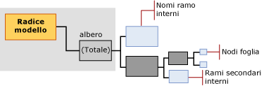

# Mining Model Content for Decision Tree Models (Analysis Services - Data Mining)
  In questo argomento viene descritto il contenuto dei modelli di data mining specifico dei modelli che utilizzano l'algoritmo [!INCLUDE[msCoName](../../includes/msconame-md.md)] Decision Trees. Per una spiegazione del modello di data mining applicabile a tutti i tipi di modello, vedere [Contenuto del modello di data mining &#40;Analysis Services - Data mining&#41;](../../analysis-services/data-mining/mining-model-content-analysis-services-data-mining.md). È importante ricordare che l'algoritmo Microsoft Decision Trees è un algoritmo ibrido che consente di creare modelli con funzioni molto diverse: un albero delle decisioni può rappresentare associazioni, regole o persino regressione lineare. La struttura dell'albero è sostanzialmente la stessa, ma la modalità di interpretazione delle informazioni dipenderà dallo scopo per il quale è stato creato il modello.  
  
##   Informazioni sulla struttura di un modello di albero delle decisioni  
 Un modello di albero delle decisioni dispone di un singolo nodo padre che rappresenta il modello e i relativi metadati. Sotto il nodo padre sono presenti alberi indipendenti che rappresentano gli attributi stimabili selezionati. Se ad esempio il modello di albero delle decisioni viene configurato per stimare se un cliente acquisterà un prodotto e fornire input relativi a genere e reddito, il modello creerà un singolo albero per l'attributo relativo agli acquisti, con molti rami riferiti alle condizioni correlate al genere e al reddito.  
  
 Se in seguito si aggiunge un attributo stimabile separato riferito alla partecipazione a un concorso a premi per clienti, l'algoritmo creerà due alberi separati sotto il nodo padre. Un albero contiene l'analisi relativa agli acquisti e un altro contiene l'analisi per il concorso a premi per clienti.  Se l'algoritmo Decision Trees viene utilizzato per creare un modello di associazione, viene creato un albero separato per ogni prodotto stimato, in cui saranno contenute tutte le altre combinazioni di prodotti che contribuiscono alla selezione dell'attributo di destinazione.  
  
> [!NOTE]  
>  Se il modello include più alberi, è possibile visualizzare solo un albero alla volta nel **Visualizzatore Microsoft Decision Trees**. In **Microsoft Generic Content Tree Viewer** , tuttavia, tutti gli alberi dello stesso modello vengono visualizzati contemporaneamente.  
  
   
  
 L'albero di ogni attributo stimabile contiene informazioni che descrivono il modo in cui le colonne di input scelte incidono sul risultato di quel particolare attributo stimabile. Ogni albero ha inizio da un nodo (NODE_TYPE = 9) che contiene l'attributo stimabile, seguito da una serie di nodi (NODE_TYPE = 10) che rappresentano gli attributi di input. Un attributo corrisponde a una colonna del livello del case o a valori di colonne di tabella annidata che in genere corrispondono ai valori nella colonna **Chiave** della tabella annidata.  
  
 I nodi interni e i nodi foglia rappresentano le condizioni di divisione. Un albero può dividersi più volte sullo stesso attributo. Il modello **TM_DecisionTree** può ad esempio dividersi su [Reddito annuo] e su [Number of Children]\ (Numero di figli) e quindi dividersi nuovamente su [Reddito annuo] a un livello inferiore nell'albero.  
  
 L'algoritmo Microsoft Decision Trees può contenere anche regressioni lineari in tutto l'albero o in parte di esso. Se l'attributo di cui si crea il modello presenta un tipo di dati numerici continui, è possibile creare un nodo di albero di regressione (NODE_TYPE = 25) in ogni punto in cui la relazione tra gli attributi può essere modellata in modo lineare. In questo caso, il nodo contiene una formula di regressione.  
  
 Tuttavia, se l'attributo stimabile presenta valori discreti o se i valori numerici sono stati inseriti in bucket o discretizzati, il modello crea sempre un albero di classificazione (NODE_TYPE = 2). Un albero di classificazione può presentare più rami o nodi di albero interni (NODE_TYPE = 3) per ogni valore dell'attributo. Tuttavia, la divisione non avviene necessariamente su ogni valore dell'attributo.  
  
 L'algoritmo Microsoft Decision Trees non consente di utilizzare tipi di dati continui come input; pertanto, se una colonna dispone di un tipo di dati numerici continui, i valori vengono discretizzati. Per tutti gli attributi continui, l'algoritmo esegue la discretizzazione in corrispondenza di una divisione.  
  
> [!NOTE]  
>  [!INCLUDE[ssASnoversion](../../includes/ssasnoversion-md.md)]viene automaticamente scelto un metodo per bucket di attributi continui; Tuttavia, è possibile controllare i valori come continui negli input vengono discretizzati impostando il tipo di contenuto della colonna della struttura di data mining per **Discretized** e impostando il <xref:Microsoft.AnalysisServices.ScalarMiningStructureColumn.DiscretizationBucketCount%2A> o <xref:Microsoft.AnalysisServices.ScalarMiningStructureColumn.DiscretizationMethod%2A> proprietà.  
  
 [Torna all'inizio](#bkmk_Top)  
  
##   Contenuto di un modello di albero delle decisioni  
 In questa sezione vengono forniti dettagli ed esempi specifici delle colonne del contenuto dei modelli di data mining particolarmente importanti per i modelli di albero delle decisioni. Per informazioni sulle colonne generiche del set di righe dello schema e per spiegazioni sulla terminologia dei modelli di data mining, vedere [Contenuto del modello di data mining &#40;Analysis Services - Data mining&#41;](../../analysis-services/data-mining/mining-model-content-analysis-services-data-mining.md).  
  
 MODEL_CATALOG  
 Nome del database in cui è archiviato il modello.  
  
 MODEL_NAME  
 Nome del modello.  
  
 ATTRIBUTE_NAME  
 Nome dell'attributo che corrisponde a questo nodo.  
  
 NODE_NAME  
 Sempre uguale a NODE_UNIQUE_NAME.  
  
 NODE_UNIQUE_NAME  
 Identificatore univoco del nodo all'interno del modello. Questo valore non può essere modificato.  
  
 Per i modelli di albero delle decisioni, i nomi univoci rispettano la convenzione seguente che non si applica a tutti gli algoritmi:  
  
 Tutti i nodi figlio di un determinato nodo specifico disporranno tutti dello stesso prefisso esadecimale seguito da un altro numero esadecimale che rappresenta la sequenza del nodo figlio all'interno del nodo padre. È possibile utilizzare i prefissi per dedurre un percorso.  
  
 NODE_TYPE  
 Nei modelli di albero delle decisioni, vengono creati i tipi di nodi seguenti:  
  
|Tipo di nodo|Description|  
|---------------|-----------------|  
|1 (Model)|Nodo radice per il modello.|  
|2 (Albero)|Nodo padre per alberi di classificazione del modello. Denominato **"Tutti"**.|  
|3 (Interno)|Inizio di ramo interno, disponibile all'interno di un albero di classificazione o di un albero di regressione.|  
|4 (Distribuzione)|Nodo foglia, disponibile all'interno di un albero di classificazione o di un albero di regressione.|  
|25 (Albero di regressione)|Nodo padre per albero di regressione all'interno del modello. Denominato **"Tutti"**.|  
  
 NODE_CAPTION  
 Nome descrittivo a scopo di visualizzazione.  
  
 Quando si crea un modello, il valore di NODE_UNIQUE_NAME viene automaticamente utilizzato come didascalia. Tuttavia, è possibile modificare il valore di NODE_CAPTION per aggiornare il nome visualizzato per il cluster, a livello di programmazione o tramite il visualizzatore. La didascalia viene generata automaticamente dal modello. Il contenuto della didascalia dipende dal tipo di modello e dal tipo di nodo.  
  
 In un modello di albero delle decisioni, NODE_CAPTION e NODE_DESCRIPTION presentano informazioni diverse, a seconda del livello nell'albero. Per ulteriori informazioni ed esempi, vedere [Didascalia del nodo e descrizione del nodo](#NodeCaption).  
  
 CHILDREN_CARDINALITY  
 Stima del numero di nodi figlio del nodo.  
  
 **Nodo padre** Indica il numero di attributi stimabili modellati. Viene creato un albero per ogni attributo stimabile.  
  
 **Nodo albero** Il nodo **Tutti** di ogni albero indica quanti valori sono stati utilizzati per l'attributo di destinazione.  
  
-   Se l'attributo di destinazione è discreto, il valore è uguale al numero di valori distinct più 1 per lo stato **Missing** .  
  
-   Se l'attributo stimabile è continuo, il valore indica il numero di bucket utilizzati per modellare l'attributo continuo.  
  
 **Nodi foglia** Sempre 0.  
  
 PARENT_UNIQUE_NAME  
 Nome univoco dell'elemento padre del nodo. Per tutti i nodi a livello di radice viene restituito NULL.  
  
 NODE_DESCRIPTION  
 Descrizione del nodo.  
  
 In un modello di albero delle decisioni, NODE_CAPTION e NODE_DESCRIPTION presentano informazioni diverse, a seconda del livello nell'albero.  
  
 Per ulteriori informazioni ed esempi, vedere [Didascalia del nodo e descrizione del nodo](#NodeCaption).  
  
 NODE_RULE  
 Descrizione XML della regola che indica il percorso del nodo corrente dal nodo padre immediato corrispondente.  
  
 Per ulteriori informazioni ed esempi, vedere [Regola del nodo e regola marginale](#NodeRule).  
  
 MARGINAL_RULE  
 Descrizione XML della regola che indica il percorso dal nodo padre al nodo corrente del modello.  
  
 Per ulteriori informazioni, vedere [Regola del nodo e regola marginale](#NodeRule).  
  
 NODE_PROBABILITY  
 Probabilità associata a questo nodo.  
  
 Per ulteriori informazioni, vedere [Probabilità](#bkmk_NodeDist_Discrete).  
  
 MARGINAL_PROBABILITY  
 Probabilità di raggiungere il nodo dal nodo padre.  
  
 Per ulteriori informazioni, vedere [Probabilità](#bkmk_NodeDist_Discrete).  
  
 NODE_DISTRIBUTION  
 Tabella contenente l'istogramma delle probabilità del nodo. Le informazioni in questa tabella variano a seconda che l'attributo stimabile sia una variabile continua o discreta.  
  
 **Nodo radice del modello** Questa tabella è vuota.  
  
 **Nodo (Tutti)** Contiene un riepilogo del modello nel suo complesso.  
  
 **Nodo interno** Contiene statistiche aggregate per i relativi nodi foglia.  
  
 **Nodo foglia** Contiene supporto e probabilità per i risultati stimati in base a tutte le condizioni nel percorso che conduce al nodo foglia corrente.  
  
 **Nodo di regressione** Contiene la formula di regressione che rappresenta la relazione tra gli input e l'attributo stimabile.  
  
 Per ulteriori informazioni, vedere [Distribuzione del nodo per attributi discreti](#bkmk_NodeDist_Discrete) e [Distribuzione del nodo per attributi continui](#bkmk_RegressionNodes).  
  
 NODE_SUPPORT  
 Numero di case che supportano il nodo.  
  
 MSOLAP_MODEL_COLUMN  
 Indica la colonna che contiene l'attributo stimabile.  
  
 MSOLAP_NODE_SCORE  
 Visualizza un punteggio associato al nodo. Per ulteriori informazioni, vedere [Punteggio del nodo](#NodeScore).  
  
 MSOLAP_NODE_SHORT_CAPTION  
 Etichetta utilizzata a scopo di visualizzazione.  
  
## Osservazioni  
 A differenza del nodo delle statistiche marginali disponibile in un modello Naive Bayes o in un modello di rete neurale, un modello di albero delle decisioni non dispone di un nodo separato in cui vengono archiviate le statistiche per l'intero modello. Al contrario, il modello crea un albero separato per ogni attributo stimabile, con un nodo (Tutti) all'inizio dell'albero. Ogni albero è indipendente dagli altri. Se il modello contiene un solo attributo stimabile, è presente un solo albero e quindi un solo nodo (Tutti).  
  
 Ogni albero che rappresenta un attributo di output viene ulteriormente suddiviso in rami interni (NODE_TYPE = 3) che rappresentano divisioni. Ognuno di questi alberi contiene statistiche sulla distribuzione dell'attributo di destinazione. Ogni nodo foglia (NODE_TYPE = 4) contiene inoltre statistiche che descrivono attributi di input e relativi valori, insieme al numero di case che supportano ciascuna coppia attributo-valore. Di conseguenza, in qualsiasi ramo di un albero delle decisioni, sarà possibile visualizzare con facilità le probabilità o la distribuzione dei dati senza dover eseguire una query sui dati di origine. Ogni livello dell'albero rappresenta necessariamente la somma dei relativi nodi figlio immediati.  
  
 Per esempi su come recuperare queste statistiche, vedere [Esempi di query sul modello di alberi delle decisioni](../../analysis-services/data-mining/decision-trees-model-query-examples.md).  
  
 [Torna all'inizio](#bkmk_Top)  
  
## Esempio di struttura di albero delle decisioni  
 Per comprendere il funzionamento di un albero delle decisioni, considerare un esempio come lo scenario dell'acquirente di biciclette di AdventureWorks. Presupponendo che l'attributo stimabile sia dato dagli acquisti del cliente, l'algoritmo Decision Trees tenta di trovare una colonna di dati, tra tutti gli input forniti, che individui i clienti aventi maggiori probabilità di acquistare una bicicletta e quelli aventi le minori probabilità. Ad esempio, il modello potrebbe rilevare che l'attributo Age (età) è il migliore indicatore del comportamento di acquisto. In particolare, è possibile che venga rilevato che i clienti di età superiore a 30 anni hanno maggiori probabilità di acquistare una bicicletta, rispetto a quelli di altre età. In questo scenario il modello crea una *divisione* sull'attributo Age. Ciò significa che l'albero si divide in due rami, uno contenente i clienti di età superiore a 30 anni e l'altro i clienti di età inferiore a 30 anni. I nuovi rami vengono rappresentati nella struttura del modello come due nuovi alberi interni (NODE_TYPE = 3).  
  
 Per ogni ramo, il modello continua a cercare attributi aggiuntivi da utilizzare per la differenziazione dei clienti. Se nei dati non esistono elementi sufficienti per continuare a creare sottogruppi di clienti, il modello arresta la compilazione dell'albero. Il modello arresterà la compilazione dell'albero ogni volta che il numero di case nel nodo risulterà troppo basso per continuare, indipendentemente dalla qualità della divisione, oppure se il valore è Null o mancante. Arrestando in anticipo la crescita dell'albero, si impedisce al modello di eseguire il training in posizione troppo ravvicinata a un particolare set di dati.  
  
 Ogni nodo interno dell'albero contiene nodi foglia che forniscono una suddivisione dei risultati in base ai risultati di classificazione correnti. È ad esempio possibile disporre di un nodo interno che rappresenta Age >= 30 and Gender = Male. Il nodo per questo gruppo mostra quanti clienti in questa categoria hanno acquistato o meno un prodotto. Ad esempio, la classificazione potrebbe contenere le divisioni dell'albero seguenti:  
  
|Albero interno|divisione|  
|-------------------|-----------|  
|Age >= 30|Age >= 30 and Gender = Male|  
||Age >= 30 and Gender = Female|  
|Age < 30|Age < 30 and Gender = Male|  
||Age < 30 and Gender = Female|  
  
 Quando si utilizza un modello di albero delle decisioni per la stima, il modello accetta gli attributi forniti come argomenti e segue il percorso degli attributi lungo l'albero. In genere, tutte le stime conducono a un nodo foglia e i nodi interni vengono utilizzati solo per la classificazione.  
  
 Un nodo foglia include sempre un nodo NODE_TYPE 4 (Distribuzione) e contiene un istogramma che indica la probabilità di ogni risultato (acquisto o non acquisto) in base agli attributi forniti. Ad esempio, se si richiede una stima per un nuovo cliente, ovvero un uomo di età superiore a 60 anni, il modello cercherà il nodo corrispondente (Età > 30 e Gender = Male), quindi restituirà la probabilità per il risultato specificato. Queste probabilità vengono archiviate nella tabella [NODE_DISTRIBUTION](#bkmk_NodeDist_Discrete) per il nodo.  
  
 Se l'attributo stimabile è un numero continuo, l'algoritmo tenta di creare una formula di regressione che modella la relazione tra l'attributo stimabile e gli input.  
  
 [Torna all'inizio](#bkmk_Top)  
  
###   Didascalia del nodo e descrizione del nodo  
 In un modello di albero delle decisioni la didascalia del nodo e la descrizione del nodo contengono informazioni simili. Tuttavia, la descrizione del nodo è più completa e contiene un numero maggiore di informazioni man mano che ci si avvicina ai nodi foglia. Sia la didascalia sia la descrizione sono stringhe localizzate.  
  
|||  
|-|-|  
|**NODE_CAPTION**|Visualizza l'attributo che distingue quel particolare nodo relativo al nodo padre. La didascalia del nodo definisce un sottosegmento del popolamento in base alla condizione di divisione. Ad esempio, in caso di divisione a tre vie eseguita su [Age], le didascalie dei tre nodi figlio potrebbero essere "[Age] < 40", "40 <= [Age] < 50", "[Age] >= 50".|  
|**NODE_DESCRIPTION**|Contiene un elenco completo degli attributi che distinguono quel nodo dagli altri, a cominciare dal nodo padre del modello. Ad esempio, Product name = Apple e Color = Red.|  
  
 [Torna all'inizio](#bkmk_Top)  
  
###   Regola del nodo e regola marginale  
 Le colonne NODE_RULE e MARGINAL_RULE contengono le stesse informazioni delle colonne NODE_CAPTION e NODE_DESCRIPTION, ma rappresentano le informazioni come frammenti XML. La regola del nodo è una versione XML del percorso completo, mentre la regola marginale indica la divisione più recente.  
  
 L'attributo rappresentato dal frammento XML può essere semplice o complesso. Un attributo semplice contiene il nome della colonna del modello e il valore dell'attributo. Se la colonna del modello contiene una tabella nidificata, l'attributo di tale tabella è rappresentato come una concatenazione del nome della tabella, del valore della chiave e dell'attributo.  
  
> [!NOTE]  
>  [!INCLUDE[ssNoVersion](../../includes/ssnoversion-md.md)][!INCLUDE[ssASnoversion](../../includes/ssasnoversion-md.md)] supporta la versione 2.0 dello standard PMML, con le estensioni per supportare l'utilizzo della tabella nidificata. Se i dati contengono tabelle nidificate e viene generata una versione PMML del modello, tutti gli elementi del modello che includono i predicati sono contrassegnati come un'estensione.  
  
 [Torna all'inizio](#bkmk_Top)  
  
###   Distribuzione del nodo per attributi discreti  
 In un modello di albero delle decisioni la tabella NODE_DISTRIBUTION contiene statistiche utili. Tuttavia, il tipo di statistiche varia a seconda che nell'albero venga stimato un attributo discreto o continuo. In questa sezione viene descritto il significato delle statistiche di distribuzione del nodo per attributi discreti.  
  
#### Nome e valore dell'attributo  
 In un albero di classificazione il nome dell'attributo contiene sempre il nome della colonna stimabile. Questo valore indica quanto viene stimato dall'albero. Poiché un singolo albero rappresenta sempre un singolo attributo stimabile, questo valore viene ripetuto in tutto l'albero.  
  
 Per un tipo di dati discreto, nel campo del valore dell'attributo vengono elencati i possibili valori della colonna stimabile, più il valore **Missing** .  
  
#### Supporto  
 Il valore di supporto per ogni nodo indica quanti case sono inclusi in questo nodo. In corrispondenza del livello (Tutti) viene visualizzato il conteggio completo dei case utilizzati per eseguire il training del modello. Per ogni divisione nell'albero, il valore di supporto è il conteggio dei case raggruppati in quel nodo dell'albero. La somma dei case nei nodi foglia è necessariamente uguale al conteggio dei case nel nodo padre dell'albero.  
  
 Per i nodi che rappresentano attributi continui, la presenza di valori Null nei dati potrebbe produrre alcuni risultati poco intuitivi. Ad esempio, se ci sono case m, viene calcolato un valore medio come somma(tutti i case)/n, dove n è un numero inferiore a m e m-n indica il conteggio dei case con valori mancanti. Il supporto è rappresentato anche come n.  
  
#### Probabilità  
 La probabilità associata a ogni nodo indica la probabilità con la quale qualsiasi case nell'intero set di dati venga incluso in questo nodo particolare. I punteggi di probabilità vengono calcolati sia per l'albero nel suo complesso sia per la divisione immediata.  
  
 Ad esempio, nella tabella seguente viene illustrato un modello molto semplice con 100 case.  
  
|Albero interno|Case|Nodo foglia|Case|Probabilità relativa al nodo padre|Probabilità relativa al nodo di livello superiore|  
|-------------------|-----------|---------------|-----------|-----------------------------------------|--------------------------------------|  
|Age >= 30|60|Age >= 30 and Gender = Male|50|50/60 = 0,83|50/100 = 0,5|  
|||Age >= 30 and Gender = Female|10|10/60 = 0,16|10/100 = 0,10|  
|Age < 30|40|Age < 30 and Gender = Male|30|30/40 = 0,75|30/100 = 0,30|  
|||Age < 30 and Gender = Female|10|10/40 = 0,25|10/100 = 0,10|  
  
 In tutti i modelli viene eseguita una piccola regolazione per tenere conto dei possibili valori mancanti. Per gli attributi continui, ogni valore o intervallo di valori è rappresentato come un stato (ad esempio Age \<30, Age = 30 e l'età > 30) e le probabilità vengono calcolate come segue: stato esiste (valore = 1), esiste qualche altro stato (valore = 0), lo stato è  **Mancante**. Per altre informazioni sulla modalità di regolazione delle probabilità per tenere conto dei valori mancanti, vedere [Valori mancanti &#40;Analysis Services - Data mining&#41;](../../analysis-services/data-mining/missing-values-analysis-services-data-mining.md).  
  
 Le probabilità per ogni nodo vengono calcolate in modo pressoché diretto dalla distribuzione, nel modo seguente:  
  
 Probabilità = (supporto per lo stato + supporto per lo stato precedente) / (supporto del nodo più supporto del nodo precedente)  
  
 [!INCLUDE[ssASnoversion](../../includes/ssasnoversion-md.md)] vengono utilizzate le probabilità per ogni nodo per confrontare la probabilità archiviata con la probabilità precedente allo scopo di determinare se il percorso dal nodo padre al nodo figlio indica un'inferenza sostanziale.  
  
 Quando si eseguono stime, la probabilità della distribuzione deve essere bilanciata con la probabilità del nodo, allo scopo di regolare le probabilità. Ad esempio, se in una divisione dell'albero i case vengono separati con un rapporto di 9000/1000, l'albero è molto sbilanciato. Di conseguenza, una stima proveniente dal ramo di piccole dimensioni non presenterà lo stesso peso di una stima proveniente da un ramo con molti case.  
  
#### Variance  
 La varianza è la misura della frammentazione dei valori in un campione, in base a una distribuzione prevista. Per i valori discreti, la varianza è 0 per definizione.  
  
 Per informazioni sulla modalità di calcolo dei valori continui, vedere [Contenuto dei modelli di data mining per i modelli di regressione lineare &#40;Analysis Services - Data mining&#41;](../../analysis-services/data-mining/mining-model-content-for-linear-regression-models-analysis-services-data-mining.md).  
  
#### Tipo valore  
 La colonna del tipo valore fornisce informazioni sul significato del valore numerico fornito nelle altre colonne della tabella NODE_DISTRIBUTION. È possibile utilizzare il tipo di valore nelle query per recuperare righe specifiche dalle tabelle nidificate. Per altri esempi, vedere [Esempi di query sul modello di alberi delle decisioni](../../analysis-services/data-mining/decision-trees-model-query-examples.md).  
  
 Tra i tipi presenti nell'enumerazione <xref:Microsoft.AnalysisServices.AdomdClient.MiningValueType> , quelli riportati di seguito vengono usati negli alberi di classificazione.  
  
|Tipo valore|Description|  
|----------------|-----------------|  
|1 (Mancante)|Indica un conteggio, una probabilità o un'altra statistica correlata ai valori mancanti.|  
|4 (discreto)|Indica un conteggio, una probabilità o un'altra statistica correlata a un valore discreto o discretizzato.|  
  
 Se il modello include un attributo stimabile continuo, l'albero potrebbe anche contenere tipi di valore univoci per le formule di regressione. Per un elenco dei tipi di valore usati negli alberi di regressione, vedere [Contenuto dei modelli di data mining per i modelli di regressione lineare &#40;Analysis Services - Data mining&#41;](../../analysis-services/data-mining/mining-model-content-for-linear-regression-models-analysis-services-data-mining.md).  
  
###   Punteggio del nodo  
 Il punteggio del nodo rappresenta informazioni leggermente diverse in corrispondenza di ogni livello dell'albero. In generale, il punteggio è un valore numerico che indica la qualità con cui è stata realizzata una divisione sulla condizione. Il valore viene rappresentato come un valore Double. Un valore più elevato indica una quantità maggiore.  
  
 Per definizione, il nodo del modello e tutti i nodi foglia presentano un punteggio del nodo pari a 0.  
  
 Per il nodo (Tutti) che rappresenta il livello superiore di ogni albero, la colonna MSOLAP_NODE_SCORE contiene il miglior punteggio di divisione dell'intero albero.  
  
 Per tutti gli altri nodi dell'albero, ad eccezione dei nodi foglia, il punteggio di ogni nodo rappresenta il miglior punteggio di divisione per il nodo corrente, meno il punteggio di divisione per il nodo padre. In genere, il punteggio di divisione per un nodo padre sarà sempre migliore del punteggio di divisione in tutti i relativi nodi figlio. Ciò è dovuto al fatto che un modello di albero delle decisioni generalmente esegue la suddivisione prima sugli attributi più importanti.  
  
 Sono disponibili numerosi modi per calcolare un punteggio per una divisione, a seconda del parametro dell'algoritmo scelto. La spiegazione delle modalità di calcolo dei punteggi per ognuno dei metodi di punteggio esula dall'ambito di questo argomento. Per ulteriori informazioni, vedere[Learning Bayesian Networks:](http://research.microsoft.com/en-us/um/people/heckerman/hgc94uai.pdf)nel sito Web [!INCLUDE[msCoName](../../includes/msconame-md.md)] Research.  
  
> [!NOTE]  
>  Se si crea un modello di albero delle decisioni che include attributi stimabili continui e discreti, verranno visualizzati punteggi completamente diversi nei nodi (Tutti) che rappresentano ogni tipo di albero. Ogni modello deve essere considerato in modo indipendente e i metodi utilizzati per il calcolo del punteggio di regressione sono completamente diversi da quelli utilizzati per il calcolo del punteggio di classificazione. Non è possibile confrontare i valori del punteggio del nodo.  
  
 [Torna all'inizio](#bkmk_Top)  
  
##   Nodi di regressione in un modello di albero delle decisioni  
 Se un modello di albero delle decisioni contiene un attributo stimabile con dati numerici continui, l'algoritmo Microsoft Decision Trees cerca di individuare aree nei dati in cui la relazione tra lo stato stimato e le variabili di input è lineare. Se l'algoritmo trova una relazione lineare, crea un albero speciale (NODE_TYPE = 25) che rappresenta una regressione lineare. Questi nodi dell'albero di regressione sono più complessi dei nodi che rappresentano valori discreti.  
  
 In generale, una regressione esegue il mapping delle modifiche nella variabile dipendente continua (variabile stimabile) come una funzione delle modifiche negli input. Se la variabile dipendente dispone di input continui e la relazione tra l'input e il valore stimato è sufficientemente stabile per essere calcolata come un grafico a linee, il nodo per la regressione contiene una formula.  
  
 Tuttavia, se la relazione tra l'input e il valore stimato è di tipo *non lineare*, viene invece creata una divisione, esattamente come per un albero delle decisioni standard. Si supponga ad esempio che A sia l'attributo stimabile e che B e C siano gli input, dove C è un tipo di valore continuo. Se la relazione tra A e C è abbastanza stabile in alcune parti dei dati, ma instabile in altre, l'algoritmo creerà divisioni per rappresentare le diverse aree dei dati.  
  
|Condizione di divisione|Risultato nel nodo|  
|---------------------|--------------------|  
|se n < 5|La relazione può essere espressa come equazione 1|  
|se n è compreso tra 5 e 10|Nessuna equazione|  
|if n > 10|La relazione può essere espressa come equazione 2|  
  
 Per altre informazioni sui nodi di regressione, vedere [Contenuto dei modelli di data mining per i modelli di regressione lineare &#40;Analysis Services - Data mining&#41;](../../analysis-services/data-mining/mining-model-content-for-linear-regression-models-analysis-services-data-mining.md).  
  
## Vedere anche  
 [Contenuto dei modelli di data mining &#40;Analysis Services - Data mining&#41;](../../analysis-services/data-mining/mining-model-content-analysis-services-data-mining.md)   
 [Visualizzatori modello di data mining](../../analysis-services/data-mining/data-mining-model-viewers.md)   
 [Query di data mining](../../analysis-services/data-mining/data-mining-queries.md)   
 [Algoritmo Microsoft Decision Trees](../../analysis-services/data-mining/microsoft-decision-trees-algorithm.md)  
  
  

