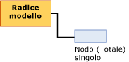

# Contenuto dei modelli di data mining per i modelli di regressione lineare (Analysis Services - Data mining)
[!INCLUDE[ssas-appliesto-sqlas](../../includes/ssas-appliesto-sqlas.md)]
  In questo argomento viene descritto il contenuto dei modelli di data mining specifico dei modelli che utilizzano l'algoritmo [!INCLUDE[msCoName](../../includes/msconame-md.md)] Linear Regression. Per una spiegazione generale del contenuto del modello di data mining valida per tutti i tipi di modello, vedere [Contenuto dei modelli di data mining &#40;Analysis Services - Data mining&#41;](../../analysis-services/data-mining/mining-model-content-analysis-services-data-mining.md).  
  
## Informazioni sulla struttura di un modello di regressione lineare  
 Un modello di regressione lineare presenta una struttura estremamente semplice. Ogni modello dispone di un singolo nodo padre che rappresenta il modello e i relativi metadati e di un nodo dell'albero di regressione (NODE_TYPE = 25) che contiene la formula di regressione per ogni attributo stimabile.  
  
   
  
 I modelli di regressione lineare utilizzano lo stesso algoritmo di [!INCLUDE[msCoName](../../includes/msconame-md.md)] Decision Trees, ma parametri diversi per vincolare l'albero. Vengono inoltre accettati come input solo gli attributi continui. Essendo basati sull'algoritmo [!INCLUDE[msCoName](../../includes/msconame-md.md)] Decision Trees, tuttavia, i modelli di regressione lineare vengono visualizzati tramite il Visualizzatore [!INCLUDE[msCoName](../../includes/msconame-md.md)] Decision Trees. Per informazioni, vedere [Visualizzare un modello usando il Visualizzatore Microsoft Decision Trees](../../analysis-services/data-mining/browse-a-model-using-the-microsoft-tree-viewer.md).  
  
 Nella sezione successiva viene illustrato come interpretare le informazioni nel nodo della formula di regressione. Queste informazioni non si applicano solo ai modelli di regressione lineare, ma anche ai modelli di albero delle decisioni che contengono regressioni in una parte dell'albero.  
  
## Contenuto di un modello di regressione lineare  
 In questa sezione vengono forniti dettagli ed esempi specifici delle colonne del contenuto dei modelli di data mining particolarmente importanti per la regressione lineare.  
  
 Per informazioni sulle colonne generiche del set di righe dello schema, vedere [Contenuto dei modelli di data mining &#40;Analysis Services - Data mining&#41;](../../analysis-services/data-mining/mining-model-content-analysis-services-data-mining.md).  
  
 MODEL_CATALOG  
 Nome del database in cui è archiviato il modello.  
  
 MODEL_NAME  
 Nome del modello.  
  
 ATTRIBUTE_NAME  
 **Nodo radice:** vuoto  
  
 **Nodo di regressione:** nome dell'attributo stimabile.  
  
 NODE_NAME  
 Sempre uguale a NODE_UNIQUE_NAME.  
  
 NODE_UNIQUE_NAME  
 Identificatore univoco del nodo all'interno del modello. Questo valore non può essere modificato.  
  
 NODE_TYPE  
 Un modello di regressione lineare restituisce i tipi di nodo seguenti:  
  
|ID tipo di nodo|Tipo|Description|  
|------------------|----------|-----------------|  
|25|Nodo radice dell'albero di regressione|Contiene la formula che descrive la relazione tra la variabile di input e quella di output.|  
  
 NODE_CAPTION  
 Etichetta o didascalia associata al nodo. Questa proprietà viene utilizzata principalmente per scopi di visualizzazione.  
  
 **Nodo radice:** vuoto  
  
 **Nodo di regressione:** tutti.  
  
 CHILDREN_CARDINALITY  
 Stima del numero di nodi figlio del nodo.  
  
 **Nodo radice:** indica il numero di nodi di regressione. Per ogni attributo stimabile del modello viene creato un nodo di regressione.  
  
 **Nodo di regressione:** sempre 0.  
  
 PARENT_UNIQUE_NAME  
 Nome univoco dell'elemento padre del nodo. Per tutti i nodi a livello di radice viene restituito NULL.  
  
 NODE_DESCRIPTION  
 Descrizione del nodo.  
  
 **Nodo radice:** vuoto  
  
 **Nodo di regressione:** tutti.  
  
 NODE_RULE  
 Non utilizzato per i modelli di regressione lineare.  
  
 MARGINAL_RULE  
 Non utilizzato per i modelli di regressione lineare.  
  
 NODE_PROBABILITY  
 Probabilità associata a questo nodo.  
  
 **Nodo radice:** 0  
  
 **Nodo di regressione:** 1  
  
 MARGINAL_PROBABILITY  
 Probabilità di raggiungere il nodo dal nodo padre.  
  
 **Nodo radice:** 0  
  
 **Nodo di regressione:** 1  
  
 NODE_DISTRIBUTION  
 Tabella nidificata che fornisce statistiche sui valori nel nodo.  
  
 **Nodo radice:** 0  
  
 **Nodo di regressione:** tabella che contiene gli elementi utilizzati per compilare la formula di regressione. Un nodo di regressione contiene i tipi di valore seguenti:  
  
|VALUETYPE|  
|---------------|  
|1 (Mancante)|  
|3 (Continuo)|  
|7 (Coefficiente)|  
|8 (Miglioramento punteggio)|  
|9 (Statistiche)|  
|11 (Intercetta)|  
  
 NODE_SUPPORT  
 Numero di case che supportano il nodo.  
  
 **Nodo radice:** 0  
  
 **Nodo di regressione:** conteggio dei case di training.  
  
 MSOLAP_MODEL_COLUMN  
 Nome dell'attributo stimabile.  
  
 MSOLAP_NODE_SCORE  
 Equivale a NODE_PROBABILITY  
  
 MSOLAP_NODE_SHORT_CAPTION  
 Etichetta utilizzata a scopo di visualizzazione.  
  
## Osservazioni  
 Quando si crea un modello tramite l'algoritmo [!INCLUDE[msCoName](../../includes/msconame-md.md)] Linear Regression, il motore di data mining crea un'istanza speciale di un modello di albero delle decisioni e fornisce i parametri che vincolano l'albero a contenere tutti i dati di training in un singolo nodo. Tutti gli input continui sono contrassegnati e valutati come regressori potenziali, ma solo i regressori che si adattano ai dati vengono mantenuti come regressori nel modello finale. L'analisi produce una sola formula di regressione per ogni regressore oppure non ne produce alcuna.  
  
 È possibile visualizzare la formula di regressione completa in **Legenda data mining**facendo clic sul nodo **Tutti** nel [Visualizzatore Microsoft Decision Trees](../../analysis-services/data-mining/browse-a-model-using-the-microsoft-tree-viewer.md).  
  
 Inoltre, quando si crea un modello di albero delle decisioni che include un attributo stimabile continuo, in alcuni casi i nodi di regressione dell'albero condividono le proprietà di nodi dell'albero di regressione.  
  
##   Distribuzione del nodo per attributi continui  
 La maggior parte delle informazioni importanti in un nodo di regressione è contenuta nella tabella NODE_DISTRIBUTION. Nell'esempio seguente viene illustrato il layout della tabella NODE_DISTRIBUTION. In questo esempio la struttura di data mining Targeted Mailing è stata utilizzata per creare un modello di regressione lineare che esegue la stima del reddito dei clienti in base all'età. Il modello ha unicamente uno scopo illustrativo perché può essere compilato con facilità utilizzando la struttura di data mining e i dati di esempio esistenti di [!INCLUDE[ssSampleDBnormal](../../includes/sssampledbnormal-md.md)] .  
  
|ATTRIBUTE_NAME|ATTRIBUTE_VALUE|SUPPORT|PROBABILITY|VARIANCE|VALUETYPE|  
|---------------------|----------------------|-------------|-----------------|--------------|---------------|  
|Yearly Income|Missing|0|0,000457142857142857|0|1|  
|Yearly Income|57220,8876687257|17484|0,999542857142857|1041275619,52776|3|  
|Age|471.687717702463|0|0|126,969442359327|7|  
|Age|234.680904692439|0|0|0|8|  
|Age|45,4269617936399|0|0|126,969442359327|9|  
||35793,5477381267|0|0|1012968919,28372|11|  
  
 La tabella NODE_DISTRIBUTION contiene più righe, ognuna delle quali è raggruppata da una variabile. Le prime due righe presentano sempre i tipi di valore 1 e 3 e descrivono l'attributo di destinazione. Le righe successive forniscono dettagli sulla formula per un *regressore*particolare. Un regressore è una variabile di input che presenta una relazione lineare con la variabile di output. È possibile disporre di più regressori e ogni regressore disporrà di una riga separata per il coefficiente (VALUETYPE = 7), il miglioramento del punteggio (VALUETYPE = 8) e le statistiche (VALUETYPE = 9). Infine, la tabella dispone di una riga che contiene l'intercetta dell'equazione (VALUETYPE = 11).  
  
### Elementi della formula di regressione  
 La tabella nidificata NODE_DISTRIBUTION contiene ogni elemento della formula di regressione in una riga separata. Le prime due righe di dati nei risultati dell'esempio contengono informazioni sull'attributo stimabile, **Yearly Income**, che modella la variabile dipendente. La colonna SUPPORT mostra il conteggio dei case in supporto dei due stati di questo attributo: il valore **Yearly Income** era disponibile oppure il valore **Yearly Income** era mancante.  
  
 La colonna VARIANCE indica la varianza calcolata dell'attributo stimabile. La*varianza* è la misura della dispersione dei valori in un campione, in base a una distribuzione prevista. In questo caso la varianza viene calcolata considerando la media della deviazione al quadrato dal valore medio. La radice quadrata della varianza è nota anche come devianza standard. [!INCLUDE[ssASnoversion](../../includes/ssasnoversion-md.md)] non fornisce la varianza standard ma è possibile calcolarla facilmente.  
  
 Per ogni regressore vengono restituite tre righe. Contengono il coefficiente, il miglioramento del punteggio e le statistiche del regressore.  
  
 Infine, la tabella contiene una riga che fornisce l'intercetta dell'equazione.  
  
#### Coefficiente  
 Per ogni regressore viene calcolato un coefficiente (VALUETYPE = 7). Il coefficiente stesso viene visualizzato nella colonna ATTRIBUTE_VALUE, mentre la colonna VARIANCE indica la varianza per il coefficiente. I coefficienti vengono calcolati in modo da ottimizzare la linearità.  
  
#### Miglioramento del punteggio  
 Il miglioramento del punteggio (VALUETYPE = 8) per ogni regressore rappresenta il punteggio di interesse dell'attributo. È possibile utilizzare questo valore per stimare l'utilità di più regressori.  
  
#### Statistiche  
 La statistica del regressore (VALUETYPE = 9) è il valore medio dell'attributo per i case che dispongono di un valore. La colonna ATTRIBUTE_VALUE contiene tale valore medio, mentre la colonna VARIANCE contiene la somma delle deviazioni dal valore medio.  
  
#### Intercetta  
 Generalmente, l' *intercetta* (VALUETYPE = 11) o *residuo* in un'equazione di regressione indica il valore dell'attributo stimabile, nel punto in cui l'attributo di input è 0. In molti casi, questa situazione potrebbe non verificarsi e i risultati ottenuti potrebbero essere poco intuitivi.  
  
 Ad esempio, in un modello che esegue la stima del reddito in base all'età, è inutile conoscere il reddito all'età di 0 anni. Nelle situazioni di vita reale, è generalmente più utile conoscere il comportamento della riga rispetto a valori medi. Di conseguenza, in [!INCLUDE[ssNoVersion](../../includes/ssnoversion-md.md)] [!INCLUDE[ssASnoversion](../../includes/ssasnoversion-md.md)] viene modificata l'intercetta per esprimere ogni regressore in una relazione con il valore medio.  
  
 Questa regolazione è difficile da osservare nel contenuto del modello di data mining, ma è evidente se si visualizza l'equazione completata in **Legenda data mining** del **Visualizzatore Microsoft Decision Trees**. La formula di regressione viene spostata dal punto 0 al punto che rappresenta il valore medio. Si ottiene una vista più intuitiva in base ai dati correnti.  
  
 Di conseguenza, presupponendo che l'età media è circa 45 anni, l'intercetta (VALUETYPE = 11) per la formula di regressione indica il reddito medio.  
  
## Vedere anche  
 [Contenuto del modello di data mining & #40; Analysis Services - Data Mining & #41;](../../analysis-services/data-mining/mining-model-content-analysis-services-data-mining.md)   
 [Algoritmo Microsoft Linear Regression](../../analysis-services/data-mining/microsoft-linear-regression-algorithm.md)   
 [Riferimento tecnico l'algoritmo Microsoft Linear Regression](../../analysis-services/data-mining/microsoft-linear-regression-algorithm-technical-reference.md)   
 [Esempi di query sul modello di regressione lineare](../../analysis-services/data-mining/linear-regression-model-query-examples.md)  
  
  
