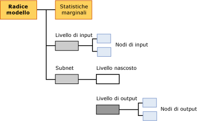

# Mining Model Content for Logistic Regression Models
[!INCLUDE[ssas-appliesto-sqlas](../../includes/ssas-appliesto-sqlas.md)]Questo argomento descrive contenuto del modello di data mining che è specifico dei modelli che utilizzano l'algoritmo Microsoft Logistic Regression. Per una spiegazione dell'interpretazione delle statistiche e della struttura condivise da tutti i tipi di modello e per definizioni generali dei termini relativi al contenuto dei modelli di data mining, vedere [Contenuto dei modelli di data mining &#40;Analysis Services - Data mining&#41;](../../analysis-services/data-mining/mining-model-content-analysis-services-data-mining.md).  
  
## Informazioni sulla struttura di un modello di regressione logistica  
 Un modello di regressione logistica viene creato tramite l'algoritmo Microsoft Neural Network con parametri che impongono al modello l'eliminazione del nodo nascosto. La struttura globale di un modello di regressione logistica è pertanto quasi identica a quella di una rete neurale, in cui ogni modello ha un solo nodo padre che rappresenta il modello e i relativi metadati e un nodo speciale delle statistiche marginali (NODE_TYPE = 24) che fornisce statistiche descrittive sugli input utilizzati nel modello.  
  
 Il modello contiene inoltre una subnet (NODE_TYPE = 17) per ogni attributo stimabile. Come in un modello di rete neurale, ogni subnet ha sempre due rami: uno per il livello di input e un altro che contiene il livello nascosto (NODE_TYPE = 19) e il livello di output (NODE_TYPE = 20) per la rete. La stessa subnet può essere utilizzata per più attributi se sono specificati come PREDICT ONLY. Gli attributi stimabili che sono anche input potrebbero non essere presenti nella stessa subnet.  
  
 Tuttavia, in un modello di regressione logistica, il nodo che rappresenta il livello nascosto è vuoto e non ha elementi figlio. Il modello contiene pertanto nodi che rappresentano singoli output (NODE_TYPE = 23) e singoli input (NODE_TYPE = 21), ma non singoli nodi nascosti.  
  
   
  
 Per impostazione predefinita, un modello di regressione logistica è visualizzato nel **Visualizzatore Microsoft Neural Network**. Con questo visualizzatore personalizzato, è possibile impostare un filtro sugli attributi di input e i relativi valori e visualizzarne graficamente l'impatto sugli output. Le descrizioni comandi nel visualizzatore mostrano la probabilità e l'accuratezza associate a ogni coppia di input e valori di output. Per altre informazioni, vedere [Visualizzare un modello utilizzando il Visualizzatore Microsoft Neural Network](../../analysis-services/data-mining/browse-a-model-using-the-microsoft-neural-network-viewer.md).  
  
 Per esplorare la struttura degli input e delle subnet e visualizzare statistiche dettagliate, è possibile utilizzare il Microsoft Generic Content Tree Viewer. È possibile fare clic su qualsiasi nodo per espanderlo e visualizzare i nodi figlio oppure visualizzare i pesi e le altre statistiche contenute nel nodo.  
  
## Contenuto di un modello di regressione logistica  
 In questa sezione vengono forniti dettagli ed esempi relativi solo alle colonne del contenuto dei modelli di data mining particolarmente importanti per la regressione logistica. Il contenuto del modello è quasi identico a quello di un modello di rete neurale, ma è possibile che le descrizioni valide per i modelli di rete neurale siano ripetute in questa tabella per praticità.  
  
 Per informazioni sulle colonne generiche del set di righe dello schema, ad esempio MODEL_CATALOG e MODEL_NAME, non descritte in questo argomento o per spiegazioni sulla terminologia dei modelli di data mining, vedere [Contenuto dei modelli di data mining &#40;Analysis Services - Data mining&#41;](../../analysis-services/data-mining/mining-model-content-analysis-services-data-mining.md).  
  
 MODEL_CATALOG  
 Nome del database in cui è archiviato il modello.  
  
 MODEL_NAME  
 Nome del modello.  
  
 ATTRIBUTE_NAME  
 Nomi degli attributi che corrispondono a questo nodo.  
  
|Node|Contenuto|  
|----------|-------------|  
|Nodo radice del modello|Vuoto|  
|Statistiche marginali|Vuoto|  
|Livello di input|Vuoto|  
|Nodo di input|Nome dell'attributo di input|  
|Livello nascosto|Vuoto|  
|Livello di output|Vuoto|  
|Nodo di output|Nome dell'attributo di output|  
  
 NODE_NAME  
 Nome del nodo. Attualmente, questa colonna contiene lo stesso valore di NODE_UNIQUE_NAME, anche se nelle versioni future il valore potrebbe essere diverso.  
  
 NODE_UNIQUE_NAME  
 Nome univoco del nodo.  
  
 Per ulteriori informazioni sul modo in cui i nomi e gli ID forniscono informazioni strutturali sul modello, vedere la sezione [Utilizzo dei nomi e degli ID dei nodi](#bkmk_NodeIDs).  
  
 NODE_TYPE  
 Un modello di regressione logistica restituisce i tipi di nodo seguenti:  
  
|ID tipo di nodo|Description|  
|------------------|-----------------|  
|1|Modello.|  
|17|Nodo della libreria per la subnet|  
|18|Nodo della libreria per il livello di input|  
|19|Nodo della libreria per il livello nascosto Il livello nascosto è vuoto.|  
|20|Nodo della libreria per il livello di output|  
|21|Nodo dell'attributo di input|  
|23|Nodo dell'attributo di output|  
|24|Nodo delle statistiche marginali|  
  
 NODE_CAPTION  
 Etichetta o didascalia associata al nodo. Nei modelli di regressione logistica è sempre vuoto.  
  
 CHILDREN_CARDINALITY  
 Stima del numero di nodi figlio del nodo.  
  
|Node|Contenuto|  
|----------|-------------|  
|Nodo radice del modello|Indica il conteggio di nodi figlio che include almeno 1 rete, 1 nodo marginale obbligatorio e 1 livello di input obbligatorio. Se, ad esempio, il valore è 5, sono presenti 3 subnet.|  
|Statistiche marginali|Sempre 0.|  
|Livello di input|Indica il numero di coppie attributo-valori di input utilizzate dal modello.|  
|Nodo di input|Sempre 0.|  
|hidden layer|In un modello di regressione logistica, è sempre 0.|  
|Livello di output|Indica il numero di valori di output.|  
|Nodo di output|Sempre 0.|  
  
 PARENT_UNIQUE_NAME  
 Nome univoco dell'elemento padre del nodo. Per tutti i nodi a livello di radice viene restituito NULL.  
  
 Per ulteriori informazioni sul modo in cui i nomi e gli ID forniscono informazioni strutturali sul modello, vedere la sezione [Utilizzo dei nomi e degli ID dei nodi](#bkmk_NodeIDs).  
  
 NODE_DESCRIPTION  
 Descrizione intuitiva del nodo.  
  
|Node|Contenuto|  
|----------|-------------|  
|Nodo radice del modello|Vuoto|  
|Statistiche marginali|Vuoto|  
|Livello di input|Vuoto|  
|Nodo di input|Nome dell'attributo di input|  
|Livello nascosto|Vuoto|  
|Livello di output|Vuoto|  
|Nodo di output|Se l'attributo di output è continuo, contiene il nome dell'attributo di output.   Se l'attributo di output è discreto o discretizzato, contiene il nome dell'attributo e il valore.|  
  
 NODE_RULE  
 Descrizione XML della regola incorporata nel nodo.  
  
|Node|Contenuto|  
|----------|-------------|  
|Nodo radice del modello|Vuoto|  
|Statistiche marginali|Vuoto|  
|Livello di input|Vuoto|  
|Nodo di input|Frammento XML che contiene le stesse informazioni della colonna NODE_DESCRIPTION.|  
|hidden layer|Vuoto|  
|Livello di output|Vuoto|  
|Nodo di output|Frammento XML che contiene le stesse informazioni della colonna NODE_DESCRIPTION.|  
  
 MARGINAL_RULE  
 Nei modelli di regressione logistica è sempre vuoto.  
  
 NODE_PROBABILITY  
 Probabilità associata a questo nodo. Nei modelli di regressione logistica è sempre 0.  
  
 MARGINAL_PROBABILITY  
 Probabilità di raggiungere il nodo dal nodo padre. Nei modelli di regressione logistica è sempre 0.  
  
 NODE_DISTRIBUTION  
 Tabella nidificata che contiene informazioni statistiche per il nodo. Per informazioni dettagliate sul contenuto di questa tabella per ogni tipo di nodo, vedere la sezione relativa alle informazioni sulla tabella NODE_DISTRIBUTION in [Contenuto dei modelli di data mining per i modelli di rete neurale &#40;Analysis Services - Data mining&#41;](../../analysis-services/data-mining/mining-model-content-for-neural-network-models-analysis-services-data-mining.md).  
  
 NODE_SUPPORT  
 Nei modelli di regressione logistica è sempre 0.  
  
> [!NOTE]  
>  Le probabilità di supporto sono sempre 0 perché l'output di questo tipo di modello non è probabilistico. Soltanto i pesi sono significativi per l'algoritmo, pertanto l'algoritmo non calcola probabilità, supporto o varianza.  
  
 Per ottenere informazioni sul supporto nei case di training per valori specifici, vedere il nodo delle statistiche marginali.  
  
 MSOLAP_MODEL_COLUMN  
 |Node|Contenuto|  
|----------|-------------|  
|Nodo radice del modello|Vuoto|  
|Statistiche marginali|Vuoto|  
|Livello di input|Vuoto|  
|Nodo di input|Nome dell'attributo di input.|  
|hidden layer|Vuoto|  
|Livello di output|Vuoto|  
|Nodo di output|Nome dell'attributo di input.|  
  
 MSOLAP_NODE_SCORE  
 Nei modelli di regressione logistica è sempre 0.  
  
 MSOLAP_NODE_SHORT_CAPTION  
 Nei modelli di regressione logistica è sempre vuoto.  
  
##   Utilizzo dei nomi e degli ID dei nodi  
 La denominazione dei nodi in un modello di regressione logistica fornisce informazioni aggiuntive sulle relazioni tra i nodi nel modello. Nella tabella seguente vengono illustrate le convenzioni per gli ID assegnati ai nodi in ogni livello.  
  
|Tipo di nodo|Convenzione per ID del nodo|  
|---------------|----------------------------|  
|Nodo radice del modello (1)|00000000000000000.|  
|Nodo delle statistiche marginali (24)|10000000000000000|  
|Livello di input (18)|30000000000000000|  
|Nodo di input (21)|Inizia da 60000000000000000|  
|Subnet (17)|20000000000000000|  
|Livello nascosto (19)|40000000000000000|  
|Livello di output (20)|50000000000000000|  
|Nodo di output (23)|Inizia da 80000000000000000|  
  
 È possibile utilizzare questi ID per determinare il modo in cui gli attributi di output sono correlati ad attributi di livello di input specifici, visualizzando la tabella NODE_DISTRIBUTION del nodo di output. Ogni riga della tabella contiene un ID che punta a un nodo dell'attributo di input specifico. La tabella NODE_DISTRIBUTION contiene inoltre il coefficiente per tale coppia di input/output.  
  
## Vedere anche  
 [Algoritmo Microsoft Logistic Regression](../../analysis-services/data-mining/microsoft-logistic-regression-algorithm.md)   
 [Contenuto del modello di data mining per i modelli di rete neurale &#40; Analysis Services - Data Mining &#41;](../../analysis-services/data-mining/mining-model-content-for-neural-network-models-analysis-services-data-mining.md)   
 [Esempi di Query del modello di regressione logistica](../../analysis-services/data-mining/logistic-regression-model-query-examples.md)   
 [Riferimento tecnico per l'algoritmo Microsoft Logistic Regression](../../analysis-services/data-mining/microsoft-logistic-regression-algorithm-technical-reference.md)  
  
  
