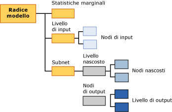

# Contenuto dei modelli di data mining per i modelli di rete neurale (Analysis Services - Data mining)
[!INCLUDE[ssas-appliesto-sqlas](../../includes/ssas-appliesto-sqlas.md)]
  In questo argomento viene descritto il contenuto dei modelli di data mining specifico dei modelli che utilizzano l'algoritmo Microsoft Neural Network. Per una spiegazione dell'interpretazione delle statistiche e della struttura condivise da tutti i tipi di modello e per definizioni generali dei termini relativi al contenuto dei modelli di data mining, vedere [Contenuto del modello di data mining &#40;Analysis Services - Data mining&#41;](../../analysis-services/data-mining/mining-model-content-analysis-services-data-mining.md).  
  
## Informazioni sulla struttura di un modello di rete neurale  
 Ogni modello di rete neurale presenta un singolo nodo padre che rappresenta il modello e i relativi metadati e un nodo delle statistiche marginali (NODE_TYPE = 24) che fornisce statistiche descrittive sugli attributi di input. Poiché il nodo delle statistiche marginali riepiloga informazioni sugli input, non è necessario eseguire query sui dati dai singoli nodi.  
  
 Sotto questi due nodi, sono presenti almeno altri due nodi, ma potrebbero esservene altri, a seconda del numero di attributi stimabili di cui dispone il modello.  
  
-   Il primo nodo (NODE_TYPE = 18) rappresenta sempre il nodo superiore del livello di input. Sotto questo nodo superiore, è possibile trovare nodi di input (NODE_TYPE = 21) che contengono gli attributi di input effettivi e i relativi valori.  
  
-   Ogni nodo successivo contiene una *subnet* diversa (NODE_TYPE = 17). Ogni subnet contiene sempre un livello nascosto (NODE_TYPE = 19) e un livello di output (NODE_TYPE = 20) per quella subnet.  
  
   
  
 Le informazioni nel livello di input sono chiare: il nodo superiore per ogni livello di input (NODE_TYPE = 18) viene usato come libreria per una raccolta di nodi di input (NODE_TYPE = 21). Il contenuto dei nodi di input viene descritto nella tabella seguente.  
  
 Ogni subnet (NODE_TYPE = 17) rappresenta l'analisi dell'influenza del livello di input su un particolare attributo stimabile. Se sono presenti più output stimabili, saranno disponibili più subnet. Il livello nascosto per ogni subnet contiene più nodi nascosti (NODE_TYPE = 22) che a loro volta contengono dettagli sui pesi per ogni transizione che termina in quel determinato nodo nascosto.  
  
 Il livello di output (NODE_TYPE = 20) contiene nodi di output (NODE_TYPE = 23), ognuno dei quali contiene a sua volta valori distinct dell'attributo stimabile. Se l'attributo stimabile è un tipo di dati numerici continui, è presente un solo nodo di output per l'attributo.  
  
> [!NOTE]  
>  L'algoritmo di regressione logistica utilizza un case speciale di una rete neurale che dispone di un solo risultato stimabile e potenzialmente di molti input. La regressione logistica non utilizza un livello nascosto.  
  
 Il modo più semplice per esplorare la struttura degli input e delle subnet consiste nell'utilizzare il **Microsoft Generic Content Tree Viewer**. È possibile fare clic su qualsiasi nodo per espanderlo e visualizzare i nodi figlio oppure visualizzare i pesi e le altre statistiche contenute nel nodo.  
  
 Per utilizzare i dati e osservare il modo in cui il modello mette in correlazione gli input con gli output, utilizzare il **Visualizzatore Microsoft Neural Network**. Tramite questo visualizzatore personalizzato, è possibile impostare un filtro sugli attributi di input e sui relativi valori e visualizzarne graficamente l'impatto sugli output. Le descrizioni comandi nel visualizzatore mostrano la probabilità e l'accuratezza associate a ogni coppia di input e valori di output. Per altre informazioni, vedere [Visualizzare un modello utilizzando il Visualizzatore Microsoft Neural Network](../../analysis-services/data-mining/browse-a-model-using-the-microsoft-neural-network-viewer.md).  
  
## Contenuto di un modello di rete neurale  
 In questa sezione vengono forniti dettagli ed esempi specifici delle colonne del contenuto dei modelli di data mining particolarmente importanti per le reti neurali. Per informazioni sulle colonne generiche del set di righe dello schema, ad esempio MODEL_CATALOG e MODEL_NAME, non descritte in questo argomento o per spiegazioni sulla terminologia dei modelli di data mining, vedere [Contenuto del modello di data mining &#40;Analysis Services - Data mining&#41;](../../analysis-services/data-mining/mining-model-content-analysis-services-data-mining.md).  
  
 MODEL_CATALOG  
 Nome del database in cui è archiviato il modello.  
  
 MODEL_NAME  
 Nome del modello.  
  
 ATTRIBUTE_NAME  
 Nomi degli attributi che corrispondono a questo nodo.  
  
|Node|Contenuto|  
|----------|-------------|  
|Nodo radice del modello|Vuoto|  
|Statistiche marginali|Vuoto|  
|Livello di input|Vuoto|  
|Nodo di input|Nome dell'attributo di input|  
|hidden layer|Vuoto|  
|Nodo nascosto|Vuoto|  
|Livello di output|Vuoto|  
|Nodo di output|Nome dell'attributo di output|  
  
 NODE_NAME  
 Nome del nodo. In questa colonna è contenuto lo stesso valore di NODE_UNIQUE_NAME.  
  
 NODE_UNIQUE_NAME  
 Nome univoco del nodo.  
  
 Per ulteriori informazioni sul modo in cui i nomi e gli ID forniscono informazioni strutturali sul modello, vedere la sezione [Utilizzo dei nomi e degli ID dei nodi](#bkmk_NodeIDs).  
  
 NODE_TYPE  
 Un modello di rete neurale restituisce i tipi di nodo seguenti:  
  
|ID tipo di nodo|Description|  
|------------------|-----------------|  
|1|Modello.|  
|17|Nodo della libreria per la subnet|  
|18|Nodo della libreria per il livello di input|  
|19|Nodo della libreria per il livello nascosto|  
|20|Nodo della libreria per il livello di output|  
|21|Nodo dell'attributo di input|  
|22|Nodo del livello nascosto|  
|23|Nodo dell'attributo di output|  
|24|Nodo delle statistiche marginali|  
  
 NODE_CAPTION  
 Etichetta o didascalia associata al nodo. Nei modelli di rete neurale, sempre vuoto.  
  
 CHILDREN_CARDINALITY  
 Stima del numero di nodi figlio del nodo.  
  
|Node|Contenuto|  
|----------|-------------|  
|Nodo radice del modello|Indica il conteggio di nodi figlio che include almeno 1 rete, 1 nodo marginale obbligatorio e 1 livello di input obbligatorio. Se, ad esempio, il valore è 5, sono presenti 3 subnet.|  
|Statistiche marginali|Sempre 0.|  
|Livello di input|Indica il numero di coppie attributo-valori di input utilizzate dal modello.|  
|Nodo di input|Sempre 0.|  
|hidden layer|Indica il numero di nodi nascosti creati dal modello.|  
|Nodo nascosto|Sempre 0.|  
|Livello di output|Indica il numero di valori di output.|  
|Nodo di output|Sempre 0.|  
  
 PARENT_UNIQUE_NAME  
 Nome univoco dell'elemento padre del nodo. Per tutti i nodi a livello di radice viene restituito NULL.  
  
 Per ulteriori informazioni sul modo in cui i nomi e gli ID forniscono informazioni strutturali sul modello, vedere la sezione [Utilizzo dei nomi e degli ID dei nodi](#bkmk_NodeIDs).  
  
 NODE_DESCRIPTION  
 Descrizione intuitiva del nodo.  
  
|Node|Contenuto|  
|----------|-------------|  
|Nodo radice del modello|Vuoto|  
|Statistiche marginali|Vuoto|  
|Livello di input|Vuoto|  
|Nodo di input|Nome dell'attributo di input|  
|hidden layer|Vuoto|  
|Nodo nascosto|Valore intero che indica la sequenza del nodo nascosto nell'elenco dei nodi nascosti.|  
|Livello di output|Vuoto|  
|Nodo di output|Se l'attributo di output è continuo, contiene il nome dell'attributo di output.   Se l'attributo di output è discreto o discretizzato, contiene il nome dell'attributo e il valore.|  
  
 NODE_RULE  
 Descrizione XML della regola incorporata nel nodo.  
  
|Node|Contenuto|  
|----------|-------------|  
|Nodo radice del modello|Vuoto|  
|Statistiche marginali|Vuoto|  
|Livello di input|Vuoto|  
|Nodo di input|Frammento XML che contiene le stesse informazioni della colonna NODE_DESCRIPTION.|  
|hidden layer|Vuoto|  
|Nodo nascosto|Valore intero che indica la sequenza del nodo nascosto nell'elenco dei nodi nascosti.|  
|Livello di output|Vuoto|  
|Nodo di output|Frammento XML che contiene le stesse informazioni della colonna NODE_DESCRIPTION.|  
  
 MARGINAL_RULE  
 Per i modelli di rete neurale, sempre vuoto.  
  
 NODE_PROBABILITY  
 Probabilità associata a questo nodo. Per i modelli di rete neurale, sempre 0.  
  
 MARGINAL_PROBABILITY  
 Probabilità di raggiungere il nodo dal nodo padre. Per i modelli di rete neurale, sempre 0.  
  
 NODE_DISTRIBUTION  
 Tabella nidificata che contiene informazioni statistiche per il nodo. Per informazioni dettagliate sul contenuto di questa tabella per ogni tipo di nodo, vedere la sezione [Informazioni sulla tabella NODE_DISTRIBUTION](#bkmk_NodeDistTable).  
  
 NODE_SUPPORT  
 Per i modelli di rete neurale, sempre 0.  
  
> [!NOTE]  
>  Le probabilità di supporto sono sempre 0 perché l'output di questo tipo di modello non è probabilistico. Soltanto i pesi sono significativi per l'algoritmo, pertanto l'algoritmo non calcola probabilità, supporto o varianza.  
  
 Per ottenere informazioni sul supporto nei case di training per valori specifici, vedere il nodo delle statistiche marginali.  
  
 MSOLAP_MODEL_COLUMN  
 |Node|Contenuto|  
|----------|-------------|  
|Nodo radice del modello|Vuoto|  
|Statistiche marginali|Vuoto|  
|Livello di input|Vuoto|  
|Nodo di input|Nome dell'attributo di input.|  
|hidden layer|Vuoto|  
|Nodo nascosto|Vuoto|  
|Livello di output|Vuoto|  
|Nodo di output|Nome dell'attributo di input.|  
  
 MSOLAP_NODE_SCORE  
 Per un modello di rete neurale, sempre 0.  
  
 MSOLAP_NODE_SHORT_CAPTION  
 Per i modelli di rete neurale, sempre vuoto.  
  
## Osservazioni  
 Lo scopo del training di un modello di rete neurale consiste nel determinare i pesi associati a ogni transizione da un input a un punto medio e da un punto medio a un endpoint. Di conseguenza, il livello di input del modello esiste principalmente per archiviare i valori effettivi utilizzati per la compilazione del modello. Nel livello nascosto vengono archiviati i pesi calcolati e vengono forniti nuovamente i puntatori agli attributi di input. Nel livello di output vengono archiviati i valori stimabili e vengono forniti nuovamente i puntatori ai punti medi nel livello nascosto.  
  
##   Utilizzo dei nomi e degli ID dei nodi  
 La denominazione dei nodi in un modello di rete neurale fornisce informazioni aggiuntive sul tipo di nodo, per rendere più semplice la correlazione tra il livello nascosto e il livello di input e tra il livello di output e il livello nascosto. Nella tabella seguente viene illustrata la convenzione per gli ID assegnati ai nodi in ogni livello.  
  
|Tipo di nodo|Convenzione per ID del nodo|  
|---------------|----------------------------|  
|Nodo radice del modello (1)|00000000000000000.|  
|Nodo delle statistiche marginali (24)|10000000000000000|  
|Livello di input (18)|30000000000000000|  
|Nodo di input (21)|Inizia da 60000000000000000|  
|Subnet (17)|20000000000000000|  
|Livello nascosto (19)|40000000000000000|  
|Nodo nascosto (22)|Inizia da 70000000000000000|  
|Livello di output (20)|50000000000000000|  
|Nodo di output (23)|Inizia da 80000000000000000|  
  
 È possibile determinare quali attributi di input sono correlati a un nodo di livello nascosto specifico visualizzando la tabella NODE_DISTRIBUTION nel nodo nascosto (NODE_TYPE = 22). Ogni riga della tabella NODE_DISTRIBUTION contiene l'ID di un nodo dell'attributo di input.  
  
 Analogamente, è possibile determinare quali livelli nascosti sono correlati a un attributo di output visualizzando la tabella NODE_DISTRIBUTION nel nodo di output (NODE_TYPE = 23). Ogni riga della tabella NODE_DISTRIBUTION contiene l'ID di un nodo di livello nascosto, insieme al coefficiente correlato.  
  
##   Interpretazione delle informazioni nella tabella NODE_DISTRIBUTION  
 In alcuni nodi la tabella NODE_DISTRIBUTION può essere vuota. Tuttavia, per nodi di input, nodi del livello nascosto e nodi di output, nella tabella NODE_DISTRIBUTION vengono archiviate informazioni importanti e interessanti sul modello. Per agevolare l'interpretazione di queste informazioni, la tabella NODE_DISTRIBUTION contiene una colonna VALUETYPE per ogni riga che indica se il valore nella colonna ATTRIBUTE_VALUE è discreto (4), discretizzato (5) o continuo (3).  
  
### Nodi di input  
 Il livello di input contiene un nodo per ogni valore dell'attributo utilizzato nel modello.  
  
 **Attributo discreto:** nel nodo di input vengono archiviati solo il nome dell'attributo e il relativo valore nelle colonne ATTRIBUTE_NAME e ATTRIBUTE_VALUE. Ad esempio, se [Work Shift] è la colonna, viene creato un nodo separato per ogni valore di quella colonna utilizzato nel modello, ad esempio AM e PM. Per ogni nodo, nella tabella NODE_DISTRIBUTION viene elencato solo il valore corrente dell'attributo.  
  
 **Attributo numerico discretizzato:** nel nodo di input vengono archiviati il nome dell'attributo e il valore, che può essere costituito da un intervallo o da un valore specifico. Tutti valori vengono rappresentati tramite espressioni, ad esempio '77,4 – 87,4' < 64,0' per il valore [Time Per Issue]. Per ogni nodo, nella tabella NODE_DISTRIBUTION viene elencato solo il valore corrente dell'attributo.  
  
 **Attributo continuo:** nel nodo di input viene archiviato il valore medio dell'attributo. Per ogni nodo, nella tabella NODE_DISTRIBUTION viene elencato solo il valore corrente dell'attributo.  
  
### Nodi del livello nascosto  
 Il livello nascosto contiene un numero variabile di nodi. In ogni nodo, la tabella NODE_DISTRIBUTION contiene mapping dal livello nascosto ai nodi nel livello di input. La colonna ATTRIBUTE_NAME contiene un ID del nodo che corrisponde a un nodo nel livello di input. La colonna ATTRIBUTE_VALUE contiene il peso associato a tale combinazione di un nodo di input e di un nodo del livello nascosto. L'ultima riga nella tabella contiene un coefficiente che rappresenta il peso di tale nodo nascosto nel livello nascosto.  
  
### Nodi di output  
 Il livello di output contiene un nodo di output per ogni valore di output utilizzato nel modello. In ogni nodo, la tabella NODE_DISTRIBUTION contiene mapping dal livello di output ai nodi nel livello nascosto. La colonna ATTRIBUTE_NAME contiene un ID del nodo che corrisponde a un nodo nel livello nascosto. La colonna ATTRIBUTE_VALUE contiene il peso associato a tale combinazione di un nodo di output e di un nodo del livello nascosto.  
  
 La tabella NODE_DISTRIBUTION contiene le informazioni aggiuntive seguenti, a seconda del tipo di attributo:  
  
 **Attributo discreto:** le due righe finali della tabella NODE_DISTRIBUTION contengono un coefficiente per il nodo nel suo complesso e il valore corrente dell'attributo.  
  
 **Attributo numerico discretizzato:** identico agli attributi discreti, ad eccezione del fatto che il valore dell'attributo è un intervallo di valori.  
  
 **Attributo continuo:** le due righe finali della tabella NODE_DISTRIBUTION contengono il valore medio dell'attributo, il coefficiente per il nodo nel suo complesso e la varianza del coefficiente.  
  
## Vedere anche  
 [Algoritmo Microsoft Neural Network](../../analysis-services/data-mining/microsoft-neural-network-algorithm.md)   
 [Riferimento tecnico l'algoritmo Microsoft Neural Network](../../analysis-services/data-mining/microsoft-neural-network-algorithm-technical-reference.md)   
 [Esempi di Query del modello di rete neurale](../../analysis-services/data-mining/neural-network-model-query-examples.md)  
  
  
