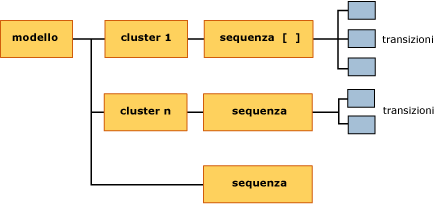

# <a name="mining-model-content-for-sequence-clustering-models"></a>Contenuto dei modelli di data mining per i modelli Sequence Clustering
[!INCLUDE[ssas-appliesto-sqlas](../../includes/ssas-appliesto-sqlas.md)]
  In questo argomento viene descritto il contenuto dei modelli di data mining specifico dei modelli che utilizzano l'algoritmo Microsoft Sequence Clustering. Per una spiegazione della terminologia generale e statistica relativa al contenuto dei modelli di data mining applicabile a tutti i tipi di modello, vedere [Contenuto del modello di data mining &#40;Analysis Services - Data mining&#41;](../../analysis-services/data-mining/mining-model-content-analysis-services-data-mining.md).  
  
## <a name="understanding-the-structure-of-a-sequence-clustering-model"></a>Informazioni sulla struttura di un modello Sequence Clustering  
 Un modello Sequence Clustering include un singolo nodo padre (NODE_TYPE = 1) che rappresenta il modello e i relativi metadati. Il nodo padre, identificato con **(All)**, include un nodo di sequenza correlato (NODE_TYPE = 13) che elenca tutte le transizioni rilevate nei dati di training.  
  
   
  
 Tramite l'algoritmo vengono inoltre creati diversi cluster, in base alle transizioni rilevate nei dati e in qualsiasi altro attributo di input incluso alla creazione del modello, ad esempio i dati demografici del cliente. Ogni cluster (NODE_TYPE = 5) contiene un proprio nodo di sequenza (NODE_TYPE = 13) in cui sono elencate solo le transizioni utilizzate per generare quel cluster specifico. Dal nodo di sequenza, è possibile eseguire il drill-down per visualizzare i dettagli di singole transizioni di stato (NODE_TYPE = 14).  
  
 Per una spiegazione della sequenza e delle transizioni di stato con esempi, vedere [Algoritmo Microsoft Sequence Clustering](../../analysis-services/data-mining/microsoft-sequence-clustering-algorithm.md).  
  
## <a name="model-content-for-a-sequence-clustering-model"></a>Contenuto di un modello Sequence Clustering  
 In questa sezione vengono fornite informazioni aggiuntive sulle colonne nel contenuto del modello di data mining particolarmente attinenti al clustering delle sequenze.  
  
 MODEL_CATALOG  
 Nome del database in cui è archiviato il modello.  
  
 MODEL_NAME  
 Nome del modello.  
  
 ATTRIBUTE_NAME  
 Sempre vuoto.  
  
 NODE_NAME  
 Nome del nodo. Attualmente lo stesso valore di NODE_UNIQUE_NAME.  
  
 NODE_UNIQUE_NAME  
 Nome univoco del nodo.  
  
 NODE_TYPE  
 Un modello Sequence Clustering restituisce i tipi di nodo seguenti:  
  
|ID tipo di nodo|Description|  
|------------------|-----------------|  
|1 (Model)|Nodo radice per il modello|  
|5 (Cluster)|Contiene un conteggio delle transizioni nel cluster, un elenco degli attributi e statistiche che descrivono i valori nel cluster.|  
|13 (Sequenza)|Contiene un elenco delle transizioni incluse nel cluster.|  
|14 (Transizione)|Descrive una sequenza di eventi come una tabella in cui la prima riga contiene lo stato iniziale e tutte le altre contengono stati successivi, insieme alle statistiche di supporto e probabilità.|  
  
 NODE_GUID  
 Vuoto.  
  
 NODE_CAPTION  
 Etichetta o didascalia associata al nodo a scopo di visualizzazione.  
  
 È possibile rinominare le didascalie del cluster mentre si utilizza il modello. Il nuovo nome non verrà tuttavia salvato in modo permanente se si chiude il modello.  
  
 CHILDREN_CARDINALITY  
 Stima del numero di nodi figlio del nodo.  
  
 **Nodo radice del modello** Il valore di cardinalità corrisponde al numero di cluster più uno. Per altre informazioni, vedere [Cardinalità](#bkmk_cardinality).  
  
 **Nodi del cluster** Il valore di cardinalità è sempre pari a 1, poiché ogni cluster dispone di un unico nodo figlio che contiene l'elenco delle sequenze nel cluster.  
  
 **Nodi di sequenza** La cardinalità indica il numero di transizioni incluse in quel cluster. Ad esempio, la cardinalità del nodo di sequenza per il nodo radice del modello indica il numero di transizioni trovate nell'intero modello.  
  
 PARENT_UNIQUE_NAME  
 Nome univoco dell'elemento padre del nodo.  
  
 Per tutti i nodi a livello di radice viene restituito NULL.  
  
 NODE_DESCRIPTION  
 Equivale alla didascalia del nodo.  
  
 NODE_RULE  
 Sempre vuoto.  
  
 MARGINAL_RULE  
 Sempre vuoto.  
  
 NODE_PROBABILITY  
 **Nodo radice del modello** Sempre 0.  
  
 **Nodi del cluster** La probabilità adattata del cluster nel modello. La somma delle probabilità adattate non dà 1, perché il metodo di clustering utilizzato nel clustering delle sequenze consente l'appartenenza parziale a più cluster.  
  
 **Nodi di sequenza** Sempre 0.  
  
 **Nodi di transizione** Sempre 0.  
  
 MARGINAL_PROBABILITY  
 **Nodo radice del modello** Sempre 0.  
  
 **Nodi del cluster** Lo stesso valore di NODE_PROBABILITY.  
  
 **Nodi di sequenza** Sempre 0.  
  
 **Nodi di transizione** Sempre 0.  
  
 NODE_DISTRIBUTION  
 Tabella che contiene probabilità e altre informazioni. Per altre informazioni, vedere [Tabella NODE_DISTRIBUTION](#bkmk_NODEDIST).  
  
 NODE_SUPPORT  
 Numero di transizioni che supportano il nodo. Pertanto, se sono presenti 30 esempi della sequenza "Prodotto A seguito da Prodotto B" nei dati di training, il supporto totale è 30.  
  
 **Nodo radice del modello** Numero totale di transizioni nel modello.  
  
 **Nodi del cluster** Supporto non elaborato per il cluster che indica il numero di case di training che forniscono case al cluster.  
  
 **Nodi di sequenza** Sempre 0.  
  
 **Nodi di transizione** Percentuale di case nel cluster che rappresentano una transizione specifica. Può essere 0 o un valore positivo. Viene calcolato moltiplicando il supporto non elaborato del nodo del cluster per la probabilità del cluster.  
  
 Da questo valore, è possibile risalire al numero di case di training che hanno contribuito alla transizione.  
  
 MSOLAP_MODEL_COLUMN  
 Non applicabile.  
  
 MSOLAP_NODE_SCORE  
 Non applicabile.  
  
 MSOLAP_NODE_SHORT_CAPTION  
 Come NODE_DESCRIPTION.  
  
## <a name="understanding-sequences-states-and-transitions"></a>Informazioni sulle sequenze, sugli stati e sulle transizioni  
 Un modello Sequence Clustering presenta una struttura univoca che combina due tipi di oggetti con tipi molto diversi di informazioni: il primo tipo è dato dai cluster, il secondo dalle transizioni di stato.  
  
 I cluster creati dal clustering delle sequenze sono come i cluster creati dall'algoritmo Microsoft Clustering. Ogni cluster dispone di un profilo e di caratteristiche. Nel clustering delle sequenze, tuttavia, ogni cluster contiene inoltre un singolo nodo figlio in cui sono elencate le sequenze di quel cluster. Ogni nodo di sequenza contiene più nodi figlio che descrivono in dettaglio le transizioni di stato, insieme alle probabilità.  
  
 Poiché è possibile concatenare le sequenze, è in genere presente un numero maggiore di sequenze nel modello di quante non sia possibile trovare in un singolo case. Microsoft Analysis Services archivia i puntatori da uno stato a un altro in modo che sia possibile contare il numero di volte in cui si verifica ogni transizione. È anche possibile conoscere il numero di volte in cui si è verificata la sequenza e misurare le probabilità che si verifichi rispetto all'intero set di stati osservati.  
  
 Nella tabella seguente viene illustrato il modo in cui le informazioni vengono archiviate nel modello e il modo in cui sono correlati i nodi.  
  
|Node|Dispone di nodo figlio|Tabella NODE_DISTRIBUTION|  
|----------|--------------------|------------------------------|  
|Nodo radice del modello|Più nodi del cluster<br /><br /> Nodo con sequenze per l'intero modello|Elenca tutti i prodotti nel modello, con supporto e probabilità.<br /><br /> Poiché il metodo di clustering consente l'appartenenza parziale a più cluster, il supporto e la probabilità possono presentare valori frazionari. Anziché contare una sola volta un singolo case, ogni case può appartenere potenzialmente a più cluster. Pertanto, quando viene determinata l'appartenenza al cluster finale, il valore viene adattato dalla probabilità di quel cluster.|  
|Nodo di sequenza per il modello|Più nodi di transizione|Elenca tutti i prodotti nel modello, con supporto e probabilità.<br /><br /> Poiché è noto il numero di sequenze per il modello, a questo livello, i calcoli per supporto e probabilità sono semplici:<br /><br /> <br /><br /> Supporto = conteggio dei case<br /><br /> Probabilità = probabilità non elaborata di ogni sequenza nel modello. La somma di tutte le probabilità dovrebbe dare 1.|  
|Nodi del cluster singoli|Nodo con sequenze per quel solo cluster|Elenca tutti i prodotti in un cluster, ma fornisce valori di supporto e probabilità solo per i prodotti caratteristici del cluster.<br /><br /> Il supporto rappresenta il valore di supporto adattato per ogni case del cluster. I valori di probabilità sono dati dalla probabilità adattata.|  
|Nodi di sequenza per singoli cluster|Più nodi con transizioni per sequenze solo in quel cluster|Esattamente le stesse informazioni dei nodi del cluster.|  
|Transizioni|Nessun elemento figlio|Elenca le transizioni per il primo stato correlato.<br /><br /> Il supporto è un valore di supporto adattato che indica i case che prendono parte a ogni transizione. La probabilità è un valore di probabilità adattato, rappresentato come percentuale.|  
  
###  <a name="bkmk_NODEDIST"></a> Tabella NODE_DISTRIBUTION  
 Nella tabella NODE_DISTRIBUTION vengono fornite informazioni dettagliate sulla probabilità e sul supporto per le transizioni e le sequenze di un cluster specifico.  
  
 Viene sempre aggiunta una riga alla tabella delle transizioni per rappresentare i valori **mancanti** possibili. Per informazioni sul significato di valore **mancante** e sull'influenza esercitata sui calcoli, vedere [Valori mancanti &#40;Analysis Services - Data mining&#41;](../../analysis-services/data-mining/missing-values-analysis-services-data-mining.md).  
  
 I calcoli relativi a supporto e probabilità variano a seconda che il calcolo venga applicato ai case di training o al modello finito. Questo perché il metodo di clustering predefinito, Expectation Maximization (EM), presuppone che qualsiasi case possa appartenere a più di un cluster. Quando si calcola il supporto per i case nel modello, è possibile utilizzare conteggi non elaborati e probabilità non elaborate. Tuttavia, le probabilità di una particolare sequenza in un cluster devono essere ponderate dalla somma di ogni possibile combinazione di sequenze e cluster.  
  
###  <a name="bkmk_cardinality"></a> Cardinalità  
 In un modello di clustering la cardinalità del nodo padre indica in genere il numero di cluster presenti nel modello. Tuttavia, un modello Sequence Clustering dispone di due tipi di nodo al livello del cluster: un tipo di nodo contiene cluster, l'altro contiene un elenco delle sequenze per il modello nel suo complesso.  
  
 Per conoscere il numero di cluster nel modello, sottrarre uno dal valore NODE_CARDINALITY per il nodo (All). Ad esempio, se il modello ha creato 9 cluster, la cardinalità del nodo radice del modello sarà 10. Questo perché il modello contiene 9 nodi del cluster, ognuno con il proprio nodo di sequenza, più un nodo di sequenza aggiuntivo identificato come cluster 10 che rappresenta le sequenze per il modello.  
  
## <a name="walkthrough-of-structure"></a>Descrizione dettagliata della struttura  
 Un esempio potrebbe chiare il modo in cui vengano archiviate le informazioni e il modo in cui è possibile interpretarle. È ad esempio possibile trovare l'ordine più lungo, ovvero la catena osservata più lunga nei dati [!INCLUDE[ssSampleDBDWobject](../../includes/sssampledbdwobject-md.md)] sottostanti usando la query seguente:  
  
```  
USE AdventureWorksDW2012  
SELECT DISTINCT OrderNumber, Count(*)  
FROM vAssocSeqLineItems  
GROUP BY OrderNumber  
ORDER BY Count(*) DESC  
```  
  
 Da questi risultati, si evince che i numeri d'ordine 'SO72656', 'SO58845' e 'SO70714' contengono le sequenze più lunghe, con otto elementi ciascuna. Tramite gli ID degli ordini, è possibile visualizzare i dettagli di un determinato ordine per sapere quali articoli sono stati acquistati e in quale ordine.  
  
|OrderNumber|LineNumber|Modello|  
|-----------------|----------------|-----------|  
|SO58845|1|Mountain-500|  
|SO58845|2|LL Mountain Tire|  
|SO58845|3|Mountain Tire Tube|  
|SO58845|4|Fender Set - Mountain|  
|SO58845|5|Mountain Bottle Cage|  
|SO58845|6|Water Bottle|  
|SO58845|7|Sport-100|  
|SO58845|8|Long-Sleeve Logo Jersey|  
  
 Alcuni clienti che acquistano l'articolo Mountain-500, tuttavia, potrebbero acquistare prodotti diversi. È possibile visualizzare tutti i prodotti che seguono l'articolo Mountain-500 visualizzando l'elenco delle sequenze nel modello. Le procedure seguenti riguardano la visualizzazione di queste sequenze usando i due visualizzatori forniti in [!INCLUDE[ssASnoversion](../../includes/ssasnoversion-md.md)]:  
  
#### <a name="to-view-related-sequences-by-using-the-sequence-clustering-viewer"></a>Per visualizzare le sequenze correlate tramite il visualizzatore Sequence Clustering  
  
1.  In Esplora oggetti fare clic con il pulsante destro del mouse sul modello [Sequence Clustering] e scegliere Sfoglia.  
  
2.  Nel visualizzatore Clustering delle sequenze fare clic sulla scheda **Transizioni di stato** .  
  
3.  Nell'elenco a discesa **Cluster** assicurarsi che **Popolazione (Tutto)** sia selezionato.  
  
4.  Spostare in alto il dispositivo di scorrimento posto sulla sinistra del riquadro per mostrare tutti i collegamenti.  
  
5.  Nel diagramma individuare **Mountain-500**fare clic sul nodo nel diagramma.  
  
6.  Le righe evidenziate fanno riferimento agli stati successivi (i prodotti acquistati dopo Mountain-500) e i numeri indicano la probabilità. Confrontare questi valori ai risultati nel visualizzatore del contenuto del modello generico.  
  
#### <a name="to-view-related-sequences-by-using-the-generic-model-content-viewer"></a>Per visualizzare sequenze correlate utilizzando il visualizzatore del contenuto del modello generico  
  
1.  In Esplora oggetti fare clic con il pulsante destro del mouse sul modello [Sequence Clustering] e scegliere Sfoglia.  
  
2.  Nell'elenco a discesa del visualizzatore selezionare **Microsoft Generic Content Tree Viewer**.  
  
3.  Nel riquadro **Didascalia nodo** fare clic sul nodo denominato **Livello sequenza per cluster 16**.  
  
4.  Nel riquadro dettagli Nodo trovare la riga NODE_DISTRIBUTION e fare clic in qualsiasi punto della tabella nidificata.  
  
     La riga superiore è sempre destinata al valore Missing. Questa riga ha uno stato sequenza 0.  
  
5.  Premere il tasto freccia in giù, oppure utilizzare le barre di scorrimento, per scorrere la tabella nidificata fino a visualizzare la riga Mountain-500.  
  
     Questa riga ha uno stato sequenza 20.  
  
    > [!NOTE]  
    >  È possibile ottenere il numero di riga di un particolare stato sequenza a livello di codice, ma potrebbe essere più facile copiare semplicemente la tabella nidificata in una cartella di lavoro di Excel.  
  
6.  Tornare al riquadro Didascalia nodo ed espandere, se necessario, il nodo **Livello sequenza per cluster 16**.  
  
7.  Cercare tra i nodi figlio **Riga transizione per stato sequenza 20**. Fare clic sul nodo di transizione.  
  
8.  La tabella NODE_DISTRIBUTION nidificata contiene i prodotti e le probabilità seguenti. Confrontare questi valori ai risultati nella scheda **Transizione di stato** del visualizzatore Clustering delle sequenze.  
  
 Nella tabella seguente sono contenuti i risultati della tabella NODE_DISTRIBUTION, insieme ai valori di probabilità arrotondati visualizzati nel visualizzatore grafico.  
  
|Product|Supporto (tabella NODE_DISTRIBUTION)|Probabilità (tabella NODE_DISTRIBUTION)|Probabilità (da grafico)|  
|-------------|------------------------------------------|------------------------------------------------|--------------------------------|  
|mancanti|48.447887|0.138028169|(non mostrato)|  
|Cycling Cap|10.876056|0.030985915|0.03|  
|Fender Set - Mountain|80.087324|0.228169014|0.23|  
|Half-Finger Gloves|0.9887324|0.002816901|0,00|  
|Hydration Pack|0.9887324|0.002816901|0,00|  
|LL Mountain Tire|51.414085|0.146478873|0.15|  
|Long-Sleeve Logo Jersey|2.9661972|0.008450704|0.01|  
|Mountain Bottle Cage|87.997183|0.250704225|0.25|  
|Mountain Tire Tube|16.808451|0.047887324|0.05|  
|Short-Sleeve Classic Jersey|10.876056|0.030985915|0.03|  
|Sport-100|20.76338|0.05915493|0.06|  
|Water Bottle|18.785915|0.053521127|0.25|  
  
 Sebbene il case inizialmente selezionato dai dati di training contenesse il prodotto 'Mountain-500' seguito da 'LL Mountain Tire, si noti come siano possibili molte altre sequenze. Per trovare informazioni dettagliate relative a un qualsiasi cluster, è necessario eseguire il drill-drown dall'elenco di sequenze nel cluster fino alle transizioni effettive per ogni stato o prodotto.  
  
 È possibile passare dalla sequenza elencata in un determinato cluster alla riga di transizione. Dalla riga di transizione, è possibile determinare il prodotto successivo e quindi tornare a quel prodotto nell'elenco di sequenze. Ripetendo questo processo per ogni primo e secondo stato, è possibile utilizzare lunghe catene di stati.  
  
## <a name="using-sequence-information"></a>Utilizzo delle informazioni sulle sequenze  
 Uno scenario comune per il clustering delle sequenze consiste nel tenere traccia dei clic dell'utente in un sito Web. Ad esempio, se i dati provengono dai record relativi agli acquisti del cliente sul sito Web e-commerce di Adventure Works, il modello Sequence Clustering risultante potrebbe essere utilizzato per dedurre il comportamento dell'utente, riprogettare il sito e-commerce per risolvere i problemi di navigazione o per promuovere le vendite.  
  
 L'analisi potrebbe, ad esempio, dimostrare che gli utenti seguono sempre una particolare catena di prodotti, indipendentemente dai dati demografici. Si potrebbe inoltre scoprire che gli utenti abbandonano spesso il sito dopo avere fatto clic su un particolare prodotto. Rivelato questo aspetto, ci si potrebbe chiedere quali percorsi aggiuntivi fornire agli utenti per indurli a trattenersi sul sito Web.  
  
 Se non si dispone di informazioni aggiuntive da utilizzare per la classificazione degli utenti, è possibile utilizzare le informazioni sulle sequenze per raccogliere i dati sugli spostamenti per comprendere meglio il comportamento nel complesso. Se è possibile raccogliere informazioni sui clienti e trovare corrispondenze tra queste informazioni e il database clienti, è possibile combinare le funzionalità del clustering con la stima sulle sequenze per fornire consigli personalizzati o basati sul percorso di navigazione alla pagina corrente.  
  
 Un altro utilizzo delle informazioni sugli stati e le transizioni compilate da un modello Sequence Clustering consiste nel determinare quali percorsi non vengono mai utilizzati. Se ad esempio si nota che molti visitatori accedono alle pagine 1-4, ma non continuano mai alla pagina 5, è possibile verificare che non esistano problemi che impediscono la navigazione alla pagina 5. A tale scopo, è possibile eseguire una query sul contenuto del modello e fare un confronto con un elenco di percorsi possibili.  I grafici che suggeriscono tutti i percorsi di navigazione in un sito Web possono essere creati a livello di codice o tramite una varietà di strumenti di analisi dei siti Web.  
  
 Per ottenere l'elenco dei percorsi osservati eseguendo una query sul contenuto del modello e per analizzare altri esempi di query su un modello Sequence Clustering, vedere [Esempi di query sul modello di cluster di sequenza](../../analysis-services/data-mining/sequence-clustering-model-query-examples.md).  
  
## <a name="see-also"></a>Vedere anche  
 [Contenuto del modello di data mining &#40;Analysis Services - Data mining&#41;](../../analysis-services/data-mining/mining-model-content-analysis-services-data-mining.md)   
 [Algoritmo Microsoft Sequence Clustering](../../analysis-services/data-mining/microsoft-sequence-clustering-algorithm.md)   
 [Esempi di query su modelli Sequence Clustering](../../analysis-services/data-mining/sequence-clustering-model-query-examples.md)  
  
  
