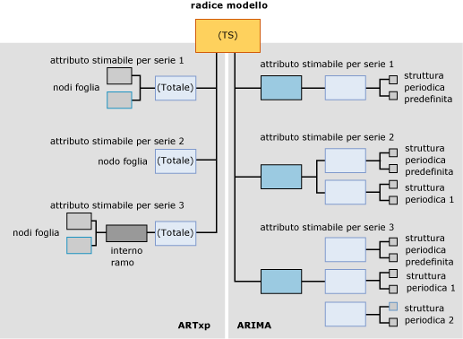

# <a name="mining-model-content-for-time-series-models-analysis-services---data-mining"></a>Contenuto dei modelli di data mining per i modelli Time Series (Analysis Services - Data mining)
[!INCLUDE[ssas-appliesto-sqlas](../../includes/ssas-appliesto-sqlas.md)]Tutti i modelli di data mining utilizzano la stessa struttura per archiviare i propri contenuti. Tale struttura viene definita secondo il set di righe dello schema relativo al contenuto di data mining. Tuttavia, all'interno della struttura standard i nodi che contengono informazioni vengono disposti in modi diversi per rappresentare vari tipi di albero. In questo argomento vengono descritti l'organizzazione e il significato dei nodi per i modelli di data mining basati sull'algoritmo [!INCLUDE[msCoName](../../includes/msconame-md.md)] Time Series.  
  
 Per una spiegazione del modello di data mining applicabile a tutti i tipi di modello, vedere [Contenuto del modello di data mining &#40;Analysis Services - Data mining&#41;](../../analysis-services/data-mining/mining-model-content-analysis-services-data-mining.md).  
  
 Quando si rivede questo argomento, potrebbe risultare utile seguirlo esplorando il contenuto di un modello Time Series. È possibile creare un modello Time Series completando l'esercitazione di base sul data mining. Il modello creato nell'esercitazione è un modello misto mediante il quale viene eseguito il training dei dati utilizzando gli algoritmi ARIMA e ARTXP. Per informazioni su come visualizzare il contenuto di un modello di data mining, vedere [Visualizzatori modello di data mining](../../analysis-services/data-mining/data-mining-model-viewers.md).  
  
## <a name="understanding-the-structure-of-a-time-series-model"></a>Informazioni sulla struttura di un modello Time Series  
 Un modello Time Series include un singolo nodo padre che rappresenta il modello e i relativi metadati. Sotto il nodo padre sono presenti uno o due alberi Time Series, a seconda dell'algoritmo utilizzato per creare il modello.  
  
 Se si crea un modello misto, vengono aggiunti due alberi separati al modello, uno per ARIMA e uno per ARTXP. Se si sceglie di utilizzare solo l'algoritmo ARTXP o solo l'algoritmo ARIMA, sarà disponibile un solo albero corrispondente all'algoritmo. È possibile specificare l'algoritmo da utilizzare impostando il parametro FORECAST_METHOD. Per altre informazioni su come determinare se usare ARTXP, ARIMA o un modello misto, vedere [Algoritmo Microsoft Time Series](../../analysis-services/data-mining/microsoft-time-series-algorithm.md).  
  
 Nel diagramma seguente viene visualizzato un esempio di un modello di data mining Time Series creato con le impostazioni predefinite, per la creazione di un modello misto. Per consentire di confrontare con maggiore semplicità le differenze tra i due modelli, il modello ARTXP è mostrato sul lato sinistro del diagramma mentre quello ARIMA sul lato destro.  Mentre la struttura di ARTXP è simile a un albero che si divide in rami sempre più piccoli, la struttura creata dall'algoritmo ARIMA è più simile a una piramide compilata verso l'alto dai componenti più piccoli.  
  
   
  
 L'aspetto importante da ricordare è che le informazioni sono disposte all'interno degli alberi ARIMA e ARTXP in modi completamente diversi ed è necessario considerare i due alberi correlati solo a livello del nodo radice. Anche se le due rappresentazioni sono presentate in un solo modello per convenienza, devono essere considerate come due modelli indipendenti. ARTXP rappresenta un albero effettivo, diversamente da ARIMA.  
  
 Quando si utilizza Microsoft Generic Content Tree Viewer per visualizzare un modello in cui vengono utilizzati sia ARIMA sia ARTXP, i nodi dei modelli ARTXP e ARIMA sono tutti presentati come nodi figlio del modello Time Series padre. Tuttavia, è possibile distinguerli facilmente in base alle etichette applicate ai nodi.  
  
-   Il primo set di nodi viene identificato con l'etichetta (Tutto) e rappresenta i risultati dell'analisi effettuata con l'algoritmo ARTXP.  
  
-   Il secondo set di nodi viene identificato con l'etichetta ARIMA e rappresenta i risultati dell'analisi effettuata con l'algoritmo ARIMA.  
  
> [!WARNING]  
>  Il nome (Tutto) sull'albero ARTXP viene mantenuto per compatibilità con le versioni precedenti. Prima di SQL Server 2008, nell'algoritmo Time Series veniva utilizzato un solo algoritmo per l'analisi, ovvero ARTXP.  
  
 Nelle sezioni seguenti viene illustrata la disposizione dei nodi all'interno di ognuno di questi tipi di modello.  
  
### <a name="structure-of-an-artxp-model"></a>Struttura di un modello ARTXP  
 L'algoritmo ARTXP consente di creare un modello simile a un modello di albero delle decisioni. Vengono raggruppati attributi stimabili che vengono divisi ogni volta che vengono rilevate differenze significative. Pertanto, in ogni modello ARTXP è contenuto un ramo separato per ogni attributo stimabile. Ad esempio, l'esercitazione di base sul data mining consente di creare un modello per la stima dei ricavi delle vendite per molte aree. In questo caso, **[Amount]** è l'attributo stimabile e viene creato un ramo distinto per ogni area. Se fossero presenti due attributi stimabili, ovvero **[Amount]** e **[Quantity]**, verrebbe creato un ramo distinto per ogni combinazione di attributo e area.  
  
 Nel nodo di livello superiore del ramo ARTXP sono contenute le stesse informazioni del nodo radice dell'albero delle decisioni. Tra queste, il numero di elementi figlio del nodo (CHILDREN_CARDINALITY), il numero di case che soddisfano le condizioni del nodo (NODE_SUPPORT) e varie statistiche descrittive (NODE_DISTRIBUTION).  
  
 Se il nodo non dispone di elementi figlio, significa che non sono state rilevate condizioni tali da giustificare la divisione dei case in ulteriori sottogruppi. Il ramo termina in questo punto e il nodo è denominato *nodo foglia*. Nel nodo foglia sono contenuti attributi, coefficienti e valori che costituiscono gli elementi di compilazione della formula ARTXP.  
  
 Alcuni rami possono presentare divisioni aggiuntive, simili a un modello di albero delle decisioni. Ad esempio, il ramo dell'albero che rappresenta le vendite per l'area Europa viene diviso in due rami. La divisione si verifica in presenza di una condizione che causa una differenza significativa tra i due gruppi. Il nodo padre indica il nome dell'attributo che ha causato la divisione, ad esempio [Amount], e il numero di case presenti nel nodo padre. I nodi foglia forniscono altri dettagli: il valore dell'attributo, ad esempio [Sales] >10.000 rispetto a [Sales] < 10.000), il numero di case che supportano ciascuna condizione e la formula ARTXP.  
  
> [!NOTE]  
>  Per visualizzare le formule, è possibile trovare la formula di regressione completa a livello del nodo foglia, ma non in un nodo intermedio o radice.  
  
### <a name="structure-of-an-arima-model"></a>Struttura di un modello ARIMA  
 L'algoritmo ARIMA consente di creare una singola informazione per ogni combinazione di una serie di dati, ad esempio **[Region]**, e di un attributo stimabile, ad esempio **[Sales Amount]**, ovvero l'equazione che descrive la modifica dell'attributo stimabile nel tempo.  
  
 L'equazione per ogni serie deriva da più componenti, uno per ogni struttura periodica rilevata nei dati. Ad esempio, se si dispone di dati delle vendite raccolti su base mensile, l'algoritmo potrebbe rilevare strutture periodiche mensili, trimestrali o annuali.  
  
 L'algoritmo restituisce un set separato di nodi padre e figlio per ciascuna periodicità rilevata. La periodicità predefinita è 1 per singolo intervallo di tempo e viene automaticamente aggiunta in tutti i modelli. È possibile specificare le possibili strutture periodiche immettendo più valori nel parametro PERIODICITY_HINT. Tuttavia, se l'algoritmo non rileva una struttura periodica, non restituirà risultati per l'hint in questione.  
  
 In ogni struttura periodica restituita nel contenuto del modello sono inclusi i nodi componente seguenti:  
  
-   Nodo per l' *ordine autoregressivo* (AR)  
  
-   Nodo per la *media mobile* (MA)  
  
 Per informazioni sul significato di questi termini, vedere [Algoritmo Microsoft Time Series](../../analysis-services/data-mining/microsoft-time-series-algorithm.md).  
  
 L' *ordine delle differenze* è una parte importante della formula e viene rappresentato nell'equazione. Per altre informazioni sull'uso dell'ordine delle differenze, vedere [Riferimento tecnico per l'algoritmo Microsoft Time Series](../../analysis-services/data-mining/microsoft-time-series-algorithm-technical-reference.md).  
  
## <a name="model-content-for-time-series"></a>Contenuto di un modello Time Series  
 In questa sezione vengono forniti dettagli ed esempi specifici delle colonne del contenuto del modello di data mining particolarmente importanti per i modelli Time Series.  
  
 Per informazioni sulle colonne generiche del set di righe dello schema, ad esempio MODEL_CATALOG e MODEL_NAME, o per spiegazioni sulla terminologia dei modelli di data mining, vedere [Contenuto del modello di data mining &#40;Analysis Services - Data mining&#41;](../../analysis-services/data-mining/mining-model-content-analysis-services-data-mining.md).  
  
 MODEL_CATALOG  
 Nome del database in cui è archiviato il modello.  
  
 MODEL_NAME  
 Nome del modello.  
  
 ATTRIBUTE_NAME  
 Attributo stimabile della serie di dati rappresentata nel nodo. Stesso valore di MSOLAP_MODEL_COLUMN.  
  
 NODE_NAME  
 Nome del nodo.  
  
 Attualmente, questa colonna contiene lo stesso valore di NODE_UNIQUE_NAME, anche se nelle versioni future il valore potrebbe essere diverso.  
  
 NODE_UNIQUE_NAME  
 Nome univoco del nodo. Il nodo padre del modello è sempre denominato **TS**.  
  
 **ARTXP:** ogni nodo è rappresentato da TS seguito da un valore numerico esadecimale. L'ordine dei nodi non è importante.  
  
 Ad esempio, i nodi ARTXP direttamente sotto l'albero TS potrebbero essere numerati come segue: TS00000001-TS0000000b.  
  
 **ARIMA:** ogni nodo di un albero ARIMA è rappresentato da TA seguito da un valore numerico esadecimale. I nodi figlio contengono il nome univoco del nodo padre seguito da un altro numero esadecimale che indica la sequenza all'interno del nodo.  
  
 Tutti gli alberi ARIMA sono strutturati allo stesso modo. Ogni radice contiene i nodi e la convenzione di denominazione indicati nella tabella seguente:  
  
|ID e tipo di nodo ARIMA|Esempio di nome di nodo|  
|----------------------------|--------------------------|  
|Radice ARIMA (27)|TA0000000b|  
|Struttura periodica ARIMA (28)|TA0000000b00000000|  
|Autoregressione ARIMA (29)|TA0000000b000000000|  
|Media mobile ARIMA (30)|TA0000000b000000001|  
  
 NODE_TYPE  
 Tramite un modello Time Series vengono restituiti i tipi di nodo seguenti, a seconda dell'algoritmo.  
  
 **ARTXP:**  
  
|ID tipo di nodo|Description|  
|------------------|-----------------|  
|1 (Model)|Time Series|  
|3 (Interno)|Viene rappresentato un ramo interno all'interno di un albero Time Series ARTXP.|  
|16 (Albero Time Series)|Radice dell'albero ARTXP che corrisponde a un attributo e a una serie stimabili.|  
|15 (Time Series)|Nodo foglia nell'albero ARTXP.|  
  
 **ARIMA:**  
  
|ID tipo di nodo|Description|  
|------------------|-----------------|  
|27 (radice ARIMA)|Nodo principale di un albero ARIMA.|  
|28 (Struttura periodica ARIMA)|Componente di un albero ARIMA che descrive una singola struttura periodica.|  
|29 (Autoregressione ARIMA)|Contiene un coefficiente per una singola struttura periodica.|  
|30 (Media mobile ARIMA)|Contiene un coefficiente per una singola struttura periodica.|  
  
 NODE_CAPTION  
 Etichetta o didascalia associata al nodo.  
  
 Questa proprietà viene utilizzata principalmente per scopi di visualizzazione.  
  
 **ARTXP:** è contenuta la condizione di divisione per il nodo, visualizzata come combinazione di attributo e intervallo di valori.  
  
 **ARIMA:** contiene la forma abbreviata dell'equazione ARIMA.  
  
 Per ulteriori informazioni sul formato dell'equazione ARIMA, vedere [Legenda data mining per la formula ARIMA](#bkmk_ARIMA_2).  
  
 CHILDREN_CARDINALITY  
 Numero di elementi figlio diretti del nodo.  
  
 PARENT_UNIQUE_NAME  
 Nome univoco dell'elemento padre del nodo. Per tutti i nodi a livello di radice viene restituito NULL.  
  
 NODE_DESCRIPTION  
 Descrizione in formato testo delle regole, delle divisioni o delle formule nel nodo corrente.  
  
 **ARTXP:** per ulteriori informazioni, vedere [Informazioni sull'albero ARTXP](#bkmk_ARTXP_1).  
  
 **ARIMA:** per ulteriori informazioni, vedere [Informazioni sull'albero ARIMA](#bkmk_ARIMA_1).  
  
 NODE_RULE  
 Descrizione XML delle regole, delle divisioni o delle formule nel nodo corrente.  
  
 **ARTXP:** NODE_RULE corrisponde in genere a NODE_CAPTION.  
  
 **ARIMA:** per ulteriori informazioni, vedere [Informazioni sull'albero ARIMA](#bkmk_ARIMA_1).  
  
 MARGINAL_RULE  
 Descrizione XML della divisione o del contenuto specifico del nodo.  
  
 **ARTXP:** MARGINAL_RULE corrisponde in genere a NODE_DESCRIPTION.  
  
 **ARIMA:** sempre vuoto; usare invece NODE_RULE.  
  
 NODE_PROBABILITY  
 **ARTXP:** per i nodi dell'albero, sempre 1. Per i nodi foglia, la probabilità di raggiungere il nodo dal nodo radice del modello.  
  
 **ARIMA:** sempre 0.  
  
 MARGINAL_PROBABILITY  
 **ARTXP:** per i nodi dell'albero, sempre 1. Per i nodi foglia, la probabilità di raggiungere il nodo dal nodo padre diretto.  
  
 **ARIMA:** sempre 0.  
  
 NODE_DISTRIBUTION  
 Tabella contenente l'istogramma delle probabilità del nodo. In un modello Time Series, questa tabella nidificata contiene tutti i componenti richiesti per assemblare la formula di regressione effettiva.  
  
 Per ulteriori informazioni sulla tabella di distribuzione dei nodi in un albero ARTXP, vedere [Informazioni sull'albero ARTXP](#bkmk_ARTXP_1).  
  
 Per ulteriori informazioni sulla tabella di distribuzione dei nodi in un albero ARIMA, vedere [Informazioni sull'albero ARIMA](#bkmk_ARIMA_1).  
  
 Se si desidera visualizzare tutte le costanti e altri componenti composti in un formato leggibile, utilizzare [Visualizzatore Time Series](../../analysis-services/data-mining/browse-a-model-using-the-microsoft-time-series-viewer.md), fare clic sul nodo, quindi aprire **Legenda data mining**.  
  
 NODE_SUPPORT  
 Numero di case che supportano il nodo.  
  
 **ARTXP:** per il nodo **(Tutti)** , indica il numero totale di periodi temporali inclusi nel ramo.  
  
 Nei nodi finali, indica il numero di intervalli di tempo inclusi nell'intervallo descritto da NODE_CAPTION. Il numero di periodi temporali nei nodi terminali viene sempre sommato al valore di NODE_SUPPORT del nodo **(Tutti)** del ramo.  
  
 **ARIMA:** conteggio dei case che supportano la struttura periodica corrente. Il valore del supporto viene ripetuto in tutti i nodi della struttura periodica corrente.  
  
 MSOLAP_MODEL_COLUMN  
 Attributo stimabile della serie di dati rappresentata nel nodo. Stesso valore di ATTRIBUTE_NAME.  
  
 MSOLAP_NODE_SCORE  
 Valore numerico che consente di caratterizzare il valore delle informazioni dell'albero o della divisione.  
  
 **ARTXP:** il valore è sempre 0,0 per i nodi senza divisione. Per i nodi che contengono una divisione, il valore rappresenta il punteggio di interesse della divisione.  
  
 Per altre informazioni sui metodi di valutazione, vedere [Selezione delle caratteristiche &#40;Data mining&#41;](../../analysis-services/data-mining/feature-selection-data-mining.md).  
  
 **ARIMA:**  punteggio BIC (Bayesian Information Criterion) del modello ARIMA. Lo stesso punteggio viene impostato su tutti i nodi ARIMA correlati all'equazione.  
  
 MSOLAP_NODE_SHORT_CAPTION  
 **ARTXP:**  stesse informazioni di NODE_DESCRIPTION.  
  
 **ARIMA:** stesse informazioni di NODE_CAPTION, ovvero la forma abbreviata dell'equazione ARIMA.  
  
##  <a name="bkmk_ARTXP_1"></a> Informazioni sull'albero ARTXP  
 Il modello ARTXP consente di separare chiaramente le aree dei dati lineari dalle aree dei dati divisi in altri fattori. Dove le modifiche nell'attributo stimabile possono essere rappresentate direttamente come una funzione delle variabili indipendenti, viene calcolata una formula di regressione per rappresentare la relazione.  
  
 Ad esempio, se è presente una correlazione diretta tra periodo di tempo e vendite per la maggior parte della serie di dati, ciascuna serie è compresa all'interno di un albero Time Series (NODE_TYPE = 16) che non dispone di nodi figlio per ciascuna serie di dati, ma solo un'equazione di regressione. Tuttavia, se la relazione non è lineare, un albero Time Series ARTXP consente di dividere in base alle condizioni in nodi figlio, come un modello di albero delle decisioni. Visualizzando il contenuto del modello in **Microsoft Generic Content Tree Viewer** , è possibile visualizzare i punti in cui si verificano le divisioni e il relativo impatto sulla linea di tendenza.  
  
 Per comprendere meglio questo comportamento, è possibile esaminare il modello Time Series creato nell' [Esercitazione di base sul data mining](http://msdn.microsoft.com/library/6602edb6-d160-43fb-83c8-9df5dddfeb9c). In questo modello, basato sul data warehouse di AdventureWorks, non vengono utilizzati dati particolarmente complessi. Pertanto, l'albero ARTXP non presenta molte divisioni. Tuttavia, anche questo modello relativamente semplice presenta tre tipi diversi di divisioni:  
  
-   La linea di tendenza [Amount] per l'area Pacifico si divide sulla chiave temporale. Una divisione sulla chiave temporale indica una modifica nella tendenza in un determinato momento. La linea di tendenza è lineare solo fino a un certo punto, quindi la curva assume una forma diversa. Ad esempio, una serie temporale continua fino al 6 agosto 2002 e un'altra comincia dopo tale data.  
  
-   La linea di tendenza [Amount] per l'area relativa al Nord America si divide in un'altra variabile. In questo caso, la tendenza per il Nord America si divide in base al valore dello stesso modello nell'area dell'Europa. In altre parole, l'algoritmo rileva che quando il valore dell'area dell'Europa viene modificato, anche il valore dell'area del Nord America A viene modificato.  
  
-   La linea di tendenza dell'area dell'Europa si divide in base a se stessa.  
  
 Significato di ciascuna divisione L'interpretazione delle informazioni fornite dal contenuto del modello richiede una conoscenza approfondita dei dati e del relativo significato nel contesto aziendale.  
  
-   L'apparente collegamento tra le tendenze nelle aree del Nord America e dell'Europa potrebbe significare semplicemente che la serie di dati dell'Europa dispone di maggiore entropia, facendo apparire più debole la tendenza dell'area del Nord America. Oppure, potrebbe non esserci una differenza significativa nel punteggio delle due aree e la correlazione potrebbe essere accidentale, basata semplicemente sul fatto che il calcolo dell'area dell'Europa è avvenuto prima del calcolo dell'area del Nord America. È tuttavia possibile rivedere i dati per verificare se la correlazione è false oppure determinare l'eventuale coinvolgimento di altri fattori.  
  
-   La divisione sulla chiave temporale indica una modifica statisticamente significativa nel gradiente della linea. Ciò potrebbe essere causato da fattori matematici, quali il supporto di ciascun intervallo o i calcoli di entropia richiesti dalla divisione. Pertanto, la divisione potrebbe non essere importante per il significato del modello nel mondo reale. Tuttavia, quando si rivede il periodo di tempo indicato nella divisione, si potrebbero trovare correlazioni interessanti non rappresentate nei dati, come promozioni di vendite o altri eventi che iniziano in quel periodo e che possono aver influito sui dati.  
  
 Se i dati contengono altri attributi, è probabile che si verifichino esempi interessanti di diramazioni nell'albero. Ad esempio, se informazioni meteo sono state rilevate e utilizzate come attributo per l'analisi, nell'albero potrebbero essere visualizzate più divisioni che rappresentano l'interazione complessa tra vendite e previsioni del tempo.  
  
 In breve, il data mining è utile per fornire suggerimenti sul punto in cui si verificano fenomeni potenzialmente interessanti, ma sono necessarie l'analisi e l'esperienza da parte degli utenti aziendali per interpretare accuratamente il valore delle informazioni nel contesto.  
  
### <a name="elements-of-the-artxp-time-series-formula"></a>Elementi della formula Time Series ARTXP  
 Per visualizzare la formula completa per un albero o un ramo ARTXP, è consigliabile utilizzare **Legenda data mining** in [Visualizzatore Microsoft Time Series](../../analysis-services/data-mining/browse-a-model-using-the-microsoft-time-series-viewer.md), in cui vengono presentate tutte le costanti in un formato leggibile.  
  
-   [Visualizzare la formula per un modello Time Series &#40;Data Mining&#41;](../../analysis-services/data-mining/view-the-formula-for-a-time-series-model-data-mining.md)  
  
 Nella sezione seguente viene presentato un esempio di equazione e vengono spiegati i termini di base.  
  
#### <a name="mining-legend-for-an-artxp-formula"></a>Legenda data mining per la formula ARTXP  
 Nell'esempio seguente viene illustrata la formula ARTXP per una parte del modello, come visualizzata nella **Legenda data mining**. Per visualizzare questa formula, aprire il modello [Forecasting] creato nell'esercitazione di base sul data mining nel Visualizzatore Microsoft Time Series, fare clic sulla scheda **Modello** e selezionare l'albero per la serie di dati R250: Europe.  
  
 Per visualizzare l'equazione utilizzata per questo esempio, fare clic sul nodo che rappresenta la serie di date a partire da o dopo il 7/5/2003.  
  
 Esempio di equazione del nodo dell'albero:  
  
 `Quantity = 21.322 -0.293 * Quantity(R250 North America,-7) + 0.069 * Quantity(R250 Europe,-1) + 0.023 * Quantity(R250 Europe,-3) -0.142 * Quantity(R750 Europe,-8)`  
  
 In questo caso, il valore 21,322 rappresenta il valore stimato per Quantity come funzione degli elementi seguenti dell'equazione.  
  
 Un elemento, ad esempio, è `Quantity(R250 North America,-7)`. Questa notazione indica la quantità per l'area del Nord America in corrispondenza di `t-7`, oppure sette intervalli di tempo prima dell'intervallo di tempo corrente. Il valore della serie di dati viene moltiplicato per il coefficiente -0,293. Il coefficiente per ogni elemento deriva dal processo di training ed è basato sulle tendenze nei dati.  
  
 L'equazione presenta più elementi poiché è stato calcolato che la quantità del modello R250 nell'area relativa all'Europa dipende dai valori di altre serie di dati.  
  
#### <a name="model-content-for-an-artxp-formula"></a>Contenuto del modello per una formula ARTXP  
 Nella tabella seguente vengono mostrate le stesse informazioni per la formula, usando il contenuto del nodo correlato come visualizzato in [Microsoft Generic Content Tree Viewer &#40;Data mining&#41;](http://msdn.microsoft.com/library/751b4393-f6fd-48c1-bcef-bdca589ce34c).  
  
|ATTRIBUTE_NAME|ATTRIBUTE_VALUE|SUPPORT|PROBABILITY|VARIANCE|VALUETYPE|  
|---------------------|----------------------|-------------|-----------------|--------------|---------------|  
|Quantity(R250 Europe,y-intercept)|21,3223433563772|11|0|1,65508795539661|11 (Intercetta)|  
|Quantity(R250 Europe,-1)|0,0691694140876526|0|0|0|7 (Coefficiente)|  
|Quantity(R250 Europe,-1)|20,6363635858123|0|0|182,380682874818|9 (Statistiche)|  
|Quantity(R750 Europe,-8)|-0,1421203048299|0|0|0|7 (Coefficiente)|  
|Quantity(R750 Europe,-8)|22,5454545333019|0|0|104,362130048408|9 (Statistiche)|  
|Quantity(R250 Europe,-3)|0,0234095979448281|0|0|0|7 (Coefficiente)|  
|Quantity(R250 Europe,-3)|24,8181818883176|0|0|176,475304989169|9 (Statistiche)|  
|Quantity(R250 North America,-7)|-0,292914186039869|0|0|0|7 (Coefficiente)|  
|Quantity(R250 North America,-7)|10,36363640433|0|0|701,882534898676|9 (Statistiche)|  
  
 Come si può vedere dal confronto di questi esempi, nel contenuto del modello di data mining sono incluse le stesse informazioni disponibili in **Legenda data mining**, ma con colonne aggiuntive per *varianza* e *supporto*. Il valore del supporto indica il conteggio dei case che supportano la tendenza descritta dall'equazione.  
  
### <a name="using-the-artxp-time-series-formula"></a>Utilizzo della formula Time Series ARTXP  
 Per la maggior parte degli utenti aziendali, il valore del contenuto del modello ARTXP è dato dalla possibilità di combinare sia una visualizzazione albero sia una rappresentazione lineare dei dati.  
  
-   Se le modifiche nell'attributo stimabile possono essere rappresentate come funzione lineare delle variabili indipendenti, l'algoritmo consentirà di calcolare automaticamente l'equazione di regressione e di restituire la serie in un nodo separato.  
  
-   Quando la relazione non può essere espressa come correlazione lineare, la serie temporale consente di creare un ramo come albero delle decisioni.  
  
 Visualizzando il contenuto del modello in [Visualizzatore Microsoft Time Series](../../analysis-services/data-mining/browse-a-model-using-the-microsoft-time-series-viewer.md) , è possibile visualizzare il punto in cui si verifica la divisione e il relativo impatto sulla linea di tendenza.  
  
 Se esiste una correlazione diretta tra i periodi di tempo e le vendite per qualsiasi parte della serie di dati, il modo più semplice per ottenere la formula consiste nel copiarla da **Legenda data mining**, quindi incollarla in un documento o una presentazione per semplificare la spiegazione del modello. In alternativa, è possibile estrarre il mezzo, il coefficiente e altre informazioni dalla tabella NODE_DISTRIBUTION per l'albero e utilizzarle per calcolare le estensioni della tendenza. Se l'intera serie mostra una relazione lineare coerente, l'equazione viene contenuta nel nodo (Tutto). Se sono presenti diramazioni nell'albero, l'equazione viene contenuta nel nodo foglia.  
  
 Nella query seguente vengono restituiti tutti i nodi foglia ARTXP da un modello di data mining, insieme alla tabella nidificata NODE_DISTRIBUTION in cui è contenuta l'equazione.  
  
```  
SELECT MODEL_NAME, ATTRIBUTE_NAME, NODE_NAME,  
NODE_CAPTION,   
(SELECT ATTRIBUTE_NAME, ATTRIBUTE_VALUE, [VARIANCE], VALUETYPE  
FROM NODE_DISTRIBUTION) as t  
FROM Forecasting.CONTENT  
WHERE NODE_TYPE = 15  
```  
  
##  <a name="bkmk_ARIMA_1"></a> Informazioni sull'albero ARIMA  
 Ogni struttura in un modello ARIMA corrisponde a una *periodicità* o a una *struttura periodica*. Una struttura periodica è uno schema di dati ripetuto in tutta la serie di dati. Sono consentite variazioni secondarie entro limiti statistici. La periodicità viene misurata secondo le unità di tempo predefinite utilizzate nei dati di training. Ad esempio, se i dati di training forniscono dati di vendita per ogni giorno, l'unità di tempo predefinita è un giorno e tutte le strutture periodiche vengono definite come un numero specifico di giorni.  
  
 Ogni periodo rilevato dall'algoritmo ottiene il proprio nodo della struttura. Ad esempio, se si analizzano i dati di vendita giornalieri, potrebbero essere rilevate strutture periodiche che rappresentano le settimane. In questo caso, verranno create due strutture periodiche nel modello finito: una per il periodo giornaliero predefinito, indicata come \{1\}, e una per le settimane, indicata da \{7\}.  
  
 Ad esempio, nella query seguente vengono restituite tutte le strutture ARIMA da un modello di data mining.  
  
```  
SELECT MODEL_NAME, ATTRIBUTE_NAME, NODE_NAME, NODE_CAPTION  
FROM Forecasting.CONTENT  
WHERE NODE_TYPE = 27  
```  
  
 Risultati dell'esempio:  
  
|MODEL_NAME|ATTRIBUTE_NAME|NODE_NAME|NODE_TYPE|NODE_CAPTION|  
|-----------------|---------------------|----------------|----------------|-------------------|  
|Forecasting|M200 Europe:Quantity|TA00000000|27|ARIMA (1,0,1)|  
|Forecasting|M200 North America:Quantity|TA00000001|27|ARIMA (1,0,4) X (1,1,4)(6)|  
|Forecasting|M200 Pacific:Quantity|TA00000002|27|ARIMA (2,0,8) X (1,0,0)(4)|  
|Forecasting|M200 Pacific:Quantity|TA00000002|27|ARIMA (2,0,8) X (1,0,0)(4)|  
|Forecasting|R250 Europe:Quantity|TA00000003|27|ARIMA (1,0,7)|  
|Forecasting|R250 North America:Quantity|TA00000004|27|ARIMA (1,0,2)|  
|Forecasting|R250 Pacific:Quantity|TA00000005|27|ARIMA (2,0,2) X (1,1,2)(12)|  
|Forecasting|R750 Europe:Quantity|TA00000006|27|ARIMA (2,1,1) X (1,1,5)(6)|  
|Forecasting|T1000 Europe:Quantity|TA00000009|27|ARIMA (1,0,1)|  
|Forecasting|T1000 North America:Quantity|TA0000000a|27|ARIMA (1,1,1)|  
|Forecasting|T1`000 Pacific:Quantity|TA0000000b|27|ARIMA (1,0,3)|  
  
 Da questi risultati, cui è possibile accedere anche utilizzando [Microsoft Generic Content Tree Viewer &#40;Data mining&#41;](http://msdn.microsoft.com/library/751b4393-f6fd-48c1-bcef-bdca589ce34c), è possibile stabilire immediatamente quali serie sono completamente lineari, quali dispongono di più strutture periodiche e quali sono le relative periodicità individuate.  
  
 Ad esempio, la forma abbreviata dell'equazione ARIMA per la serie M200 Europa indica che è stato rilevato solo il ciclo predefinito o giornaliero. La forma abbreviata dell'equazione viene fornita nella colonna NODE_CAPTION.  
  
 Tuttavia, nella serie M200 North America è stata rilevata una struttura periodica aggiuntiva. Nel nodo TA00000001 sono inclusi due nodi figlio, uno con l'equazione (1,0,4) e uno con l'equazione (1,1,4)(6). Tali equazioni sono concatenate e presentate nel nodo padre.  
  
 Per ogni struttura periodica, il contenuto del modello fornisce anche l' *ordine* e la *media mobile* come nodi figlio. Ad esempio, la query seguente consente di recuperare i nodi figlio di uno dei nodi elencati nell'esempio precedente. È necessario includere la colonna PARENT_UNIQUE_NAME tra parentesi quadre per distinguerla dalla parola chiave riservata con lo stesso nome.  
  
```  
SELECT *   
FROM Forecasting.CONTENT  
WHERE [PARENT_UNIQUE_NAME] = ' TA00000001'  
```  
  
 Poiché si tratta di un albero ARIMA e non di un albero ARTXP, non è possibile usare la funzione [IsDescendant &#40;DMX&#41;](../../dmx/isdescendant-dmx.md) per restituire i nodi figlio della struttura periodica. È possibile invece utilizzare i tipi di nodo e di attributo per filtrare i risultati e ottenere i nodi figlio che forniscono ulteriori dettagli su come è stata compilata l'equazione, inclusi le medie mobili e l'ordine delle differenze.  
  
```  
SELECT MODEL_NAME, ATTRIBUTE_NAME, NODE_UNIQUE_NAME,  
NODE_TYPE,  NODE_CAPTION  
FROM Forecasting.CONTENT  
WHERE [MSOLAP_MODEL_COLUMN] ='M200 North America:Quantity'  
AND (NODE_TYPE = 29 or NODE_TYPE = 30)  
```  
  
 Risultati dell'esempio:  
  
|MODEL_NAME|ATTRIBUTE_NAME|NODE_UNIQUE_NAME|NODE_TYPE|NODE_CAPTION|  
|-----------------|---------------------|------------------------|----------------|-------------------|  
|Forecasting|M200 North America:Quantity|TA00000001000000010|29|ARIMA {1,0.961832044807041}|  
|Forecasting|M200 North America:Quantity|TA00000001000000011|30|ARIMA {1,-3.51073103693271E-02,2.15731642954099,-0.220314343327742,-1.33151478258758}|  
|Forecasting|M200 North America:Quantity|TA00000001000000000|29|ARIMA {1,0.643565911081657}|  
|Forecasting|M200 North America:Quantity|TA00000001000000001|30|ARIMA {1,1.45035399809581E-02,-4.40489283927752E-02,-0.19203901352577,0.242202497643993}|  
  
 In questi esempi viene illustrato che ogni ulteriore drill-down dell'albero ARIMA consente di rivelare maggiori dettagli, ma le informazioni importanti sono combinate e vengono presentate anche nel nodo padre.  
  
### <a name="time-series-formula-for-arima"></a>Formula Time Series per ARIMA  
 Per visualizzare la formula completa per qualsiasi nodo ARIMA, è consigliabile utilizzare **Legenda data mining** in [Visualizzatore Microsoft Time Series](../../analysis-services/data-mining/browse-a-model-using-the-microsoft-time-series-viewer.md), in cui vengono presentati l'ordine autoregressivo, le medie mobili e altri elementi dell'equazione già composti in un formato coerente.  
  
-   [Visualizzare la formula per un modello Time Series &#40;Data Mining&#41;](../../analysis-services/data-mining/view-the-formula-for-a-time-series-model-data-mining.md)  
  
 In questa sezione viene presentato un esempio di equazione e vengono spiegati i termini di base.  
  
####  <a name="bkmk_ARIMA_2"></a> Legenda data mining per la formula ARIMA  
 Nell'esempio seguente viene illustrata la formula ARIMA per una parte del modello, come visualizzata nella Legenda data mining. Per visualizzare questa formula, aprire il modello **Previsione** usando **Visualizzatore Microsoft Time Series**, fare clic sulla scheda **Modello** , selezionare l'albero per la serie di dati **R250: Europe** , quindi fare clic sul nodo che rappresenta la serie di date relativa al 5/7/2003 o a una data successiva. La legenda data mining consente di comporre tutte le costanti in un formato leggibile, mostrato nell'esempio:  
  
 Equazione ARIMA:  
  
`ARIMA ({1,1},0,{1,1.49791920964142,1.10640053499397,0.888873034670339,-5.05429403071953E-02,-0.905265316720334,-0.961908900643379,-0.649991020901922}) Intercept:56.8888888888889`  
  
 L'equazione è il formato ARIMA lungo, in cui sono inclusi i valori dei coefficienti e l'intersezione. Il formato abbreviato per questa equazione sarebbe {1,0,7}, dove 1 indica il periodo come conteggio di intervalli di tempo, 0 indica l'ordine delle differenze del termine e 7 indica il numero di coefficienti.  
  
> [!NOTE]  
>  In Analysis Services viene calcolata una costante per il calcolo della varianza, ma la costante non viene visualizzata nell'interfaccia utente. È possibile, tuttavia, visualizzare la varianza per qualsiasi punto della serie come funzione di questa costante selezionando **Mostra deviazioni** nella vista **Grafico** . La descrizione comando per ogni serie di dati mostra la varianza di un punto stimato specifico.  
  
#### <a name="model-content-for-arima-formula"></a>Contenuto del modello per la formula ARIMA  
 Un modello ARIMA segue una struttura standard, con informazioni differenti contenute in nodi di diversi tipi. Per visualizzare il contenuto del modello per il modello ARIMA, passare al visualizzatore **Microsoft Generic Content Tree Viewer**e quindi espandere il nodo con il nome dell'attributo **R250 Europe: Quantity**.  
  
 Un modello ARIMA per una serie di dati contiene l'equazione periodica di base in quattro formati diversi, selezionabili a seconda dell'applicazione.  
  
 **NODE_CAPTION:** visualizza il formato abbreviato dell'equazione. Il formato abbreviato indica la quantità di strutture periodiche rappresentate e dei relativi coefficienti. Se, ad esempio, il formato abbreviato dell'equazione è `{4,0,6}`, il nodo rappresenta una struttura periodica con 6 coefficienti. Se il formato abbreviato è simile a `{2,0,8} x {1,0,0}(4)`, , il nodo contiene due strutture periodiche.  
  
 **NODE DESCRIPTION:** viene visualizzato il formato esteso dell'equazione, corrispondente al formato dell'equazione visualizzata in **Legenda data mining**. La forma estesa dell'equazione è simile alla forma breve, con l'eccezione che i valori effettivi dei coefficienti vengono visualizzati anziché contati.  
  
 **NODE_RULE:** visualizza una rappresentazione XML dell'equazione. A seconda del tipo di nodo, la rappresentazione XML può includere una o più strutture periodiche. Nella tabella seguente viene illustrato come viene eseguito il rollup dei nodi XML a livelli più elevati del modello ARIMA.  
  
|Tipo di nodo|Contenuto XML|  
|---------------|-----------------|  
|27 (radice ARIMA)|Include tutte le strutture periodiche per la serie di dati e il contenuto di tutti i nodi figlio per ogni struttura periodica.|  
|28 (Struttura periodica ARIMA)|Definisce una singola struttura periodica, includendo il nodo dei termini autoregressivi e i relativi coefficienti delle medie mobili.|  
|29 (Autoregressione ARIMA)|Elenca i termini di una singola struttura periodica.|  
|30 (Media mobile ARIMA)|Elenca i coefficienti di una singola struttura periodica.|  
  
 **NODE_DISTRIBUTION:** visualizza i termini dell'equazione in una tabella annidata su cui è possibile eseguire query per ottenere termini specifici. La tabella di distribuzione del nodo segue la stessa struttura gerarchica delle regole XML: nel nodo radice della serie ARIMA (NODE_TYPE = 27) sono contenuti il valore di intersezione e le periodicità dell'equazione completa, che può includere più periodicità, mentre nei nodi figlio sono contenute solo informazioni specifiche su una certa struttura periodica o sui nodi figlio di tale struttura periodica.  
  
|Tipo di nodo|Attribute|Tipo valore|  
|---------------|---------------|----------------|  
|27 (radice ARIMA)|Intercetta<br /><br /> periodicità|11|  
|28 (Struttura periodica ARIMA)|periodicità<br /><br /> Ordine autoregressivo<br /><br /> ordine delle differenze<br /><br /> Ordine media mobile|12<br /><br /> 13<br /><br /> 15<br /><br /> 14|  
|29 (Autoregressione ARIMA)|Coefficiente<br /><br /> (complemento del coefficiente)|7|  
|30 (Media mobile ARIMA)|Valore a t<br /><br /> Valore a t-1<br /><br /> …<br /><br /> Valore a t-n|7|  
  
 Il valore dell' *ordine della media mobile* indica il numero di medie mobili in una serie. Benché la media mobile venga in genere calcolata `n-1` volte se sono presenti `n` termini in una serie, è possibile ridurre questo numero per ottenere calcoli più semplici.  
  
 Il valore per l' *ordine autoregressivo* indica il numero di serie autoregressive.  
  
 Il valore per l' *ordine delle differenze* indica il numero di volte in cui vengono confrontate le serie o in cui vengono calcolate le relative differenze.  
  
 Per un'enumerazione dei tipi di valore possibili, vedere <xref:Microsoft.AnalysisServices.AdomdServer.MiningValueType>.  
  
### <a name="using-the-arima-tree-information"></a>Utilizzo delle informazioni dell'albero ARIMA  
 Se si utilizzano stime basate sull'algoritmo ARIMA in una soluzione aziendale, è necessario incollare l'equazione in un report per illustrare il metodo utilizzato per creare la stima. È possibile utilizzare la didascalia e la descrizione per presentare le formule rispettivamente in formato abbreviato ed esteso.  
  
 Se si sviluppa un'applicazione in cui vengono utilizzate stime basate su serie temporali, potrebbe risultare utile ottenere l'equazione ARIMA dal contenuto del modello, quindi creare le proprie stime. Per ottenere l'equazione ARIMA per un determinato output, è possibile eseguire direttamente una query sulla radice ARIMA per l'attributo specifico, come mostrato negli esempi precedenti.  
  
 Se si conosce l'ID del nodo che contiene la serie desiderata, sono disponibili due opzioni per recuperare i componenti dell'equazione:  
  
-   Formato della tabella nidificata: utilizzare una query DMX o eseguire una query via client OLE DB.  
  
-   Rappresentazione XML: Utilizzare una query XML.  
  
## <a name="remarks"></a>Osservazioni  
 Il recupero di informazioni da un albero ARTXP potrebbe risultare difficile, poiché le informazioni di ciascuna divisione si trovano in un punto diverso dell'albero. Pertanto, con un modello ARTXP è necessario ottenere tutte le parti, quindi procedere alla ricostruzione della formula completa. Il recupero di un'equazione da un modello ARIMA è più facile, poiché la formula è stata resa disponibile in tutto l'albero. Per altre informazioni su come creare una query per recuperare queste informazioni, vedere [Esempi di query sul modello di serie temporale](../../analysis-services/data-mining/time-series-model-query-examples.md).  
  
## <a name="see-also"></a>Vedere anche  
 [Contenuto del modello di data mining &#40;Analysis Services - Data mining&#41;](../../analysis-services/data-mining/mining-model-content-analysis-services-data-mining.md)   
 [Algoritmo Microsoft Time Series](../../analysis-services/data-mining/microsoft-time-series-algorithm.md)   
 [Tempo Series Model Query Examples](../../analysis-services/data-mining/time-series-model-query-examples.md)   
 [Riferimento tecnico per l'algoritmo Microsoft Time Series](../../analysis-services/data-mining/microsoft-time-series-algorithm-technical-reference.md)  
  
  
