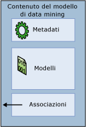

# Modelli di data mining (Analysis Services - Data mining)
  Un *modello di data mining* viene creato applicando un algoritmo ai dati, ma è molto più di un algoritmo o di un contenitore di metadati: è un set di dati, statistiche e modelli che possono essere applicati a nuovi dati per generare stime ed eseguire inferenze sulle relazioni.  
  
 In questa sezione viene presentato un modello di data mining e vengono illustrati i relativi utilizzi, l'architettura di base di modelli e strutture, le proprietà dei modelli di data mining, nonché le modalità per creare e utilizzare tali modelli.  
  
 [Architettura del modello di data mining](#bkmk_mdlArch)  
  
 [Definizione dei modelli di data mining](#bkmk_mdlDefine)  
  
 [Proprietà dei modelli di data mining](#bkmk_mdlProps)  
  
 [Colonne del modello di data mining](#bkmk_mdlCols)  
  
 [Elaborazione di modelli di data mining](#bkmk_mdlProcess)  
  
 [Visualizzazione ed esecuzione di query sui modelli di data mining](#bkmk_mdlView)  
  
##   Architettura del modello di data mining  
 Un modello di data mining ottiene i dati da una struttura di data mining e li analizza tramite un algoritmo di data mining. La struttura di data mining e il modello di data mining sono oggetti separati. In una struttura di data mining sono archiviate le informazioni che definiscono l'origine dati. In un modello di data mining sono archiviate le informazioni derivate dall'elaborazione statistica dei dati, ad esempio gli schemi ottenuti come risultato di un'analisi.  
  
 Un modello di data mining rimane vuoto finché i dati forniti dalla struttura di data mining non vengono elaborati e analizzati. Dopo essere stato elaborato, un modello di data mining contiene metadati, risultati e associazioni alla struttura di data mining.  
  
   
  
 I metadati consentono di specificare il nome del modello e il server in cui è archiviato, nonché una definizione del modello contenente le colonne della struttura di data mining utilizzate per la compilazione del modello, le definizioni dei filtri applicati durante l'elaborazione del modello e l'algoritmo utilizzato per analizzare i dati. Tutte queste scelte, ovvero le colonne dei dati e i relativi tipi di dati, i filtri e gli algoritmi, influiscono in maniera rilevante sui risultati dell'analisi.  
  
 Ad esempio, è possibile utilizzare gli stessi dati per creare più modelli, utilizzando algoritmi quali quelli di clustering, dell'albero delle decisioni e Naive Bayes. Ogni tipo di modello consente di creare set diversi di modelli, set di elementi, regole o formule che è possibile utilizzare per l'esecuzione di stime. Poiché in genere ogni algoritmo analizza i dati in modo diverso, anche il *contenuto* del modello risultante è organizzato in strutture diverse. In un tipo di modello i dati e i modelli possono essere raggruppati in *cluster*, mentre in un altro tipo i dati possono essere organizzati in alberi e rami e in base alle regole che li dividono e li definiscono.  
  
 Il modello viene anche influenzato dai dati utilizzati per il training: persino i modelli sottoposti a training nella stessa struttura di data mining possono generare risultati diversi se i dati vengono filtrati in modi differenti o se si utilizzano valori di inizializzazione diversi durante l'analisi. Tuttavia, i dati effettivi non vengono archiviati nel modello, bensì vengono archiviate solo le statistiche riepilogative, con i dati effettivi presenti nella struttura di data mining. Se sono stati creati filtri dei dati durante il training del modello, le definizioni dei filtri vengono salvate anche con l'oggetto modello.  
  
 Nel modello è contenuto un set di associazioni tramite cui viene fatto riferimento ai dati memorizzati nella cache della struttura di data mining. Se i dati sono stati memorizzati nella cache della struttura e non sono stati cancellati dopo l'elaborazione, queste associazioni consentono di eseguire il drill-through dai risultati ai case che supportano i risultati. Tuttavia, i dati effettivi vengono archiviati nella cache della struttura, non nel modello.  
  
 [Architettura del modello di data mining](#bkmk_mdlArch)  
  
##   Definizione dei modelli di data mining  
 Per creare un modello di data mining effettuare i passaggi generali seguenti:  
  
-   Creare la struttura di data mining sottostante e includere le colonne di dati che potrebbero essere necessarie.  
  
-   Selezionare l'algoritmo più appropriato per l'attività analitica.  
  
-   Scegliere le colonne della struttura da utilizzare nel modello e specificare la relativa modalità di utilizzo, ovvero in quale colonna è contenuto il risultato che si desidera stimare, quali colonne sono solo per l'input e così via.  
  
-   Facoltativamente, impostare i parametri per ottimizzare l'elaborazione attraverso l'algoritmo.  
  
-   Popolare il modello con i dati *elaborando* la struttura e il modello.  
  
 [!INCLUDE[ssASnoversion](../../includes/ssasnoversion-md.md)] offre gli strumenti seguenti per semplificare la gestione dei modelli di data mining:  
  
-   La Creazione guidata modello di data mining consente di creare una struttura e un modello di data mining correlato. Si tratta del metodo più semplice da utilizzare. La procedura guidata crea automaticamente la struttura di data mining richiesta e semplifica la configurazione delle impostazioni importanti.  
  
-   È possibile utilizzare un'istruzione DMX CREATE MODEL per definire un modello. La struttura richiesta viene creata automaticamente come parte del processo; pertanto, con questo metodo non è possibile riutilizzare una struttura esistente. Utilizzare questo metodo se si conosce con esattezza il modello che si desidera creare o se si desidera generare gli script per i modelli.  
  
-   È possibile utilizzare un'istruzione DMX ALTER STRUCTURE ADD MODEL per aggiungere un nuovo modello di data mining a una struttura esistente. Utilizzare questo metodo per provare a utilizzare modelli diversi basati sullo stesso set di dati.  
  
 È possibile creare modelli di data mining anche a livello di codice, tramite AMO o XML/A o tramite altri client quali Client di data mining per Excel. Per altre informazioni, vedere gli argomenti seguenti:  
  
 [Architettura del modello di data mining](#bkmk_mdlArch)  
  
##   Proprietà dei modelli di data mining  
 Ogni modello di data mining dispone di proprietà che consentono di definire il modello e i relativi metadati. In tali proprietà sono inclusi il nome, la descrizione, la data dell'ultima elaborazione del modello, le autorizzazioni per il modello e qualsiasi filtro dei dati utilizzato per il training.  
  
 Ogni modello di data mining dispone anche di proprietà derivate dalla struttura di data mining tramite cui vengono descritte le colonne di dati utilizzate dal modello. Se una colonna utilizzata dal modello è una tabella nidificata, è possibile applicare a tale colonna anche un filtro separato.  
  
 Inoltre, ogni modello di data mining contiene due proprietà speciali: <xref:Microsoft.AnalysisServices.MiningModel.Algorithm%2A> e <xref:Microsoft.AnalysisServices.MiningModelColumn.Usage%2A>.  
  
-   **Proprietà Algorithm** Specifica l'algoritmo usato per creare il modello. Gli algoritmi disponibili dipendono dal provider utilizzato. Per un elenco degli algoritmi disponibili in [!INCLUDE[ssNoVersion](../../includes/ssnoversion-md.md)] [!INCLUDE[ssASnoversion](../../includes/ssasnoversion-md.md)], vedere [Algoritmi di data mining &#40;Analysis Services - Data mining&#41;](../../analysis-services/data-mining/data-mining-algorithms-analysis-services-data-mining.md). La proprietà **Algorithm** si applica al modello di data mining e può essere impostata solo una volta per ogni modello. È possibile modificare l'algoritmo in un secondo momento, tuttavia alcune colonne nel modello di data mining potrebbero diventare non valide se non sono supportate dall'algoritmo scelto. È necessario rielaborare sempre il modello dopo aver apportato una modifica a questa proprietà.  
  
-   **Proprietà Usage** Definisce il modo in cui ogni colonna viene usata dal modello. È possibile definire l'utilizzo delle colonne come **Input**, **Stima**, **Solo stima**o **Chiave**. La proprietà **Usage** si applica a singole colonne del modello di data mining e deve essere impostata singolarmente per ogni colonna inclusa in un modello. Se la struttura contiene una colonna che non viene usata nel modello, l'utilizzo è impostato su **Ignora**. I nomi o gli indirizzi di posta elettronica dei clienti possono essere esempi di dati che potrebbero essere inclusi nella struttura di data mining, ma non utilizzati per l'analisi. In questo modo è possibile eseguirvi query in un secondo momento senza dover includerli durante la fase di analisi.  
  
 È possibile modificare il valore delle proprietà del modello di data mining dopo aver creato un modello. Tuttavia, qualsiasi modifica, anche al nome del modello di data mining, richiede la rielaborazione del modello. Dopo aver rielaborato il modello, è possibile visualizzare risultati diversi.  
  
 [Architettura del modello di data mining](#bkmk_mdlArch)  
  
##   Colonne del modello di data mining  
 Nel modello di data mining sono contenute le colonne di dati ottenute dalle colonne definite nella struttura di data mining. È possibile scegliere quali colonne della struttura di data mining utilizzare nel modello, creare copie di tali colonne, quindi rinominarle o modificarne l'utilizzo. Durante il processo di compilazione del modello, è necessario definire anche l'utilizzo della colonna in base al modello in cui sono incluse informazioni relative alla possibilità che la colonna sia una chiave, se viene utilizzata per le stime oppure se può essere ignorata dall'algoritmo.  
  
 Durante la compilazione di un modello, piuttosto che aggiungere automaticamente ogni colonna di dati disponibile, è consigliabile verificare attentamente i dati nella struttura e includere nel modello solo le colonne utili per l'analisi. Ad esempio, è consigliabile evitare di includere più colonne in cui sono ripetuti gli stessi dati, nonché di utilizzare colonne che dispongono quasi sempre di valori univoci. Se si ritiene che una colonna non debba essere utilizzata, non è necessario eliminarla dalla struttura o dal modello di data mining; è sufficiente impostare un flag sulla colonna affinché venga ignorata durante la compilazione del modello. In questo modo, la colonna rimarrà nella struttura di data mining, ma non sarà utilizzata nel modello di data mining. Se è stata abilitata la funzione di drill-through dal modello alla struttura di data mining, è possibile recuperare le informazioni dalla colonna in un secondo momento.  
  
 In base all'algoritmo scelto, alcune colonne della struttura di data mining potrebbero essere incompatibili con determinati tipi di modelli o restituire risultati poco soddisfacenti. Se nei dati sono inclusi dati numerici continui, ad esempio una colonna relativa al reddito, e per il modello sono richiesti valori discreti, potrebbe essere necessario convertire i dati in intervalli discreti o rimuoverli dal modello. In alcuni casi l'algoritmo consentirà di convertire o suddividere automaticamente i dati, tuttavia i risultati potrebbero non essere sempre quelli desiderati o previsti. Si consideri di effettuare copie aggiuntive della colonna e di provare modelli diversi. È possibile inoltre impostare flag sulle singole colonne per indicare se è necessaria un'elaborazione speciale. Ad esempio, se nei dati sono contenuti valori Null, è possibile utilizzare un flag di modellazione per controllare la gestione. Se si desidera che una particolare colonna venga considerata come un regressore in un modello, è possibile utilizzare un flag di modellazione.  
  
 Dopo aver creato il modello, è possibile apportare modifiche, ad esempio aggiungere o rimuovere colonne oppure modificare il nome del modello. Tuttavia, qualsiasi modifica, anche soltanto ai metadati del modello, richiede la rielaborazione del modello.  
  
 [Architettura del modello di data mining](#bkmk_mdlArch)  
  
##   Elaborazione di modelli di data mining  
 Un modello di data mining è un oggetto vuoto finché non viene elaborato. Quando si elabora un modello, i dati memorizzati nella cache della struttura vengono filtrati, se è stato definito un filtro nel modello, e quindi analizzati dall'algoritmo. Quest'ultimo consente di elaborare un set di statistiche riepilogative in cui sono descritti i dati, di identificare regole e schemi all'interno dei dati, nonché di utilizzare tali elementi per popolare il modello.  
  
 Una volta elaborato, nel modello di data mining sono contenute molte informazioni sui dati e sui modelli rilevati tramite l'analisi, incluse statistiche, regole e formule di regressione. È possibile utilizzare i visualizzatori personalizzati per esplorare queste informazioni oppure creare query di data mining per recuperare tali informazioni e utilizzarle per l'analisi e la presentazione.  
  
 [Architettura del modello di data mining](#bkmk_mdlArch)  
  
##   Visualizzazione ed esecuzione di query sui modelli di data mining  
 Dopo aver elaborato un modello, è possibile esaminarlo tramite i visualizzatori personalizzati disponibili in [!INCLUDE[ssBIDevStudioFull](../../includes/ssbidevstudiofull-md.md)] e in [!INCLUDE[ssManStudioFull](../../includes/ssmanstudiofull-md.md)]. For  
  
 È inoltre possibile creare query sul modello di data mining per eseguire stime oppure recuperare i metadati o gli schemi creati dal modello. Le query vengono create tramite DMX (Data Mining Extensions).  
  
## Contenuto correlato  
  
|Argomento|Collegamenti|  
|------------|-----------|  
|Informazioni sulla compilazione di strutture di data mining che possono supportare più modelli di data mining. Informazioni sull'utilizzo di colonne nei modelli.|[Colonne della struttura di data mining](../../analysis-services/data-mining/mining-structure-columns.md)   [Colonne del modello di data mining](../../analysis-services/data-mining/mining-model-columns.md)   [Tipi di contenuto &#40;Data mining&#41;](../../analysis-services/data-mining/content-types-data-mining.md)|  
|Informazioni sui diversi algoritmi e sul modo in cui la scelta dell'algoritmo influisce sul contenuto del modello.|[Contenuto dei modelli di data mining &#40;Analysis Services - Data mining&#41;](../../analysis-services/data-mining/mining-model-content-analysis-services-data-mining.md)   [Algoritmi di data mining &#40;Analysis Services - Data mining&#41;](../../analysis-services/data-mining/data-mining-algorithms-analysis-services-data-mining.md)|  
|Informazioni sull'impostazione delle proprietà nel modello che influisce sulla composizione e sul comportamento.|[Proprietà dei modelli di data mining](../../analysis-services/data-mining/mining-model-properties.md)   [Flag di modellazione &#40;Data mining&#41;](../../analysis-services/data-mining/modeling-flags-data-mining.md)|  
|Informazioni sulle interfacce programmabili per il data mining.|[Sviluppo con Analysis Management Objects &#40;AMO&#41;](../../analysis-services/multidimensional-models/analysis-management-objects/developing-with-analysis-management-objects-amo.md)   [Guida di riferimento a DMX &#40;Data Mining Extensions&#41;](../../dmx/data-mining-extensions-dmx-reference.md)|  
|Informazioni sull'utilizzo dei visualizzatori di data mining personalizzati in [!INCLUDE[ssASnoversion](../../includes/ssasnoversion-md.md)].|[Visualizzatori modello di data mining](../../analysis-services/data-mining/data-mining-model-viewers.md)|  
|Esempi di diversi tipi di query che è possibile utilizzare rispetto ai modelli di data mining.|[Query di data mining](../../analysis-services/data-mining/data-mining-queries.md)|  
  
## Attività correlate  
 Utilizzare i collegamenti seguenti per ottenere informazioni più specifiche sull'utilizzo dei modelli di data mining  
  
|Attività|Collegamento|  
|----------|----------|  
|Aggiungere ed eliminare i modelli di data mining|[Aggiungere un modello di data mining a una struttura di data mining esistente](../../analysis-services/data-mining/add-a-mining-model-to-an-existing-mining-structure.md)   [Eliminare un modello di data mining da una struttura di data mining](../../analysis-services/data-mining/delete-a-mining-model-from-a-mining-structure.md)|  
|Utilizzare le colonne di modelli di data mining|[Escludere una colonna da un modello di data mining](../../analysis-services/data-mining/exclude-a-column-from-a-mining-model.md)   [Creare un alias per una colonna di un modello](../../analysis-services/data-mining/create-an-alias-for-a-model-column.md)   [Modificare la discretizzazione di una colonna in un modello di data mining](../../analysis-services/data-mining/change-the-discretization-of-a-column-in-a-mining-model.md)   [Specificare una colonna da utilizzare come regressore in un modello](../../analysis-services/data-mining/specify-a-column-to-use-as-regressor-in-a-model.md)|  
|Modificare le proprietà dei modelli|[Modificare le proprietà di un modello di data mining](../../analysis-services/data-mining/change-the-properties-of-a-mining-model.md)   [Applicare un filtro a un modello di data mining](../../analysis-services/data-mining/apply-a-filter-to-a-mining-model.md)   [Eliminare un filtro da un modello di data mining](../../analysis-services/data-mining/delete-a-filter-from-a-mining-model.md)   [Abilitare il drill-through per un modello di data mining](../../analysis-services/data-mining/enable-drillthrough-for-a-mining-model.md)   [Visualizzare o modificare i parametri dell'algoritmo](../../analysis-services/data-mining/view-or-change-algorithm-parameters.md)|  
|Copiare, spostare o gestire i modelli|[Eseguire una copia di un modello di data mining](../../analysis-services/data-mining/make-a-copy-of-a-mining-model.md)   [Copiare una vista di un modello di data mining](../../analysis-services/data-mining/copy-a-view-of-a-mining-model.md)   [EXPORT &#40;DMX&#41;](../../dmx/export-dmx.md)   [IMPORT &#40;DMX&#41;](../../dmx/import-dmx.md)|  
|Popolare modelli con i dati o aggiornare i dati in un modello|[Elaborare un modello di data mining](../../analysis-services/data-mining/process-a-mining-model.md)|  
|Utilizzare i modelli OLAP|[Creare una dimensione di data mining](../../analysis-services/data-mining/create-a-data-mining-dimension.md)|  
  
## Vedere anche  
 [Oggetti di database &#40;Analysis Services - Dati multidimensionali&#41;](../../analysis-services/multidimensional-models/olap-logical/database-objects-analysis-services-multidimensional-data.md)  
  
  
