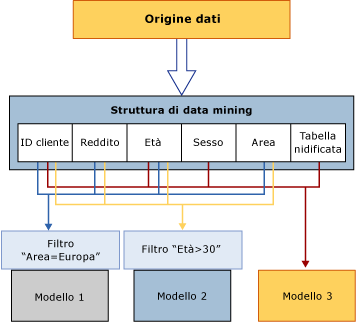

# Elaborazione di oggetti di data mining
[!INCLUDE[ssas-appliesto-sqlas](../../includes/ssas-appliesto-sqlas.md)]
  Un oggetto di data mining è soltanto un contenitore vuoto finché non viene elaborato. L'*elaborazione* di un modello di data mining viene anche definita *training*.  
  
 **Elaborazione di strutture di data mining:** una struttura di data mining ottiene i dati da un'origine dati esterna, secondo quanto definito dalle associazioni delle colonne e dai metadati di utilizzo, dopodiché li legge. Questi dati vengono letti completamente e successivamente analizzati per estrarre diverse statistiche. In Analysis Services una rappresentazione compressa dei dati, ideale per l'analisi basata sugli algoritmi di data mining, viene archiviata in una cache locale. È possibile conservare questa cache oppure eliminarla dopo l'elaborazione dei modelli. Per impostazione predefinita, la cache viene archiviata. Per altre informazioni, vedere [Elaborare una struttura di data mining](../../analysis-services/data-mining/process-a-mining-structure.md).  
  
 **Elaborazione di modelli di data mining:** un modello di data mining contiene solo definizioni finché non viene elaborato. Per elaborare un modello di data mining, è necessario elaborare la struttura di data mining sulla quale è basato. Il modello di data mining ottiene i dati dalla cache della struttura di data mining, applica i filtri eventualmente creati sul modello, dopodiché passa il set di dati attraverso l'algoritmo per rilevare gli schemi. Al termine dell'elaborazione, il modello archivia solo i risultati dell'elaborazione, non i dati stessi. Per altre informazioni, vedere [Elaborare un modello di data mining](../../analysis-services/data-mining/process-a-mining-model.md).  
  
 Nel diagramma seguente viene illustrato il flusso di dati al momento dell'elaborazione di una struttura di data mining e al momento dell'elaborazione di un modello di data mining.  
  
   
  
## Visualizzazione dei risultati dell'elaborazione  
 Dopo essere stata elaborata, una struttura di data mining contiene una rappresentazione compressa dei dati per l'utilizzo nell'analisi statistica. Se la cache non è stata cancellata, è possibile accedere ai dati in essa contenuti nelle modalità seguenti:  
  
-   Creazione di una query DMX (Data Mining Extensions) sul modello ed esecuzione del drill-through nella struttura. Per altre informazioni, vedere [SELECT FROM &#60;model&#62;.CASES &#40;DMX&#41;](../../dmx/select-from-model-cases-dmx.md).  
  
-   Esplorazione di un modello basato sulla struttura e utilizzo di una delle opzioni nell'interfaccia utente per eseguire il drill-through nei case della struttura. Per altre informazioni, vedere [Visualizzatori modello di data mining](../../analysis-services/data-mining/data-mining-model-viewers.md)o [Eseguire il drill-through sui dati del case da un modello di data mining](../../analysis-services/data-mining/drill-through-to-case-data-from-a-mining-model.md).  
  
-   Creazione di una query DMX nei case della struttura. Per altre informazioni, vedere [SELECT FROM &#60;structure&#62;.CASES](../../dmx/select-from-structure-cases.md).  
  
 Dopo essere stato elaborato, un modello di data mining contiene solo gli schemi derivati dall'analisi e i mapping dei risultati del modello ai dati di training memorizzati nella cache. È possibile esplorare o eseguire una query sui risultati del modello, definiti *contenuto del modello*, oppure è possibile eseguire una query sui case del modello e della struttura, purché siano stati memorizzati nella cache.  
  
 Il contenuto di ciascun modello di data mining dipende dall'algoritmo utilizzato per creare il modello stesso. Ad esempio, se un modello è un modello di clustering e un altro è un modello di albero delle decisioni, il contenuto del modello è molto diverso anche se i modelli utilizzano esattamente gli stessi dati. Per altre informazioni, vedere [Contenuto del modello di data mining &#40;Analysis Services - Data Mining&41#;](../../analysis-services/data-mining/mining-model-content-analysis-services-data-mining.md).  
  
## Requisiti per l'elaborazione  
 È possibile che i requisiti per l'elaborazione siano diversi a seconda che i modelli di data mining siano basati solamente su dati relazionali o su un'origine dati multidimensionale.  
  
 Per l'origine dati relazionale, l'elaborazione richiede unicamente la creazione di dati di training e l'esecuzione degli algoritmi di data mining su tali dati. Tuttavia, i modelli di data mining basati su oggetti OLAP, ad esempio dimensioni e misure, richiedono che i dati sottostanti siano elaborati. Ciò può richiedere l'elaborazione degli oggetti multidimensionali per la popolazione del modello di data mining.  
  
 Per altre informazioni, vedere [Requisiti e considerazioni sull'elaborazione &#40;data mining&#41;](../../analysis-services/data-mining/processing-requirements-and-considerations-data-mining.md).  
  
## Vedere anche  
 [Data Mining query drill-through & #40; & #41;](../../analysis-services/data-mining/drillthrough-queries-data-mining.md)   
 [Strutture di data mining & #40; Analysis Services - Data Mining & #41;](../../analysis-services/data-mining/mining-structures-analysis-services-data-mining.md)   
 [Modelli di data mining & #40; Analysis Services - Data Mining & #41;](../../analysis-services/data-mining/mining-models-analysis-services-data-mining.md)   
 [Architettura logica & #40; Analysis Services - Data Mining & #41;](../../analysis-services/data-mining/logical-architecture-analysis-services-data-mining.md)  
  
  
