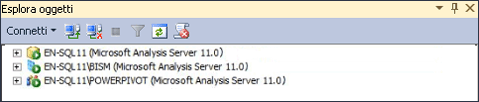

# Determinare la modalità server di un'istanza di Analysis Services
[!INCLUDE[ssas-appliesto-sqlas](../../includes/ssas-appliesto-sqlas.md)]
Sono disponibili tre diverse modalità server per installare Analysis Services: multidimensionale e data mining (impostazione predefinita), [!INCLUDE[ssGemini](../../includes/ssgemini-md.md)] per SharePoint e tabulare. La modalità server di un'istanza di Analysis Services è determinata durante l'installazione quando si scelgono le opzioni per l'installazione del server.  
  
 La modalità server determina il tipo di soluzione creata e distribuita. Se non è stato installato il software server e si desidera sapere in quale modalità è stato installato il server, è possibile usare le informazioni di questo argomento per determinare tale modalità. Per ulteriori informazioni sulla disponibilità delle funzionalità in una modalità specifica, vedere [confronto tabulari e multidimensionali ](../../analysis-services/comparing-tabular-and-multidimensional-solutions-ssas.md).  
  
 Se non si desidera usare la modalità server installata, è necessario disinstallare e reinstallare il software, scegliendo la modalità preferita. In alternativa, è possibile installare un'istanza aggiuntiva di Analysis Services nello stesso computer per disporre di più istanze eseguite in modalità diverse.  
  
## Icone del server in Esplora oggetti  
 Il modo più semplice per determinare la modalità server consiste nel connettersi al server in SQL Server Management Studio e individuare l'icona accanto al nome del server in Esplora oggetti. La figura seguente mostra tre istanze di Analysis Services distribuite in modalità multidimensionale, tabulare e [!INCLUDE[ssGemini](../../includes/ssgemini-md.md)] :  
  
   
  
## Visualizzazione della proprietà DeploymentMode nel file MSMDSRV.INI  
 In alternativa, è possibile verificare la proprietà **DeploymentMode** nel file msmdsrv.ini incluso in ogni istanza di Analysis Services. Il valore di questa proprietà identifica la modalità del server. I valori validi sono 0 (multidimensionale), 1 (SharePoint) o 2 (tabulare). Per aprire il file msmdsrv.ini, è necessario essere un amministratore (ovvero, un membro del ruolo server) di [!INCLUDE[ssASnoversion](../../includes/ssasnoversion-md.md)] . Questo file contiene XML strutturato. È possibile visualizzare il file usando Blocco note o qualsiasi editor di testo.  
  
> [!CAUTION]  
>  Non modificare il valore della proprietà **DeploymentMode** . La modifica manuale della proprietà dopo l'installazione del server non è supportata.  
  
## Informazioni sulla proprietà DeploymentMode  
 La proprietà**DeploymentMode** consente di determinare il contesto operativo di un'istanza del server Analysis Services. Questa proprietà viene definita 'modalità server' in finestre di dialogo, messaggi e documentazione. Questa proprietà viene inizializzata dal programma di installazione in base alla modalità di installazione di Analysis Services e deve essere considerata solo per uso interno, usando sempre il valore specificato dal programma di installazione.  
  
 Tra i valori validi per questa proprietà sono inclusi i seguenti:  
  
|Valore|Descrizione|  
|-----------|-----------------|  
|0|Si tratta del valore predefinito. Specifica la modalità multidimensionale, usata per i database multidimensionali che usano l'archiviazione MOLAP, HOLAP e ROLAP, nonché i modelli di data mining.|  
|1|Specifica le istanze di Analysis Services installate nell'ambito di una distribuzione di [!INCLUDE[ssGemini](../../includes/ssgemini-md.md)] per SharePoint. Non modificare la proprietà della modalità di distribuzione dell'istanza di Analysis Services che fa parte di un'installazione di [!INCLUDE[ssGemini](../../includes/ssgemini-md.md)] per SharePoint. [!INCLUDE[ssGemini](../../includes/ssgemini-md.md)] I dati di non verranno più eseguiti nel server se si cambia modalità.|  
|2|Specifica la modalità tabulare usata per l'hosting dei database del modello tabulare che usano l'archiviazione in memoria o DirectQuery.|  
  
 Ogni modalità comporta l'esclusione dell'altra. In un server configurato per la modalità tabulare non è possibile eseguire i database di Analysis Services che contengono cubi e dimensioni. Se l'hardware del computer sottostante può supportare tale condizione, è possibile installare più istanze di Analysis Services nello stesso computer e configurare ogni istanza per l'utilizzo di una modalità di distribuzione diversa. Analysis Services è un'applicazione a elevato utilizzo di risorse. La distribuzione di più istanze sullo stesso sistema viene consigliata solo per server di fascia alta.  
  
## Vedere anche  
 [Installare Analysis Services](../../analysis-services/instances/install-windows/install-analysis-services.md)   
 [Installazione di Analysis Services in modalità Multidimensionale e Data Mining](http://msdn.microsoft.com/library/8a1f33e8-2bd6-4fb8-bd46-c86f2a067f60)   
 [Installazione di Power Pivot per SharePoint 2010](http://msdn.microsoft.com/en-us/8d47dde7-c941-4280-a934-e2fe3f9a938f)   
 [Connettersi ad Analysis Services](../../analysis-services/instances/connect-to-analysis-services.md)   
 [Soluzioni di modelli tabulari](../../analysis-services/tabular-models/tabular-model-solutions-ssas-tabular.md)   
 [Soluzioni di modelli multidimensionali ](../../analysis-services/multidimensional-models/multidimensional-model-solutions-ssas.md)   
 [Modelli di data mining &#40; Analysis Services - Data Mining &#41;](../../analysis-services/data-mining/mining-models-analysis-services-data-mining.md)  
  
  
