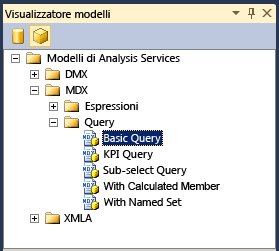

# <a name="use-analysis-services-templates-in-sql-server-management-studio"></a>Usare i modelli di Analysis Services in SQL Server Management Studio
[!INCLUDE[ssas-appliesto-sqlas-all-aas](../../includes/ssas-appliesto-sqlas-all-aas.md)]

  [!INCLUDE[ssManStudioFull](../../includes/ssmanstudiofull-md.md)] fornisce un set di modelli che aiutano a creare rapidamente script XMLA, query MDX o DMX oppure indicatori KPI in un cubo o in un modello tabulare, a generare script per operazioni di backup e ripristino, nonché a eseguire numerose altre attività. I modelli si trovano in **Esplora modelli** in [!INCLUDE[ssManStudio](../../includes/ssmanstudio-md.md)].  
  
 In questo argomento è incluso un elenco dei modelli per i modelli multidimensionali e tabulari e vengono forniti esempi di come compilare una query MDX e un'istruzione XMLA tramite Visualizzatore metadati ed Esplora modelli.  
  
 In questo argomento non vengono analizzati i modelli DMX. Per esempi su come creare query di data mining con i modelli, vedere [Creare una query DMX in SQL Server Management Studio](../../analysis-services/data-mining/create-a-dmx-query-in-sql-server-management-studio.md) o [Creare una query di stima singleton da un modello](../../analysis-services/data-mining/create-a-singleton-prediction-query-from-a-template.md).  
  
##  <a name="bkmk_usingTE"></a> Aprire un modello di Analysis Services  
 Tutti i modelli per le query del motore di database e le query e i comandi di Analysis Services sono disponibili in Esplora modelli.  
  
 Per aprire **Esplora modelli**scegliere la voce corrispondente dal menu **Visualizza** . Fare quindi clic sull'icona del cubo per visualizzare un elenco dei modelli disponibili per [!INCLUDE[ssASnoversion](../../includes/ssasnoversion-md.md)].  
  
   
  
 Per aprire un modello, fare clic con il pulsante destro del mouse sul nome del modello e scegliere **Apri**oppure trascinare il modello in una finestra Query già aperta. Dopo che la finestra Query è stata aperta, è possibile utilizzare i comandi sulla barra degli strumenti o il menu Query per compilare istruzioni:  
  
-   Per verificare la sintassi di una query, fare clic su **Analizza**.  
  
-   Per eseguire una query, fare clic su **Esegui**.  
  
     Per arrestare l'esecuzione di una query, fare clic su **Annulla esecuzione query**.  
  
-   Per visualizzare i risultati di una query, usare la scheda **Risultati** nella parte inferiore dello schermo.  
  
     Passare alla scheda **Messaggi** per visualizzare il numero di record restituiti, errori, istruzioni di query ed eventuali altri messaggi associati all'esecuzione della query. Se, ad esempio, si esegue un'istruzione DAX su un modello che è in esecuzione in modalità DirectQuery, è possibile visualizzare l'istruzione Transact-SQL generata dal motore di analisi in memoria xVelocity (VertiPaq).  
  
##  <a name="BKMK_Building_Queries"></a> Compilare ed eseguire una query MDX su un modello tabulare utilizzando un modello  
 In questo esempio viene illustrato come creare una query MDX in SQL Server Management Studio utilizzando un database modello tabulare come origine dati. Per ripetere questo esempio nel computer, è possibile [scaricare il progetto di esempio di modello tabulare AdventureWorks](http://go.microsoft.com/fwlink/?LinkId=231183).  
  
> [!WARNING]  
>  Non è possibile utilizzare query MDX su modelli tabulari distribuiti in modalità DirectQuery. È tuttavia possibile inviare query equivalenti utilizzando query di tabella DAX con il comando EVALUATE. Per altre informazioni, vedere [Parametri per query DAX](http://msdn.microsoft.com/en-us/c5841b4e-3395-4237-815b-9822a691e544).  
  
#### <a name="create-an-mdx-query-from-a-template"></a>Creare una query MDX da un modello  
  
1.  In [!INCLUDE[ssManStudioFull](../../includes/ssmanstudiofull-md.md)]aprire l'istanza contenente il modello tabulare su cui eseguire la query. Fare clic con il pulsante destro del mouse sull'icona del database, scegliere **Nuova query**e quindi **MDX**.  
  
2.  Nel Visualizzatore modelli, in Modelli di Analysis Services, aprire **MDX**e quindi aprire **Query**. Trascinare **Basic Query** nella finestra Query.  
  
3.  Tramite **Visualizzatore metadati**trascinare i campi e le misure seguenti nel modello di query:  
  
    1.  Sostituire \<row_axis, mdx_set > con **[Product Category]. [ Product Category Name]**.  
  
    2.  Sostituire \<column_axis, mdx_set > con **[Date]. [ Anno di calendario]. [Anno di calendario]** .  
  
    3.  Sostituire \<from_clause, mdx_name > con **[Internet Sales]**.  
  
    4.  Sostituire \<where_clause, mdx_set > con **[Measures]. [ Internet Total Sales]**.  
  
4.  È possibile eseguire la query così come è, ma sarà probabilmente necessario apportare alcune modifiche, ad esempio aggiungendo una funzione per restituire membri specifici. Digitare, ad esempio, **.members** dopo **[Product Category].[Product Category Name]**. Per altre informazioni, vedere [Uso delle espressioni di membro](../../mdx/using-member-expressions.md).  
  
##  <a name="bkmk_backup"></a> Creare uno script XMLA da un modello  
 I modelli di comandi XMLA forniti in Esplora modelli possono essere usati per creare script per il monitoraggio e l'aggiornamento di oggetti di [!INCLUDE[ssASnoversion](../../includes/ssasnoversion-md.md)] , indipendentemente dal fatto che l'istanza sia in modalità multidimensionale e di data mining oppure tabulare. I modelli **XMLA** includono esempi per i tipi di script seguenti:  
  
-   Backup, ripristino e sincronizzazione delle operazioni  
  
-   Annullamento del processo o del comando specificato  
  
-   Elaborazione di un oggetto  
  
-   Individuazione dei set di righe dello schema  
  
-   Monitoraggio dello stato del server, inclusi processi, connessioni, transazioni, memoria e contatori delle prestazioni  
  
#### <a name="create-a-backup-command-script-from-a-template"></a>Creare uno script per il comando di backup da un modello  
  
1.  In [!INCLUDE[ssManStudioFull](../../includes/ssmanstudiofull-md.md)]aprire l'istanza contenente il database su cui eseguire la query. Fare clic con il pulsante destro del mouse sull'icona del database, scegliere **Nuova query**e quindi **XMLA**.  
  
    > [!WARNING]  
    >  Non è possibile impostare il contesto di una query XMLA modificando l'elenco di restrizioni o specificando un database nella finestra di dialogo di connessione. È necessario aprire la finestra Query XMLA dal database su cui si desidera eseguire la query.  
  
2.  Trascinare il modello **Backup** nella finestra Query vuota.  
  
3.  Fare doppio clic sul testo all'interno di \<DatabaseID > elemento.  
  
4.  In Esplora oggetti selezionare il database di cui si desidera eseguire il backup, trascinarlo e rilasciarlo tra le parentesi dell'elemento DatabaseID.  
  
5.  Fare doppio clic sul testo all'interno di \<File > elemento. Digitare il nome del file di backup, inclusa l'estensione abf. Se non si utilizza il percorso di backup predefinito, specificare il percorso completo del file. Per altre informazioni, vedere [Backup, ripristino e sincronizzazione di database &#40;XMLA&#41;](../../analysis-services/multidimensional-models-scripting-language-assl-xmla/backing-up-restoring-and-synchronizing-databases-xmla.md).  
  
##  <a name="bkmk_schemarowset"></a> Generare una query sul set di righe dello schema utilizzando un modello XMLA  
 In **Esplora modelli** è incluso un solo modello per le query sul set di righe dello schema. Per utilizzare questo modello, è necessario avere familiarità con i requisiti del singolo set di righe dello schema che si desidera utilizzare, inclusi eventuali elementi necessari, nonché le colonne che possono essere utilizzate come restrizioni. Per altre informazioni, vedere [Set di righe dello schema di Analysis Services](../../analysis-services/schema-rowsets/analysis-services-schema-rowsets.md).  
  
 Si noti che numerosi set di righe dello schema sono stati esposti anche come DMV (viste a gestione dinamica), per semplicità. Utilizzando la DMV corrispondente, è possibile eseguire query sul set di righe dello schema utilizzando una sintassi analoga a quella di Transact-SQL. Tramite le query seguenti vengono ad esempio restituiti gli stessi risultati, ma uno è in formato XML e uno è in un formato tabulare. Per altre informazioni sulle DMV, vedere [Usare DMV per monitorare Analysis Services](../../analysis-services/instances/use-dynamic-management-views-dmvs-to-monitor-analysis-services.md).  
  
 Di seguito è illustrata una DMV che restituisce un elenco di tutti i set di righe dello schema disponibili come DMV:  
  
```  
SELECT * FROM $system.DISCOVER_SCHEMA_ROWSETS  
```  
  
 Di seguito è illustrato un comando XMLA che restituisce un elenco di tutti i set di righe dello schema disponibili:  
  
```  
<Discover xmlns="urn:schemas-microsoft-com:xml-analysis">  
<RequestType>DISCOVER_SCHEMA_ROWSETS</RequestType>  
    <Restrictions>  
<RestrictionList>  
</RestrictionList>  
</Restrictions>  
    <Properties>  
<PropertyList>  
   </PropertyList>  
</Properties>  
</Discover>  
```  
  
#### <a name="get-a-list-of-data-sources-for-a-tabular-model-using-a-schema-rowset-query"></a>Ottenere un elenco di origini dati per un modello tabulare utilizzando una query sul set di righe dello schema  
  
1.  In [!INCLUDE[ssManStudioFull](../../includes/ssmanstudiofull-md.md)]aprire l'istanza contenente il database su cui eseguire la query. Fare clic con il pulsante destro del mouse sull'icona del database, scegliere **Nuova query**e quindi **XMLA**.  
  
    > [!WARNING]  
    >  Non è possibile impostare il contesto di una query XMLA modificando l'elenco di restrizioni o specificando un database nella finestra di dialogo di connessione. È necessario aprire la finestra Query XMLA dal database su cui si desidera eseguire la query.  
  
2.  Aprire **Esplora modelli**e trascinare il modello **Discover Schema Rowsets**nella finestra Query vuota.  
  
3.  Nel modello, sostituire i [elemento RequestType &#40;XMLA&#41; ](../../analysis-services/xmla/xml-elements-properties/requesttype-element-xmla.md) elemento con il testo seguente: `<RequestType>MDSCHEMA_INPUT_DATASOURCES</RequestType>`  
  
4.  Fare clic su **Esegui**.  
  
     Risultati previsti:  
  
    ```  
    <CATALOG_NAME>AW Internet Sales Tabular Model_ 24715b71-ea74-4828-aefc-d4c12c15db64</CATALOG_NAME>   
    <DATASOURCE_NAME>SqlServer localhost AdventureWorksDW2012</DATASOURCE_NAME>   
    <DATASOURCE_TYPE>Relational</DATASOURCE_TYPE>   
    <CREATED_ON>2011-10-12T20:27:05.196667</CREATED_ON>   
    <LAST_SCHEMA_UPDATE>2011-10-12T20:27:05.196667</LAST_SCHEMA_UPDATE>   
    <DESCRIPTION />   
    <TIMEOUT>0</TIMEOUT>   
    <DBMS_NAME>Microsoft SQL Server</DBMS_NAME>   
    <DBMS_VERSION>11.00.1724</DBMS_VERSION>  
  
    ```  
  
##  <a name="bkmk_Ref"></a> Guida di riferimento ai modelli di Analysis Services  
 I modelli seguenti vengono forniti per l'utilizzo con i database di Analysis Services e gli oggetti all'interno del database, inclusi modelli e strutture di data mining, cubi e modelli tabulari:  
  
|Category|Modello di elementi|Description|  
|--------------|-------------------|-----------------|  
|DMX\Model Content|Content Query|Viene illustrato come utilizzare l'istruzione DMX SELECT FROM  *\<modello >*. CONTENUTO istruzione per recuperare il contenuto del set di righe dello schema per un modello di data mining specificato.|  
||Continuous Column Values|Viene illustrato come utilizzare DMX SELECT DISTINCT FROM  *\<modello >* dell'istruzione DMX **RangeMin** e **RangeMax** funzioni per recuperare un set di valori in un intervallo specificato da colonne continue in un modello di data mining specificato.|  
||Discrete Column Values|Viene illustrato come utilizzare DMX SELECT DISTINCT FROM  *\<modello >* istruzione recuperare un set completo di valori da colonne discrete di un modello di data mining specificato.|  
||Drillthrough Query|Illustra l'utilizzo dell'istruzione DMX SELECT * FROM Model.CASES con la funzione DMX IsInNode per l'esecuzione di una query drill-through.|  
||Attributi di modellazione|Illustra l'utilizzo della funzione DMX System.GetModelAttributes per restituire un elenco degli attributi utilizzati da un modello.|  
||PMML Content|Viene illustrato come utilizzare l'istruzione DMX SELECT \* FROM  *\<modello >*. Istruzione PMML per recuperare la rappresentazione PMML Predictive Model Markup Language () del modello di data mining, per gli algoritmi che supportano questa funzionalità.|  
|DMX\Model Management|Add Model|Illustra l'utilizzo dell'istruzione DMX ALTER MINING MODEL STRUCTURE per l'aggiunta di un modello di data mining.|  
||Clear Model|Illustra l'utilizzo dell'istruzione DMX DELETE * FROM MINING MODEL per l'eliminazione del contenuto di un modello di data mining specificato.|  
||Clear Structure Cases|Illustra l'utilizzo dell'istruzione DMX DELETE FROM MINING STRUCTURE per la cancellazione dei case delle strutture dei modelli di data mining.|  
||Clear Structure|Illustra l'utilizzo dell'istruzione DMX DELETE FROM MINING STRUCTURE per la cancellazione della struttura di un modello di data mining.|  
||Create from PMML|Illustra l'utilizzo dell'istruzione DMX CREATE MINING MODEL con la clausola FROM PMML per creare un modello di data mining basato su una rappresentazione PMML.|  
||Create Structure Nested|Illustra l'utilizzo dell'istruzione DMX CREATE MINING STRUCTURE con un elenco di definizioni di colonne nidificate per la creazione di un modello di data mining con colonne nidificate.|  
||Create Structure|Illustra l'utilizzo dell'istruzione DMX CREATE MINING STRUCTURE per la creazione di un modello di data mining.|  
||Drop Model|Illustra l'utilizzo dell'istruzione DMX CREATE MINING MODEL per eliminare un modello di data mining.|  
||Drop Structure|Illustra l'utilizzo dell'istruzione DMX CREATE MINING STRUCTURE per l'eliminazione di un modello di data mining esistente.|  
||Export Model|Illustra l'utilizzo dell'istruzione DMX EXPORT MINING MODEL con le clausole WITH DEPENDENCIES e PASSWORD per l'esportazione di un modello di data mining, includendo l'origine dei dati e la vista origine dati da cui dipende tale modello, in un file.|  
||Export Structure|Illustra l'utilizzo dell'istruzione DMX EXPORT MINING STRUCTURE con la clausola WITH DEPENDENCIES per l'esportazione di una struttura di data mining, includendo tutti i modelli di data mining in essa contenuti e l'origine dei dati e la vista origine dati da cui dipende tale struttura, in un file.|  
||Importa|Illustra come usare l'istruzione DMX IMPORT FROM con la clausola WITH PASSWORD per eseguire un'importazione.|  
||Rename Model|Illustra l'utilizzo dell'istruzione DMX RENAME MINING MODEL per la ridenominazione di un modello di data mining esistente.|  
||Rename Structure|Illustra l'utilizzo dell'istruzione DMX RENAME MINING STRUCTURE per la ridenominazione di una struttura di data mining esistente.|  
||Train Model|Illustra l'utilizzo dell'istruzione DMX INSERT INTO MINING MODEL per eseguire il training di un modello di data mining all'interno di una struttura di cui è stato precedentemente eseguito il training.|  
||Train Nested Structure|Illustra la combinazione dell'istruzione DMX INSERT INTO MINING STRUCTURE con la query dei dati di origine SHAPE per eseguire il training di un modello di data mining contenente colonne nidificate con dati che includono tabelle nidificate recuperati tramite query da un'origine dei dati esistente.|  
||Train Structure|Illustra la combinazione dell'istruzione DMX INSERT INTO MINING STRUCTURE con la query dei dati di origine OPENQUERY per il training di una struttura di data mining.|  
|DMX\Prediction Queries|Base Prediction|Viene illustrato come combinare DMX SELECT FROM  *\<modello >* istruzione PREDICTION JOIN insieme alla query di dati di origine OPENQUERY per eseguire una query di stima su un modello di data mining utilizzando i dati, recuperati tramite una query, di un origine dati esistente.|  
||Nested Prediction|Viene illustrato come combinare DMX SELECT FROM  *\<modello >* istruzione PREDICTION JOIN con le query di dati origine SHAPE e OPENQUERY per eseguire una query di stima su un modello di data mining utilizzando i dati che contiene annidati tabelle, recuperate tramite una query, di un'origine dati esistente.|  
||Nested Singleton Prediction|Viene illustrato come utilizzare un'istruzione DMX SELECT FROM  *\<modello >* clausola NATURAL PREDICTION JOIN per eseguire una query di stima su un modello di data mining utilizzando un singolo valore, specificato in modo esplicito nella query di stima, in una colonna il cui nome corrisponde a una colonna nel modello di data mining e che include un set di valori in una tabella nidificata creata tramite un'istruzione di unione i cui nomi corrispondono anche a colonne nidificate del modello di data mining.|  
||Singleton Prediction|Viene illustrato come utilizzare un'istruzione DMX SELECT FROM \<model > NATURAL PREDICTION JOIN istruzione da eseguire una query di stima su un modello di data mining utilizzando un singolo valore, specificato in modo esplicito nella query di stima, in una colonna il cui nome corrisponde a una colonna modello di data mining.|  
||Stored Procedure Call|Illustra l'utilizzo dell'istruzione DMX CALL per la chiamata di una stored procedure.|  
|MDX\Expressions|Moving Average-Fixed|Illustra l'uso delle funzioni MDX **ParallelPeriod** e **CurrentMember** con un set ordinato per creare una misura calcolata che restituisce la media mobile di una misura in relazione a un numero fisso di periodi di tempo inclusi nella gerarchia di una dimensione temporale.|  
||Moving Average-Variable|Illustra l'uso dell'istruzione MDX **CASE** in una funzione **Avg** per creare una misura calcolata che restituisce la media mobile di una misura in relazione a un numero variabile di periodi di tempo inclusi nella gerarchia di una dimensione temporale.|  
||Da inizio periodo fino alla data specificata|Illustra l'uso della funzione MDX **PeriodsToDate** in un membro calcolato.|  
||Ratio to Parent|Illustra l'uso della funzione MDX **Parent** per creare una misura calcolata che rappresenta il rapporto espresso in percentuale di una misura di ogni figlio di un membro padre della gerarchia specificata.|  
||Ratio to Total|Illustra l'utilizzo di All member per creare una misura calcolata che rappresenta un rapporto espresso in percentuale della misura di ogni membro della gerarchia specificata.|  
|MDX\Queries|Basic Query|Illustra un'istruzione MDX SELECT di base utilizzabile per la formulazione di una query MDX.|  
||KPI Query|Illustra l'uso delle funzioni MDX **KPIValue** e **KPIGoal** per recuperare informazioni sull'indicatore di prestazioni chiave (KPI) in una query MDX.|  
||Sub-select Query|Illustra come creare un'istruzione MDX SELECT per recuperare informazioni da un sottocubo definito da un'altra istruzione SELECT.|  
||With Calculated Member|Illustra l'utilizzo della clausola MDX WITH in un'istruzione SELECT per definire un membro calcolato per una query MDX.|  
||With Named Set|Illustra l'utilizzo della clausola MDX WITH in un'istruzione SELECT per definire un set denominato per una query MDX.|  
|XMLA\Management|Backup|Illustra l'uso del comando XMLA **Backup** per eseguire il backup di un database di [!INCLUDE[ssASnoversion](../../includes/ssasnoversion-md.md)] in un file.|  
||Annulla|Illustra l'uso del comando XMLA **Cancel** per annullare tutte le operazioni in corso nella sessione corrente (nel caso di utenti diversi da amministratori e amministratori del server), nel database corrente (nel caso di amministratori) o nell'istanza corrente (nel caso di amministratori del server).|  
||Create Remote Partition Database|Illustra l'uso del comando XMLA **Create** con l'elemento Database del linguaggio di scripting di [!INCLUDE[ssASnoversion](../../includes/ssasnoversion-md.md)] (ASSL) per creare un database di [!INCLUDE[ssASnoversion](../../includes/ssasnoversion-md.md)] e un'origine dei dati per l'archiviazione di partizioni remote.|  
||Delete|Illustra l'uso del comando XMLA **Delete** per eliminare un database di [!INCLUDE[ssASnoversion](../../includes/ssasnoversion-md.md)] esistente.|  
||Process Dimension|Illustra l'uso del comando XMLA **Batch** insieme all'elemento **Parallel** e al comando **Process** per aggiornare gli attributi di una dimensione tramite un'operazione batch parallela.|  
||Process Partition|Illustra l'uso del comando XMLA **Batch** insieme all'elemento **Parallel** e al comando **Process** per l'elaborazione completa di una partizione tramite un'operazione batch parallela.|  
||Restore|Illustra l'uso del comando XMLA **Restore** per ripristinare un database di [!INCLUDE[ssASnoversion](../../includes/ssasnoversion-md.md)] da un file di backup.|  
||Sincronizza|Illustra l'uso del comando XMLA **Synchronize** per la sincronizzazione di un altro database di [!INCLUDE[ssASnoversion](../../includes/ssasnoversion-md.md)] con il database corrente di [!INCLUDE[ssASnoversion](../../includes/ssasnoversion-md.md)] con l'opzione SkipMembership per il tag SynchronizeSecurity.|  
|XMLA\Schema Rowsets|Individuazione dei set di righe dello schema|Illustra l'uso del metodo XMLA **Discover** per recuperare il contenuto del set di righe dello schema DISCOVER_SCHEMA_ROWSETS.|  
|XMLA\Server Status|Connessioni|Illustra l'uso del metodo XMLA **Discover** per recuperare il contenuto del set di righe dello schema DISCOVER_CONNECTIONS.|  
||Processi|Illustra l'uso del metodo XMLA **Discover** per recuperare il contenuto del set di righe dello schema DISCOVER_JOBS.|  
||Percorsi|Illustra l'uso del metodo XMLA **Discover** per recuperare il contenuto del set di righe dello schema DISCOVER_LOCATIONS, specificando il percorso dei file di backup.|  
||Locks|Illustra l'uso del metodo XMLA **Discover** per recuperare il contenuto del set di righe dello schema DISCOVER_LOCKS.|  
||Memory Grant|Illustra l'uso del metodo XMLA **Discover** per recuperare il contenuto del set di righe dello schema DISCOVER_MEMORYGRANT.|  
||Contatori delle prestazioni|Illustra l'uso del metodo XMLA **Discover** per recuperare il contenuto del set di righe dello schema DISCOVER_PERFORMANCE_COUNTERS.|  
||Sessioni|Illustra l'uso del metodo XMLA **Discover** per recuperare il contenuto del set di righe dello schema DISCOVER_SESSIONS.|  
||Traces|Illustra l'uso del metodo XMLA **Discover** per recuperare il contenuto del set di righe dello schema DISCOVER_TRACES.|  
||Transazioni|Illustra l'uso del metodo XMLA **Discover** per recuperare il contenuto del set di righe dello schema DISCOVER_TRANSACTIONS.|  
  
## <a name="see-also"></a>Vedere anche  
 [Guida di riferimento a MDX &#40;Multidimensional Expressions&#41;](../../mdx/multidimensional-expressions-mdx-reference.md)   
 [Data Mining Extensions & #40; DMX & #41; Riferimento](../../dmx/data-mining-extensions-dmx-reference.md)   
 [Analysis Services Scripting Language &#40;ASSL per XMLA&#41;](../../analysis-services/scripting/analysis-services-scripting-language-assl-for-xmla.md)   
 [Analysis Services Scripting Language &#40;ASSL per XMLA&#41;](../../analysis-services/scripting/analysis-services-scripting-language-assl-for-xmla.md)  
  
  
