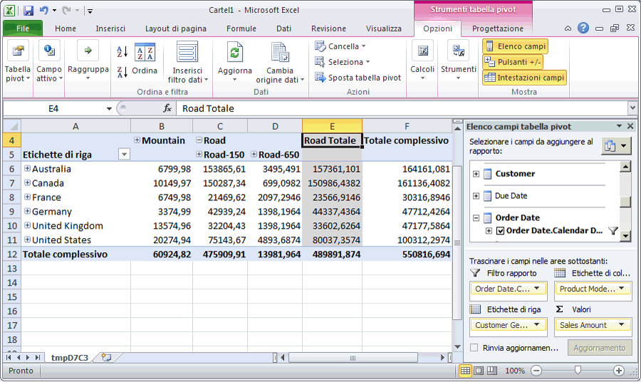

# Lezione 3-5-esplorazione del cubo distribuito
[!INCLUDE[ssas-appliesto-sqlas](../includes/ssas-appliesto-sqlas.md)]

Nell'attività seguente si esplorerà il cubo [!INCLUDE[ssASnoversion](../includes/ssasnoversion-md.md)] Tutorial. Poiché l'analisi confronta la misura in più dimensioni, verrà utilizzata una tabella pivot di Excel per esplorare i dati. L'utilizzo di una tabella pivot consente di posizionare cliente, data e informazioni sul prodotto su diversi assi in modo da potere visualizzare come cambia Internet Sales quando viene visualizzato in periodi di tempo, dati demografici del cliente e linee di prodotti specifici.  
  
### Per esplorare il cubo distribuito  
  
1.  Per passare a Progettazione cubi in [!INCLUDE[ssBIDevStudio](../includes/ssbidevstudio-md.md)], fare doppio clic sul cubo **[!INCLUDE[ssASnoversion](../includes/ssasnoversion-md.md)] Tutorial** nella cartella **Cubi** di Esplora soluzioni.  
  
2.  Aprire la scheda **Esplorazione** , quindi fare clic sul pulsante **Riconnetti** nella barra degli strumenti della finestra di progettazione.  
  
3.  Fare clic sull'icona Excel per avviare Excel utilizzando il database dell'area di lavoro come origine dati. Quando viene richiesto di abilitare le connessioni, fare clic su **Abilita**.  
  
4.  Nell'elenco di campi della tabella pivot espandere **Internet Sales**, quindi trascinare la misura **Sales Amount** nell'area **Valori** .  
  
5.  Nell'elenco di campi della tabella pivot espandere **Product**.  
  
6.  Trascinare la gerarchia utente **Product Model Lines** nell'area **Colonne** .  
  
7.  Nell'elenco di campi della tabella pivot espandere **Customer**e **Location**, quindi trascinare la gerarchia **Customer Geography** dalla cartella di visualizzazione Location della dimensione Customer all'area **Righe** .  
  
8.  Nell'elenco di campi della tabella pivot espandere **Order Date**, quindi trascinare la gerarchia **Order Date.Calendar Date** nell'area **Filtro report** .  
  
9. Fare clic sulla freccia a destra del filtro **Order Date.Calendar Date** nel riquadro Dati, deselezionare la casella di controllo relativa al livello **(Totale)** , espandere **2006**, **H1 CY 2006**e **Q1 CY 2006**, selezionare la casella di controllo relativa a **February 2006**e quindi fare clic su **OK**.  
  
    Verranno visualizzate le vendite realizzate nel mese di febbraio 2006 tramite Internet in base alla regione e alla linea di prodotti, come illustrato nella figura seguente.  
  
      
  
## Lezione successiva  
[Lezione 4: Definizione di attributo avanzato e proprietà dimensione](../analysis-services/lesson-4-defining-advanced-attribute-and-dimension-properties.md)  
  
  
  
