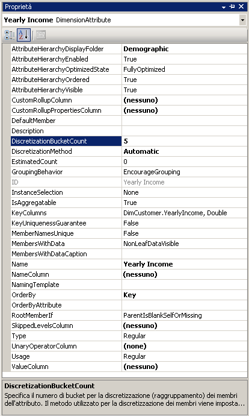
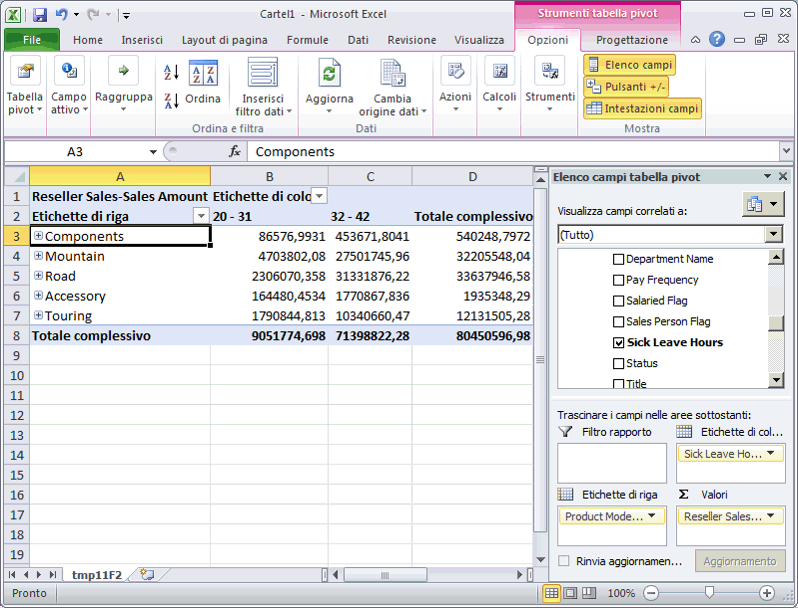

# Lezione 4-3 - automaticamente i membri di attributo di raggruppamento
Quando si esplora un cubo, in genere i membri di una gerarchia di attributi si dimensionano in base a quelli di un'altra gerarchia di attributi. Ad esempio, le vendite clienti si potrebbero raggruppare per città, per prodotto acquistato o per sesso. Tuttavia, con alcuni tipi di attributi, è utile ottenere la creazione automatica di raggruppamenti di membri di attributi da parte di [!INCLUDE[msCoName](../includes/msconame-md.md)] [!INCLUDE[ssASnoversion](../includes/ssasnoversion-md.md)] in base alla distribuzione dei membri all'interno di una gerarchia di attributi. In [!INCLUDE[ssASnoversion](../includes/ssasnoversion-md.md)] , ad esempio, è possibile ottenere la creazione di gruppi di valori di reddito annuale per i clienti. In questo caso, gli utenti che esplorano la gerarchia di attributi vedranno i nomi e i valori dei gruppi anziché i membri stessi. L'operazione limiterà inoltre il numero di livelli presentato agli utenti, cosa che può essere più utile per l'analisi.  
  
La proprietà **DiscretizationMethod** determina se [!INCLUDE[ssASnoversion](../includes/ssasnoversion-md.md)] crea raggruppamenti e stabilisce il tipo di raggruppamento eseguito. Per impostazione predefinita, in [!INCLUDE[ssASnoversion](../includes/ssasnoversion-md.md)] non viene eseguito alcun raggruppamento. Quando si abilitano i raggruppamenti automatici, è possibile configurare [!INCLUDE[ssASnoversion](../includes/ssasnoversion-md.md)] affinché determini automaticamente il miglior metodo di raggruppamento in base alla struttura dell'attributo. In alternativa, è possibile scegliere uno degli algoritmi di raggruppamento inclusi nell'elenco seguente:  
  
**EqualAreas**  
[!INCLUDE[ssASnoversion](../includes/ssasnoversion-md.md)] crea intervalli di gruppi in modo che la popolazione totale dei membri della dimensione sia distribuita equamente nei gruppi.  
  
**Clusters**  
[!INCLUDE[ssASnoversion](../includes/ssasnoversion-md.md)] crea gruppi eseguendo il clustering unidimensionale sui valori di input usando il metodo di clustering K-Medie con le distribuzioni di Gauss. Questa opzione è valida solo per le colonne numeriche.  
  
Dopo avere specificato un metodo di raggruppamento è necessario specificare il numero di gruppi usando la proprietà **DiscretizationBucketCount** . Per altre informazioni, vedere [Raggruppare membri di attributo &#40;discretizzazione&#41;](../analysis-services/multidimensional-models/attribute-properties-group-attribute-members.md)  
  
Nelle attività di questo argomento si abiliteranno diversi tipi di raggruppamento per gli elementi seguenti: i valori dei redditi annuali della dimensione **Customer** , il numero di ore di permesso per malattia della dimensione **Employees** e il numero di ore di ferie della dimensione **Employees** . Seguiranno quindi l'elaborazione e l'esplorazione del cubo [!INCLUDE[ssASnoversion](../includes/ssasnoversion-md.md)] Tutorial per visualizzare l'effetto dei gruppi di membri. Infine, si modificheranno le proprietà dei gruppi di membri per vedere l'effetto della modifica del tipo di raggruppamento.  
  
## Raggruppamento dei membri delle gerarchie di attributi nella dimensione Customer  
  
1.  In Esplora soluzioni fare doppio clic su **Customer** nella cartella **Dimensioni** per aprire Progettazione dimensioni per la dimensione Customer.  
  
2.  Nel riquadro **Vista origine dati** , fare clic con il pulsante destro del mouse sulla tabella **Customer** e quindi fare clic su **Esplora dati**.  
  
    Notare l'intervallo di valori della colonna **YearlyIncome** . Questi valori diventano membri della gerarchia dell'attributo **Yearly Income** , a meno che non si abiliti il raggruppamento dei membri.  
  
3.  Chiudere la scheda **Esplora tabella Customer** .  
  
4.  Nel riquadro **Attributi** selezionare **Yearly Income**.  
  
5.  Nella finestra Proprietà, cambiare il valore della proprietà **DiscretizationMethod** in **Automatic** e cambiare il valore della proprietà **DiscretizationBucketCount** in **5**.  
  
    Nella figura seguente vengono illustrate le proprietà modificate per **Yearly Income**.  
  
      
  
## Raggruppamento dei membri delle gerarchie di attributi nella dimensione Employee  
  
1.  Passare a Progettazione dimensioni per la dimensione Employee.  
  
2.  Nel riquadro **Vista origine dati** fare clic con il pulsante destro del mouse sulla tabella **Employee** e quindi fare clic su **Esplora dati**.  
  
    Notare i valori della colonna **SickLeaveHours** e della colonna **VacationHours** .  
  
3.  Chiudere la scheda **Esplora tabella Employee** .  
  
4.  Nel riquadro **Attributi** selezionare **Sick Leave Hours**.  
  
5.  Nella finestra Proprietà cambiare il valore della proprietà **DiscretizationMethod** in **Clusters** e cambiare il valore della proprietà **DiscretizationBucketCount** in **5**.  
  
6.  Nel riquadro **Attributi** selezionare **Vacation Hours**.  
  
7.  Nella finestra Proprietà cambiare il valore della proprietà **DiscretizationMethod** in **Equal Areas** e cambiare il valore della proprietà **DiscretizationBucketCount** in **5**.  
  
## Esplorazione delle gerarchie di attributi modificati  
  
1.  Scegliere **Distribuisci Analysis Services Tutorial** dal menu [!INCLUDE[ssBIDevStudioFull](../includes/ssbidevstudiofull-md.md)]Compila **di**.  
  
2.  Dopo aver completato la distribuzione passare a Progettazione cubi per il cubo [!INCLUDE[ssASnoversion](../includes/ssasnoversion-md.md)] Tutorial, quindi fare clic su **Riconnetti** nella scheda **Esplorazione** .  
  
3.  Fare clic sull'icona di Excel, quindi su **Abilita**.  
  
4.  Trascinare la misura **Internet Sales-Sales Amount** nell'area Valori dell'elenco di campi della tabella pivot.  
  
5.  Nell'elenco di campi espandere la dimensione **Product** , quindi trascinare la gerarchia utente **Product Model Lines** nell'area **Etichette di riga** dell'elenco di campi.  
  
6.  Espandere la dimensione **Customer** nell'elenco di campi, espandere la cartella di visualizzazione **Demographic** , quindi trascinare la gerarchia di attributi **Yearly Income** nell'area **Etichette di colonna** .  
  
    I membri della gerarchia di attributi **Yearly Income** sono ora raggruppati in sei bucket, tra cui uno per le vendite ai clienti il cui reddito annuale è sconosciuto. Non tutti i bucket sono visualizzati.  
  
7.  Rimuovere la gerarchia di attributi **Yearly Income** dall'area delle colonne e la misura **Internet Sales-Sales Amount** dall'area **Valori** .  
  
8.  Aggiungere la misura **Reseller Sales-Sales Amount** all'area dati.  
  
9. Nell'elenco di campi espandere la dimensione **Employee** , espandere **Organizzazione**, quindi trascinare **Ore malattia** in **Etichette di colonna**.  
  
    Notare che tutte le vendite sono effettuate da dipendenti di uno dei due gruppi. Si noti inoltre che i dipendenti con 32 - 42 ore di permesso per malattia hanno vendite notevolmente superiori a quelli con 20 - 31 ore di permesso per malattia.  
  
    Nella figura seguente vengono illustrate le vendite dimensionate per ore di permesso per malattia.  
  
      
  
10. Rimuovere la gerarchia di attributi **Sick Leave Hours** dall'area colonna del riquadro **Dati** .  
  
11. Aggiungere **Vacation Hours** all'area colonna del riquadro **Dati** .  
  
    Notare che vengono visualizzati due gruppi, in base al metodo di raggruppamento per aree uguali. Gli altri tre gruppi sono nascosti poiché non contengono valori di dati.  
  
## Modifica delle proprietà di raggruppamento e verifica degli effetti delle modifiche  
  
1.  Passare a Progettazione dimensioni per la dimensione **Employee** , quindi selezionare **Ore ferie** nel riquadro **Attributi** .  
  
2.  Nella finestra Proprietà modificare il valore della proprietà **DiscretizationBucketCount** in **10.**  
  
3.  Scegliere **Distribuisci Analysis Services Tutorial** dal menu [!INCLUDE[ssBIDevStudio](../includes/ssbidevstudio-md.md)]Compila **di**.  
  
4.  Dopo aver completato la distribuzione, tornare a Progettazione cubi per il cubo [!INCLUDE[ssASnoversion](../includes/ssasnoversion-md.md)] Tutorial.  
  
5.  Fare clic su **Riconnetti** nella scheda **Esplorazione** , fare clic sull'icona di Excel, quindi ricostruire la tabella pivot in modo da potere visualizzare l'effetto della modifica sul metodo di raggruppamento:  
  
    1.  Trascinare Reseller Sales-Sales Amount nell'area Valori  
  
    2.  Trascinare Ore ferie (nella cartella Organizzazione di Employees) in Colonne  
  
    3.  Trascinare Linee modelli prodotto in Righe  
  
    Si noti che vi sono tre gruppi di membri dell'attributo **Vacation Hours** che presentano valori di vendita per i prodotti. Gli altri sette gruppi contengono membri che non hanno dati di vendita.  
  
## Attività successiva della lezione  
[Come nascondere e disabilitare le gerarchie degli attributi](../analysis-services/lesson-4-4-hiding-and-disabling-attribute-hierarchies.md)  
  
## Vedere anche  
[Raggruppare membri di attributo &#40;discretizzazione&#41;](../analysis-services/multidimensional-models/attribute-properties-group-attribute-members.md)  
  
  
  
