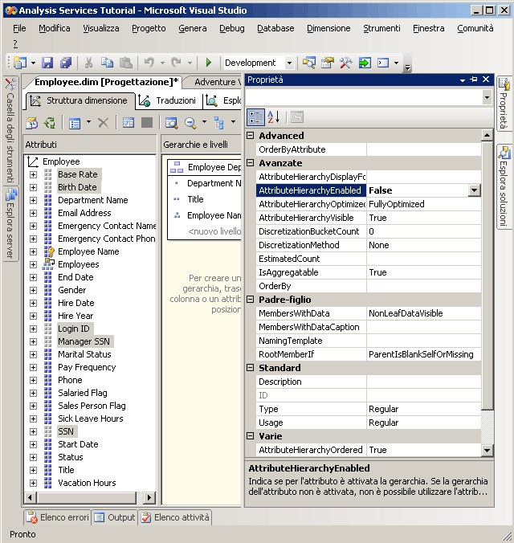
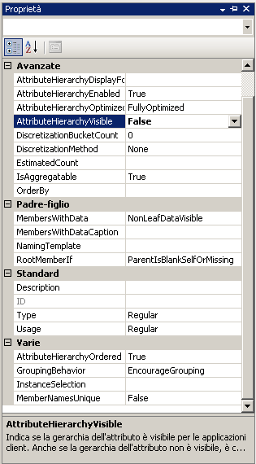

# Lezione 4-4-come nascondere e disabilitare le gerarchie di attributi
Per impostazione predefinita, una gerarchia dell'attributo viene creata per ogni attributo di una dimensione e ogni gerarchia è disponibile per il dimensionamento dei dati delle tabelle dei fatti. Questa gerarchia include un livello Totale e un livello di dettaglio contenente tutti i membri della gerarchia. Come illustrato in precedenza, è possibile organizzare gli attributi in gerarchie definite dall'utente per offrire percorsi di navigazione in un cubo. In alcuni casi è possibile disabilitare o nascondere determinati attributi o le rispettive gerarchie. Alcuni attributi, ad esempio i numeri della previdenza sociale o il codice fiscale, le retribuzioni, le date di nascita e le informazioni di accesso non sono attributi in base ai quali gli utenti dimensionano le informazioni sul cubo. Queste informazioni vengono invece generalmente visualizzate come dettagli di un particolare membro dell'attributo. È possibile nascondere queste gerarchie degli attributi lasciando gli attributi visibili come proprietà del membro di un attributo specifico. È inoltre possibile rendere visibili i membri di altri attributi, come ad esempio i nomi dei clienti o i codici postali, solo quando vengono visualizzati tramite una gerarchia utente anziché indipendentemente tramite una gerarchia dell'attributo. Ciò può essere determinato dal numero dei membri distinti nella gerarchia dell'attributo. Per migliorare le prestazioni di elaborazione, è infine consigliabile disabilitare le gerarchie degli attributi non utilizzate dagli utenti a fini di esplorazione.  
  
Il valore della proprietà **AttributeHierarchyEnabled** determina se viene creata una gerarchia dell'attributo. Se la proprietà è impostata su **False**, la gerarchia dell'attributo non viene creata e l'attributo non rappresenta un livello nella gerarchia utente; la gerarchia dell'attributo esiste solo come proprietà del membro. È tuttavia possibile utilizzare una gerarchia dell'attributo disabilitata per ordinare i membri di un altro attributo. Se il valore della proprietà **AttributeHierarchyEnabled** è impostato su **True**, il valore della proprietà **AttributeHierarchyVisible** determina se la gerarchia dell'attributo è visibile indipendentemente dall'uso in una gerarchia definita dall'utente.  
  
Quando viene abilitata una gerarchia dell'attributo, è possibile specificare i valori delle tre proprietà aggiuntive seguenti:  
  
-   **IsAggregatable**  
  
    Per impostazione predefinita, un livello (Totale) viene definito per tutte le gerarchie degli attributi. Per disabilitare questo livello per una gerarchia dell'attributo abilitata, impostare il valore della proprietà su **False**.  
  
    > [!NOTE]  
    > È possibile usare un attributo con la proprietà **IsAggregatable** impostata su False solo come radice di una gerarchia definita dall'utente ed è necessario che sia specificato un membro predefinito. In caso contrario, ne sceglierà uno automaticamente il motore [!INCLUDE[ssASnoversion](../includes/ssasnoversion-md.md)] .  
  
-   **AttributeHierarchyOrdered**  
  
    Per impostazione predefinita, [!INCLUDE[ssASnoversion](../includes/ssasnoversion-md.md)] consente di ordinare i membri delle gerarchie degli attributi attivati durante l'elaborazione; quindi i membri vengono archiviati in base al valore della proprietà **OrderBy** , ad esempio in base al nome o alla chiave. Se non si desidera eseguire l'ordinamento, è possibile migliorare le prestazioni di elaborazione impostando il valore di questa proprietà su **False**.  
  
-   **AttributeHierarchyOptimizedState**  
  
    Per impostazione predefinita, [!INCLUDE[ssASnoversion](../includes/ssasnoversion-md.md)] consente di creare un indice per ogni gerarchia dell'attributo abilitata durante l'elaborazione in modo da migliorare le prestazioni delle query. Se non si intende utilizzare una gerarchia dell'attributo per la visualizzazione, è possibile migliorare le prestazioni di elaborazione impostando il valore di questa proprietà su **NotOptimized**. Se viene tuttavia utilizzata una gerarchia nascosta come attributo chiave per la dimensione, la creazione di un indice dei membri dell'attributo consentirà un miglioramento delle prestazioni.  
  
Queste proprietà non si applicano se la gerarchia dell'attributo è disabilitata.  
  
Nelle attività di questo argomento verranno illustrate le procedure per disabilitare i numeri della previdenza sociale e gli altri attributi della dimensione Employee che non verranno utilizzati per la visualizzazione. Verranno quindi nascoste le gerarchie degli attributi relative al nome del cliente e al codice postale della dimensione Customer. Il numero elevato di membri dell'attributo di queste gerarchie determina un notevole rallentamento della visualizzazione indipendentemente dalla gerarchia utente.  
  
## Impostazione delle proprietà della gerarchia dell'attributo della dimensione Employee  
  
1.  Passare a Progettazione dimensioni per la dimensione Employee, quindi fare clic sulla scheda **Esplorazione** .  
  
2.  Verificare che le seguenti gerarchie degli attributi vengano visualizzate nell'elenco **Gerarchia** :  
  
    -   **Base Rate**  
  
    -   **Birth Date**  
  
    -   **ID accesso**  
  
    -   **Manager SSN**  
  
    -   **SSN**  
  
3.  Passare alla scheda **Struttura dimensione** , quindi selezionare gli attributi seguenti nel riquadro **Attributi** . Per selezionare più misure, fare clic su ognuna di esse tenendo premuto CTRL:  
  
    -   **Base Rate**  
  
    -   **Birth Date**  
  
    -   **ID accesso**  
  
    -   **Manager SSN**  
  
    -   **SSN**  
  
4.  Nella finestra Proprietà impostare il valore della proprietà **AttributeHierarchyEnabled** su **False** per gli attributi selezionati.  
  
    Si noti che nel riquadro **Attributi** l'icona relativa a ogni attributo è cambiata per indicare che l'attributo non è abilitato.  
  
    Nella figura seguente viene illustrata la proprietà **AttributeHierarchyEnabled** impostata su False per gli attributi selezionati.  
  
      
  
5.  Scegliere **Distribuisci Analysis Services Tutorial** dal menu **Compila**.  
  
6.  Al termine dell'elaborazione, passare alla scheda **Esplorazione** , fare clic su **Riconnetti**, quindi tentare di visualizzare le gerarchie degli attributi modificati.  
  
    Si noti che i membri degli attributi modificati non sono disponibili per la visualizzazione come gerarchie degli attributi nell'elenco **Gerarchia** . Se si tenta di aggiungere una delle gerarchie degli attributi disabilitate come livello di una gerarchia utente, verrà generato un errore che indica che per partecipare a una gerarchia definita dall'utente è necessario che la gerarchia dell'attributo sia abilitata.  
  
## Impostazione delle proprietà della gerarchia dell'attributo della dimensione Customer  
  
1.  Passare a Progettazione dimensioni per la dimensione Customer, quindi fare clic sulla scheda **Esplorazione** .  
  
2.  Verificare che le seguenti gerarchie degli attributi vengano visualizzate nell'elenco **Gerarchia** :  
  
    -   **Nome completo**  
  
    -   **Postal Code**  
  
3.  Passare alla scheda **Struttura dimensione** e quindi selezionare gli attributi nel riquadro **Attributi** utilizzando CTRL per selezionare più attributi contemporaneamente.  
  
    -   **Nome completo**  
  
    -   **Postal Code**  
  
4.  Nella finestra Proprietà impostare il valore della proprietà **AttributeHierarchyVisible** su **False** per gli attributi selezionati.  
  
    Poiché i membri di queste gerarchie degli attributi verranno utilizzati per dimensionare le tabelle dei fatti, l'ordinamento e l'ottimizzazione dei membri di queste gerarchie degli attributi determineranno un miglioramento delle prestazioni. È pertanto consigliabile non modificare le proprietà di questi attributi.  
  
    La figura seguente illustra la proprietà **AttributeHierarchyVisible** impostata su False.  
  
      
  
5.  Trascinare l'attributo **Postal Code** dal riquadro **Attributi** nella gerarchia utente **Customer Geography** all'interno del riquadro **Gerarchie e livelli** immediatamente sotto il livello **City** .  
  
    Si noti che è possibile che un attributo nascosto diventi un livello in una gerarchia utente.  
  
6.  Scegliere **Distribuisci Analysis Services Tutorial** dal menu **Compila**.  
  
7.  Al termine delle operazioni di distribuzione, passare alla scheda **Esplorazione** per la dimensione Customer e quindi fare clic su **Riconnetti**.  
  
8.  Provare a selezionare una delle gerarchie degli attributi modificati dall'elenco **Gerarchia** .  
  
    Si noti che nessuna delle gerarchie degli attributi modificati viene visualizzata nell'elenco **Gerarchia** .  
  
9. Nell'elenco **Gerarchia** selezionare **Customer Geography**e quindi visualizzare tutti i livelli nel riquadro del visualizzatore.  
  
    Si noti che i livelli nascosti, **Postal Code** e **Full Name**, sono visibili nella gerarchia definita dall'utente.  
  
## Attività successiva della lezione  
[Ordinamento dei membri dell'attributo in base a un attributo secondario](../analysis-services/lesson-4-5-sorting-attribute-members-based-on-a-secondary-attribute.md)  
  
  
  
