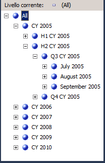
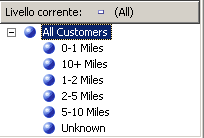
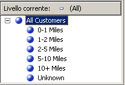

# Lezione 4-5 - ordinamento dei membri dell'attributo in base a un attributo secondario
[!INCLUDE[ssas-appliesto-sqlas](../includes/ssas-appliesto-sqlas.md)]
Nella lezione 3 è stato illustrato l'ordinamento dei membri dell'attributo in base al nome o al valore di chiave. È stato inoltre descritto come utilizzare una chiave composta del membro per influire sui membri dell'attributo e sul tipo di ordinamento. Per altre informazioni, vedere [Modifica della dimensione Date](../analysis-services/lesson-3-4-modifying-the-date-dimension.md). Tuttavia, se il nome o la chiave dell'attributo non forniscono il tipo di ordinamento desiderato, è possibile utilizzare un attributo secondario per ottenere i risultati richiesti. Definendo una relazione tra gli attributi, è possibile utilizzare il secondo attributo per ordinare i membri del primo attributo.  
  
Le relazioni tra attributi definiscono le relazioni o le dipendenze che intercorrono tra gli attributi. In una dimensione basata su una singola tabella relazionale tutti gli attributi sono in genere correlati tra loro mediante l'attributo chiave poiché tutti gli attributi relativi a una dimensione includono informazioni sui membri collegati mediante l'attributo chiave della dimensione ai fatti della tabella dei fatti per ogni gruppo di misure correlato. In una dimensione basata su più tabelle, gli attributi sono in genere collegati in base alla chiave di join tra le tabelle. Se supportato dai dati sottostanti, gli attributi correlati possono essere utilizzati per specificare un ordinamento. Ad esempio, è possibile creare un nuovo attributo tramite cui viene fornita la logica di ordinamento per un attributo correlato.  
  
Con Progettazione dimensioni è possibile definire relazioni aggiuntive tra gli attributi o modificare le relazioni predefinite per migliorare le prestazioni. Il vincolo principale quando si crea una relazione tra attributi consiste nel verificare che l'attributo a cui si fa riferimento non possieda più di un valore per ogni membro dell'attributo correlato. Una relazione tra due attributi può essere definita rigida o flessibile a seconda che le relazioni tra i membri possano modificarsi nel tempo. Ad esempio, un dipendente può cambiare area di vendita mentre una città non può cambiare stato. Se una relazione è definita come rigida, le aggregazioni di attributi non vengono ricalcolate a ogni elaborazione incrementale della dimensione. Se tuttavia la relazione tra i membri si modifica, è necessario elaborare completamente la dimensione. Per altre informazioni, vedere [Relazioni tra attributi](../analysis-services/multidimensional-models-olap-logical-dimension-objects/attribute-relationships.md), [Definire relazioni tra attributi](../analysis-services/multidimensional-models/attribute-relationships-define.md), [Configurare le proprietà della relazione tra attributi](../analysis-services/multidimensional-models/attribute-relationships-configure-attribute-properties.md), e [Impostazione delle relazioni tra gli attributi in una gerarchia definita dall'utente](../analysis-services/4-6-specifying-attribute-relationships-in-user-defined-hierarchy.md).  
  
Nelle attività incluse in questo argomento verrà definito un nuovo attributo nella dimensione **Date** in base a una colonna esistente della tabella delle dimensioni sottostante. Il nuovo attributo verrà utilizzato per ordinare i membri dei mesi del calendario cronologicamente anziché alfabeticamente. Verrà inoltre definito un nuovo attributo della dimensione **Customer** in base al calcolo denominato da usare per ordinare i membri dell'attributo **Commute Distance** . Nelle attività dell'argomento successivo verranno illustrate le procedure per utilizzare le relazioni tra gli attributi in modo da migliorare le prestazioni delle query.  
  
## Definizione di una relazione tra attributi e dell'ordinamento nella dimensione Date  
  
1.  Aprire Progettazione dimensioni per la dimensione **Date** , quindi controllare la proprietà **OrderBy** dell'attributo **Month Name** nella finestra Proprietà.  
  
    Si noti che i membri dell'attributo **Month Name** sono ordinati in base ai relativi valori di chiave.  
  
2.  Passare alla scheda **Esplorazione** , verificare che nell'elenco **Gerarchia** sia selezionato **Calendar Date** , quindi espandere i livelli della gerarchia definita dall'utente per controllare l'ordinamento dei mesi del calendario.  
  
    Si noti che i membri della gerarchia dell'attributo sono ordinati in base ai valori ASCII delle chiavi del membro, ovvero mese e anno. In questo caso, l'ordinamento in base al nome o alla chiave dell'attributo non consente di ordinare cronologicamente i mesi del calendario. Per risolvere questo problema, è necessario ordinare i membri della gerarchia dell'attributo in base a un nuovo attributo **MonthNumberOfYear** . L'attributo verrà creato in base a una colonna che opportunamente esiste nella tabella delle dimensioni **Date** .  
  
3.  Passare alla scheda **Struttura dimensione** per la dimensione Date, fare clic con il pulsante destro del mouse su **MonthNumberOfYear** nel riquadro **Vista origine dati** , quindi scegliere **Nuovo attributo da colonna**.  
  
4.  Nel riquadro **Attributi** , selezionare **Month Number Of Year**, quindi nella finestra Proprietà impostare le proprietà **AttributeHierarchyEnabled** su **False** , **AttributeHierarchyOptimizedState** su **NotOptimized**e **AttributeHierarchyOrdered** su **False**.  
  
    Con queste impostazioni l'attributo verrà nascosto agli utenti e sarà possibile migliorare i tempi di elaborazione. L'attributo non verrà utilizzato per l'esplorazione, ma solo per ordinare i membri di un altro attributo.  
  
    > [!NOTE]  
    > Se si ordinano alfabeticamente le proprietà nella relativa finestra, l'esecuzione di questa attività risulterà più semplice poiché le tre proprietà verranno disposte una accanto all'altra.  
  
5.  Fare clic sulla scheda **Relazioni tra attributi** .  
  
    Si noti che tutti gli attributi della dimensione **Date** sono direttamente correlati all'attributo **Date** , che rappresenta la chiave del membro che consente di correlare i membri della dimensione ai fatti in gruppi di misure correlati. Non c'è alcuna relazione definita tra gli attributi **Month Name** e **Month Number Of Year** .  
  
6.  Nel diagramma fare clic con il pulsante destro del mouse sull'attributo **Month Name** , quindi scegliere **Nuova relazione tra attributi**.  
  
7.  Nella finestra di dialogo **Crea relazione tra attributi** l'opzione **Attributo di origine** è impostata su **Month Name**. Impostare **Attributo correlato** su **Month Number Of Year**.  
  
8.  Nell'elenco **Tipo di relazione** impostare il tipo di relazione su **Rigida**.  
  
    Le relazioni tra i membri degli attributi **Month Name** e **Month Number Of Year** rimangono invariate nel tempo. Ne consegue che Analysis Services non eliminerà le aggregazioni relative alla relazione durante l'elaborazione incrementale. Se viene apportata una modifica, si verificherà un errore durante l'elaborazione incrementale e sarà necessario eseguire un'elaborazione completa della dimensione. A questo punto è possibile impostare il tipo di ordinamento per i membri di **Month Name**.  
  
9. [!INCLUDE[clickOK](../includes/clickok-md.md)]  
  
10. Fare clic sulla scheda **Struttura dimensione** .  
  
11. Selezionare **Month Name** nel riquadro **Attributi** , quindi nella finestra Proprietà impostare il valore della proprietà **OrderBy** su **AttributeKey** e il valore della proprietà **OrderByAttribute** su **Month Number Of Year**.  
  
12. Scegliere **Distribuisci Analysis Services Tutorial** dal menu **Compila**.  
  
13. Al termine delle operazioni di distribuzione, passare alla scheda **Esplorazione** per la dimensione Date, fare clic su **Riconnetti**, quindi visualizzare le gerarchie utente **Calendar Date** e **Fiscal Date** per verificare che i mesi vengano visualizzati in ordine cronologico.  
  
    Si noti che i mesi sono ora ordinati cronologicamente, come illustrato nella figura seguente.  
  
      
  
## Definizione delle relazioni tra gli attributi e il tipo di ordinamento nella dimensione Customer  
  
1.  Passare alla scheda **Esplorazione** in Progettazione dimensioni per la dimensione Customer, quindi sfogliare i membri della gerarchia dell'attributo **Commute Distance** .  
  
    Si noti che i membri di questa gerarchia dell'attributo sono ordinati in base ai valori ASCII della chiave del membro. In questo caso, l'ordinamento in base al nome o alla chiave dell'attribuito non consente di ordinare le distanze percorse in ordine crescente. In questa attività i membri della gerarchia dell'attributo verranno ordinati in base al calcolo denominato **CommuteDistanceSort** che attribuisce il numero di ordine appropriato a ogni valore distinto della colonna. Per risparmiare tempo, questo calcolo denominato è già stato aggiunto alla tabella **Customer** nella vista origine dati di [!INCLUDE[ssSampleDBCoShort](../includes/sssampledbcoshort-md.md)] DW. È possibile passare a questa vista origine dati per visualizzare lo script SQL utilizzato in questo calcolo denominato. Per altre informazioni, vedere [Definire calcoli denominati in una vista origine dati &#40;Analysis Services&#41;](../analysis-services/multidimensional-models/define-named-calculations-in-a-data-source-view-analysis-services.md).  
  
    Nell'immagine seguente vengono illustrati i membri della gerarchia dell'attributo **Commute Distance** ordinati in base ai valori ASCII della chiave del membro.  
  
      
  
2.  Passare alla scheda **Struttura dimensione** in Progettazione dimensioni per la dimensione Customer, fare clic con il pulsante destro del mouse su **CommuteDistanceSort** nella tabella **Customer** del riquadro **Vista origine dati** e scegliere **Nuovo attributo da colonna**.  
  
3.  Nel riquadro **Attributi** , selezionare **Commute Distance Sort**, quindi nella finestra Proprietà impostare la proprietà **AttributeHierarchyEnabled** per questo attributo su **False** , la proprietà **AttributeHierarchyOptimizedState** su **NotOptimized**e la proprietà **AttributeHierarchyOrdered** su **False**.  
  
    Con queste impostazioni l'attributo verrà nascosto agli utenti e sarà possibile migliorare i tempi di elaborazione. L'attributo non verrà utilizzato per l'esplorazione, ma solo per ordinare i membri di un altro attributo.  
  
4.  Selezionare **Geography**, quindi nella finestra Proprietà impostare le proprietà **AttributeHierarchyVisible** su **False** , **AttributeHierarchyOptimizedState** su **NotOptimized**e **AttributeHierarchyOrdered** su **False**.  
  
    Con queste impostazioni l'attributo verrà nascosto agli utenti e sarà possibile migliorare i tempi di elaborazione. L'attributo non verrà utilizzato per l'esplorazione, ma solo per ordinare i membri di un altro attributo. Poiché **Geography** dispone di proprietà membro, la proprietà **AttributeHierarchyEnabled** deve essere impostata su **True**. Pertanto, per nascondere l'attributo, impostare la proprietà **AttributeHierarchyVisible** su **False**.  
  
5.  Fare clic sulla scheda **Relazioni tra attributi** .  
  
6.  Nell'elenco di attributi fare clic con il pulsante destro del mouse sull'attributo **Commute Distance** , quindi scegliere **Nuova relazione tra attributi**.  
  
7.  Nella finestra di dialogo **Crea relazione tra attributi** l'opzione **Attributo di origine** è impostata su **Commute Distance**. Impostare **Attributo correlato** su **Commute Distance Sort**.  
  
8.  Nell'elenco **Tipo di relazione** impostare il tipo di relazione su **Rigida**.  
  
    La relazione tra i membri degli attributi **Commute Distance** e **Commute Distance Sort** rimane invariata nel tempo.  
  
9. [!INCLUDE[clickOK](../includes/clickok-md.md)]  
  
    A questo punto è possibile impostare il tipo di ordinamento per l'attributo **Commute Distance** .  
  
10. Fare clic sulla scheda **Struttura dimensione** .  
  
11. Nel riquadro **Attributi** selezionare **Commute Distance**, quindi nella finestra Proprietà impostare il valore delle proprietà **OrderBy** su **AttributeKey**e **OrderByAttribute** su **Commute Distance Sort**.  
  
12. Scegliere **Distribuisci Analysis Services Tutorial** dal menu **Compila**.  
  
13. Al termine delle operazioni di distribuzione, passare alla scheda **Esplorazione** di Progettazione dimensioni per la dimensione Customer, fare clic su **Riconnetti**, quindi visualizzare la gerarchia dell'attributo **Commute Distance** .  
  
    Si noti che i membri della gerarchia dell'attributo sono ora ordinati in base a un criterio logico per distanza crescente come illustrato nella figura seguente.  
  
      
  
## Attività successiva della lezione  
[Impostazione delle relazioni tra gli attributi in una gerarchia definita dall'utente](../analysis-services/4-6-specifying-attribute-relationships-in-user-defined-hierarchy.md)  
  
  
  
