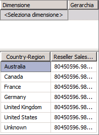
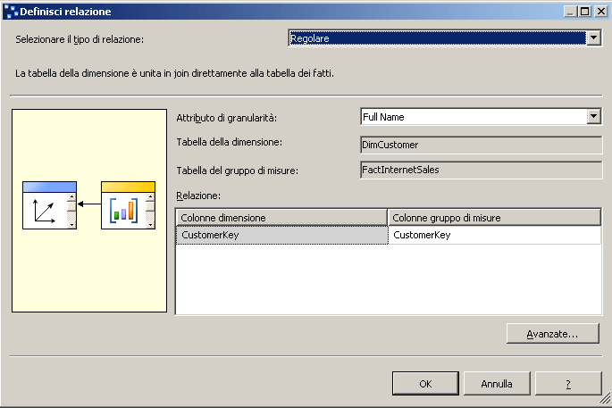
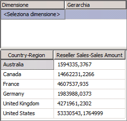

# Lezione 5-1-definizione di una relazione di riferimento
Fino a questo punto dell'esercitazione, ogni dimensione del cubo definita è stata basata su una tabella direttamente collegata alla tabella dei fatti per un gruppo di misure tramite una relazione chiave primaria–chiave esterna. Nelle attività di questo argomento la dimensione **Geography** verrà collegata alla tabella dei fatti relativa alle vendite dei rivenditori tramite la dimensione **Reseller** , denominata *dimensione di riferimento*. Ciò consente agli utenti di dimensionare le vendite dei rivenditori in base all'area geografica. Per altre informazioni, vedere [Definire una relazione di tipo Riferimento e le relative proprietà](../analysis-services/multidimensional-models/define-a-referenced-relationship-and-referenced-relationship-properties.md).  
  
## Dimensionamento di Reseller Sales in base a Geography  
  
1.  In Esplora soluzioni fare clic con il pulsante destro del mouse su **Analysis Services Tutorial** nella cartella **Cubi** e quindi scegliere **Sfoglia**.  
  
2.  Rimuovere tutte le gerarchie dal riquadro Dati, quindi verificare se la misura **Reseller Sales-Sales Amount** viene visualizzata nell'area dati del riquadro Dati. Aggiungerla al riquadro Dati se non già disponibile.  
  
3.  Dalla dimensione **Geography** nel riquadro Metadati trascinare la gerarchia definita dall'utente **Geographies** nell'area **Rilasciare qui i campi riga** del riquadro Dati.  
  
    Si noti che la misura **Reseller Sales-Sales Amount** non viene dimensionata correttamente dai membri dell'attributo **Country-Region** della gerarchia **Regions** . Il valore per **Reseller Sales-Sales Amount** viene ripetuto per ogni membro dell'attributo **Country-Region** .  
  
      
  
4.  Aprire Progettazione vista origine dati per la vista origine dati **Adventure Works DW 2012** .  
  
5.  Nel riquadro **Libreria diagrammi** visualizzare la relazione tra la tabella **Geography** e la tabella **ResellerSales** .  
  
    Si noti che non esiste un collegamento diretto tra queste tabelle. Esiste tuttavia un collegamento indiretto tra tali tabelle tramite la tabella **Reseller** o la tabella **SalesTerritory** .  
  
6.  Fare doppio clic sulla freccia che rappresenta la relazione tra la tabella **Geography** e la tabella **Reseller** .  
  
    Nella finestra di dialogo **Modifica relazione** si noti che la colonna **GeographyKey** è la chiave primaria della tabella **Geography** e la chiave esterna della tabella **Reseller** .  
  
7.  Fare clic su **Annulla**, passare a Progettazione cubi per il cubo [!INCLUDE[ssASnoversion](../includes/ssasnoversion-md.md)] Tutorial e quindi fare clic sulla scheda **Utilizzo dimensioni** .  
  
    Si noti che la dimensione **Geography** del cubo non ha attualmente alcuna relazione né con il gruppo di misure **Internet Sales** né con il gruppo di misure **Reseller Sales** .  
  
8.  Fare clic sul pulsante con i puntini di sospensione (**…**) nella cella **Nome completo** nel punto di intersezione tra la dimensione **Customer** e il gruppo di misure **Internet Sales** .  
  
    Nella finestra di dialogo **Definisci relazione** si noti che viene definita una relazione di tipo **Regolare** tra la tabella delle dimensioni **DimCustomer** e la tabella del gruppo di misure **FactInternetSales** in base alla colonna **CustomerKey** di ognuna di queste tabelle. Tutte le relazioni che sono state definite fino a questo momento nell'esercitazione sono di tipo Regolare.  
  
    Nella figura seguente viene illustrata la finestra di dialogo **Define Relationship** con una relazione di tipo Regolare tra la tabella delle dimensioni **DimCustomer** e la tabella del gruppo di misure **FactInternetSales** .  
  
      
  
9. Fare clic su **Annulla**.  
  
10. Fare clic sul pulsante con i puntini di sospensione (**…**) nella cella senza nome nel punto di intersezione tra la dimensione **Geography** e il gruppo di misure **Reseller Sales** .  
  
    Nella finestra di dialogo **Definisci relazione** si noti che non è attualmente definita alcuna relazione tra la dimensione Geography del cubo e il gruppo di misure Reseller Sales. Non è possibile definire una relazione di tipo Regolare poiché non vi è una relazione diretta tra la tabella delle dimensioni per la dimensione Geography e la tabella dei fatti per il gruppo di misure Reseller Sales.  
  
11. Nell'elenco **Selezionare il tipo di relazione** selezionare **Riferimento**.  
  
    Una relazione di tipo Riferimento viene definita specificando una dimensione direttamente connessa alla tabella del gruppo di misure, denominata *dimensione intermedia*, che [!INCLUDE[ssASnoversion](../includes/ssasnoversion-md.md)] può usare per collegare la dimensione di riferimento alla tabella dei fatti. È quindi possibile specificare l'attributo che collega la dimensione di riferimento alla dimensione intermedia.  
  
12. Nell'elenco **Dimensione intermedia** selezionare **Reseller**.  
  
    La tabella sottostante della dimensione Geography è collegata alla tabella dei fatti tramite la tabella sottostante della dimensione Reseller.  
  
13. Nell'elenco **Attributo della dimensione di riferimento** selezionare **Geography Key**e quindi provare a selezionare **Geography Key** nell'elenco **Attributo della dimensione intermedia** .  
  
    Si noti che **Geography Key** non compare nell'elenco **Attributo della dimensione intermedia** . Ciò si verifica perché la colonna **GeographyKey** non è definita come attributo nella dimensione **Reseller** .  
  
14. Fare clic su **Annulla**.  
  
Il problema verrà risolto nell'attività successiva, definendo un attributo basato sulla colonna GeographyKey della dimensione Reseller.  
  
## Definizione dell'attributo della dimensione intermedia e della relazione della dimensione di riferimento  
  
1.  Aprire Progettazione dimensioni per la dimensione **Reseller** , quindi visualizzare le colonne della tabella **Reseller** nel riquadro **Vista origine dati** e gli attributi definiti nella dimensione **Reseller** nel riquadro **Attributi** .  
  
    Si noti che, sebbene GeographyKey sia definita come una colonna nella tabella Reseller, nella dimensione Reseller non viene definito alcun attributo della dimensione basato su questa colonna. Geography viene definito come un attributo della dimensione nella dimensione Geography poiché rappresenta la colonna chiave che collega la tabella sottostante per tale dimensione con la tabella dei fatti.  
  
2.  Per aggiungere un attributo **Geography Key** alla dimensione **Reseller** , fare clic con il pulsante destro del mouse su **GeographyKey** nel riquadro **Vista origine dati** , quindi scegliere **Nuovo attributo da colonna**.  
  
3.  Nel riquadro **Attributi** selezionare **Geography Key**, quindi nella finestra Proprietà impostare le proprietà **AttributeHierarchyOptimizedState** su **NotOptimized**, **AttributeHierarchyOrdered** su **False**e **AttributeHierarchyVisible** su **False.**  
  
    L'attributo Geography Key nella dimensione Reseller verrà utilizzato soltanto per collegare la dimensione Geography alla tabella dei fatti Reseller Sales. Dal momento che non verrà utilizzato per la visualizzazione, non c'è motivo per definire questa gerarchia dell'attributo come visibile. Ordinare e ottimizzare la gerarchia dell'attributo può soltanto produrre effetti negativi sulle prestazioni di elaborazione. È necessario, tuttavia, che l'attributo sia abilitato per essere utilizzato come collegamento tra le due dimensioni.  
  
4.  Passare a Progettazione cubi per il cubo [!INCLUDE[ssASnoversion](../includes/ssasnoversion-md.md)] Tutorial, fare clic sulla scheda **Utilizzo dimensioni** e quindi fare clic sul pulsante con i puntini di sospensione (**…**) nel punto di intersezione tra il gruppo di misure **Reseller Sales** e la dimensione **Geography** del cubo.  
  
5.  Nell'elenco **Selezionare il tipo di relazione** selezionare **Riferimento**.  
  
6.  Nell'elenco **Dimensione intermedia** selezionare **Reseller**.  
  
7.  Nell'elenco **Attributo della dimensione di riferimento** selezionare **Geography Key**, quindi selezionare **Geography Key** nell'elenco **Attributo della dimensione intermedia** .  
  
    Si noti che la casella di controllo **Materializza** è selezionata. Si tratta dell'impostazione predefinita per le dimensioni MOLAP. La materializzazione del collegamento dell'attributo della dimensione determina la materializzazione o l'archiviazione del valore del collegamento tra la tabella dei fatti e la dimensione di riferimento per ogni riga nella struttura MOLAP della dimensione durante l'elaborazione. Ciò influisce in modo poco significativo sulle prestazioni di elaborazione e sui requisiti di archiviazione ma determina un miglioramento delle prestazioni di esecuzione delle query.  
  
8.  Scegliere **OK**.  
  
    Si noti che la dimensione **Geography** del cubo è ora collegata al gruppo di misure **Reseller Sales** . L'icona indica che la relazione è una relazione della dimensione di riferimento.  
  
9. Nell'elenco **Dimensioni** della scheda **Utilizzo dimensioni** fare clic con il pulsante destro del mouse su **Geography**e quindi scegliere **Rinomina**.  
  
10. Impostare il nome di questa dimensione del cubo su **Reseller Geography**.  
  
    Dal momento che la dimensione del cubo è ora collegata al gruppo di misure **Reseller Sales** , per gli utenti sarà vantaggioso definirne esplicitamente l'uso nel cubo evitando possibili confusioni.  
  
## Dimensionamento di Reseller Sales in base a Geography  
  
1.  Scegliere **Distribuisci Analysis Services Tutorial** dal menu **Compila**.  
  
2.  Una volta completata la distribuzione, selezionare la scheda **Esplorazione** in Progettazione cubi per il cubo [!INCLUDE[ssASnoversion](../includes/ssasnoversion-md.md)] Tutorial e fare clic sul pulsante **Riconnetti** .  
  
3.  Nel riquadro Metadati espandere **Reseller Geography**, fare clic con il pulsante destro del mouse su **Geographies**e quindi scegliere **Aggiungi all'area riga**.  
  
    Si noti che la misura **Reseller Sales-Sales Amount** è ora dimensionata correttamente dall'attributo **Country-Region** della gerarchia definita dall'utente **Geographies** , come illustrato nella figura seguente.  
  
      
  
## Attività successiva della lezione  
[Definizione di una relazione di tipo Fatti](../analysis-services/lesson-5-2-defining-a-fact-relationship.md)  
  
## Vedere anche  
[Relazioni tra attributi](../analysis-services/multidimensional-models-olap-logical-dimension-objects/attribute-relationships.md)  
[Definire una relazione di tipo Riferimento e le relative proprietà](../analysis-services/multidimensional-models/define-a-referenced-relationship-and-referenced-relationship-properties.md)  
  
  
  
