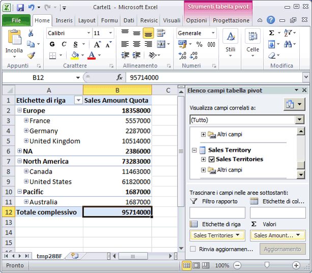
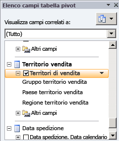
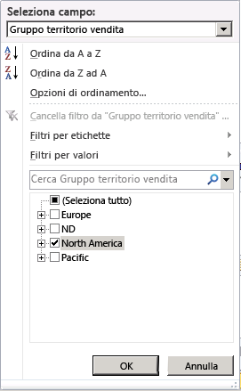
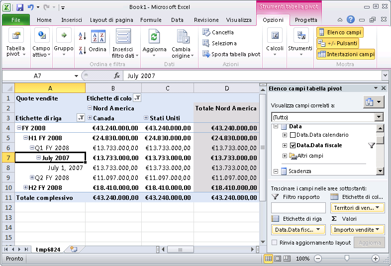
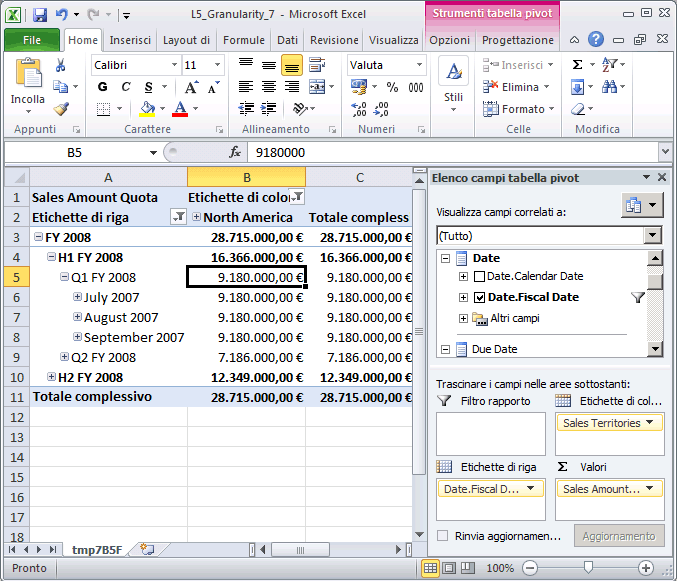

# Lezione 5-4-definizione granularità della dimensione all'interno di un gruppo di misure
[!INCLUDE[ssas-appliesto-sqlas](../includes/ssas-appliesto-sqlas.md)]Gli utenti desiderano dati della dimensione dei fatti a vari livelli di granularità o specificità per scopi diversi. È ad esempio possibile registrare per ogni giorno i dati relativi alle vendite per rivenditore o le vendite effettuate tramite Internet, mentre le informazioni sulle quote di vendita esistono solo per il mese o il trimestre. In questi casi è possibile che la dimensione temporale abbia un livello di dettaglio diverso per ognuna di queste diverse tabelle dei fatti. Sebbene sia possibile definire una nuova dimensione del database come dimensione temporale con tale diverso livello di dettaglio, in [!INCLUDE[ssASnoversion](../includes/ssasnoversion-md.md)]è disponibile un modo più semplice.  
  
Per impostazione predefinita in [!INCLUDE[ssASnoversion](../includes/ssasnoversion-md.md)], quando si utilizza una dimensione in un gruppo di misure, il livello di dettaglio dei dati della dimensione è basato sull'attributo chiave della dimensione stessa. Ad esempio, quando una dimensione temporale è inclusa in un gruppo di misure e il livello di dettaglio predefinito della dimensione temporale è giornaliero, il livello di dettaglio predefinito della dimensione nel gruppo di misure è anch'esso giornaliero. In molti casi ciò risulta appropriato, ad esempio per i gruppi di misure **Internet Sales** e **Reseller Sales** di questa esercitazione. Quando tuttavia una dimensione di questo tipo è inclusa in altri tipi di gruppi di misure, quali gruppi di misure relative a budget o quote di vendita, risulta generalmente più appropriato un livello di dettaglio mensile o trimestrale.  
  
Per specificare un livello di dettaglio per la dimensione del cubo diverso da quello predefinito, si modifica l'attributo di granularità per la dimensione del cubo usato in un particolare gruppo di misure nella scheda **Utilizzo dimensioni** di Progettazione cubi. Quando il livello di dettaglio di una dimensione in un gruppo di misure specifico viene modificato in un attributo diverso dall'attributo chiave della dimensione, è necessario garantire che tutti gli altri attributi del gruppo di misure siano direttamente o indirettamente correlati al nuovo attributo di granularità. A tale scopo, specificare le relazioni tra tutti gli altri attributi e l'attributo specificato come l'attributo di granularità del gruppo di misure. In questo caso si definiscono ulteriori relazioni tra attributi anziché spostare quelle esistenti. L'attributo specificato come attributo di granularità diventa l'attributo chiave all'interno del gruppo di misure per gli attributi rimanenti nella dimensione. Se le relazioni tra gli attributi non vengono specificate in modo appropriato, [!INCLUDE[ssASnoversion](../includes/ssasnoversion-md.md)] non sarà in grado di aggregare correttamente i valori, come mostrato nelle attività di questo argomento.  
  
Per altre informazioni, vedere [Relazioni tra dimensioni](../analysis-services/multidimensional-models-olap-logical-cube-objects/dimension-relationships.md), [Definire una relazione di tipo Regolare e le relative proprietà](../analysis-services/multidimensional-models/define-a-regular-relationship-and-regular-relationship-properties.md).  
  
Nelle attività di questo argomento verrà aggiunto un gruppo di misure Sales Quotas e la granularità della dimensione Date in questo gruppo di misure verrà definita a livello mensile. Verranno quindi definite le relazioni tra l'attributo mese e gli altri attributi della dimensione per garantire che in [!INCLUDE[ssASnoversion](../includes/ssasnoversion-md.md)] venga eseguita correttamente l'aggregazione dei valori.  
  
## Aggiunta di tabelle e definizione del gruppo di misure Sales Quotas  
  
1.  Passare alla vista origine dati **Adventure Works DW 2012** .  
  
2.  Fare clic con il pulsante destro del mouse in qualsiasi punto del riquadro **Libreria diagrammi** , scegliere **Nuovo diagramma**, quindi assegnare al diagramma il nome **Sales Quotas**.  
  
3.  Trascinare le tabelle **Employee**, **Sales Territory**e **Date** dal riquadro **Tabelle** al riquadro **Diagramma** .  
  
4.  Aggiungere la tabella **FactSalesQuota** al riquadro **Diagramma** facendo clic con il pulsante destro del mouse su un punto qualsiasi del riquadro **Diagramma** e selezionando **Aggiungi/Rimuovi tabelle**.  
  
    Si noti che la tabella **SalesTerritory** è collegata alla tabella **FactSalesQuota** tramite la tabella **Employee** .  
  
5.  Esaminare le colonne nella tabella **FactSalesQuota** e quindi esplorarne i dati.  
  
    Si noti che il livello di dettaglio dei dati contenuti nella tabella è il trimestre di calendario, che rappresenta il livello di dettaglio più basso nella tabella FactSalesQuota.  
  
6.  In Progettazione vista origine dati modificare la proprietà **FriendlyName** della tabella **FactSalesQuota** in **SalesQuotas**.  
  
7.  Passare al cubo [!INCLUDE[ssASnoversion](../includes/ssasnoversion-md.md)] Tutorial e fare clic sulla scheda **Struttura cubo** .  
  
8.  Fare clic con il pulsante destro del mouse in qualsiasi punto del riquadro **Misure** , fare clic su **Nuovo gruppo di misure**, fare clic su **SalesQuotas** nella finestra di dialogo **Nuovo gruppo di misure** e quindi fare clic su **OK**.  
  
    Il gruppo di misure **Sales Quotas** verrà visualizzato nel riquadro **Misure** . Si noti che nel riquadro **Dimensioni** è definita una nuova dimensione **Date** del cubo basata sulla dimensione **Date** del database. Viene definita una nuova dimensione temporale del cubo poiché [!INCLUDE[ssASnoversion](../includes/ssasnoversion-md.md)] non è in grado di stabilire quale delle dimensioni temporali esistenti del cubo correlare alla colonna **DateKey** nella tabella dei fatti **FactSalesQuota** sottostante al gruppo di misure Sales Quotas. Questa modifica verrà eseguita più avanti in un'altra attività di questo argomento.  
  
9. Espandere il gruppo di misure **Sales Quotas** .  
  
10. Nel riquadro **Misure** selezionare **Sales Amount Quota**e quindi impostare il valore della proprietà **FormatString** su **Currency** nella finestra Proprietà.  
  
11. Selezionare la misura **Sales Quotas Count** , quindi digitare **#,#** come valore della proprietà **FormatString** nella finestra Proprietà.  
  
12. Eliminare la misura **Calendar Quarter** dal gruppo di misure **Sales Quotas** .  
  
    [!INCLUDE[ssASnoversion](../includes/ssasnoversion-md.md)] ha rilevato che la colonna sottostante la misura Calendar Quarter è una colonna contenente misure. Questa colonna e la colonna CalendarYear, tuttavia, contengono i valori che saranno utilizzati più avanti in questo argomento per collegare il gruppo di misure Sales Quotas alla dimensione Date.  
  
13. Nel riquadro **Misure** fare clic con il pulsante destro del mouse sul gruppo di misure **Sales Quotas** e quindi scegliere **Nuova misura**.  
  
    Verrà visualizzata la finestra di dialogo **Nuova misura** , contenente le colonne di origine disponibili per una misura con tipo di uso **Somma**.  
  
14. Nella finestra di dialogo **Nuova misura** selezionare **Distinct count** nell'elenco **Utilizzo** , verificare che **SalesQuotas** sia selezionato nell'elenco **Tabella di origine** , selezionare **EmployeeKey** nell'elenco **Colonna di origine** e quindi fare clic su **OK**.  
  
    Si noti che la misura viene creata in un nuovo gruppo di misure denominato **Sales Quotas 1**. Le misure Distinct Count in [!INCLUDE[ssNoVersion](../includes/ssnoversion-md.md)] vengono create nei gruppi di misure per ottimizzare le prestazioni di elaborazione.  
  
15. Cambiare il valore della proprietà **Name** per la misura **Employee Key Distinct Count** in **Sales Person Count**, quindi digitare **#,#** come valore della proprietà **FormatString** .  
  
## Visualizzazione delle misure nel gruppo di misure Sales Quota in base al valore della data  
  
1.  Scegliere **Distribuisci Analysis Services Tutorial** dal menu **Compila**.  
  
2.  Dopo aver completato la distribuzione, selezionare la scheda **Esplorazione** in Progettazione cubi per il cubo [!INCLUDE[ssASnoversion](../includes/ssasnoversion-md.md)] Tutorial e quindi fare clic sul pulsante **Riconnetti**.  
  
3.  Fare clic sul collegamento Excel e quindi fare clic su **Abilita**.  
  
4.  Nell'elenco di campi della tabella pivot espandere il gruppo di misure **Sales Quotas** e quindi trascinare la misura **Sales Amount Quota** nell'area Valori.  
  
5.  Espandere la dimensione **Sales Territory** , quindi trascinare la gerarchia definita dall'utente **Sales Territories** in Etichette di riga.  
  
    Si noti che la dimensione del cubo Sales Territory non è correlata, direttamente o indirettamente, alla tabella Fact Sales Quota come illustrato nella figura seguente.  
  
      
  
    Nella serie passaggi successiva di questo argomento verrà definita una relazione della dimensione di riferimento tra la dimensione e la tabella dei fatti.  
  
6.  Spostare la gerarchia utente **Sales Territories** dall'area Etichette di riga all'area Etichette di colonna.  
  
7.  Nell'elenco di campi della tabella pivot selezionare la gerarchia definita dall'utente **Sales Territories** e quindi fare clic sulla freccia giù visualizzata a destra.  
  
      
  
8.  Nel filtro fare clic sulla casella di controllo Seleziona tutto per annullare tutte le selezioni, quindi scegliere solo **North America**.  
  
      
  
9. Nell'elenco di campi della tabella pivot espandere **Date**.  
  
10. Trascinare la gerarchia utente **Date.Fiscal Date** in Etichette di riga.  
  
11. Nella tabella pivot fare clic sulla freccia in giù accanto a Etichette di riga. Deselezionare tutti gli anni ad eccezione di **FY 2008**.  
  
    Si noti che viene visualizzato solo il membro **July 2007** del livello **Month** invece dei membri **July, 2007**, **August, 2007**e **September, 2007** di tale livello **Month** e che viene visualizzato solo il membro **July 1, 2007** del livello **Date** anziché tutti e 31 i giorni. Ciò si verifica perché il livello di dettaglio dei dati nella tabella dei fatti è impostato sul livello trimestrale e quello della dimensione **Date** sul livello giornaliero. Questa impostazione verrà modificata nell'attività successiva di questo argomento.  
  
    Si noti anche che il valore **Sales Amount Quota** per i livelli mese e giorno è lo stesso valore presente per il livello trimestre ovvero $13,733,000.00. Il livello dei dati più basso nel gruppo di misure Sales Quotas è infatti impostato sul livello trimestrale. Questa impostazione verrà modificata nella Lezione 6.  
  
    Nell'immagine seguente vengono illustrati i valori per **Sales Amount Quota**.  
  
      
  
## Definizione delle proprietà di utilizzo delle dimensioni per il gruppo di misure Sales Quotas  
  
1.  Aprire Progettazione dimensioni per la dimensione **Employee** , fare clic con il pulsante destro del mouse su **SalesTerritoryKey** nel riquadro **Vista origine dati** , quindi scegliere **Nuovo attributo da colonna**.  
  
2.  Nel riquadro **Attributi** selezionare **SalesTerritoryKey**, quindi nella finestra Proprietà impostare le proprietà **AttributeHierarchyVisible** su **False** , **AttributeHierarchyOptimizedState** su **NotOptimized**e **AttributeHierarchyOrdered** su **False**.  
  
    L'attributo è necessario per collegare la dimensione **Sales Territory** ai gruppi di misure **Sales Quotas** e **Sales Quotas 1** come una dimensione di riferimento.  
  
3.  In Progettazione cubi per il cubo [!INCLUDE[ssASnoversion](../includes/ssasnoversion-md.md)] Tutorial fare clic sulla scheda **Utilizzo dimensioni** e quindi esaminare l'uso delle dimensioni nei gruppi di misure **Sales Quotas** e **Sales Quotas 1** .  
  
    Le dimensioni del cubo **Employee** e **Date** sono collegate ai gruppi di misure **Sales Quotas e Sales Quotas 1** tramite relazioni regolari. Si noti anche che la dimensione del cubo **Sales Territory** non è collegata a nessuno di questi gruppi di misure.  
  
4.  Fare clic sulla cella nel punto di intersezione tra la dimensione **Sales Territory** e il gruppo di misure **Sales Quotas** e quindi fare clic sul pulsante Sfoglia (**…**). Verrà visualizzata la finestra di dialogo **Definisci relazione** .  
  
5.  Nell'elenco **Selezionare il tipo di relazione** selezionare **Riferimento**.  
  
6.  Nell'elenco **Dimensione intermedia** selezionare **Employee**.  
  
7.  Nell'elenco **Attributo della dimensione di riferimento** selezionare **Sales Territory Region.**  
  
8.  Nell'elenco **Attributo della dimensione intermedia** selezionare **Sales Territory Key**. (la colonna chiave dell'attributo Sales Territory Region è la colonna SalesTerritoryKey).  
  
9. Verificare che la casella di controllo **Materializza** sia selezionata.  
  
10. Scegliere **OK**.  
  
11. Fare clic sulla cella nel punto di intersezione tra la dimensione **Sales Territory** e il gruppo di misure **Sales Quotas 1** e quindi fare clic sul pulsante Sfoglia (**…**). Verrà visualizzata la finestra di dialogo **Definisci relazione** .  
  
12. Nell'elenco **Selezionare il tipo di relazione** selezionare **Riferimento**.  
  
13. Nell'elenco **Dimensione intermedia** selezionare **Employee**.  
  
14. Nell'elenco **Attributo della dimensione di riferimento** selezionare **Sales Territory Region.**  
  
15. Nell'elenco **Attributo della dimensione intermedia** selezionare **Sales Territory Key**. (la colonna chiave dell'attributo Sales Territory Region è la colonna SalesTerritoryKey).  
  
16. Verificare che la casella di controllo **Materializza** sia selezionata.  
  
17. Scegliere **OK**.  
  
18. Eliminare la dimensione **Date** del cubo.  
  
    Invece di avere quattro dimensioni temporali del cubo, si userà la dimensione **Order Date** del cubo nel gruppo di misure **Sales Quotas** come data rispetto alla quale verranno dimensionate le quote di vendita. Questa dimensione del cubo verrà inoltre utilizzata come dimensione di data primaria del cubo.  
  
19. Nell'elenco **Dimensioni** rinominare la dimensione **Order Date** del cubo come **Date**.  
  
    Rinominando la dimensione **Order Date** del cubo come **Date** se ne evidenzia meglio agli utenti il ruolo di dimensione primaria di data del cubo.  
  
20. Fare clic sul pulsante Sfoglia (**…**) nella cella nel punto di intersezione tra il gruppo di misure **Sales Quotas** e la dimensione **Date** .  
  
21. Nella finestra di dialogo **Definisci relazione** selezionare **Regolare** nell'elenco **Selezionare il tipo di relazione** .  
  
22. Nell'elenco **Attributo di granularità** selezionare **Calendar Quarter**.  
  
    Verrà visualizzato un avviso per notificare che, avendo selezionato un attributo non chiave come attributo di granularità, è necessario assicurarsi che tutti gli altri attributi siano direttamente o indirettamente correlati all'attributo di granularità specificandoli come proprietà del membro.  
  
23. Nell'area **Relazione** della finestra di dialogo **Definisci relazione** collegare le colonne delle dimensioni **CalendarYear** e **CalendarQuarter** della tabella sottostante la dimensione Date del cubo alle colonne **CalendarYear** e **CalendarQuarter** della tabella sottostante il gruppo di misure Sales Quota e quindi fare clic su **OK**.  
  
    > [!NOTE]  
    > Calendar Quarter è definito come attributo di granularità per la dimensione Date del cubo nel gruppo di misure Sales Quotas mentre l'attributo Date continua ad essere l'attributo di granularità per i gruppi di misure Internet Sales e Reseller Sales.  
  
24. Ripetere i quattro passaggi precedenti per il gruppo di misure **Sales Quotas 1** .  
  
## Definizione delle relazioni tra attributi tra l'attributo Calendar Quarter e gli altri attributi della dimensione nella dimensione Date  
  
1.  Passare a **Progettazione dimensioni** per la dimensione **Date** e quindi fare clic sulla scheda **Relazioni tra attributi** .  
  
    Si noti che sebbene **Calendar Year** sia collegato a **Calendar Quarter** tramite l'attributo **Calendar Semester** , gli attributi relativi al calendario fiscale sono collegati soltanto l'uno all'altro; non sono collegati all'attributo **Calendar Quarter** e quindi non verranno aggregati correttamente nel gruppo di misure **Sales Quotas** .  
  
2.  Nel diagramma fare clic con il pulsante destro del mouse sull'attributo **Calendar Quarter** , quindi scegliere **Nuova relazione tra attributi**.  
  
3.  Nella finestra di dialogo **Crea relazione tra attributi** l'opzione **Attributo di origine** è impostata su **Calendar Quarter**. Impostare **Attributo correlato** su **Fiscal Quarter**.  
  
4.  Scegliere **OK**.  
  
    Si noti che verrà visualizzato un messaggio per indicare che la dimensione **Date** contiene una o più relazioni tra attributi ridondanti, le quali potrebbero impedire l'aggregazione dei dati se un attributo non chiave viene usato come attributo di granularità.  
  
5.  Eliminare la relazione tra l'attributo **Month Name** e l'attributo **Fiscal Quarter** .  
  
6.  Scegliere **Salva tutti** dal menu **File**.  
  
## Visualizzazione delle misure nel gruppo di misure Sales Quota in base al valore della data  
  
1.  Scegliere **Distribuisci Analysis Services Tutorial** dal menu **Compila**.  
  
2.  Al termine delle operazioni di distribuzione, fare clic sulla scheda **Esplorazione** in Progettazione cubi per il cubo [!INCLUDE[ssASnoversion](../includes/ssasnoversion-md.md)] Tutorial e quindi fare clic su **Riconnetti**.  
  
3.  Fare clic sul collegamento Excel e quindi fare clic su **Abilita**.  
  
4.  Trascinare la misura **Sales Amount Quota** nell'area Valori.  
  
5.  Trascinare la gerarchia utente **Sales Territories** in Etichette di colonna, quindi applicare il filtro per **North America**.  
  
6.  Trascinare la gerarchia utente **Date.FiscalDate** in Etichette di riga, fare clic sulla freccia giù accanto a **Etichette di riga** nella tabella pivot e deselezionare tutte le caselle di controllo ad eccezione di **FY 2008**per visualizzare solo l'anno fiscale 2008.  
  
7.  Fare clic su OK.  
  
8.  Espandere **FY 2008**, **H1 FY 2008**e quindi espandere **Q1 FY 2008**.  
  
    Nella figura seguente viene illustrata la tabella pivot per il cubo [!INCLUDE[ssASnoversion](../includes/ssasnoversion-md.md)] Tutorial con il gruppo di misure Sales Quota correttamente dimensionato.  
  
    Si noti che ogni membro del livello trimestre fiscale ha lo stesso valore del livello trimestre. Prendendo come esempio **Q1 FY 2008** , la quota di $9,180,000.00 per **Q1 FY 2008** è anche il valore per ognuno dei relativi membri. Ciò si verifica perché il livello di dettaglio nella tabella dei fatti è impostato sul livello trimestrale così come il livello di dettaglio della dimensione Date. Nella Lezione 6 verranno illustrate le procedure per allocare gli importi trimestrali proporzionalmente a ogni mese.  
  
      
  
## Lezione successiva  
[Lezione 6: Definizione di calcoli](../analysis-services/lesson-6-defining-calculations.md)  
  
## Vedere anche  
[Relazioni tra dimensioni](../analysis-services/multidimensional-models-olap-logical-cube-objects/dimension-relationships.md)  
[Definire una relazione di tipo Regolare e le relative proprietà](../analysis-services/multidimensional-models/define-a-regular-relationship-and-regular-relationship-properties.md)  
[Utilizzare diagrammi in Progettazione vista origine dati &#40;Analysis Services&#41;](../analysis-services/multidimensional-models/work-with-diagrams-in-data-source-view-designer-analysis-services.md)  
  
  
  
