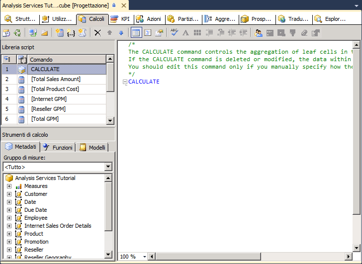
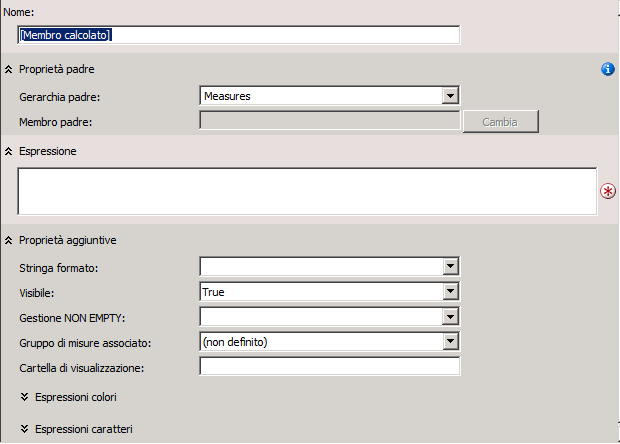
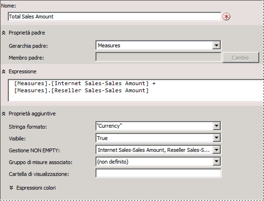
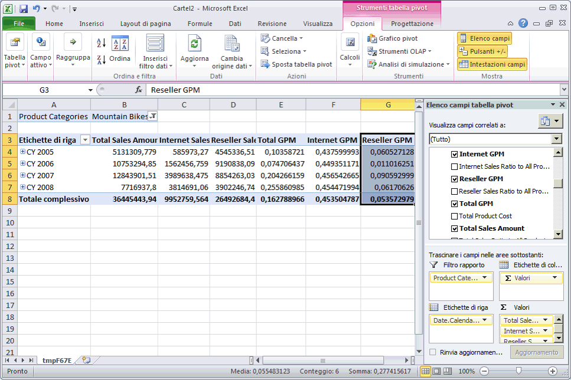

# <a name="lesson-6-1---defining-calculated-members"></a>Lezione 6-1-definizione di membri calcolati
I membri calcolati sono membri di una dimensione o di un gruppo di misure definiti in base a una combinazione di dati del cubo, di operatori aritmetici, di numeri e di funzioni. È possibile ad esempio creare un membro calcolato che calcoli la somma di due misure fisiche del cubo. Le definizioni dei membri calcolati vengono archiviate nei cubi, ma i loro valori vengono calcolati in fase di query.  
  
Per creare un membro calcolato, usare il comando **Nuovo membro calcolato** nella scheda **Calcoli** di Progettazione cubi. È possibile creare un membro calcolato all'interno di qualsiasi dimensione, inclusa la dimensione di tipo misure. È anche possibile inserire un membro calcolato in una cartella di visualizzazione nella finestra di dialogo **Proprietà calcolo** . Per altre informazioni, vedere [Calcoli](../analysis-services/multidimensional-models-olap-logical-cube-objects/calculations.md), [Calcoli nei modelli multidimensionali](../analysis-services/multidimensional-models/calculations-in-multidimensional-models.md)e [Creare membri calcolati](../analysis-services/multidimensional-models/create-calculated-members.md).  
  
Nelle procedure descritte in questo argomento vengono definite misure calcolate per consentire agli utenti di visualizzare i rapporti tra la percentuale di margine di profitto lordo e le vendite per le vendite Internet, le vendite rivenditore e tutte le vendite.  
  
## <a name="defining-calculations-to-aggregate-physical-measures"></a>Definizione di calcoli per aggregare le misure fisiche  
  
1.  Aprire Progettazione cubi per il cubo [!INCLUDE[ssASnoversion](../includes/ssasnoversion-md.md)] Tutorial e fare clic sulla scheda **Calcoli** .  
  
    Si noti il comando predefinito CALCULATE nel riquadro **Calculation Expressions** (Espressioni di calcolo) e nel riquadro **Libreria script** . Tale comando specifica che le misure del cubo devono essere aggregate in base al valore specificato dalle corrispondenti proprietà AggregateFunction. I valori di misura vengono generalmente sommati, ma possono essere contati o aggregati in altro modo.  
  
    Nella figura seguente viene illustrata la scheda **Calcoli** di Progettazione cubi.  
  
      
  
2.  Fare clic su **Nuovo membro calcolato** sulla barra degli strumenti della scheda **Calcoli**.  
  
    Verrà visualizzato un nuovo modulo nel riquadro **Calculation Expressions** (Espressioni di calcolo), all'interno del quale è possibile definire le proprietà del nuovo membro calcolato. Il nuovo membro verrà visualizzato anche nel riquadro **Libreria script** .  
  
    Nella figura seguente viene illustrato il modulo visualizzato nel riquadro **Calculation Expressions** (Espressioni di calcolo) quando si fa clic su **Nuovo membro calcolato**.  
  
      
  
3.  Nella casella **Nome** cambiare il nome della misura calcolata in **[Total Sales Amount]**.  
  
    Se il nome di un membro calcolato contiene uno spazio, tale nome deve essere racchiuso tra parentesi quadre.  
  
    Si noti che, nell'elenco **Gerarchia padre** viene creato per impostazione predefinita un nuovo membro calcolato nella dimensione **Measures** . Un membro calcolato nella dimensione Measures viene spesso definito misura calcolata.  
  
4.  Nella scheda **Metadati** del riquadro **Strumenti di calcolo** della scheda **Calcoli** espandere **Measures** e poi **Internet Sales** per visualizzare i metadati per il gruppo di misure **Internet Sales** .  
  
    Gli elementi di metadati possono essere trascinati dal riquadro **Strumenti di calcolo** nella casella **Espressione** ed è quindi possibile aggiungere operatori e altri elementi per creare espressioni MDX (Multidimensional Expression). In alternativa è possibile digitare l'espressione MDX direttamente nella casella **Espressione** .  
  
    > [!NOTE]  
    > Se non è possibile visualizzare i metadati nel riquadro **Strumenti di calcolo** , fare clic su **Riconnetti** sulla barra degli strumenti. Se questo sistema non funziona, può essere necessario elaborare il cubo o avviare l'istanza di [!INCLUDE[ssASnoversion](../includes/ssasnoversion-md.md)].  
  
5.  Trascinare **Internet Sales-Sales Amount** dalla scheda **Metadati** nel riquadro **Strumenti di calcolo** alla casella **Espressione** nel riquadro **Calculation Expressions** (Espressioni di calcolo).  
  
6.  Nella casella **Espressione** digitare un segno più (**+**) dopo **[Measures].[Internet Sales-Sales Amount]**.  
  
7.  Nella scheda **Metadati** del riquadro **Strumenti di calcolo** , espandere **Vendite rivenditore**e trascinare **Reseller Sales-Sales Amount** nella casella **Espressione** del riquadro **Calculation Expressions** (Espressioni di calcolo) dopo il segno più (+).  
  
8.  Nell'elenco **Stringa formato** selezionare **"Currency".**  
  
9. Nell'elenco **Gestione NON EMPTY** selezionare le caselle di controllo corrispondenti a **Internet Sales-Sales Amount** e **Reseller Sales-Sales Amount**e fare clic su **OK**.  
  
    Le misure specificate nell'elenco **Gestione NON EMPTY** vengono usate per risolvere query NON VUOTE in MDX. Quando si specifica una o più misure nell'elenco **Gestione NON EMPTY[!INCLUDE[ssASnoversion](../includes/ssasnoversion-md.md)],**  tratta i membri calcolati come vuoti se tutte le misure specificate sono vuote. Se la proprietà **Gestione NON EMPTY[!INCLUDE[ssASnoversion](../includes/ssasnoversion-md.md)] è vuota,**  deve valutare il membro calcolato stesso per determinare se è vuoto.  
  
    Nella figura seguente viene illustrato il riquadro **Calculation Expressions** (Espressioni di calcolo) popolato con le impostazione specificate nei passaggi precedenti.  
  
      
  
10. Sulla barra degli strumenti della scheda **Calcoli** fare clic su **Visualizzazione Script**e controllare lo script di calcolo nel riquadro **Calculation Expressions** (Espressioni di calcolo).  
  
    Si noti che il nuovo calcolo viene aggiunto all'espressione CALCULATE iniziale e che ogni singolo calcolo è separato da punto e virgola. Si noti inoltre che viene visualizzato un commento all'inizio dello script di calcolo. È consigliabile aggiungere commenti nello script di calcolo per i gruppi di calcoli per consentire agli sviluppatori di comprendere script di calcolo complessi.  
  
11. Aggiungere una nuova riga nello script di calcolo dopo il comando **Calculate;** e prima dello script di calcolo appena aggiunto, poi aggiungere il testo seguente allo script su una riga a sé stante:  
  
    ```  
    /* Calculations to aggregate Internet Sales and Reseller Sales measures */  
    ```  
  
    La figura seguente illustra gli script di calcolo che saranno visualizzati nel riquadro **Calculation Expressions** (Espressioni di calcolo) a questo punto dell'esercitazione.  
  
      
  
12. Sulla barra degli strumenti della scheda **Calcoli** fare clic su **Visualizzazione Form**, verificare che sia selezionato **[Total Sales Amount]** nel riquadro **Libreria script** e fare clic su **Nuovo membro calcolato**.  
  
13. Cambiare il nome del nuovo membro calcolato in **[Total Product Cost]**e creare l'espressione seguente nella casella **Espressione** :  
  
    ```  
    [Measures].[Internet Sales-Total Product Cost] + [Measures].[Reseller Sales-Total Product Cost]  
    ```  
  
14. Nell'elenco **Stringa formato** selezionare **"Currency"**.  
  
15. Nell'elenco **Gestione NON EMPTY** selezionare le caselle di controllo corrispondenti a **Internet Sales-Total Product Cost** e **Reseller Sales-Total Product Cost**e fare clic su **OK**.  
  
    Sono stati definiti ora due membri calcolati, entrambi visibili nel riquadro **Libreria script** . Tali membri calcolati possono essere utilizzati da altri calcoli definiti successivamente nello script di calcolo. È possibile visualizzare la definizione di qualsiasi membro calcolato selezionandolo nel riquadro **Libreria script** . La definizione del membro calcolato verrà visualizzata nel riquadro **Calculation Expressions** (Espressioni di calcolo) in Visualizzazione Form. I membri calcolati appena definiti non verranno visualizzati nel riquadro **Strumenti di calcolo** finché tali oggetti non sono stati distribuiti. Non è necessaria alcuna elaborazione per i calcoli.  
  
## <a name="defining-gross-profit-margin-calculations"></a>Definizione dei calcoli del margine di profitto lordo  
  
1.  Verificare che l'opzione **[Total Product Cost]** sia selezionata nella **Libreria script** e fare clic su **Nuovo membro calcolato** sulla barra degli strumenti della scheda **Calcoli** .  
  
2.  Nella casella **Nome** cambiare il nome della nuova misura calcolata in **[Internet GPM]**.  
  
3.  Nella casella **Espressione** creare l'espressione MDX seguente:  
  
    ```  
    ([Measures].[Internet Sales-Sales Amount] -   
    [Measures].[Internet Sales-Total Product Cost]) /  
    [Measures].[Internet Sales-Sales Amount]  
    ```  
  
4.  Nell'elenco **Stringa formato** selezionare **"Percent"**.  
  
5.  Nell'elenco **Gestione NON EMPTY** selezionare la casella di controllo corrispondente a **Internet Sales-Sales Amount**e fare clic su **OK**.  
  
6.  Fare clic su **Nuovo membro calcolato** sulla barra degli strumenti della scheda **Calcoli**.  
  
7.  Nella casella **Nome** cambiare il nome della nuova misura calcolata in **[Reseller GPM]**.  
  
8.  Nella casella **Espressione** creare l'espressione MDX seguente:  
  
    ```  
    ([Measures].[Reseller Sales-Sales Amount] -   
    [Measures].[Reseller Sales-Total Product Cost]) /  
    [Measures].[Reseller Sales-Sales Amount]  
    ```  
  
9. Nell'elenco **Stringa formato** selezionare **"Percent"**.  
  
10. Nell'elenco **Gestione NON EMPTY** selezionare la casella di controllo corrispondente a **Reseller Sales-Sales Amount**e fare clic su **OK**.  
  
11. Fare clic su **Nuovo membro calcolato** sulla barra degli strumenti della scheda **Calcoli**.  
  
12. Nella casella **Nome** cambiare il nome della nuova misura calcolata in **[Total GPM]**.  
  
13. Nella casella **Espressione** creare l'espressione MDX seguente:  
  
    ```  
    ([Measures].[Total Sales Amount] -   
    [Measures].[Total Product Cost]) /  
    [Measures].[Total Sales Amount]  
    ```  
  
    Si noti che il membro calcolato fa riferimento ad altri membri calcolati. Poiché tale membro verrà calcolato dopo i membri calcolati a cui fa riferimento, si tratta di un membro calcolato valido.  
  
14. Nell'elenco **Stringa formato** selezionare **"Percent"**.  
  
15. Nell'elenco **Gestione NON EMPTY** selezionare le caselle di controllo corrispondenti a **Internet Sales-Sales Amount** e **Reseller Sales-Sales Amount**e fare clic su **OK**.  
  
16. Fare clic su **Visualizzazione Script** sulla barra degli strumenti della scheda **Calcoli** e controllare i tre calcoli appena aggiunti allo script di calcolo.  
  
17. Aggiungere una nuova riga nello script di calcolo, immediatamente prima del calcolo **[Internet GPM]** e aggiungere il testo seguente allo script su una riga a sé stante:  
  
    ```  
    /* Calculations to calculate gross profit margin */  
    ```  
  
    Nella figura seguente viene illustrato il riquadro **Espressioni** con i tre nuovi calcoli.  
  
      
  
## <a name="defining-the-percent-of-total-calculations"></a>Definizione della percentuale dei calcoli totali  
  
1.  Fare clic su **Visualizzazione Form** sulla barra degli strumenti della scheda **Calcoli**.  
  
2.  Nel riquadro **Libreria script** selezionare **[Total GPM]**e fare clic su **Nuovo membro calcolato** sulla barra degli strumenti della scheda **Calcoli** .  
  
    Facendo clic sull'ultimo membro calcolato nel riquadro **Libreria script** prima di selezionare **Nuovo membro calcolato** si garantisce che il nuovo membro calcolato venga immesso alla fine dello script. L'esecuzione degli script seguirà l'ordine visualizzato nel riquadro **Libreria script** .  
  
3.  Cambiare il nome del nuovo membro calcolato in **[Internet Sales Ratio to All Products]**.  
  
4.  Digitare l'espressione seguente nella casella **Espressione** :  
  
    ```  
    Case  
        When IsEmpty( [Measures].[Internet Sales-Sales Amount] )   
        Then 0  
        Else ( [Product].[Product Categories].CurrentMember,  
               [Measures].[Internet Sales-Sales Amount]) /  
             ( [Product].[Product Categories].[(All)].[All],   
               [Measures].[Internet Sales-Sales Amount] )  
        End  
    ```  
  
    Questa espressione MDX calcola il contributo di ogni prodotto alle vendite Internet totali. L'istruzione Case combinata alla funzione IS EMPTY evita la generazione di un errore di divisione per zero quando le vendite di un prodotto corrispondono a zero.  
  
5.  Nell'elenco **Stringa formato** selezionare **"Percent"**.  
  
6.  Nell'elenco **Gestione NON EMPTY** selezionare la casella di controllo corrispondente a **Internet Sales-Sales Amount**e fare clic su **OK**.  
  
7.  Fare clic su **Nuovo membro calcolato** sulla barra degli strumenti della scheda **Calcoli**.  
  
8.  Cambiare il nome del nuovo membro calcolato in **[Reseller Sales Ratio to All Products]**.  
  
9. Digitare l'espressione seguente nella casella **Espressione** :  
  
    ```  
    Case  
        When IsEmpty( [Measures].[Reseller Sales-Sales Amount] )   
        Then 0  
        Else ( [Product].[Product Categories].CurrentMember,  
               [Measures].[Reseller Sales-Sales Amount]) /  
             ( [Product].[Product Categories].[(All)].[All],   
               [Measures].[Reseller Sales-Sales Amount] )  
        End  
    ```  
  
10. Nell'elenco **Stringa formato** selezionare **"Percent"**.  
  
11. Nell'elenco **Gestione NON EMPTY** selezionare la casella di controllo corrispondente a **Reseller Sales-Sales Amount**e fare clic su **OK**.  
  
12. Fare clic su **Nuovo membro calcolato** sulla barra degli strumenti della scheda **Calcoli**.  
  
13. Cambiare il nome del nuovo membro calcolato in **[Total Sales Ratio to All Products]**.  
  
14. Digitare l'espressione seguente nella casella **Espressione** :  
  
    ```  
    Case  
        When IsEmpty( [Measures].[Total Sales Amount] )   
        Then 0  
        Else ( [Product].[Product Categories].CurrentMember,  
               [Measures].[Total Sales Amount]) /  
             ( [Product].[Product Categories].[(All)].[All],   
               [Measures].[Total Sales Amount] )  
        End  
    ```  
  
15. Nell'elenco **Stringa formato** selezionare **"Percent"**.  
  
16. Nell'elenco **Gestione NON EMPTY** selezionare le caselle di controllo corrispondenti a **Internet Sales-Sales Amount** e **Reseller Sales-Sales Amount**e fare clic su **OK**.  
  
17. Fare clic su **Visualizzazione Script** nella barra degli strumenti della scheda **Calcoli**e controllare i tre calcoli appena aggiunti allo script di calcolo.  
  
18. Aggiungere una nuova riga nello script di calcolo, immediatamente prima del calcolo **[Internet Sales Ratio to All Products]** e aggiungere il testo seguente allo script su una riga a sé stante:  
  
    ```  
    /* Calculations to calculate percentage of product to total product sales */  
    ```  
  
    È stato ora definito un totale di otto membri calcolati, visibili nel riquadro **Libreria script** in Visualizzazione Form.  
  
## <a name="browsing-the-new-calculated-members"></a>Esplorazione dei nuovi membri calcolati  
  
1.  Scegliere **Deploy Analysis Services Tutorial** (Distribuisci Analysis Services Tutorial) dal menu [!INCLUDE[ssBIDevStudioFull](../includes/ssbidevstudiofull-md.md)]Compila **di**.  
  
2.  Dopo aver completato la distribuzione, passare alla scheda **Esplorazione** e fare clic sul pulsante **Riconnetti**.  
  
3.  Fare clic sull'icona Excel e selezionare **Abilita**.  
  
4.  Nel riquadro **Elenco campi tabella pivot** espandere la cartella **Valori** per visualizzare i nuovi membri calcolati nella dimensione Measures.  
  
5.  Trascinare **Total Sales Amount** nell'area Valori e controllare i risultati.  
  
    Trascinare le misure **Internet Sales-Sales Amount** e **Reseller Sales-Sales Amount** dai gruppi di misure **Internet Sales** e **Reseller Sales** nell'area Valori.  
  
    Si noti che la misura **Total Sales Amount** è la somma della misura **Internet Sales-Sales Amount** e della misura **Reseller Sales-Sales Amount** .  
  
6.  Aggiungere la gerarchia definita dall'utente **Product Categories** all'area filtro dell'area **Filtro report** e filtrare i dati in base a **Mountain Bikes**.  
  
    Si noti che la misura **Total Sales Amount** viene calcolata per la categoria **Mountain Bikes** delle vendite di prodotti in base alle misure **Internet Sales-Sales Amount** e **Reseller Sales-Sales Amount** per **Mountain Bikes**.  
  
7.  Aggiungere la gerarchia definita dall'utente **Date.Calendar Date** all'area Etichette di riga e controllare i risultati.  
  
    Si noti che la misura **Total Sales Amount** per ogni anno di calendario viene calcolata per la categoria **Mountain Bikes** delle vendite di prodotti in base alle misure **Internet Sales-Sales Amount** e **Reseller Sales-Sales Amount** per **Mountain Bikes**.  
  
8.  Aggiungere le misure **Total GPM**, **Internet GPM**e **Reseller GPM** all'area Valori e controllare i risultati.  
  
    Si noti che il margine di profitto lordo per le vendite rivenditore è notevolmente inferiore rispetto alle vendite Internet, come illustrato nella figura seguente.  
  
      
  
9. Aggiungere le misure **Total Sales Ratio to All Products**, **Internet Sales Ratio to All Products**e **Reseller Sales Ratio to All Products** all'area Valori.  
  
    Si noti che il rapporto tra le vendite delle mountain bike e le vendite di tutti i prodotti è aumentato nel tempo per le vendite Internet, ma diminuisce nel tempo per le vendite rivenditore e che il rapporto tra le vendite di mountain bike e le vendite di tutti i prodotti è inferiore per le vendite rivenditore rispetto alle vendite Internet.  
  
10. Cambiare il filtro da **Mountain Bikes** a **Bikes**e controllare i risultati.  
  
    Si noti che il margine di profitto lordo per tutte le bici vendute tramite rivenditori è negativo, perché le bici da turismo e da corsa vengono vendute in perdita.  
  
11. Cambiare il filtro in **Accessories**e controllare i risultati.  
  
    Si noti che la vendita di accessori aumenta nel tempo, ma che tali vendite rappresentano solo una piccola frazione delle vendite totali. Si noti inoltre che il margine di profitto lordo per le vendite di accessori è più alto rispetto a quello delle bici.  
  
## <a name="next-task-in-lesson"></a>Attività successiva della lezione  
[Definizione dei set denominati](../analysis-services/lesson-6-2-defining-named-sets.md)  
  
## <a name="see-also"></a>Vedere anche  
[Calcoli](../analysis-services/multidimensional-models-olap-logical-cube-objects/calculations.md)  
[Calcoli nei modelli multidimensionali](../analysis-services/multidimensional-models/calculations-in-multidimensional-models.md)  
[Creare membri calcolati](../analysis-services/multidimensional-models/create-calculated-members.md)  
  
  
  

