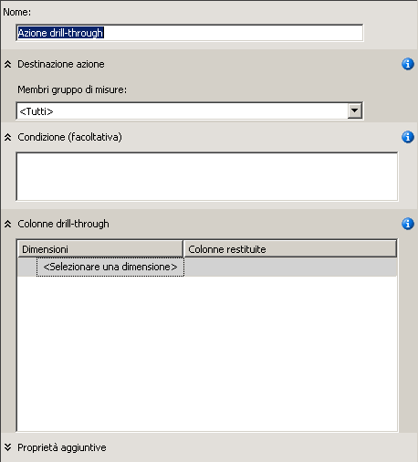
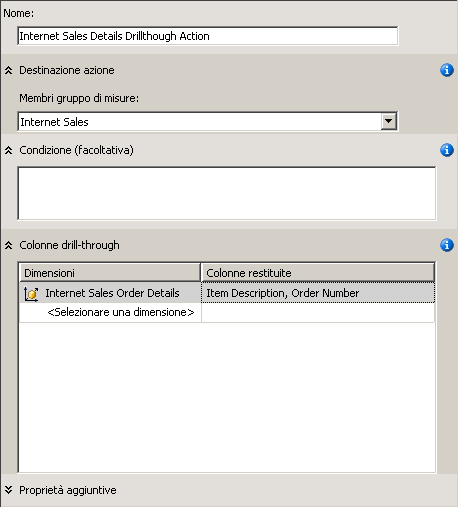
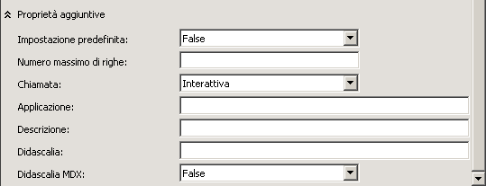
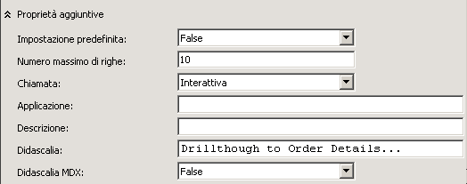
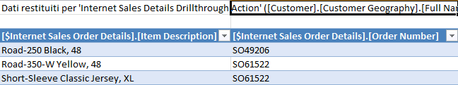
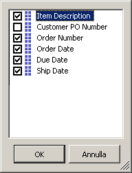
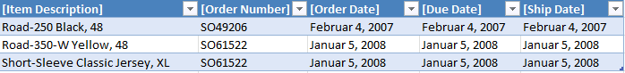

# Lezione 8-1-definizione e utilizzo di un'azione drill-through
[!INCLUDE[ssas-appliesto-sqlas](../includes/ssas-appliesto-sqlas.md)]

Il dimensionamento dei dati della tabella dei fatti tramite una dimensione dei fatti senza l'applicazione di un filtro appropriato sui dati restituiti dalla query può causare un rallentamento delle prestazioni. Per evitare questo problema, è possibile definire un'azione drill-through che limita il numero complessivo di righe restituite. In questo modo è possibile migliorare in modo significativo le prestazioni delle query.  
  
Nelle procedure descritte in questo argomento viene definita un'azione drill-through per restituire informazioni dettagliate sugli ordini relativi alle vendite ai clienti su Internet.  
  
## Definizione delle proprietà di un'azione drill-through  
  
1.  In Progettazione cubi per il cubo [!INCLUDE[ssASnoversion](../includes/ssasnoversion-md.md)] Tutorial fare clic sulla scheda **Azioni** .  
  
    La scheda **Azioni** include diversi riquadri. Sul lato sinistro della scheda si trovano il riquadro **Libreria azioni** e il riquadro **Strumenti di calcolo** . Il riquadro a destra di questi due riquadri è il riquadro **Visualizza** , contenente i dettagli dell'azione selezionata nel riquadro **Libreria azioni** .  
  
    La figura seguente illustra la scheda **Azioni** di Progettazione cubi.  
  
      
  
2.  Fare clic sul pulsante **Nuova azione dril-through** sulla barra degli strumenti della scheda **Azioni** .  
  
    Nel riquadro di visualizzazione verrà visualizzato un modello Azione vuoto.  
  
      
  
3.  Nella casella **Nome** cambiare il nome dell'azione in **Internet Sales Details Drillthrough Action**.  
  
4.  Selezionare **Internet Sales** dall'elenco **Membri gruppo di misure**.  
  
5.  Nella casella **Colonne drill-through** selezionare **Dettagli ordine vendita Internet** nell'elenco **Dimensioni** .  
  
6.  Nell'elenco **Colonne restituite** selezionare le caselle di controllo **Item Description** e **Order Number** e fare clic su **OK**. Nella figura seguente viene illustrato l'aspetto che dovrebbe avere assunto il modello Azione a questo punto della procedura.  
  
      
  
7.  Espandere la casella **Proprietà aggiuntive** , come illustrato nella figura seguente.  
  
      
  
8.  Nella casella **Numero massimo di righe** digitare **10**.  
  
9. Nella casella **Didascalia** digitare **Drillthrough to Order Details…**.  
  
    Queste impostazioni limitano il numero di righe restituite e specificano la didascalia che viene visualizzata nel menu dell'applicazione client. La figura seguente illustra tali impostazioni all'interno della casella **Proprietà aggiuntive** .  
  
      
  
## Utilizzo dell'azione drill-through  
  
1.  Scegliere **Distribuisci Analysis Services Tutorial** dal menu **Compila**.  
  
2.  Una volta completata la distribuzione, selezionare la scheda **Esplorazione** in Progettazione cubi per il cubo [!INCLUDE[ssASnoversion](../includes/ssasnoversion-md.md)] Tutorial e fare clic sul pulsante **Riconnetti** .  
  
3.  Avviare Excel.  
  
4.  Aggiungere la misura **Internet Sales-Sales Amount** all'area Valori.  
  
5.  Aggiungere la gerarchia definita dall'utente **Customer Geography** della cartella **Location** nella dimensione **Customer** all'area **Filtro report** .  
  
6.  In **Customer Geography**nella tabella pivot aggiungere un filtro per selezionare un solo cliente. Espandere **All Customers**, **Australia**, **Queensland**, **Brisbane**e **4000**, selezionare la casella di controllo corrispondente ad **Adam Powell**e fare clic su **OK**.  
  
    Il totale dei prodotti venduti da [!INCLUDE[ssSampleDBCoFull](../includes/sssampledbcofull-md.md)] ad Adam Powell viene visualizzato nell'area dati.  
  
7.  Fare clic con il pulsante destro del mouse sull'importo delle vendite, scegliere **Additional Actions**(Azioni aggiuntive) e fare clic su **Drillthrough to Order Details**.  
  
    I dettagli degli ordini spediti ad Adam Powell vengono visualizzati nel **visualizzatore dati di esempio**, come illustrato nella figura seguente. Servirebbero tuttavia alcuni dettagli supplementari, ad esempio la data dell'ordine, la data di scadenza e la data di spedizione. Nella procedura seguente si aggiungeranno tali dettagli supplementari.  
  
      
  
8.  Chiudere Excel.  
  
## Modifica dell'azione drill-through  
  
1.  Aprire Progettazione dimensioni per la dimensione **Internet Sales Order Details** .  
  
    Si noti che sono stati definiti solo tre attributi per questa dimensione.  
  
2.  Nel riquadro **Vista origine dati** fare clic con il pulsante destro del mouse su un'area aperta e scegliere **Mostra tutte le tabelle**.  
  
3.  Scegliere **Layout automatico** dal menu **Formato** e fare clic su **Diagramma**.  
  
4.  Individuare la tabella **InternetSales (dbo.FactInternetSales)** facendo clic con il pulsante destro del mouse in un'area aperta del riquadro **Vista origine dati** . Scegliere **Trova tabella** , selezionare **InternetSales** e fare clic su **OK**.  
  
5.  Creare nuovi attributi in base alle colonne seguenti:  
  
    -   OrderDateKey  
  
    -   DueDateKey  
  
    -   ShipDateKey  
  
6.  Modificare la proprietà **Name** dell'attributo **Order Date Key** in **Order Date** . Fare clic sul pulsante Sfoglia relativo alla proprietà **Name Column** e nella finestra di dialogo **Name Column** selezionare **Date** come tabella di origine e SimpleDate come colonna di origine. [!INCLUDE[clickOK](../includes/clickok-md.md)]  
  
7.  Modificare la proprietà **Name** dell'attributo **Due Date Key** in **Due Date**e modificare la proprietà **Name Column** di questo attributo in **Date.SimpleDate (WChar)** usando lo stesso metodo eseguito per l'attributo **Order Date Key**.  
  
8.  Modificare la proprietà **Name** dell'attributo **Ship Date Key** in **Ship Date** e modificare la proprietà **Name Column** di questo attributo in **Date.SimpleDate (WChar)**.  
  
9. Passare alla scheda **Azioni[!INCLUDE[ssASnoversion](../includes/ssasnoversion-md.md)] di Progettazione cubi per il cubo**  Tutorial.  
  
10. Nella casella **Colonne drill-through** selezionare le caselle di controllo per aggiungere le colonne seguenti all'elenco **Colonne restituite** e fare clic su **OK**:  
  
    -   Order Date  
  
    -   Due Date  
  
    -   Ship Date  
  
    Nella figura seguente vengono illustrate tali colonne selezionate.  
  
      
  
## Controllo dell'azione drill-through modificata  
  
1.  Scegliere **Distribuisci Analysis Services Tutorial** dal menu **Compila**.  
  
2.  Dopo aver completato la distribuzione, passare alla scheda **Esplorazione[!INCLUDE[ssASnoversion](../includes/ssasnoversion-md.md)] in Progettazione cubi per il cubo**  Tutorial e fare clic sul pulsante **Riconnetti**.  
  
3.  Avviare Excel.  
  
4.  Ricreare la tabella pivot usando **Internet Sales-Sales Amount** nell'area Valori e **Customer Geography** nel Filtro report.  
  
    Aggiungere un filtro per selezionare da **All Customers**, **Australia**, **Queensland**, **Brisbane**, **4000**, **Adam Powell**.  
  
5.  Fare clic sulla cella di dati **Internet Sales-Sales Amount** , scegliere **Additional Actions**(Azioni aggiuntive) e fare clic su **Drillthrough to Order Details**.  
  
    I dettagli di questi ordini spediti ad Adam Powell vengono visualizzati in un foglio di lavoro temporaneo. Tali dettagli includono informazioni relative a descrizione articolo, numero ordine, data dell'ordine, data di scadenza e data di spedizione, come illustrato nell'immagine seguente.  
  
      
  
## Lezione successiva  
[Lezione 9: Definizione di prospettive e traduzioni](../analysis-services/lesson-9-defining-perspectives-and-translations.md)  
  
## Vedere anche  
[Azioni &#40;Analysis Services - Dati multidimensionali&#41;](../analysis-services/multidimensional-models/actions-analysis-services-multidimensional-data.md)  
[Azioni nei modelli multidimensionali](../analysis-services/multidimensional-models/actions-in-multidimensional-models.md)  
[Relazioni tra dimensioni](../analysis-services/multidimensional-models-olap-logical-cube-objects/dimension-relationships.md)  
[Definizione di una relazione di tipo Fatti](../analysis-services/lesson-5-2-defining-a-fact-relationship.md)  
[Definire una relazione di tipo Fatti e le relative proprietà](../analysis-services/multidimensional-models/define-a-fact-relationship-and-fact-relationship-properties.md)  
  
  
  
