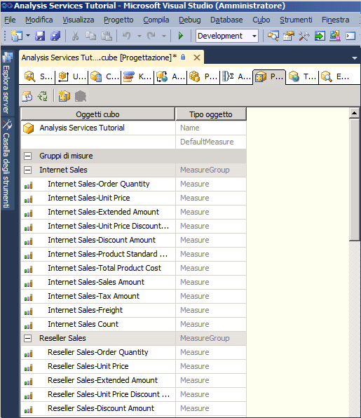
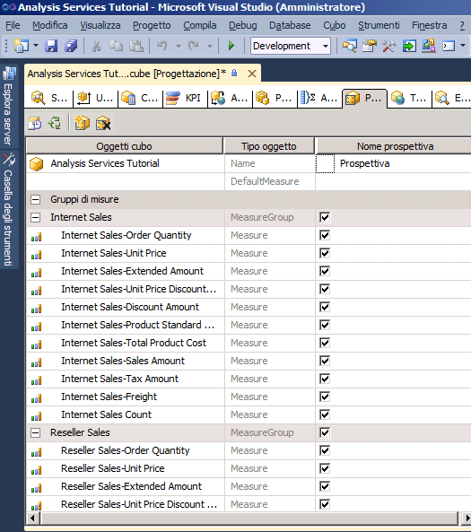
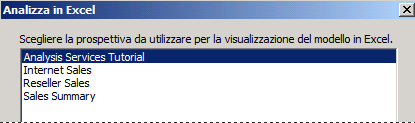
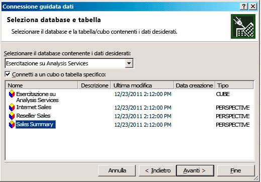
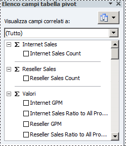

# Lezione 9-1-definizione ed esplorazione delle prospettive
Una prospettiva può semplificare la visualizzazione di un cubo a scopi specifici. Per impostazione predefinita, gli utenti possono vedere tutti gli elementi di un cubo per i quali dispongono di autorizzazioni. Quando si visualizza un intero cubo di [!INCLUDE[ssASnoversion](../includes/ssasnoversion-md.md)] , viene visualizzata la prospettiva predefinita del cubo. La navigazione all'interno di una visualizzazione dell'intero cubo può essere molto complessa per gli utenti, soprattutto per coloro che devono solo interagire con una piccola parte del cubo per soddisfare i requisiti di Business Intelligence e di report.  
  
Per ridurre la complessità apparente di un cubo è possibile creare subset visualizzabili del cubo, denominati *prospettive*, che visualizzano agli utenti solo una parte dei gruppi di misure, delle misure, delle dimensioni, degli attributi, delle gerarchie, degli indicatori di prestazioni chiave (KPI), delle azioni e dei membri calcolati del cubo. Ciò può risultare particolarmente utile per utilizzare applicazioni client scritte per una versione precedente di [!INCLUDE[ssASnoversion](../includes/ssasnoversion-md.md)]. Tali applicazioni non supportano cartelle di visualizzazione o prospettive, tuttavia una prospettiva è ad esempio presente nei client precedenti sotto forma di cubo. Per altre informazioni, vedere [Prospettive](../analysis-services/multidimensional-models-olap-logical-cube-objects/perspectives.md)e [Prospettive nei modelli multidimensionali](../analysis-services/multidimensional-models/perspectives-in-multidimensional-models.md).  
  
> [!NOTE]  
> Una prospettiva non è un meccanismo di sicurezza, ma uno strumento per semplificare il lavoro all'utente. Tutta la sicurezza di una prospettiva viene ereditata dal cubo sottostante.  
  
Nelle procedure descritte in questo argomento vengono definite diverse prospettive e successivamente il cubo verrà esplorato tramite ognuna di tali prospettive.  
  
## Definizione di una prospettiva Internet Sales  
  
1.  Aprire Progettazione cubi per il cubo di [!INCLUDE[ssASnoversion](../includes/ssasnoversion-md.md)] Tutorial, quindi fare clic sulla scheda **Prospettive** .  
  
    Tutti gli oggetti e i relativi tipi verranno visualizzati nel riquadro **Prospettive** , come illustrato nella figura seguente.  
  
      
  
2.  Fare clic sul pulsante **Nuova prospettiva** sulla barra degli strumenti della scheda **Prospettive** .  
  
    Verrà visualizzata una nuova prospettiva nella colonna **Nome prospettiva** , con il nome predefinito **Prospettiva**, come illustrato nella figura seguente. Si noti che è selezionata la casella di controllo corrispondente a ogni oggetto. Finché non si deseleziona la casella di controllo di un oggetto, questa prospettiva è identica alla prospettiva predefinita del cubo.  
  
      
  
3.  Cambiare il nome della prospettiva in **Internet Sales**.  
  
4.  Nella riga successiva impostare DefaultMeasure su **Internet Sales-Sales Amount**.  
  
    Quando gli utenti esplorano il cubo utilizzando questa prospettiva, questa sarà la misura che visualizzeranno gli utenti, a meno che non ne venga specificata una diversa.  
  
    > [!NOTE]  
    > È inoltre possibile impostare la misura predefinita per tutto il cubo di [!INCLUDE[ssASnoversion](../includes/ssasnoversion-md.md)] Tutorial nella finestra Proprietà della scheda **Struttura cubo** per il cubo.  
  
5.  Deselezionare le caselle di controllo corrispondenti agli oggetti seguenti:  
  
    -   Gruppo di misure**Reseller Sales**   
  
    -   Gruppo di misure**Sales Quotas**   
  
    -   Gruppo di misure**Sales Quotas 1**   
  
    -   Dimensione del cubo**Reseller**   
  
    -   Dimensione del cubo**Reseller Geography**   
  
    -   Dimensione del cubo**Sales Territory**   
  
    -   Dimensione del cubo**Employee**   
  
    -   Dimensione del cubo**Promotion**   
  
    -   di**Reseller Revenue**   
  
    -   Set denominato**Large Resellers**   
  
    -   Membro calcolato**Total Sales Amount**   
  
    -   Membro calcolato**Total Product Cost**   
  
    -   Membro calcolato**Reseller GPM**   
  
    -   Membro calcolato**Total GPM**   
  
    -   Membro calcolato**Reseller Sales Ratio to All Products**   
  
    -   Membro calcolato**Total Sales Ratio to All Products**   
  
    Questi oggetti non riguardano le vendite Internet.  
  
    > [!NOTE]  
    > All'interno di ogni dimensione è inoltre possibile selezionare i singoli attributi e le singole gerarchie definite dall'utente che si desidera visualizzare in una prospettiva.  
  
## Definizione di una prospettiva Reseller Sales  
  
1.  Fare clic sul pulsante **Nuova prospettiva** sulla barra degli strumenti della scheda **Prospettive** .  
  
2.  Cambiare il nome della nuova prospettiva in **Reseller Sales**.  
  
3.  Impostare **Reseller Sales-Sales Amount** come misura predefinita.  
  
    Quando gli utenti esplorano il cubo utilizzando questa prospettiva, questa misura sarà la misura visualizzata agli utenti, a meno che non ne venga specificata una diversa.  
  
4.  Deselezionare le caselle di controllo corrispondenti agli oggetti seguenti:  
  
    -   Gruppo di misure**Internet Sales**   
  
    -   Gruppo di misure**Internet Sales Reason**   
  
    -   Dimensione del cubo**Customer**   
  
    -   Dimensione del cubo**Internet Sales Order Details**   
  
    -   Dimensione del cubo**Sales Reason**   
  
    -   Azione drill-through**Internet Sales Details Drillthrough Action**   
  
    -   Membro calcolato**Total Sales Amount**   
  
    -   Membro calcolato**Total Product Cost**   
  
    -   Membro calcolato**Internet GPM**   
  
    -   Membro calcolato**Total GPM**   
  
    -   Membro calcolato**Internet Sales Ratio to All Products**   
  
    -   Membro calcolato**Total Sales Ratio to All Products**   
  
    Questi oggetti non riguardano le vendite rivenditore.  
  
## Definizione di una prospettiva Sales Summary  
  
1.  Fare clic sul pulsante **Nuova prospettiva** sulla barra degli strumenti della scheda **Prospettive** .  
  
2.  Cambiare il nome della nuova prospettiva in **Sales Summary**.  
  
    > [!NOTE]  
    > Non è possibile specificare una misura calcolata come misura predefinita.  
  
3.  Deselezionare le caselle di controllo corrispondenti agli oggetti seguenti:  
  
    -   Gruppo di misure**Internet Sales**   
  
    -   Gruppo di misure**Reseller Sales**   
  
    -   Gruppo di misure**Internet Sales Reason**   
  
    -   Gruppo di misure**Sales Quotas**   
  
    -   Gruppo di misure**Sales Quotas1**   
  
    -   Dimensione del cubo**Internet Sales Order Details**   
  
    -   Dimensione del cubo**Sales Reason**   
  
    -   Azione drill-through**Internet Sales Details Drillthrough Action**   
  
4.  Selezionare le caselle di controllo corrispondenti agli oggetti seguenti:  
  
    -   Misura**Internet Sales Count**   
  
    -   Misura**Reseller Sales Count**   
  
## Esplorazione del cubo tramite ogni prospettiva  
  
1.  Scegliere **Distribuisci Analysis Services Tutorial** dal menu **Compila**.  
  
2.  Dopo aver completato la distribuzione, passare alla scheda **Esplorazione** , quindi fare clic sul pulsante **Riconnetti** .  
  
3.  Avviare Excel.  
  
4.  Analizza in Excel richiede di scegliere quale prospettiva utilizzare per la visualizzazione del modello in Excel, come illustrato nell'immagine seguente.  
  
      
  
5.  In alternativa, è possibile avviare Excel dal menu Start di Windows, definire una connessione al database Analysis Services Tutorial su localhost e scegliere una prospettiva nella procedura guidata Connessione dati, come illustrato nell'immagine seguente.  
  
      
  
6.  Selezionare **Internet Sales** nell'elenco **Prospettiva** , quindi rivedere le misure e le dimensioni nel riquadro dei metadati.  
  
    Si noti che vengono visualizzati solo gli oggetti specificati per la prospettiva Internet Sales.  
  
7.  Nel riquadro dei metadati espandere **Misure**.  
  
    Si noti che viene visualizzato solo il gruppo di misure **Internet Sales** unitamente ai membri calcolati **Internet GPM** e **Internet Sales Ratio to All Products** .  
  
8.  Nel modello selezionare di nuovo Excel. Selezionare **Sales Summary**.  
  
    Si noti che in ognuno di questi gruppi di misure viene visualizzata un'unica misura, come illustrato nella figura seguente.  
  
      
  
## Attività successiva della lezione  
[Definizione ed esplorazione delle traduzioni](../analysis-services/lesson-9-2-defining-and-browsing-translations.md)  
  
## Vedere anche  
[Perspectives](../analysis-services/multidimensional-models-olap-logical-cube-objects/perspectives.md)  
[Prospettive nei modelli multidimensionali](../analysis-services/multidimensional-models/perspectives-in-multidimensional-models.md)  
  
  
  

