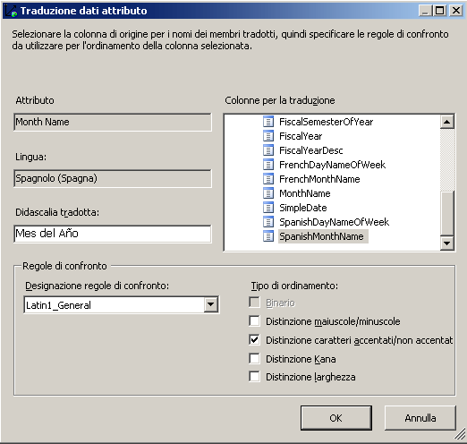
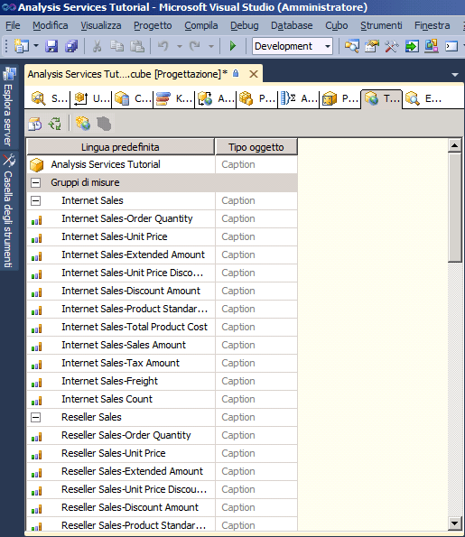
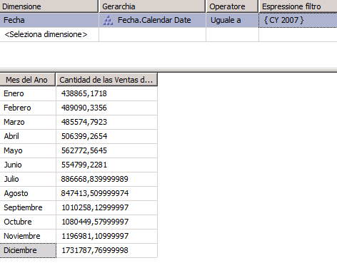

# Lezione 9-2-definizione ed esplorazione delle traduzioni
Una traduzione è una rappresentazione dei nomi degli oggetti di [!INCLUDE[ssASnoversion](../includes/ssasnoversion-md.md)] in una lingua specifica. Gli oggetti includono gruppi di misure, misure, dimensioni, attributi, gerarchie, indicatori KPI, azioni e membri calcolati. Le traduzioni offrono supporto server per applicazioni client in grado di supportare più lingue. Con un client di questo tipo, il client passa l'identificatore delle impostazioni locali (LCID) all'istanza di [!INCLUDE[ssASnoversion](../includes/ssasnoversion-md.md)], la quale utilizza tale LCID per determinare il set di traduzioni da utilizzare per generare metadati per oggetti di [!INCLUDE[ssASnoversion](../includes/ssasnoversion-md.md)] . Se un oggetto di [!INCLUDE[ssASnoversion](../includes/ssasnoversion-md.md)] non contiene una traduzione per la lingua in questione oppure per un oggetto specificato, per la restituzione dei metadati dell'oggetto al client verrà utilizzata la lingua predefinita. Se ad esempio un utente aziendale in Francia accede a un cubo da una workstation in cui vengono utilizzate le impostazioni locali francesi, le didascalie dei membri e i valori delle proprietà del membro verranno visualizzati in francese, se è disponibile una traduzione in tale lingua. Se tuttavia un utente aziendale in Germania accede allo stesso cubo da una workstation in cui vengono utilizzate le impostazioni locali tedesche, l'utente vedrà le didascalie dei membri e i valori delle proprietà del membro in tedesco. Per altre informazioni, vedere [Traduzioni delle dimensioni](../analysis-services/multidimensional-models-olap-logical-dimension-objects/dimension-translations.md), [Traduzioni di cubi](../analysis-services/multidimensional-models-olap-logical-cube-objects/cube-translations.md), [Supporto delle traduzioni in Analysis Services](../analysis-services/translation-support-in-analysis-services.md).  
  
Nelle procedure descritte in questo argomento vengono definite traduzioni di metadati per un set limitato di oggetti dimensione nella dimensione Date e oggetti cubo nel cubo di [!INCLUDE[ssASnoversion](../includes/ssasnoversion-md.md)] Tutorial. In seguito si esploreranno tali dimensioni e oggetti cubo per analizzare le traduzioni dei metadati.  
  
## Specifica di traduzioni per i metadati della dimensione Date  
  
1.  Aprire Progettazione dimensioni per la dimensione **Date** e fare clic sulla scheda **Traduzioni** .  
  
    Vengono visualizzati i metadati nella lingua predefinita per ogni oggetto della dimensione. La lingua predefinita nel cubo di [!INCLUDE[ssASnoversion](../includes/ssasnoversion-md.md)] Tutorial è l'inglese.  
  
2.  Sulla barra degli strumenti della scheda **Traduzioni** fare clic sul pulsante **Nuova traduzione** .  
  
    Verrà visualizzato un elenco di lingue nella finestra di dialogo **Seleziona lingua** .  
  
3.  Fare clic su **Spagnolo (Spagna)**e selezionare **OK**.  
  
    Verrà visualizzata una nuova colonna, nella quale si definiranno le traduzioni in spagnolo per gli oggetti di metadati che si desidera tradurre. In questa esercitazione si tradurrà un numero limitato di oggetti, al solo scopo di illustrare il processo.  
  
4.  Sulla barra degli strumenti della scheda **Traduzioni** fare clic sul pulsante **Nuova traduzione** , selezionare **Francese (Francia)** nella finestra di dialogo **Seleziona lingua** e fare clic su **OK**.  
  
    Viene visualizzata un'altra colonna per la lingua nella quale si definiranno le traduzioni in francese.  
  
5.  Nella riga relativa all'oggetto **Caption** per la dimensione **Date** digitare **Fecha** nella colonna della traduzione in **Spagnolo (Spagna)** e **Temps** nella colonna della traduzione in **Francese (Francia)** .  
  
6.  Nella riga relativa all'oggetto **Caption** per l'attributo **Month Name** , digitare **Mes del Año** nella colonna della traduzione in **Spagnolo (Spagna)** e **Mois d'Année** nella colonna della traduzione in **Francese (Francia)** .  
  
    Si noti che quando si immettono queste traduzioni, vengono visualizzati i puntini di sospensione (**...**). Facendo clic sui puntini di sospensione, è possibile specificare una colonna nella tabella sottostante che genera traduzioni per ogni membro della gerarchia dell'attributo.  
  
7.  Selezionare i puntini di sospensione (**…**) per la traduzione in **Spagnolo (Spagna)** dell'attributo **Month Name** .  
  
    Verrà visualizzata la finestra di dialogo **Traduzione dati attributo** .  
  
8.  Selezionare **SpanishMonthName** nell'elenco **Colonne per la traduzione**, come illustrato nella figura seguente.  
  
      
  
9. Fare clic su **OK**e sui puntini di sospensione (**…**) per la traduzione in **Francese (Francia)** dell'attributo **Month Name** .  
  
10. Selezionare **FrenchMonthName** nell'elenco **Colonne per la traduzione**e fare clic su **OK**.  
  
    I passaggi della procedura illustrano il processo di definizione delle traduzioni dei metadati per gli oggetti e i membri della dimensione.  
  
## Specifica delle traduzioni per i metadati del cubo di Analysis Services Tutorial  
  
1.  Passare a Progettazione cubi per il cubo [!INCLUDE[ssASnoversion](../includes/ssasnoversion-md.md)] Tutorial, poi passare alla scheda **Traduzioni** .  
  
    Verranno visualizzati i metadati nella lingua predefinita per ogni oggetto cubo, come illustrato nella figura seguente. La lingua predefinita nel cubo di [!INCLUDE[ssASnoversion](../includes/ssasnoversion-md.md)] Tutorial è l'inglese.  
  
      
  
2.  Sulla barra degli strumenti della scheda **Traduzioni** fare clic sul pulsante **Nuova traduzione** .  
  
    Verrà visualizzato un elenco di lingue nella finestra di dialogo **Seleziona lingua** .  
  
3.  Selezionare **Spagnolo (Spagna)**e fare clic su **OK**.  
  
    Verrà visualizzata una nuova colonna, nella quale si definiranno le traduzioni in spagnolo per gli oggetti di metadati che si desidera tradurre. In questa esercitazione si tradurrà un numero limitato di oggetti, al solo scopo di illustrare il processo.  
  
4.  Sulla barra degli strumenti della scheda **Traduzioni** fare clic sul pulsante **Nuova traduzione** , selezionare **Francese (Francia)** nella finestra di dialogo **Seleziona lingua** e fare clic su **OK**.  
  
    Viene visualizzata un'altra colonna per la lingua nella quale si definiranno le traduzioni in francese.  
  
5.  Nella riga relativa all'oggetto **Caption** per la dimensione **Date** digitare **Fecha** nella colonna della traduzione in **Spagnolo (Spagna)** e **Temps** nella colonna della traduzione in **Francese (Francia)** .  
  
6.  Nella riga relativa all'oggetto **Caption** per il gruppo di misure **Internet Sales** digitare **Ventas del lnternet** nella colonna della traduzione in **Spagnolo (Spagna)** e **Ventes D'Internet** nella colonna della traduzione in **Francese (Francia)** .  
  
7.  Nella riga relativa all'oggetto **Caption** per il gruppo di misure Internet Sales-Sales Amount, digitare **Cantidad de las Ventas del Internet** nella colonna della traduzione in **Spagnolo (Spagna)** e **Quantité de Ventes D'Internet** nella colonna della traduzione in **Francese (Francia)** .  
  
    I passaggi della procedura illustrano il processo di definizione delle traduzioni dei metadati per gli oggetti cubo.  
  
## Esplorazione del cubo utilizzando le traduzioni  
  
1.  Scegliere **Distribuisci Analysis Services Tutorial** dal menu **Compila**.  
  
2.  Dopo aver completato la distribuzione, passare alla scheda **Esplorazione** e fare clic sul pulsante **Riconnetti**.  
  
3.  Rimuovere tutte le gerarchie e le misure dal riquadro **Dati[!INCLUDE[ssASnoversion](../includes/ssasnoversion-md.md)], selezionare**  Tutorial nell'elenco **Prospettive**.  
  
4.  Nel riquadro dei metadati espandere **Measures** e poi **Internet Sales**.  
  
    Si noti che la misura **Internet Sales-Sales Amount** viene visualizzata in inglese in questo gruppo di misure.  
  
5.  Nella barra degli strumenti selezionare **Spagnolo (Spagna)** nell'elenco **Lingua** .  
  
    Si noti che gli elementi del riquadro Metadati vengono ripopolati. Quando gli elementi del riquadro Metadati sono stati ripopolati, si noti che la misura Internet Sales-Sales Amount non viene più visualizzata nella cartella di visualizzazione Vendite Internet, ma viene visualizzata in spagnolo in una cartella di visualizzazione nuova denominata **Ventas del lnternet**, come illustrato nella figura seguente.  
  
      
  
6.  Nel riquadro dei metadati fare clic con il pulsante destro del mouse su **Cantidad de las Ventas del Internet** e scegliere **Aggiungi a query**.  
  
7.  Nel riquadro dei metadati espandere **Fecha**, espandere **Fecha.Calendar Date**, fare clic con il pulsante destro del mouse su **Fecha.Calendar Date**e scegliere **Aggiungi a filtro**.  
  
8.  Nel riquadro **Filtro** selezionare **CY 2007** come espressione di filtro.  
  
9. Nel riquadro dei metadati fare clic con il pulsante destro del mouse su **Mes del Ano** e scegliere **Aggiungi a query**.  
  
    Si noti che i nomi dei mesi vengono visualizzati in spagnolo, come illustrato nella figura seguente.  
  
      
  
10. Nella barra degli strumenti selezionare **Francese (Francia)** nell'elenco **Lingua** .  
  
    Si noti che ora i nomi dei mesi vengono visualizzati in francese, così come il nome della misura.  
  
## Lezione successiva  
[Lezione 10: Definizione dei ruoli amministrativi](../analysis-services/lesson-10-defining-administrative-roles.md)  
  
## Vedere anche  
[Traduzioni delle dimensioni](../analysis-services/multidimensional-models-olap-logical-dimension-objects/dimension-translations.md)  
[Traduzioni di cubi](../analysis-services/multidimensional-models-olap-logical-cube-objects/cube-translations.md)  
[Supporto delle traduzioni in Analysis Services](../analysis-services/translation-support-in-analysis-services.md)  
  
  
  

