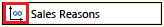
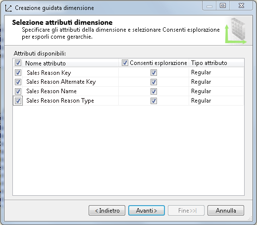
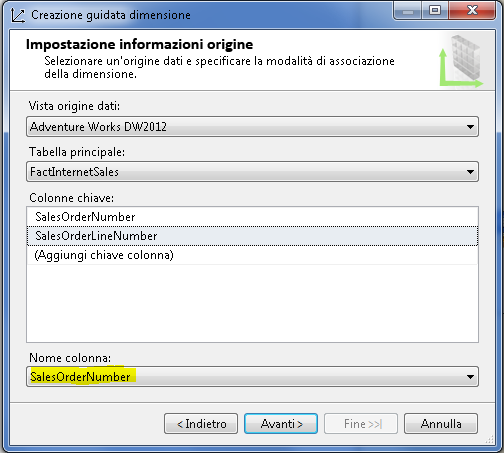
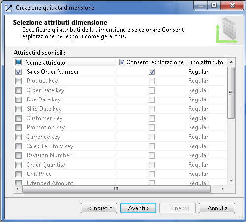
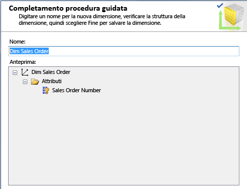
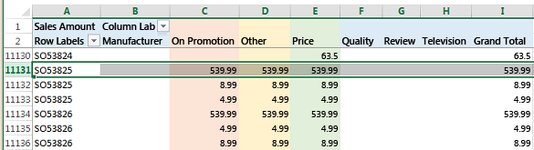
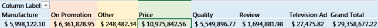

# Definire una relazione molti-a-molti e le relative proprietà
[!INCLUDE[ssas-appliesto-sqlas](../../includes/ssas-appliesto-sqlas.md)]
  In questo argomento vengono illustrate le dimensioni molti-a-molti in Analysis Services, quando utilizzarle e come crearle.  
  
## Introduzione  
 In Analysis Services sono supportate le dimensioni molti-a-molti ed è possibile ottenere un'analisi più complessa rispetto a quella di uno schema star classico. In uno schema star classico tutte le dimensioni hanno una relazione uno-a-molti con la tabella dei fatti. Ogni fatto è associato a un solo membro della dimensione e un singolo membro della dimensione è associato a molti fatti.  
  
 Nelle relazioni molti-a-molti viene eliminata questa limitazione di modellazione ed è possibile che un fatto, ad esempio il saldo di un conto, sia associato a più membri della stessa dimensione (il saldo di un conto cointestato può essere attribuito a due o più titolari di un conto cointestato).  
  
 A livello concettuale, una relazione dimensionale molti-a-molti in Analysis Services equivale a relazioni molti-a-molti in un modello relazionale che supporta gli stessi tipi di scenario. Esempi comuni di relazioni molti-a-molti:  
  
-   Gli studenti sono iscritti a molti corsi; ciascun corso ha molti studenti.  
  
-   I dottori hanno molti pazienti; i pazienti hanno molti dottori.  
  
-   I clienti possono avere molti conti bancari; i conti bancari possono appartenere a più di un cliente.  
  
-   In Adventure Works, molti clienti hanno molti motivi per effettuare l'ordine di un prodotto, e un motivo di vendita può essere associato a molti ordini.  
  
 A livello analitico, il problema risolto da una relazione molti-a-molti consiste nella rappresentazione accurata di un conteggio o somma relativi alla relazione dimensionale (solitamente attraverso l'eliminazione dei conteggi doppi quando si eseguono calcoli per uno specifico membro di dimensione). Un esempio aiuterà a chiarire questo concetto. Si consideri un prodotto o servizio appartenente a più di una categoria. Se si conta il numero di servizi per categoria, si desidera che in ciascuna venga incluso un servizio appartenente a entrambe le categorie. Allo stesso tempo, però, si desidera non esagerare il numero di servizi offerti. Specificando la relazione dimensionale molti-a-molti si hanno più probabilità di ottenere risultati corretti quando si esegue una query per categoria o servizio. A tal fine, tuttavia, sono sempre necessari test approfonditi.  
  
 A livello strutturale, la creazione di una relazione dimensionale molti-a-molti è simile alla creazione di relazioni molti-a-molti in un modello di dati relazionale. Mentre un modello relazionale si serve di una *tabella di collegamento* per archiviare le associazioni di riga, un modello multidimensionale usa di un *gruppo di misure intermedio*. Gruppo di misure intermedio è un termine utilizzato per indicare una tabella che definisce il mapping di membri di diverse dimensioni.  
  
 A livello visivo, una relazione dimensionale molti-a-molti non è indicata in un diagramma del cubo. È invece possibile utilizzare la scheda Utilizzo dimensioni per identificare rapidamente tutte le relazioni molti-a-molti all'interno di un modello. Una relazione molti-a-molti è indicata dall'icona seguente.  
  
   
  
 Fare clic sul pulsante per aprire la finestra di dialogo Definisci relazione per verificare che il tipo di relazione sia molti-a-molti e visualizzare il gruppo di misure intermedio utilizzato nella relazione.  
  
   
  
 Nelle sezioni successive è illustrato come configurare una dimensione molti-a-molti e i comportamenti del modello di test. Se si desidera prima consultare informazioni aggiuntive o provare le esercitazioni, vedere **Altre informazioni** alla fine dell'articolo.  
  
## Creare una dimensione molti-a-molti  
 Una relazione molti-a-molti semplice include due dimensioni con cardinalità molti-a-molti, un gruppo di misure intermedio per l'archiviazione delle associazioni dei membri e un gruppo di misure dei fatti contenente dati misurabili come la somma dei totali di vendita o il saldo di un conto bancario.  
  
 Le dimensioni in una relazione molti-a-molti possono avere tabelle corrispondenti nella vista origine dati, in cui ciascuna dimensione nel modello si basa su una tabella esistente in un'origine dati. Viceversa, le dimensioni nel modello in uso possono derivare da un numero minore di tabelle fisiche o tabelle fisiche differenti nella vista origine dati. Utilizzando Sales Reasons e Sales Orders a titolo esemplificativo, il cubo di esempio Adventure Works illustra una relazione molti-a-molti che utilizza dimensioni esistenti come strutture dei dati solo modello, senza controparti fisiche nella vista origine dati. La dimensione Sales Order è basata su una tabella dei fatti anziché una tabella delle dimensioni nell'origine dei dati sottostante.  
  
 Nella procedura seguente si presuppone che l'utente conosca già le entità che partecipano alla relazione molti-a-molti. Per approfondire l'argomento, vedere **Altre informazioni** .  
  
 Per illustrare i passaggi seguiti nella creazione di una relazione molti-a-molti, in questa procedura viene ricreata una delle relazioni molti-a-molti nel cubo di esempio Adventure Works. Se i dati di origine (ovvero, il data warehouse di esempio Adventure Works) sono installati in un'istanza del motore di database relazionale, è possibile attenersi alla procedura seguente.  
  
#### Passaggio 1: verificare le relazioni della vista origine dati  
  
1.  In un progetto multidimensionale di SQL Server Data Tools creare un'origine dati nel data warehouse relazionale Adventure Works DW 2012 ospitato in un'istanza del motore di database di SQL Server.  
  
2.  Creare una vista origine dati utilizzando le tabelle esistenti seguenti:  
  
    -   FactInternetSales  
  
    -   FactInternetSalesReason  
  
    -   DimSalesReason  
  
3.  Verificare che tutte le tabelle che si intende utilizzare nelle relazioni molti-a-molti siano correlate nella vista origine dati tramite relazioni di chiave primaria. Si tratta di un passaggio necessario per stabilire un collegamento al gruppo di misure intermedio in uno dei passaggi successivi.  
  
    > [!NOTE]  
    >  Se l'origine dei dati sottostante non fornisce le relazioni di chiave primaria ed esterna, è possibile creare queste relazioni manualmente nella vista origine dati. Per altre informazioni, vedere [Definire relazioni logiche in una vista origine dati &#40;Analysis Services&#41;](../../analysis-services/multidimensional-models/define-logical-relationships-in-a-data-source-view-analysis-services.md).  
  
     Nell'esempio seguente si verifica che le tabelle utilizzate nella procedura sono collegate attraverso chiavi primarie.  
  
       
  
#### Passaggio 2: creare dimensioni e gruppi di misure  
  
1.  In un progetto multidimensionale di SQL Server Data Tools, fare clic con il pulsante destro del mouse su **Dimensioni** e selezionare **Nuova dimensione**.  
  
2.  Creare una nuova dimensione sulla base della tabella **DimSalesReason**esistente. Accettare tutti i valori predefiniti quando si specifica l'origine.  
  
     Selezionare tutti gli attributi.  
  
       
  
3.  Creare una seconda dimensione sulla base della tabella Fact Internet Sales esistente. Sebbene sia una tabella dei fatti, contiene informazioni sugli ordini di vendita (Sales Order). Verrà utilizzata per creare una dimensione Sales Order.  
  
4.  In Impostazione informazioni origine viene visualizzato un messaggio che indica la necessità di specificare una colonna del nome (Name). Selezionare **SalesOrderNumber** come nome.  
  
       
  
5.  Nella pagina successiva della procedura guidata, selezionare gli attributi. In questo esempio è possibile selezionare soltanto **SalesOrderNumber**.  
  
       
  
6.  Rinominare la dimensione in **Dim Sales Orders**, in modo da avere una convenzione di denominazione coerente per le dimensioni.  
  
       
  
7.  Fare clic con il pulsante destro del mouse su **Cubi** e scegliere **Nuovo cubo**.  
  
8.  Nelle tabelle del gruppo di misure selezionare **FactInternetSales** e **FactInternetSalesReason**.  
  
     Si seleziona **FactInternetSales** perché contiene le misure da usare nel cubo. Si seleziona **FactInternetSalesReason** perché è il gruppo di misure intermedio che fornisce dati sull'associazione tra membri, che mettono in relazione ordini di vendita e motivi della vendita.  
  
9. Selezionare le misure per ciascuna tabella dei fatti.  
  
     Per semplificare il modello, deselezionare tutte le misure e selezionare soltanto **Sales amount** e **Fact Internet Sales Count** in fondo all'elenco. In **FactInternetSalesReason** è presente una sola misura, che quindi è selezionata automaticamente.  
  
10. Nell'elenco delle dimensioni dovrebbero essere visualizzati **Dim Sales Reason** e **Dim Sales Orders**.  
  
     Nella pagina Selezione nuove dimensioni, la procedura guidata chiede di creare una nuova dimensione per **Fact Internet Sales Dimension**. Questa dimensione non è necessaria, pertanto è possibile eliminarla dall'elenco.  
  
11. Assegnare un nome al cubo e fare clic su **Fine**.  
  
#### Passaggio 3: definire la relazione molti-a-molti  
  
1.  In Progettazione cubi fare clic sulla scheda Utilizzo dimensioni. Si noti che esiste già una relazione molti-a-molti tra **Dim Sales Reason** e **Fact Internet Sales**. L'icona seguente indica una relazione molti-a-molti.  
  
       
  
2.  Fare clic sulla cella nel punto di intersezione tra **Dim Sales Reason** e **Fact Internet Sales**, quindi fare clic sul pulsante per aprire la finestra di dialogo Definisci relazione.  
  
     È possibile utilizzare questa finestra di dialogo per specificare una relazione molti-a-molti. Se invece erano state aggiunte dimensioni con una relazione di tipo regolare, è possibile utilizzare questa finestra di dialogo per modificare la relazione in una di tipo molti-a-molti.  
  
       
  
3.  Distribuire il progetto in un'istanza multidimensionale di Analysis Services. Nel passaggio successivo il cubo viene esplorato in Excel per verificarne i comportamenti.  
  
## Test della relazione molti-a-molti  
 Quando si definisce una relazione molti-a-molti in un cubo, è fondamentale eseguire dei test per accertarsi che le query restituiscano i risultati desiderati. È necessario eseguire test sul cubo che si serve dello strumento di applicazione client che sarà utilizzato dagli utenti finali. Nella procedura successiva viene utilizzato Excel per la connessione al cubo e la verifica dei risultati delle query.  
  
#### Esplorare il cubo in Excel  
  
1.  Distribuire il progetto ed esplorare il cubo per verificare la validità delle aggregazioni.  
  
2.  In Excel, fare clic su **Dati** | **Da altre origini** | **Da Analysis Services**. Inserire il nome del server e selezionare database e cubo.  
  
3.  Creare una tabella pivot che utilizzi:  
  
    -   **Sales amount** come valore  
  
    -   **Sales Reason Name** sulle colonne  
  
    -   **Sales Order Number** sulle righe  
  
4.  Analizzare i risultati. Poiché si utilizzano dati di esempio, potrà sembrare inizialmente che gli ordini di vendita abbiano tutti valori identici. Tuttavia, scorrendo verso il basso, si iniziano a vedere dati diversi.  
  
     Più in basso è possibile trovare l'importo delle vendite e i motivi delle vendite relativi al numero di ordine **SO5382**. Il totale complessivo di questo ordine è **539,99**e i motivi di acquisto attribuiti allo stesso includono Promotion, Other e Price.  
  
       
  
     Si noti che l'importo vendite è calcolato correttamente per l'ordine: è pari a **539,99** per l'intero ordine. Nonostante **539,99** sia indicato per ciascun motivo, il valore non è sommato per i tre motivi e ciò fa aumentare erroneamente il totale complessivo.  
  
     Prima di tutto, perché inserire un importo delle vendite sotto ciascun motivo? Perché consente di identificare l'importo delle vendite attribuibile a ciascun motivo.  
  
5.  Scorrere fino all'estremità inferiore del foglio di lavoro. Ora si nota facilmente che il prezzo è il motivo principale per gli acquisti dei clienti in relazione agli altri motivi e al totale complessivo.  
  
       
  
#### Suggerimenti per la gestione di risultati di query imprevisti  
  
1.  Nascondere le misure nel gruppo di misure intermedio, ad esempio il conteggio, che in una query non restituiscono risultati significativi. In tal modo si impedisce agli utenti di utilizzare le aggregazioni e generare dati non significativi. Per nascondere una misura, impostare **Visibilità** su **False** nell'attributo in Progettazione dimensioni.  
  
2.  Creare prospettive di utilizzo di un subset di misure e dimensioni che supportano l'esperienza di analisi che si desidera offrire. È possibile che un cubo contenente molti gruppi di misure e dimensioni non funzioni sempre correttamente. È possibile ottenere risultati più prevedibili isolando le dimensioni e i gruppi di misure che si intende utilizzare insieme.  
  
3.  Dopo la modifica di un modello è sempre necessario eseguire la distribuzione e la riconnessione. In Excel è possibile utilizzare il pulsante Aggiorna della barra multifunzione Analizza - Tabella pivot.  
  
4.  Evitare di utilizzare gruppi di misure collegati in più relazioni molti-a-molti, soprattutto quando tali relazioni sono in cubi diversi. Questa operazione può generare aggregazioni ambigue. Per altre informazioni, vedere [Incorrect Amounts for Linked Measures in Cubes containing Many-to-Many Relationships](http://social.technet.microsoft.com/wiki/contents/articles/22911.incorrect-amounts-for-linked-measures-in-cubes-containing-many-to-many-relationships-ssas-troubleshooting.aspx)(Quantità errate per le misure collegate nei cubi che contengono relazioni molti-a-molti).  
  
##   Learn more  
 Per informazioni aggiuntive su questi concetti, vedere i collegamenti seguenti.  
  
 [La rivoluzione molti-a-molti 2.0](http://go.microsoft.com/fwlink/?LinkId=324760)  
  
 [Esercitazione: esempio di dimensione molti-a-molti per SQL Server Analysis Services](http://go.microsoft.com/fwlink/?LinkId=324761)  
  
## Vedere anche  
 [Relazioni tra dimensioni](../../analysis-services/multidimensional-models-olap-logical-cube-objects/dimension-relationships.md)   
 [Installare dati di esempio e progetti per l'esercitazione di modellazione multidimensionale di Analysis Services](../../analysis-services/install-sample-data-and-projects.md)   
 [Distribuire progetti di Analysis Services & #40; SSDT & #41;](../../analysis-services/multidimensional-models/deploy-analysis-services-projects-ssdt.md)   
 [Prospettive nei modelli multidimensionali](../../analysis-services/multidimensional-models/perspectives-in-multidimensional-models.md)  
  
  
