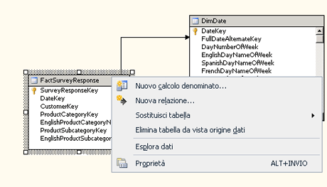

# <a name="define-named-calculations-in-a-data-source-view-analysis-services"></a>Definire calcoli denominati in una vista origine dati (Analysis Services)
  Un calcolo denominato è un'espressione SQL rappresentata come colonna calcolata. Tale espressione presenta l'aspetto e il comportamento di una colonna della tabella. Un calcolo denominato consente di estendere lo schema relazionale delle tabelle o delle viste esistenti in una vista origine dati senza modificare le tabelle o le viste nell'origine dei dati sottostante. Si considerino gli esempi seguenti:  
  
-   Creare un singolo calcolo denominato derivato da più colonne in una tabella dei fatti, ad esempio moltiplicando un'aliquota di imposta per un prezzo di vendita per ottenere l'ammontare delle imposte.  
  
-   Creare un nome descrittivo dell'utente per un membro della dimensione.  
  
-   Come miglioramento delle prestazioni delle query, creare un calcolo denominato nella vista origine dati anziché creare un membro calcolato in un cubo. I calcoli denominati vengono calcolati durante l'elaborazione, mentre i membri calcolati vengono calcolati in fase di query.  
  
## <a name="creating-named-calculations"></a>Creazione di calcoli denominati  
  
> [!NOTE]  
>  Non è possibile aggiungere un calcolo denominato a una query denominata, né basare una query denominata su una tabella contenente un calcolo denominato.  
  
 Quando si crea un calcolo denominato, è necessario specificare un nome, l'espressione SQL e, facoltativamente, una descrizione del calcolo. L'espressione SQL può fare riferimento ad altre tabelle della vista origine dati. Dopo la definizione del nuovo calcolo denominato, l'espressione contenuta all'interno viene inviata al provider dell'origine dei dati e convalidata come istruzione SQL seguente, in cui `<Expression>` contiene l'espressione che definisce il calcolo denominato.  
  
```  
SELECT   
   <Table Name in Data Source>.*,   
   <Expression> AS <Column Name>   
FROM   
   <Table Name in Data Source> AS <Table Name in Data Source View>  
```  
  
 Il tipo di dati della colonna viene determinato in base al tipo di dati del valore scalare restituito dall'espressione. Se il provider non rileva errori nell'espressione, la colonna viene aggiunta alla tabella.  
  
 È necessario che le colonne a cui fa riferimento l'espressione non siano qualificate oppure siano qualificate solo in base al nome della tabella. Per fare riferimento alla colonna SaleAmount di una tabella, ad esempio, è possibile utilizzare `SaleAmount` o `Sales.SaleAmount` , mentre `dbo.Sales.SaleAmount` genera un errore.  
  
 L'espressione non viene racchiusa automaticamente tra parentesi. Se pertanto un'espressione, ad esempio un'istruzione SELECT, richiede le parentesi, è necessario digitarle nella casella **Espressione** . Ad esempio, l'espressione seguente è valida solo se si digitano le parentesi.  
  
```  
(SELECT Description FROM Categories WHERE Categories.CategoryID = CategoryID)  
```  
  
## <a name="add-or-edit-a-named-calculation"></a>Aggiungere o modificare un calcolo denominato  
  
1.  In [!INCLUDE[ssBIDevStudioFull](../../includes/ssbidevstudiofull-md.md)]aprire il progetto o connettersi al database contenente la vista origine dati in cui si desidera definire un calcolo denominato.  
  
2.  In Esplora soluzioni espandere la cartella **Viste origine dati** , quindi fare doppio clic sulla vista origine dati.  
  
3.  Fare clic con il pulsante destro del mouse sulla tabella in cui si desidera definire il calcolo denominato all'interno del riquadro **Tabelle** o **Diagramma** , quindi scegliere **Nuovo calcolo denominato**. Assicurarsi di fare clic con il pulsante destro del mouse sul nome della tabella e non su un attributo. Il menu sarà simile al seguente:  
  
       
  
    > [!NOTE]  
    >  Per individuare una tabella o una vista, è possibile usare l'opzione **Trova tabella** scegliendola dal menu **Vista origine dati** o facendo clic con il pulsante destro del mouse su un'area vuota nei riquadri **Tabelle** o **Diagramma** .  
  
4.  Nella finestra di dialogo **Create Named Calculations (Crea calcolo denominato)** effettuare le operazioni seguenti:  
  
    -   Nella casella di testo **Nome colonna** digitare il nome della nuova colonna.  
  
    -   Nella casella di testo **Descrizione** digitare una descrizione per la nuova colonna.  
  
    -   Nella casella di testo **Espressione** digitare l'espressione che restituisce il contenuto della nuova colonna nel sottolinguaggio SQL appropriato per il provider di dati.  
  
5.  Scegliere **OK**.  
  
     La colonna del calcolo denominato viene visualizzata come ultima colonna nella tabella della vista origine dati. L'icona della calcolatrice indica che nella colonna è contenuto un calcolo denominato.  
  
## <a name="delete-a-named-calculation"></a>Eliminare un calcolo denominato  
 Quando si tenta di eliminare un calcolo denominato, viene visualizzato un elenco degli oggetti definiti nel progetto o nel database che verranno invalidati dall'eliminazione. Esaminare attentamente l'elenco prima di eliminare il calcolo.  
  
## <a name="see-also"></a>Vedere anche  
 [Definire query denominate in una vista origine dati &#40;Analysis Services&#41;](../../analysis-services/multidimensional-models/define-named-queries-in-a-data-source-view-analysis-services.md)  
  
  
