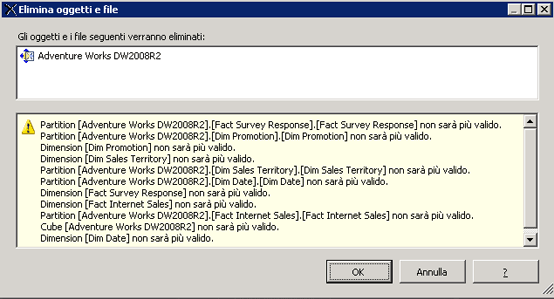

# Eliminare una vista origine dati (Analysis Services)
[!INCLUDE[ssas-appliesto-sqlas](../../includes/ssas-appliesto-sqlas.md)]Se si utilizza una vista origine dati (DSV) non è più in un progetto OLAP, è possibile eliminarlo dal progetto in [!INCLUDE[ssBIDevStudioFull](../../includes/ssbidevstudiofull-md.md)].  
  
 L'eliminazione di una vista origine dati è permanente. Non è possibile ripristinare una vista origine dati eliminata in un progetto o database di [!INCLUDE[ssASnoversion](../../includes/ssasnoversion-md.md)] .  
  
 Non è possibile eliminare viste origine dati da cui dipendono altri oggetti da un database di [!INCLUDE[ssASnoversion](../../includes/ssasnoversion-md.md)] aperto da [!INCLUDE[ssBIDevStudioFull](../../includes/ssbidevstudiofull-md.md)] in modalità online. Per eliminare una vista origine dati da un progetto connesso o da un database in esecuzione in un server, è necessario eliminare innanzitutto tutti gli oggetti nel database di [!INCLUDE[ssASnoversion](../../includes/ssasnoversion-md.md)] che dipendono da tale vista prima di eliminare la vista origine dati stessa.  
  
 Se si elimina una vista origina dati, gli altri oggetti di [!INCLUDE[ssASnoversion](../../includes/ssasnoversion-md.md)] da cui dipendono non saranno validi pertanto, prima di eliminare la vista origine dati, si esaminerà l'elenco di oggetti che diventeranno non validi una volta rimossa tale vista. Esaminare con attenzione l'elenco per assicurarsi che non siano inclusi oggetti che si prevede di utilizzare ancora.  
  
   
  
## Vedere anche  
 [Viste origine dati in modelli multidimensionali](../../analysis-services/multidimensional-models/data-source-views-in-multidimensional-models.md)   
 [Modificare le proprietà in una vista origine dati &#40;Analysis Services&#41;](../../analysis-services/multidimensional-models/change-properties-in-a-data-source-view-analysis-services.md)  
  
  
