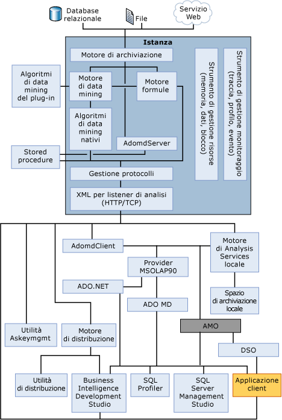

# Componenti del server del motore OLAP
[!INCLUDE[ssas-appliesto-sqlas](../../../includes/ssas-appliesto-sqlas.md)]Il componente server di [!INCLUDE[msCoName](../../../includes/msconame-md.md)] [!INCLUDE[ssNoVersion](../../../includes/ssnoversion-md.md)] [!INCLUDE[ssASnoversion](../../../includes/ssasnoversion-md.md)] è il **msmdsrv.exe** applicazione, che viene eseguito come servizio Windows. Questa applicazione è costituita da componenti di sicurezza, un componente listener XML for Analysis (XMLA), un componente di elaborazione delle query e numerosi altri componenti interni che svolgono le funzioni seguenti:  
  
-   Analisi di istruzioni ricevute dai client  
  
-   Gestione di metadati  
  
-   Gestione di transazioni  
  
-   Elaborazione di calcoli  
  
-   Archiviazione di dati relativi a dimensioni e celle  
  
-   Creazione di aggregazioni  
  
-   Pianificazione di query  
  
-   Memorizzazione di oggetti nella cache  
  
-   Gestione di risorse del server  
  
## Diagramma dell'architettura  
 Un'istanza di [!INCLUDE[ssASnoversion](../../../includes/ssasnoversion-md.md)] viene eseguita come un servizio autonomo e la comunicazione con il servizio avviene tramite XML for Analysis (XMLA), usando HTTP o TCP. AMO è un livello tra l'applicazione utente e l'istanza di [!INCLUDE[ssASnoversion](../../../includes/ssasnoversion-md.md)]. Questo livello fornisce accesso agli oggetti amministrativi [!INCLUDE[ssASnoversion](../../../includes/ssasnoversion-md.md)]. AMO è una libreria di classi che accetta i comandi da un'applicazione client e li converte in messaggi XMLA per l'istanza di [!INCLUDE[ssASnoversion](../../../includes/ssasnoversion-md.md)] . AMO presenta oggetti dell'istanza di [!INCLUDE[ssASnoversion](../../../includes/ssasnoversion-md.md)] come classi all'applicazione dell'utente finale, coi membri dei metodi che eseguono i comandi e i membri delle proprietà che utilizzano i dati per gli oggetti di [!INCLUDE[ssASnoversion](../../../includes/ssasnoversion-md.md)] .  
  
 Nell'illustrazione seguente sono mostrati i componenti dell'architettura [!INCLUDE[ssASnoversion](../../../includes/ssasnoversion-md.md)], inclusi tutti gli elementi principali che sono in esecuzione all'interno dell'istanza di [!INCLUDE[ssASnoversion](../../../includes/ssasnoversion-md.md)] e tutti i componenti dell'utente che interagiscono con essa. L'illustrazione mostra anche che il solo modo di accedere all'istanza è tramite il listener di XML for Analysis (XMLA), utilizzando HTTP o TCP.  
  
   
  
## Listener XMLA  
 Il componente listener XMLA gestisce tutte le comunicazioni XMLA tra [!INCLUDE[ssASnoversion](../../../includes/ssasnoversion-md.md)] e i relativi client. È possibile usare l'impostazione di configurazione [!INCLUDE[ssASnoversion](../../../includes/ssasnoversion-md.md)] **Port** nel file msmdsrv.ini per specificare la porta su cui è in ascolto un'istanza di [!INCLUDE[ssASnoversion](../../../includes/ssasnoversion-md.md)] . Un valore 0 in questo file indica che [!INCLUDE[ssASnoversion](../../../includes/ssasnoversion-md.md)] è in ascolto sulla porta predefinita. Se non specificato diversamente, [!INCLUDE[ssASnoversion](../../../includes/ssasnoversion-md.md)] userà le porte TCP predefinite seguenti:  
  
|Port|Description|  
|----------|-----------------|  
|2383|Istanza predefinita di [!INCLUDE[ssNoVersion](../../../includes/ssnoversion-md.md)] [!INCLUDE[ssASnoversion](../../../includes/ssasnoversion-md.md)].|  
|2382|Redirector per altre istanze di [!INCLUDE[ssNoVersion](../../../includes/ssnoversion-md.md)] [!INCLUDE[ssASnoversion](../../../includes/ssasnoversion-md.md)].|  
|Assegnata dinamicamente all'avvio del server|Istanza denominata di [!INCLUDE[ssNoVersion](../../../includes/ssnoversion-md.md)] [!INCLUDE[ssASnoversion](../../../includes/ssasnoversion-md.md)].|  
  
 Vedere [configurare Windows Firewall per consentire l'accesso ad Analysis Services](../../../analysis-services/instances/configure-the-windows-firewall-to-allow-analysis-services-access.md) per altri dettagli.  
  
## Vedere anche  
 [Oggetto denominazione regole &#40; Analysis Services &#41;](../../../analysis-services/multidimensional-models/olap-physical/object-naming-rules-analysis-services.md)   
 [Architettura fisica &#40; Analysis Services - dati multidimensionali &#41;](../../../analysis-services/multidimensional-models/olap-physical/understanding-microsoft-olap-physical-architecture.md)   
 [Architettura logica &#40; Analysis Services - dati multidimensionali &#41;](../../../analysis-services/multidimensional-models/olap-logical/understanding-microsoft-olap-logical-architecture.md)  
  
  
