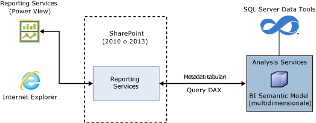
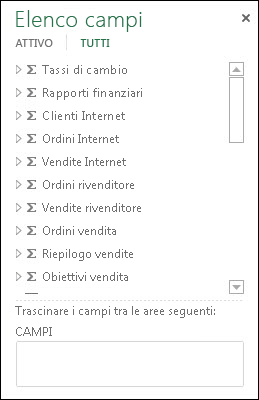
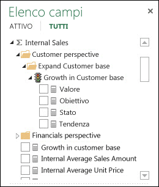
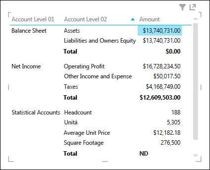
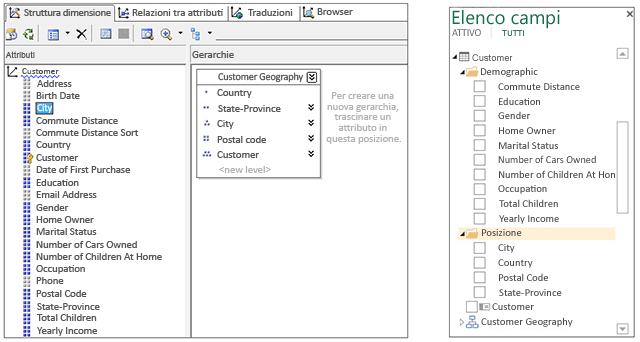
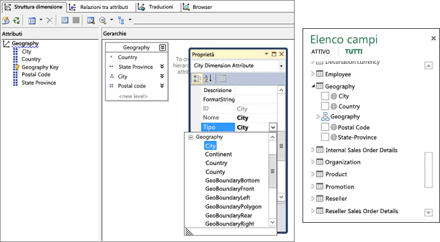
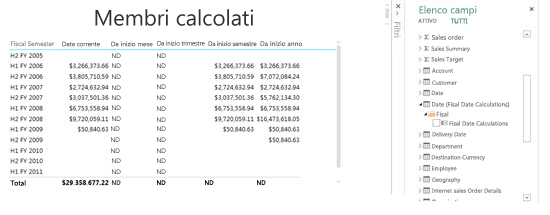
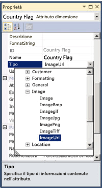
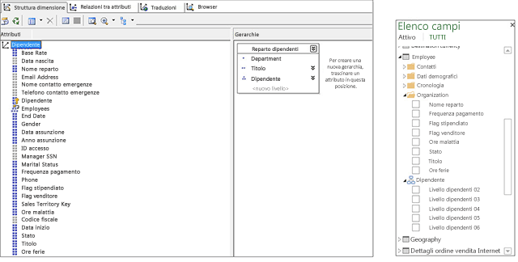
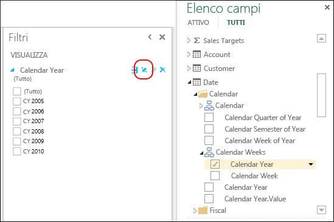

# <a name="understanding-power-view-for-multidimensional-models"></a>Informazioni su Power View per modelli multidimensionali
[!INCLUDE[ssas-appliesto-sqlas](../../includes/ssas-appliesto-sqlas.md)]In questo articolo descrive la funzionalità Power View per modelli multidimensionali in SQL Server e fornisce informazioni importanti per i professionisti di Business Intelligence e gli amministratori che intendono implementare Power View per modelli multidimensionali nelle loro organizzazioni.  
  
 I modelli multidimensionali offrono soluzioni di analisi, archiviazione e modellazione di dati OLAP all'avanguardia nel settore. I modelli multidimensionali in SQL Server supportano le attività di visualizzazione, esplorazione e analisi dei dati ad-hoc con Microsoft Power View.  
  
 Power View è un thin web client che viene avviato nel browser da un file RSDS (Report Data Source) condiviso in una raccolta SharePoint. L'origine dati report funge da ponte tra il client e l'origine dati back-end. L'origine dati back-end può essere una cartella di lavoro di [!INCLUDE[ssGemini](../../includes/ssgemini-md.md)] in SharePoint, un modello tabulare in un server Analysis Services in esecuzione in modalità tabulare o un server Analysis Services in esecuzione in modalità multidimensionale. I report di Power View possono essere salvati in una raccolta SharePoint e condivisi con altri membri dell'organizzazione.  
  
 **Architettura di Power View per modelli multidimensionali**  
  
   
  
## <a name="prerequisites"></a>Prerequisiti  
 **Requisiti del server**  
  
-   Microsoft SQL Server 2016 Analysis Services in esecuzione in modalità multidimensionale.  
  
-   Componente aggiuntivo Microsoft SQL Server 2016 Reporting Services per Microsoft SharePoint Server 2010 o versione successiva Enterprise Edition.  
  
 **Requisiti del client**  
  
-   La funzionalità client di Power View richiede Microsoft Silverlight 5. Per altre informazioni, vedere [Supporto browser per Reporting Services e Power View](../../reporting-services/browser-support-for-reporting-services-and-power-view.md).  
  
## <a name="features"></a>Funzionalità  
 **Supporto nativo per Power View**  
  
 Con questa versione, i modelli multidimensionali supportano l'analisi e la visualizzazione utilizzando Power View in modalità SharePoint. I modelli multidimensionali non richiedono alcuna configurazione speciale. Esistono tuttavia alcune differenze tra il modo in cui gli oggetti modello multidimensionale vengono visualizzati in Power View rispetto ad altri strumenti client come Microsoft Excel e Microsoft Performance Point. Questa versione non supporta l'analisi e la visualizzazione dei modelli multidimensionali con Power View in Excel.  
  
 **Supporto nativo per le query DAX**  
  
 Con questa versione, i modelli multidimensionali supportano le funzioni e le query DAX oltre alle query MDX più tradizionali. Alcune funzioni DAX, ad esempio PATH, non sono applicabili ai modelli multidimensionali. Per una migliore comprensione di DAX e delle differenze rispetto a MDX, vedere [Data Analysis Expressions e MDX](http://msdn.microsoft.com/library/ff487170\(SQL.105\).aspx).  
  
## <a name="multidimensional-to-tabular-object-mapping"></a>Mapping di oggetti da multidimensionali a tabulari  
 Analysis Services offre una rappresentazione dei metadati del modello tabulare di un modello multidimensionale. Gli oggetti di un modello multidimensionale sono rappresentati come oggetti tabulari in Power View e in CSDL con annotazioni BI.  
  
 **Riepilogo del mapping degli oggetti**  
  
|Oggetto multidimensionale|Oggetto tabulare|  
|-----------------------------|--------------------|  
|Cube|Modello|  
|Dimensione cubo|Tabella|  
|Attributi dimensione (Chiave/i, Nome)|Colonna|  
|Gruppo di misure|Tabella|  
|Misura|Misura|  
|Misura senza gruppo di misure|In una tabella denominata Misure|  
|Relazione gruppo di misure dimensione del cubo|Relazione|  
|Prospettiva|Prospettiva|  
|Indicatore KPI|Indicatore KPI|  
|Gerarchie utente/padre-figlio|Gerarchia|  
|Cartella di visualizzazione|Cartella di visualizzazione|  
  
## <a name="measures-measure-groups-and-kpis"></a>Misure, gruppi di misure e indicatori KPI  
  
> [!NOTE]  
>  Alcune immagini e il testo contenuti in questo articolo fanno riferimento al modello multidimensionale di Adventure Works per il database di esempio SQL Server 2012.  
  
 I gruppi di misure in un cubo multidimensionale sono visibili nell'elenco campi di Power View come tabelle con il segno sigma (∑).  
  
 **Gruppi di misure nell'elenco campi di Power View**  
  
   
  
 Le misure in un gruppo di misure vengono visualizzate come misure. Eventuali misure calcolate a cui non è associato un gruppo di misure verranno raggruppate in una tabella speciale denominata Misure.  
  
 Per semplificare modelli multidimensionali più complessi, gli autori possono definire un set di misure o indicatori KPI in un cubo da inserire in una cartella di visualizzazione. Tramite Power View è possibile mostrare le cartelle di visualizzazione e le misure e gli indicatori KPIs in esse contenuti.  
  
 **Misure e indicatori KPI in un gruppo di misure**  
  
   
  
### <a name="measures-as-variants"></a>Misure come varianti  
 Le misure nei modelli multidimensionali sono varianti. Ciò significa che le misure non sono fortemente tipizzate e che possono avere tipi di dati diversi. Ad esempio, nell'immagine riportata di seguito la misura Amount nella tabella Financial Reporting è per impostazione predefinita il tipo di dati Currency, ma ha anche un valore stringa "NA" per il subtotale "Statistical Accounts", che è un tipo di dati String. Power View riconosce alcune misure come varianti e mostra la formattazione e i valori corretti nelle diverse visualizzazioni.  
  
 **Misura come variante**  
  
   
  
### <a name="implicit-measures"></a>Misure implicite  
 I modelli tabulari permettono agli utenti di creare misure *implicite* come conteggio, somma o media dei campi. Per i modelli multidimensionali, poiché i dati dell'attributo dimensione sono archiviati in modo diverso, l'esecuzione di query su misure implicite può richiedere molto tempo. Per questo motivo, le misure implicite non sono disponibili in Power View.  
  
## <a name="dimensions-attributes-and-hierarchies"></a>Dimensioni, attributi e gerarchie  
 Le dimensioni del cubo vengono esposte come tabelle nei metadati tabulari. Nell'elenco campi di Power View gli attributi dimensione vengono mostrati come colonne nelle cartelle di visualizzazione  Gli attributi dimensione la cui proprietà AttributeHierarchyEnabled è impostata su false, ad esempio l'attributo Birth Date nella dimensione Customer o la proprietà AttributeHierarchyVisible impostata su false, non sono visibili nell'elenco campi di Power View. Le gerarchie multilivello o le gerarchie utente, ad esempio Customer Geography nella dimensione Customer, vengono esposte come gerarchie nell'elenco campi di Power View. Gli elementi UnknownMembers nascosti di un attributo dimensione sono esposti nelle query DAX e in Power View.  
  
 **Dimensione, attributi e gerarchie in SQL Server Data Tools (SSDT) e nell'elenco campi di Power View**  
  
   
  
### <a name="dimension-attribute-type"></a>Tipo di attributo dimensione  
 I modelli multidimensionali supportano l'associazione degli attributi dimensione a tipi di attributi dimensione specifici. Nell'immagine riportata di seguito viene illustrata la dimensione Geography ai cui attributi dimensione City, State-Province, Country e Postal Code sono associati tipi geography. Questi sono esposti nei metadati tabulari. Power View riconosce i metadati che consentono agli utenti di creare viste mappa. Questo è indicato dall'icona mappa accanto alle colonne City, Country, Postal Code e State-Province nella tabella Geography nell'elenco campi di Power View.  
  
 **Tipi geography dell'attributo dimensione in SSDT e nell'elenco campi di Power View**  
  
   
  
### <a name="dimension-calculated-members"></a>Membri calcolati della dimensione  
 I modelli multidimensionali supportano i membri calcolati per l'elemento figlio di All con un membro reale singolo. Di seguito sono riportati vincoli aggiuntivi riguardanti l'esposizione di questo tipo di membro calcolato:  
  
-   Deve essere un membro reale singolo quando la dimensione presenta più di un attributo.  
  
-   Un attributo contenente membri calcolati non può essere l'attributo chiave della dimensione, a meno che non sia l'unico attributo.  
  
-   Un attributo contenente membri calcolati non può essere un attributo padre-figlio.  
  
 I membri calcolati delle gerarchie utente non vengono esposti in Power View. Gli utenti finali non saranno tuttavia in grado di connettersi a un cubo contenente membri calcolati su gerarchie utente.  
  
 Nell'immagine riportata di seguito viene illustrato un report di Power View per un cubo contenente membri calcolati di Business Intelligence per le gerarchie temporali sull'attributo dimensione "Fiscal Date Calculations" nella dimensione Date.  
  
 **Report di Power View con membri calcolati**  
  
   
  
### <a name="default-members"></a>Membri predefiniti  
 I modelli multidimensionali supportano i membri predefiniti per gli attributi dimensione. Il membro predefinito viene utilizzato da Analysis Services nel corso dell'aggregazione di dati per una query. Il membro predefinito di un attributo dimensione viene esposto come filtro o valore predefinito per la colonna corrispondente nei metadati tabulari.  
  
 Per l'applicazione degli attributi, Power View si comporta come le tabelle pivot di Excel. Quando un utente aggiunge una colonna a una visualizzazione di Power View (tabella, matrice o grafico) che contiene un valore predefinito, quest'ultimo non verrà applicato e verranno mostrati tutti i valori disponibili. Se l'utente aggiunge la colonna a Filters, verrà applicato il valore predefinito.  
  
### <a name="dimension-security"></a>Sicurezza delle dimensioni  
 I modelli multidimensionali supportano la sicurezza a livello di dimensione e di cella attraverso i ruoli. Un utente che si connette a un cubo tramite Power View viene autenticato e valutato per accertare che disponga delle autorizzazioni appropriate. Quando si applica la sicurezza a livello di dimensione, i membri di quest'ultima non verranno visti dall'utente in Power View, tuttavia se per un utente è stata definita un'autorizzazione di sicurezza a livello di cella con restrizioni per alcune celle, quell'utente non potrà connettersi al cubo con Power View. In alcuni casi, gli utenti possono vedere dati aggregati se porzioni di questi dati sono calcolate in base a dati sicuri.  
  
### <a name="non-aggregatable-attributeshierarchies"></a>Gerarchie/attributi non aggregabili  
 In un modello multidimensionale per gli attributi di una dimensione la proprietà IsAggregatable può essere impostata su false. Ciò significa che l'autore del modello ha specificato che le applicazioni client non devono aggregare i dati tra gerarchie (attributo o multilivello) quando si eseguono query sui dati. In Power View questo attributo dimensione viene esposto come colonna per cui non sono disponibili subtotali. Nell'immagine riportata di seguito è riportato un esempio di una gerarchia non aggregabile: Accounts. Il livello superiore della gerarchia padre-figlio Accounts è non aggregabile, mentre altri livelli lo sono. In una visualizzazione matrice della gerarchia Accounts (primi due livelli), sono visibili i subtotali per Account Level 02, ma non per il livello superiore, Account Level 01.  
  
 **Gerarchia non aggregabile in Power View**  
  
   
  
## <a name="images"></a>Immagini  
 Tramite Power View è possibile eseguire il rendering delle immagini. Nei modelli multidimensionali uno dei modi in cui fornire immagini a Power View consiste nell'esporre le colonne che contengono gli URL (Uniform Resource Locator) delle immagini. Con questa versione, Analysis Services consente di contrassegnare gli attributi dimensione come tipi ImageURL. Questo tipo di dati viene fornito a Power View nei metadati tabulari. Da Power View sarà quindi possibile scaricare e visualizzare le immagini specificate negli URL all'interno delle visualizzazioni.  
  
 **Tipo di attributo dimensione ImageURL in SSDT**  
  
   
  
## <a name="parent-child-hierarchies"></a>Gerarchie padre-figlio  
 I modelli multidimensionali supportano le gerarchie padre-figlio, esposte come gerarchia nei metadati tabulari. Ogni livello della gerarchia padre-figlio viene esposto come colonna nascosta. L'attributo chiave della dimensione padre-figlio non viene esposto nei metadati tabulari.  
  
 **Gerarchie padre-figlio in Power View**  
  
   
  
## <a name="perspectives-and-translations"></a>Prospettive e traduzioni  
 Le prospettive sono viste dei cubi in cui solo alcune dimensioni o gruppi di misure sono visibili negli strumenti client. È possibile specificare un nome di prospettiva come valore per la proprietà Cube della stringa di connessione. Ad esempio, nella stringa di connessione seguente 'Direct Sales' è una prospettiva nel modello multidimensionale:  
  
 `Data Source=localost;Initial Catalog=AdventureWorksDW-MD;Cube='Direct Sales'`  
  
 I cubi possono presentare metadati e traduzioni di dati specificati per varie lingue all'interno del modello. Per visualizzare le traduzioni (dati e metadati), è necessario aggiungere la proprietà "Locale Identifier" facoltativa alla stringa di connessione nel file RSDS come illustrato di seguito.  
  
 `Data Source=localost;Initial Catalog=AdventureWorksDW-MD;Cube='Adventure Works'; Locale Identifier=3084`  
  
 Quando Power View si connette a un modello multidimensionale con un file RSDS contenente un identificatore delle impostazioni locali e nel cubo è presente una traduzione corrispondente, le traduzioni saranno visibili in Power View.  
  
 Per altre informazioni, vedere [Creazione di un'origine dati del report](../../analysis-services/multidimensional-models/create-a-report-data-source.md).  
  
## <a name="power-view-pinned-filters"></a>Filtri bloccati di Power View  
 I report di Power View possono contenere più viste. Con questa versione, la funzionalità *Aggiungi filtro* per i modelli tabulari e multidimensionali permette di creare filtri applicabili a tutte le viste di un report. Nell'immagine seguente è riportato il pulsante interruttore blocco filtro per un filtro vista. Per impostazione predefinita, un filtro vista è sbloccato e si applica solo a quella vista. Quando si blocca un filtro vista lo si applica a tutte le viste, quando lo si blocca lo si rimuove da altre viste.  
  
 **Filtri bloccati**  
  
   
  
## <a name="unsupported-features"></a>Funzionalità non supportate  
 **Power View in Excel 2013** : non supporta la connessione a report per modelli multidimensionali né la loro creazione. **Power View in Excel 2016** , invece, supporta queste operazioni. Per altre informazioni, vedere [Power View e OLAP in Excel 2016](https://support.office.com/en-us/article/power-view-and-olap-in-excel-2016-ea5ff7a5-ea5f-48d4-aeb0-98c89ab738ac)  
  
 **Azioni** : non sono supportate nei report Power View o nelle query DAX su un modello multidimensionale.  
  
 **Set denominati** : nei modelli multidimensionali non sono supportati in Power View o nelle query DAX su un modello multidimensionale.  
  
> [!NOTE]  
>  I set denominati e le azioni non supportati impediscono agli utenti di connettersi a e di esplorare i modelli multidimensionali tramite Power View.  
  
 **Sicurezza a livello di cella** : non è supportata nei report Power View.  
  
## <a name="csdlbi-annotations"></a>Annotazioni CSDLBI  
 I metadati dei cubi multidimensionali vengono esposti come modello concettuale basato su Entity Data Model (EDM) dalle annotazioni Conceptual Schema Definition Language with Business Intelligence (CSDLBI).  
  
 I metadati multidimensionali sono rappresentati come spazio dei nomi del modello tabulare in un documento CSDLBI o CSDL in uscita, quando una richiesta DISCOVER_CSDL_METADATA viene inviata all'istanza di Analysis Services.  
  
 **Richiesta DISCOVER_CSDL_METADATA di esempio**  
  
```  
<Envelopexmlns=”http://schemas.xmlsoap.org/soap/envelope/”>  
   <Body>  
      <Discoverxmlns=”urn:schemas-microsoft-com:xml-analysis”>  
         <RequestType>DISCOVER_CSDL_METADATA</RequestType>  
         <Restrictions>  
            <RestrictionList>  
              <CATALOG_NAME>”catalogname”<CATALOG_NAME>  
            </RestrictionList>  
         </Restrictions>  
         <Properties>  
            <PropertyList>  
            </PropertyList>  
         </Properties>  
      </Discover>  
   </Body>  
</Envelope>  
  
```  
  
 La richiesta DISCOVER_CSDL_METADATA presenta le restrizioni seguenti:  
  
|Nome|Obbligatorio|Description|  
|----------|--------------|-----------------|  
|CATALOG_NAME|Sì|Nome del catalogo\database.|  
|PERSPECTIVE_NAME|Sì, se il cubo contiene più di una prospettiva. Facoltativo se è presente un solo cubo o una prospettiva predefinita.|Nome del cubo o della prospettiva nel database multidimensionale.|  
|VERSION|Sì|Versione CSDL richiesta dal client. I costrutti e le funzionalità multidimensionali sono supportati nella versione 2.0.|  
  
 Il documento CSDL in uscita restituito rappresenta il modello come spazio dei nomi, contenente entità, associazioni e proprietà.  
  
 Per informazioni dettagliate sulle annotazioni CSDLBI per i modelli tabulari, vedere [Riferimento tecnico per le annotazioni di Business Intelligence per CSDL](../../analysis-services/tabular-model-programming-compatibility-levels-1050-1103/conceptual-schema-definition-language-csdl/technical-reference-for-bi-annotations-to-csdl.md) in MSDN e [\[MS-CSDLBI\]: Formato di file delle definizioni dello schema concettuale con annotazioni di Business Intelligence](http://msdn.microsoft.com/library/jj161299\(SQL.105\).aspx).  
  
## <a name="client-help-on-officecom"></a>Guida del client su Office.com  
 Negli articoli seguenti, disponibili su Office.com, vengono fornite ulteriori informazioni sulla modalità di visualizzazione degli oggetti del modello multidimensionale in Power View e sulla creazione di un report di esempio:  
  
 [Oggetti del modello multidimensionale in Power View](http://office.microsoft.com/en-us/excel-help/understanding-multidimensional-model-objects-in-power-view-HA104018589.aspx)  
  
 [Esplorare il modello multidimensionale di Adventure Works tramite Power View](http://office.microsoft.com/excel-help/explore-the-adventure-works-multidimensional-model-by-using-power-view-HA104046830.aspx)  
  
  
