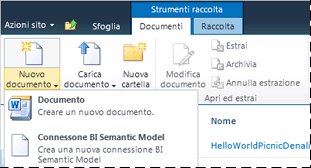

# Tipo di contenuto connessione BI Semantic Model di aggiungere alla raccolta
[!INCLUDE[ssas-appliesto-sqlas](../../includes/ssas-appliesto-sqlas.md)]
Una connessione BISM viene creata in SharePoint e fornisce il reindirizzamento ai dati Business Intelligence Semantic Model in una cartella di lavoro di [!INCLUDE[ssGemini](../../includes/ssgemini-md.md)] o un database modello tabulare di Analysis Services in un server di rete. Prima di creare una connessione BISM in SharePoint, è necessario estendere una raccolta documenti per consentire la creazione di un file con estensione bism. Questo passaggio deve essere eseguito solo una volta per ogni raccolta, tuttavia sarà necessario ripeterlo per qualsiasi raccolta da cui si desidera creare file con estensione bism. In base alle procedure consigliate, è opportuno creare una raccolta centralizzata per l'archiviazione di file con estensione bism in modo da poter gestire le autorizzazioni da un'unica posizione.  
  
> [!NOTE]  
>  Se si utilizzano già raccolte connessioni dati SharePoint, il tipo di contenuto della connessione BISM viene aggiunto automaticamente a tale modello di raccolta. È possibile ignorare i passaggi descritti in questa sezione se si utilizza una raccolta connessioni dati che consente già di creare nuovi documenti di connessione BISM.  
  
##   Aggiungere il tipo di contenuto a una raccolta documenti  
 È necessario disporre almeno dell'autorizzazione Gestione elenchi per aggiungere e configurare un tipo di contenuto. Questa autorizzazione viene compilata nel livello di autorizzazione Progettazione e superiore.  
  
 Nel sito che contiene la raccolta documenti deve essere configurata l'attivazione delle funzionalità di [!INCLUDE[ssGemini](../../includes/ssgemini-md.md)] per SharePoint. Per altre informazioni, vedere [Attivare l'integrazione delle funzionalità di Power Pivot per le raccolte siti in Amministrazione centrale](../../analysis-services/power-pivot-sharepoint/activate-power-pivot-integration-for-site-collections-in-ca.md).  
  
1.  Aprire la raccolta documenti per cui si desidera abilitare il tipo di contenuto della connessione BISM.  
  
2.  Sulla barra multifunzione di SharePoint, in Strumenti raccolta fare clic su **Raccolta**.  
  
3.  Fare clic su **Impostazioni raccolta**.  
  
4.  In Impostazioni generali scegliere **Impostazioni avanzate**.  
  
5.  In Tipi di contenuto nella sezione "Consenti la gestione di più tipi di contenuto:" scegliere **Sì**.  
  
6.  Scegliere **OK**.  
  
7.  Nella sezione Tipi di contenuto fare clic su **Aggiungi da tipi di contenuto del sito esistenti**. Se questa pagina non viene visualizzata, tornare al sito, fare clic su **Raccolta** in Strumenti raccolta, quindi scegliere **Impostazioni raccolta**.  
  
8.  In Tipi di contenuto fare clic su **Aggiungi da tipi di contenuto del sito esistenti**.  
  
9. In Seleziona tipi di contenuto del sito da: scegliere **Business Intelligence**.  
  
10. In Tipi di contenuto del sito disponibili selezionare **File di connessione BISM**, quindi scegliere **Aggiungi** per spostare il tipo di contenuto selezionato nell'elenco Tipi di contenuto da aggiungere.  
  
11. Scegliere **OK**.  
  
12. Per verificare l'aggiunta del tipo di contenuto, tornare alla raccolta e fare clic su **Nuovo documento** nell'area Documenti della barra multifunzione della raccolta. Nell'elenco Nuovi documenti dovrebbe essere presente **File di connessione BISM** .  
  
       
  
 Dopo avere abilitato il tipo di contenuto della connessione BISM per una raccolta, è possibile creare una connessione che fornisce il reindirizzamento ai dati BISM che possono essere utilizzati da report di Excel o [!INCLUDE[ssCrescent](../../includes/sscrescent-md.md)] . Per ulteriori informazioni su questa operazione, utilizzare i collegamenti seguenti:  
  
 [Creare una connessione BISM (BI Semantic Model) a una cartella di lavoro di PowerPivot](../../analysis-services/power-pivot-sharepoint/create-a-bi-semantic-model-connection-to-a-power-pivot-workbook.md)  
  
 [Creare una connessione BISM a un database modello tabulare](../../analysis-services/power-pivot-sharepoint/create-a-bi-semantic-model-connection-to-a-tabular-model-database.md)  
  
## Vedere anche  
 [Connessione BI Semantic Model di PowerPivot &#40;.bism&#41;](../../analysis-services/power-pivot-sharepoint/power-pivot-bi-semantic-model-connection-bism.md)   
 [Utilizzare una connessione BI Semantic Model in Excel o Reporting Services](../../analysis-services/power-pivot-sharepoint/use-a-bi-semantic-model-connection-in-excel-or-reporting-services.md)  
  
  
