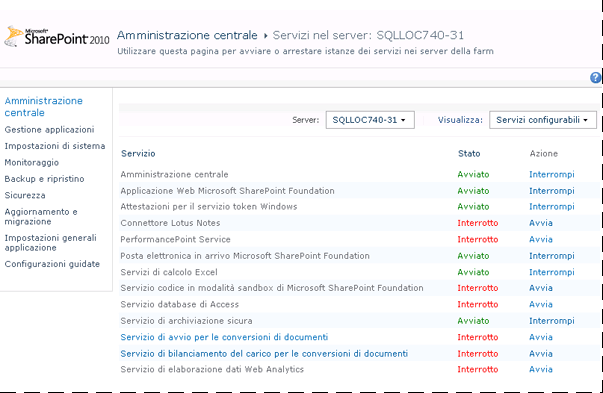
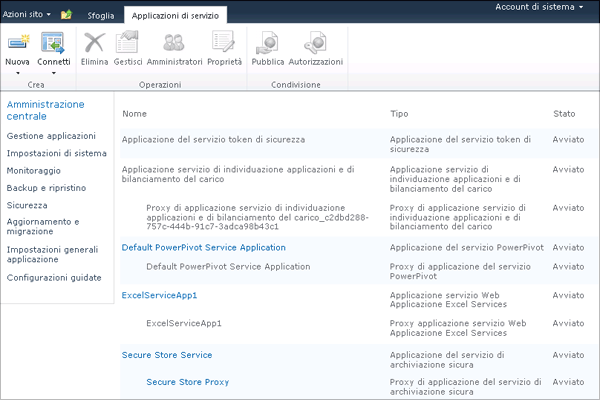
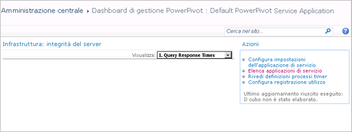

# <a name="configure-power-pivot-health-rules"></a>Configurare le regole di integrità di Power Pivot
[!INCLUDE[ssGemini_md](../../includes/ssgemini-md.md)] per SharePoint include regole di integrità di SharePoint che consentono di monitorare e risolvere i problemi di disponibilità e configurazione. Le regole di integrità che si applicano a [!INCLUDE[ssGemini_md](../../includes/ssgemini-md.md)] per SharePoint vengono visualizzate nella pagina Controlla definizioni regole.  
  
 Le regole di integrità consentono di rilevare in anticipo problemi relativi al server che potrebbero eventualmente comportare interruzioni del servizio. [!INCLUDE[ssGemini_md](../../includes/ssgemini-md.md)] per SharePoint include diverse regole per l'identificazione e la risoluzione dei problemi prima che questi abbiano un impatto sugli utenti. È possibile personalizzare molte di queste regole per adattarle alle caratteristiche univoche della distribuzione in uso. Se si desidera ad esempio più tempo per risolvere avvisi relativi allo spazio su disco, è possibile aumentare la percentuale di spazio su disco disponibile dal 5% al 10% in modo da ricevere prima l'avviso.  
  
 Le regole che possono essere personalizzate sono quelle che consentono di segnalare l'utilizzo delle risorse o la disponibilità del server. La personalizzazione è utile in queste aree in quanto la capacità del sistema sottostante varia ampiamente tra topologie di distribuzione e server differenti. Non è invece disponibile alcuna personalizzazione per le regole che consentono l'identificazione di problemi riguardanti la sicurezza o la configurazione del server. Tali regole devono essere applicate in modo uniforme in tutte le installazioni.  
  
||  
|-|  
|**[!INCLUDE[applies](../../includes/applies-md.md)]** SharePoint 2013 &#124; SharePoint 2010|  
  
 **Nota:** le impostazioni delle regole di integrità vengono configurate separatamente per l'istanza di SQL Server Analysis Services e l'applicazione del servizio [!INCLUDE[ssGemini_md](../../includes/ssgemini-md.md)]. Utilizzare le istruzioni riportate in questo argomento per configurare le regole di integrità per ogni servizio. Per una distribuzione di SharePoint 2013, in [!INCLUDE[ssGeminiShort](../../includes/ssgeminishort-md.md)] viene utilizzata solo l'applicazione di servizio. Pertanto con [!INCLUDE[ssGeminiShort](../../includes/ssgeminishort-md.md)] vengono installati differenti set di regole di integrità per versioni diverse di SharePoint. Vedere la colonna della versione nell'argomento [Guida di riferimento alle regole dell'integrità &#40;PowerPivot per SharePoint&#41;](../../analysis-services/power-pivot-sharepoint/health-rules-reference-power-pivot-for-sharepoint.md) oppure è possibile eseguire il comando seguente di Windows PowerShell per visualizzare le regole installate.  
  
```  
Get-SPHealthAnalysisRule | select name, enabled, summary | where {$_.summary -like “*power*”}  | format-table -property * -autosize | out-default  
```  
  
 **Contenuto dell'argomento:**  
  
 [Visualizzare le regole di integrità di Power Pivot](#bkmk_view)  
  
 [Configurare le regole di integrità utilizzate per valutare la stabilità del server (SQL Server Analysis Services)](#bkmk_HR_SSAS)  
  
 [Configurare le regole di integrità usate per valutare la stabilità dell'applicazione (applicazione del servizio Power Pivot)](#bkmk_evaluate_application_stability)  
  
## <a name="prerequisites"></a>Prerequisiti  
 È necessario essere un amministratore dell'applicazione di servizio per modificare le proprietà di configurazione dell'istanza di Analysis Services e dell'applicazione del servizio [!INCLUDE[ssGemini_md](../../includes/ssgemini-md.md)] .  
  
##  <a name="bkmk_view"></a> Visualizzare le regole di integrità di Power Pivot  
  
1.  In Amministrazione centrale SharePoint fare clic su **Monitoraggio**e nella sezione **Analizzatore dell'integrità** fare clic su **Controlla definizioni regole**.  
  
2.  Nella sezione Configurazione individuare le regole con il prefisso **[!INCLUDE[ssGemini_md](../../includes/ssgemini-md.md)]:** . Tutte le regole di integrità correlate a [!INCLUDE[ssGemini_md](../../includes/ssgemini-md.md)]hanno questo prefisso per facilitarne la distinzione dalle regole predefinite di SharePoint.  
  
 Queste regole verranno visualizzate nella pagina **Controlla problemi e soluzioni** in caso di problemi.  
  
 Se si sospetta un problema e si desidera controllare immediatamente, per rilevarne l'eventuale presenza è possibile eseguire manualmente una verifica della regola.  
  
 A tale scopo, fare clic sulla regola per aprirne la definizione, quindi fare clic su **Esegui ora** sulla barra multifunzione. Fare clic su **Chiudi** per tornare alla pagina **Controlla problemi e soluzioni** per visualizzare il report. Se tramite la regola viene rilevato un problema, un avviso o un errore sarà segnalato nella pagina. In alcuni casi, la visualizzazione dell'errore o dell'avviso può richiedere alcuni minuti.  
  
##  <a name="bkmk_HR_SSAS"></a> Configurare le regole di integrità utilizzate per valutare la stabilità del server (SQL Server Analysis Services)  
 Nell'istanza di Analysis Services sono incluse regole di integrità tramite cui vengono rilevati problemi a livello di sistema (CPU, memoria e spazio su disco utilizzato per la memorizzazione nella cache). Utilizzare le istruzioni seguenti per modificare le soglie che consentono l'attivazione di regole di integrità specifiche.  
  
1.  Nella sezione **Impostazioni sistema** di Amministrazione centrale SharePoint fare clic su **Gestisci servizi nel server**.  
  
2.  Nella parte superiore della pagina selezionare il server nella farm di SharePoint con un'istanza di Analysis Services (nell'illustrazione seguente il nome del server è AW-SRV033). Nell'elenco dei servizi verrà visualizzato**SQL Server Analysis Services** .  
  
       
  
3.  Scegliere **SQL Server Analysis Services**.  
  
4.  Nelle pagine delle proprietà del servizio, in Impostazioni regole di analisi dell'integrità modificare le impostazioni seguenti:  
  
     Allocazione di risorse di CPU insufficiente (l'impostazione predefinita è 80%)  
     Questa regola di analisi dell'integrità viene attivata se le risorse CPU utilizzate dal processo del server Analysis Services (msmdsrv.exe) rimangono su un valore uguale o superiore all'80% nell'arco di 4 ore (come specificato dall'impostazione Intervallo raccolta dati).  
  
     Questa impostazione di configurazione corrisponde alla definizione della regola seguente nella pagina **Controlla problemi e soluzioni** : **[!INCLUDE[ssGemini_md](../../includes/ssgemini-md.md)]: Analysis Services non ha risorse di CPU sufficienti per eseguire le operazioni richieste.**  
  
     Risorse di CPU insufficienti nel sistema (l'impostazione predefinita è 90%)  
     Questa regola di analisi dell'integrità viene attivata se le risorse di CPU per il server rimangono su un valore uguale o superiore al 90% nell'arco di 4 ore (come specificato dall'impostazione Intervallo raccolta dati). L'utilizzo della CPU complessivo è misurato come parte dell'algoritmo di bilanciamento del carico basato sull'integrità che monitora l'utilizzo della CPU come misura dell'integrità del server.  
  
     Questa impostazione di configurazione corrisponde alla definizione della regola seguente nella pagina **Controlla problemi e soluzioni** : **[!INCLUDE[ssGemini_md](../../includes/ssgemini-md.md)]: utilizzo complessivo della CPU troppo elevato.**  
  
     Soglia di memoria insufficiente (l'impostazione predefinita è 5%)  
     Un'istanza di SQL Server Analysis Services in un server applicazioni SharePoint deve disporre sempre di una piccola quantità di memoria di riserva inutilizzata. Poiché il server è associato alla memoria per la maggior parte delle operazioni, funziona meglio se non viene eseguito fino al limite massimo. Il 5% di memoria inutilizzata viene calcolato come percentuale della memoria allocata ad Analysis Services. Se, ad esempio, si dispone di 200 GB di memoria totale e per Analysis Services ne viene allocato l'80% (o 160 GB), il 5% di memoria inutilizzata corrisponde al 5% di 160 GB (o 8 GB).  
  
     Questa impostazione di configurazione corrisponde alla definizione della regola seguente nella pagina **Controlla problemi e soluzioni** : **[!INCLUDE[ssGemini_md](../../includes/ssgemini-md.md)]: Analysis Services non ha memoria sufficiente per eseguire le operazioni richieste.**  
  
     Numero massimo di connessioni (l'impostazione predefinita è 100)  
     Questa regola di analisi dell'integrità viene attivata se il numero di connessioni all'istanza di Analysis Services rimane su un valore uguale o superiore a 100 nell'arco di 4 ore (come specificato dall'impostazione Intervallo raccolta dati). Questo valore predefinito è arbitrario (non è basato sulle specifiche hardware del server o sull'attività utente), pertanto è possibile aumentare o diminuire il valore a seconda della capacità del server e dell'attività utente nell'ambiente.  
  
     Questa impostazione di configurazione corrisponde alla definizione della regola seguente nella pagina **Controlla problemi e soluzioni** : **[!INCLUDE[ssGemini_md](../../includes/ssgemini-md.md)]: l'elevato numero di connessioni indica che è necessario distribuire un maggior numero di server per gestire il carico corrente.**  
  
     Spazio su disco insufficiente (l'impostazione predefinita è 5%)  
     Lo spazio su disco è usato per memorizzare nella cache i dati di [!INCLUDE[ssGemini_md](../../includes/ssgemini-md.md)] ogni volta che viene richiesto un database. Questa regola consente di sapere quando lo spazio su disco è insufficiente. Per impostazione predefinita, questa regola di integrità viene attivata quando lo spazio su disco è minore del 5% sull'unità disco in cui si trova la cartella di backup. Per altre informazioni sull'uso del disco, vedere [Configurare l'uso di spazio su disco &#40;PowerPivot per SharePoint&#41;](../../analysis-services/power-pivot-sharepoint/configure-disk-space-usage-power-pivot-for-sharepoint.md).  
  
     Questa impostazione di configurazione corrisponde alla definizione della regola seguente nella pagina **Controlla problemi e soluzioni** : **[!INCLUDE[ssGemini_md](../../includes/ssgemini-md.md)]: spazio su disco insufficiente sull'unità in cui sono memorizzati nella cache i dati [!INCLUDE[ssGemini_md](../../includes/ssgemini-md.md)] .**  
  
     Intervallo di raccolta dati (in ore)  
     È possibile specificare il periodo di raccolta dei dati utilizzato per calcolare i numeri utilizzati per l'attivazione delle regole di analisi dell'integrità. Benché il sistema sia monitorato costantemente, le soglie utilizzate per attivare gli avvisi delle regole di analisi dell'integrità vengono calcolate utilizzando dati generati in un intervallo predefinito. L'intervallo predefinito è di 4 ore. Il server recupera dati di sistema e di utilizzo raccolti nelle 4 ore precedenti per valutare il numero di connessioni utente, l'utilizzo dello spazio su disco e i tassi di utilizzo della CPU e della memoria.  
  
##  <a name="bkmk_evaluate_application_stability"></a> Configurare le regole di integrità usate per valutare la stabilità dell'applicazione (applicazione del servizio Power Pivot)  
  
1.  In Gestione applicazioni di Amministrazione centrale fare clic su **Gestisci applicazioni di servizio**.  
  
2.  Nella pagina Applicazioni di servizio fare clic su **Applicazione di servizio [!INCLUDE[ssGemini_md](../../includes/ssgemini-md.md)] predefinita**.  
  
       
  
3.  Viene visualizzato il dashboard di gestione [!INCLUDE[ssGemini_md](../../includes/ssgemini-md.md)] . Nell'elenco **Azioni** fare clic su **Configura impostazioni dell'applicazione di servizio** per aprire la pagina delle impostazioni dell'applicazione del servizio.  
  
       
  
4.  Nelle impostazioni delle regole di integrità modificare le impostazioni seguenti:  
  
     Rapporto tra carico e connessione (l'impostazione predefinita è 20%)  
     Questa regola di integrità viene attivata se il numero di eventi di caricamento è elevato rispetto al numero di eventi di connessione, segnalando che lo scaricamento dei database potrebbe essere eseguito troppo rapidamente da parte del server o che le impostazioni di riduzione della cache sono troppo rigide.  
  
     Questa impostazione di configurazione corrisponde alla definizione della regola seguente nella pagina **Controlla problemi e soluzioni** : **[!INCLUDE[ssGemini_md](../../includes/ssgemini-md.md)]: rapporto eventi di caricamento/connessioni troppo elevato.**  
  
     Intervallo di raccolta dati (l'impostazione predefinita è 4 ore)  
     È possibile specificare il periodo di raccolta dei dati utilizzato per calcolare i numeri utilizzati per l'attivazione delle regole di analisi dell'integrità. Benché il sistema sia monitorato costantemente, le soglie utilizzate per attivare gli avvisi delle regole di analisi dell'integrità vengono calcolate utilizzando dati generati in un intervallo predefinito. L'intervallo predefinito è di 4 ore. Il server recupera dati di sistema e di utilizzo raccolti nelle 4 ore precedenti per valutare il rapporto tra carico e connessione.  
  
     Verificare gli aggiornamenti di [!INCLUDE[ssGemini_md](../../includes/ssgemini-md.md)] Management Dashboard.xlsx (l'impostazione predefinita è 5 giorni)  
     Il file [!INCLUDE[ssGemini_md](../../includes/ssgemini-md.md)] Management Dashboard.xlsx è un'origine dati usata dai report nel dashboard di gestione [!INCLUDE[ssGemini_md](../../includes/ssgemini-md.md)] . In una configurazione server predefinita il file con estensione xlsx viene aggiornato quotidianamente, tramite i dati di utilizzo raccolti da SharePoint e dal servizio di sistema [!INCLUDE[ssGemini_md](../../includes/ssgemini-md.md)] . Nel caso in cui il file non venga aggiornato, tale problema viene segnalato da una regola di analisi dell'integrità. Per impostazione predefinita, la regola viene attivata se il timestamp del file non viene modificato da 5 giorni.  
  
     Per altre informazioni sulla raccolta dei dati di utilizzo, vedere [Configurare la raccolta dati di utilizzo per PowerPivot per SharePoint](../../analysis-services/power-pivot-sharepoint/configure-usage-data-collection-for-power-pivot-for-sharepoint.md).  
  
     Questa impostazione di configurazione corrisponde alla definizione della regola seguente nella pagina **Controlla problemi e soluzioni**: **[!INCLUDE[ssGemini_md](../../includes/ssgemini-md.md)]: dati di utilizzo non aggiornati con la frequenza prevista.**  
  
## <a name="see-also"></a>Vedere anche  
 [Configurare l'uso di spazio su disco &#40;PowerPivot per SharePoint&#41;](../../analysis-services/power-pivot-sharepoint/configure-disk-space-usage-power-pivot-for-sharepoint.md)   
 [Dati di utilizzo e dashboard di gestione PowerPivot](../../analysis-services/power-pivot-sharepoint/power-pivot-management-dashboard-and-usage-data.md)  
  
  

