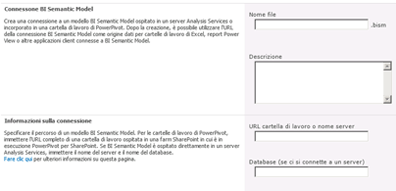

# Creare una connessione BI Semantic Model a una cartella di lavoro di PowerPivot
[!INCLUDE[ssas-appliesto-sqlas](../../includes/ssas-appliesto-sqlas.md)]
  Usare le informazioni di questo argomento per impostare una connessione BI Semantic Model che reindirizza a una cartella di lavoro di [!INCLUDE[ssGemini](../../includes/ssgemini-md.md)] nella stessa farm.  
  
 Dopo avere creato una connessione BISM e configurato le autorizzazioni di SharePoint, sarà possibile utilizzare la connessione come origine dati per i report di Excel o [!INCLUDE[ssCrescent](../../includes/sscrescent-md.md)] .  
  
 In questo argomento sono incluse le sezioni seguenti. Eseguire ogni attività nell'ordine indicato.  
  
 [Verificare i prerequisiti](#bkmk_prereq)  
  
 [Creare una connessione](#bkmk_create)  
  
 [Configurare autorizzazioni di SharePoint sulla connessione BISM](#bkmk_permissions)  
  
 [Configurare autorizzazioni di SharePoint sulla cartella di lavoro](#bkmk_userdb)  
  
 [Passaggi successivi](#bkmk_next)  
  
##   Verificare i prerequisiti  
 Per creare un file di connessione BISM, è necessario disporre delle autorizzazioni di collaborazione.  
  
 È necessario disporre di una raccolta che supporta il tipo di contenuto della connessione BISM. Per altre informazioni, vedere [Aggiungere un tipo di contenuto Connessione BI Semantic Model a una raccolta &#40;Power Pivot for SharePoint&#41;](../../analysis-services/power-pivot-sharepoint/add-bi-semantic-model-connection-content-type-to-library.md).  
  
 È necessario conoscere l'URL del [!INCLUDE[ssGemini](../../includes/ssgemini-md.md)] cartella di lavoro per cui si imposta una connessione BI semantic model (ad esempio, `http://adventure-works/shared documents/myworkbook.xlsx`). La cartella di lavoro deve essere nella stessa farm.  
  
 Tutti i computer e gli utenti che partecipano nella sequenza di connessione devono essere nello stesso dominio o nel dominio attendibile (attendibilità bidirezionale).  
  
##   Creare una connessione  
  
1.  Nella raccolta che conterrà la connessione BISM, fare clic su **Documenti** sulla barra multifunzione di SharePoint. Fare clic sulla freccia GIÙ su Nuovo documento e selezionare **File di connessione BISM** per aprire la pagina Nuova connessione BISM.  
  
       
  
2.  Impostare la proprietà **Server** sull'URL di SharePoint della cartella di lavoro di [!INCLUDE[ssGemini](../../includes/ssgemini-md.md)] , ad esempio `http://mysharepoint/shared documents/myWorkbook.xlsx`. In una distribuzione di [!INCLUDE[ssGemini](../../includes/ssgemini-md.md)] per SharePoint i dati possono essere caricati in qualsiasi server nella farm. Per questo motivo, le connessioni delle origini dati ai dati [!INCLUDE[ssGemini](../../includes/ssgemini-md.md)] consentono di specificare solo il percorso alla cartella di lavoro. Il servizio di sistema [!INCLUDE[ssGemini](../../includes/ssgemini-md.md)] determina il server con cui vengono caricati i dati.  
  
     Non usare la proprietà **Database** . Questa proprietà non viene usata quando si specifica il percorso di una cartella di lavoro di [!INCLUDE[ssGemini](../../includes/ssgemini-md.md)] .  
  
     La pagina dovrebbe essere simile a quanto illustrato nella figura seguente.  
  
       
  
     Facoltativamente, se si dispone di autorizzazioni di SharePoint per la cartella di lavoro, viene eseguito un passaggio di convalida aggiuntivo, per verificare la validità del percorso. Se non si dispone dell'autorizzazione per accedere ai dati, è possibile salvare la connessione BISM senza la risposta della convalida.  
  
##   Configurare autorizzazioni di SharePoint sulla connessione BISM  
 Per utilizzare una connessione BISM come origine dati per una cartella di lavoro di Excel o un report di Reporting Services, sono necessarie autorizzazioni **Lettura** sull'elemento della connessione BISM in una raccolta di SharePoint. Nel livello di autorizzazione di lettura è inclusa l'autorizzazione **Apertura elementi** che consente di scaricare le informazioni sulla connessione BISM in un'applicazione desktop di Excel.  
  
 Sono disponibili diversi modi per concedere le autorizzazioni in SharePoint. Le istruzioni seguenti illustrano come creare un nuovo gruppo denominato **Utenti BISM** con il livello di autorizzazione di **lettura** .  
  
 Per modificare le autorizzazioni è necessario essere proprietari del sito.  
  
1.  In Azioni sito fare clic su **Autorizzazioni sito**.  
  
2.  Fare clic su **Crea gruppo** e assegnare al nuovo gruppo il nome **Utenti BISM**.  
  
3.  Scegliere il livello di autorizzazione **Lettura** e fare clic su **Crea**.  
  
4.  Selezionare **Utenti BISM** in Utenti e gruppi.  
  
5.  Scegliere Nuovo, fare clic su **Aggiungi utenti**, quindi aggiungere account utente o di gruppo.  
  
     Questi utenti e gruppi disporranno di autorizzazioni di lettura per tutto il sito, incluse tutte le raccolte e gli elenchi che ereditano le autorizzazioni dal livello del sito. Se tali autorizzazioni sono troppo elevate, è possibile rimuovere selettivamente il gruppo da raccolte, elenchi o elementi specifici.  
  
 Per rimuovere selettivamente le autorizzazioni al livello dell'elemento, effettuare le operazioni seguenti:  
  
1.  In una raccolta, selezionare un documento. Fare clic sulla freccia GIÙ a destra e scegliere **Gestisci autorizzazioni**.  
  
2.  Per impostazione predefinita, un elemento eredita le autorizzazioni. Per modificare le autorizzazioni di singoli documenti in questa raccolta, fare clic su **Interrompi ereditarietà autorizzazioni**.  
  
3.  Selezionare la casella di controllo accanto a **Utenti BISM**.  
  
4.  Fare clic su **Rimuovi autorizzazioni utente**.  
  
##   Configurare autorizzazioni di SharePoint sulla cartella di lavoro  
 Se si usa un database [!INCLUDE[ssGemini](../../includes/ssgemini-md.md)] in una cartella di lavoro di Excel, le autorizzazioni di SharePoint per questa cartella determinano l'accesso ai dati con la connessione BI Semantic Model. Tutti gli utenti che accedono alla cartella di lavoro devono disporre delle autorizzazioni di lettura sulla cartella di lavoro per poterla utilizzare come origine dati esterna.  
  
 Se è stato creato un gruppo **Utenti BISM** con le istruzioni della sezione precedente, gli account utente e di gruppo che sono membri del gruppo **Utenti BISM** hanno autorizzazioni sufficienti sulla cartella di lavoro e sul file di connessione BI Semantic Model, presupponendo che la cartella di lavoro usi autorizzazioni ereditate.  
  
##   Passaggi successivi  
 Dopo avere creato e protetto una connessione BISM è possibile specificarla come origine dati. Per altre informazioni, vedere [Utilizzare una connessione BISM (BI Semantic Model) in Excel o Reporting Services](../../analysis-services/power-pivot-sharepoint/use-a-bi-semantic-model-connection-in-excel-or-reporting-services.md).  
  
## Vedere anche  
 [Connessione BI Semantic Model di PowerPivot &#40;.bism&#41;](../../analysis-services/power-pivot-sharepoint/power-pivot-bi-semantic-model-connection-bism.md)   
 [Utilizzare una connessione BI Semantic Model in Excel o Reporting Services](../../analysis-services/power-pivot-sharepoint/use-a-bi-semantic-model-connection-in-excel-or-reporting-services.md)   
 [Creare una connessione BISM a un database modello tabulare](../../analysis-services/power-pivot-sharepoint/create-a-bi-semantic-model-connection-to-a-tabular-model-database.md)  
  
  
