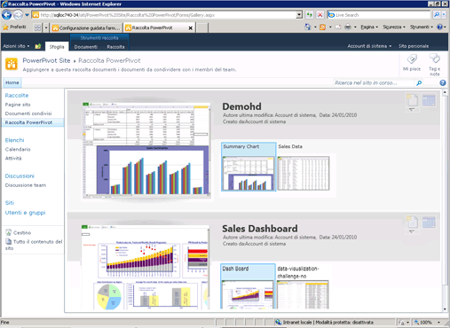

# Creare e personalizzare la Raccolta PowerPivot
[!INCLUDE[ssas-appliesto-sqlas](../../includes/ssas-appliesto-sqlas.md)]
  [!INCLUDE[ssGemini](../../includes/ssgemini-md.md)] La Raccolta è un tipo particolare di raccolta documenti di SharePoint che fornisce un'anteprima dettagliata e la gestione dei documenti per le cartelle di lavoro pubblicate di Excel e per i report di Reporting Services contenenti dati [!INCLUDE[ssGemini](../../includes/ssgemini-md.md)] .  
  
##   Contenuto dell'argomento  
  
-   [Prerequisiti](#prereq)  
  
-   [Panoramica](#overview)  
  
-   [Creare la Raccolta Power Pivot](#createlib)  
  
-   [Personalizzare una libreria della Raccolta Power Pivot](#customize)  
  
-   [Disabilitare o nascondere il pulsante Aggiorna](#bkmk_hide_refresh_button)  
  
-   [Passare alla vista teatro o alla vista raccolta](#switch)  
  
##   Prerequisiti  
  
-   È necessario disporre di Silverlight. Silverlight può essere scaricato e installato mediante Microsoft Update. Se si visualizza una libreria di Raccolta [!INCLUDE[ssGemini](../../includes/ssgemini-md.md)] usando un browser che non dispone di Silverlight, fare clic sul collegamento nella pagina per installarlo. Dopo l'installazione, sarà necessario chiudere e riaprire il browser.  
  
    > [!NOTE]  
    >  Con la raccolta di Power Pivot è richiesto Microsoft Silverlight.  Il browser Microsoft Edge non supporta Silverlight.   
    > Per visualizzare il contenuto della raccolta in Edge, fare clic sulla scheda **Raccolta** nella raccolta di Power Pivot e quindi impostare la visualizzazione della raccolta documenti su **Tutti i documenti**.    
    > Per cambiare la visualizzazione predefinita, fare clic sulla scheda **Raccolta** e quindi scegliere Modifica visualizzazione. Fare clic su "Imposta come visualizzazione predefinita" e quindi su OK per salvare la visualizzazione predefinita.  
    >  Per altre informazioni sulle funzionalità supportate in Microsoft Edge, vedere il post di blog di Windows sulle [differenze tra Edge e i browser precedenti e sul supporto di ActiveX, VBScript e altri componenti](https://blogs.windows.com/msedgedev/2015/05/06/a-break-from-the-past-part-2-saying-goodbye-to-activex-vbscript-attachevent/).  
  
-   Per creare una raccolta, è necessario essere proprietari del sito.  
  
-   Per pubblicare o caricare un file, è necessario disporre di autorizzazioni di collaborazione o superiori.  
  
-   [!INCLUDE[ssGemini](../../includes/ssgemini-md.md)] non può trovarsi in un sito con restrizioni. Il sito padre che contiene la raccolta [!INCLUDE[ssGemini](../../includes/ssgemini-md.md)] deve essere aggiunto al sito attendibile o all'area Intranet locale.  
  
-   Per l'applicazione in uso deve essere stata distribuita la soluzione dell'applicazione Web [!INCLUDE[ssGemini](../../includes/ssgemini-md.md)] mentre per la raccolta siti deve essere stata attivata la funzionalità di [!INCLUDE[ssGemini](../../includes/ssgemini-md.md)] . Per altre informazioni, vedere [Distribuire soluzioni PowerPivot in SharePoint](../../analysis-services/power-pivot-sharepoint/deploy-power-pivot-solutions-to-sharepoint.md) e[Attivare l'integrazione delle funzionalità di Power Pivot per le raccolte siti in Amministrazione centrale](../../analysis-services/power-pivot-sharepoint/activate-power-pivot-integration-for-site-collections-in-ca.md).  
  
-   Per visualizzare o creare un report Reporting Services basato su una cartella di lavoro [!INCLUDE[ssGemini](../../includes/ssgemini-md.md)] , sia la cartella di lavoro sia il report devono trovarsi nella stessa Raccolta [!INCLUDE[ssGemini](../../includes/ssgemini-md.md)] . Il report deve usare una cartella di lavoro di [!INCLUDE[ssGemini](../../includes/ssgemini-md.md)] contenente dati incorporati oppure la cartella di lavoro deve contenere al massimo un'origine dati esterna costituita da una cartella di lavoro di [!INCLUDE[ssGemini](../../includes/ssgemini-md.md)] .  
  
##   Panoramica  
 [!INCLUDE[ssGemini](../../includes/ssgemini-md.md)] è un modello di raccolta disponibile quando si installa [!INCLUDE[ssGeminiLong](../../includes/ssgeminilong-md.md)] in un server SharePoint. La raccolta di [!INCLUDE[ssGemini](../../includes/ssgemini-md.md)] consente di combinare un'anteprima accurata del contenuto dei file e informazioni relative all'origine dei documenti. È possibile dedurre immediatamente l'utente che ha creato il documento e la data dell'ultima modifica. Per creare immagini di anteprima, la raccolta [!INCLUDE[ssGemini](../../includes/ssgemini-md.md)] usa un servizio snapshot in grado di leggere le cartelle di lavoro di [!INCLUDE[ssGemini](../../includes/ssgemini-md.md)] e i report di Reporting Services che contengono dati [!INCLUDE[ssGemini](../../includes/ssgemini-md.md)] . Se si pubblica un file che il servizio snapshot non è in grado di leggere, nessuna immagine di anteprima sarà disponibile per quel file.  
  
 Le immagini di anteprima si basano sul modo in cui viene eseguito il rendering della cartella di lavoro mediante Excel Services. La rappresentazione nella raccolta [!INCLUDE[ssGemini](../../includes/ssgemini-md.md)] deve corrispondere a ciò che viene visualizzato quando si apre una cartella di lavoro di [!INCLUDE[ssGemini](../../includes/ssgemini-md.md)] in un browser. L'anteprima tuttavia presenta una superficie di attacco limitata. Parti di una cartella di lavoro o di un report potrebbero essere tagliate per adattarsi allo spazio disponibile. Per visualizzare il documento completo potrebbe essere necessario aprire una cartella di lavoro o un report.  
  
 L'aggiornamento dati della cartella di lavoro di [!INCLUDE[ssGemini](../../includes/ssgemini-md.md)] da origini dati esterne è supportato nella Raccolta [!INCLUDE[ssGemini](../../includes/ssgemini-md.md)] , ma viene richiesta una configurazione aggiuntiva. L'amministratore di una farm o di un servizio deve aggiungere la raccolta [!INCLUDE[ssGemini](../../includes/ssgemini-md.md)] come percorso attendibile di Excel Services. Per altre informazioni, vedere [Creare un percorso attendibile per i siti PowerPivot in Amministrazione centrale](../../analysis-services/power-pivot-sharepoint/create-a-trusted-location-for-power-pivot-sites-in-central-administration.md).  
  
##   Creare la Raccolta Power Pivot  
 [!INCLUDE[ssGemini](../../includes/ssgemini-md.md)] viene creata durante l'installazione di [!INCLUDE[ssGeminiLong](../../includes/ssgeminilong-md.md)] tramite l'opzione di installazione Nuovo server. Se è stato aggiunto [!INCLUDE[ssGeminiShort](../../includes/ssgeminishort-md.md)] a una farm esistente o si desidera una raccolta aggiuntiva, è possibile crearne una nuova per l'applicazione o il sito.  
  
1.  1.  **SharePoint 2010**: fare clic su **Azioni sito** nell'angolo superiore sinistro della home page del sito.  
  
    2.  Fare clic su **Altre opzioni**.  
  
    3.  In Raccolte fare clic su **Raccolta [!INCLUDE[ssGemini](../../includes/ssgemini-md.md)]**.  
  
    1.  **SharePoint 2013**: fare clic sull'icona impostazioni . Fare clic su **Contenuto sito**.  
  
    2.  Fare clic su **Aggiungi applicazione**.  
  
    3.  Fare clic su **Raccolta [!INCLUDE[ssGemini](../../includes/ssgemini-md.md)]**.  
  
2.  Digitare un nome per la raccolta. Assicurarsi di includere informazioni descrittive che consentono agli utenti di identificare questa raccolta come anteprima dettagliata per le cartelle di lavoro di [!INCLUDE[ssGemini](../../includes/ssgemini-md.md)] e i report di Reporting Services.  
  
3.  Fare clic su **Crea**.  
  
4.  Chiedere all'amministratore di una farm o di un servizio di aggiungere la raccolta [!INCLUDE[ssGemini](../../includes/ssgemini-md.md)] come percorso attendibile per Excel Services. Questo passaggio è necessario per evitare errori se un utente configura una cartella di lavoro per l'aggiornamento dati di [!INCLUDE[ssGemini](../../includes/ssgemini-md.md)] . Per altre informazioni sull'attività, vedere [Creare un percorso attendibile per i siti PowerPivot in Amministrazione centrale](../../analysis-services/power-pivot-sharepoint/create-a-trusted-location-for-power-pivot-sites-in-central-administration.md).  
  
 Verrà visualizzato un collegamento alla libreria della Raccolta [!INCLUDE[ssGemini](../../includes/ssgemini-md.md)] nel riquadro di navigazione Avvio Veloce per il sito corrente.  
  
 È possibile creare librerie aggiuntive della Raccolta [!INCLUDE[ssGemini](../../includes/ssgemini-md.md)] se si applicano autorizzazioni diverse per raccolte diverse o singoli siti.  
  
##   Personalizzare una libreria della Raccolta Power Pivot  
 [!INCLUDE[ssGemini](../../includes/ssgemini-md.md)] è una raccolta di documenti SharePoint. È pertanto possibile usare strumenti della raccolta standard in SharePoint per modificare le impostazioni della raccolta o usare documenti singoli nella raccolta. Ciascuna raccolta creata può essere personalizzata in modo indipendente per l'utilizzo di una vista o di impostazioni diverse.  
  
 È possibile modificare l'ordinamento e i filtri per modificare la posizione delle cartelle di lavoro nell'elenco. Per impostazione predefinita, i documenti vengono elencati nell'ordine in cui sono stati aggiunti, dove l'ultimo documento pubblicato viene visualizzato alla fine dell'elenco. Una volta pubblicato, un documento mantiene il proprio posto nell'elenco. Con l'aggiornamento e la ripubblicazione, il documento viene aggiornato sul posto nell'elenco.  
  
 Non è possibile abilitare o disabilitare l'anteprima per documenti specifici. Il servizio snapshot genera immagini di anteprima per tutte le cartelle di lavoro di [!INCLUDE[ssGemini](../../includes/ssgemini-md.md)] e per i report di Reporting Services basati sulle cartelle di lavoro di [!INCLUDE[ssGemini](../../includes/ssgemini-md.md)] archiviate nella stessa raccolta. Queste immagini possono essere visualizzate da tutti gli utenti che dispongono di autorizzazioni di visualizzazione nel documento.  
  
 Non è possibile estendere la raccolta [!INCLUDE[ssGemini](../../includes/ssgemini-md.md)] per l'anteprima di altri tipi di documento. L'anteprima è supportata solo per le cartelle di lavoro di Excel 2010 o i report di SQL Server 2008 R2 Reporting Services che contengono dati [!INCLUDE[ssGemini](../../includes/ssgemini-md.md)] .  
  
 Non è possibile modificare le impostazioni che controllano le informazioni relative all'origine dei documenti. I fatti visualizzati relativi a documenti singoli, ad esempio l'utente che ha apportato l'ultima modifica o ha aggiunto l'ultima cartella di lavoro, sono determinati da un set di colonne fisso che non può essere modificato.  
  
#### Modificare l'ordinamento, aggiungere filtri o limitare il numero di documenti  
 [!INCLUDE[ssGemini](../../includes/ssgemini-md.md)] vengono sempre visualizzati i valori "Data ultima modifica" e "Creato da". Non è possibile disabilitare queste colonne. Non è possibile abilitare altre colonne per la raccolta. Utilizzare le istruzioni seguenti per modificare l'ordinamento, aggiungere un filtro o limitare il numero di documenti visibili.  
  
1.  In un sito di SharePoint aprire Raccolta [!INCLUDE[ssGemini](../../includes/ssgemini-md.md)] .  
  
2.  Nella barra multifunzione fare clic su **Raccolta**.  
  
3.  **SharePoint 2010:** in Visualizzazioni personalizzate fare clic su **Modifica visualizzazione**.  
  
     **SharePoint 2013:** in **Gestisci visualizzazioni**fare clic su **Modifica visualizzazione**.  
  
4.  In Ordinamento specificare i criteri che verranno usati per determinare la modalità di visualizzazione delle cartelle di lavoro nell'elenco. Per impostazione predefinita, i documenti vengono elencati nell'ordine in cui sono stati aggiunti.  
  
5.  In Filtro specificare i criteri che verranno utilizzati per mostrare o nascondere le cartelle di lavoro in base ai valori condizionali impostati nelle colonne. Ad esempio, potrebbe essere necessario nascondere tutte le cartelle di lavoro create prima di una determinata data.  
  
6.  In Limite elementi specificare le opzioni utili per le librerie della raccolta [!INCLUDE[ssGemini](../../includes/ssgemini-md.md)] che contengono un numero molto elevato di documenti. È possibile limitare il numero effettivo di elementi visualizzati nell'elenco o visualizzare gli elementi in batch.  
  
7.  Scegliere **OK** per salvare le modifiche.  
  
####   Disabilitare o nascondere il pulsante Aggiorna  
 Non è possibile nascondere il pulsante **Gestisci aggiornamento dati** . Il pulsante è tuttavia disabilitato se l'utente non dispone di autorizzazioni sufficienti.  
  
   
  
 Gli autori o i proprietari delle cartelle di lavoro devono disporre dell'autorizzazione **Collaborazione** per pianificare l'aggiornamento dati in una cartella di lavoro. Gli utenti che dispongono di autorizzazioni di collaborazione possono aprire e modificare la pagina di configurazione dell'aggiornamento dati della cartella di lavoro per specificare le credenziali e le informazioni di pianificazione usate per aggiornare i dati.  
  
 Pertanto, gli utenti che dispongono unicamente di livelli di autorizzazione di **visualizzazione** o **lettura** non possono accedere al pulsante Aggiorna. Il pulsante Aggiorna è visibile ma disabilitato. Per altre informazioni, vedere [Autorizzazioni utente e livelli di autorizzazione in SharePoint 2013](http://technet.microsoft.com/library/cc721640.aspx).  
  
##   Passare alla vista teatro o alla vista raccolta  
 L'anteprima varia a seconda della configurazione della vista della raccolta. Nella vista Raccolta è possibile passare il puntatore del mouse sui singoli fogli di lavoro nella cartella di lavoro per rendere un foglio attivo nell'area di anteprima.  
  
   
  
 Nella tabella seguente vengono descritti i layout diversi per la presentazione di bozze di anteprima di ogni pagina visualizzata in anteprima:  
  
|visualizzazione|Description|  
|----------|-----------------|  
|Vista Raccolta (impostazione predefinita)|Raccolta è la vista predefinita per una raccolta [!INCLUDE[ssGemini](../../includes/ssgemini-md.md)] . L'anteprima viene visualizzata a sinistra. Le immagini più piccole di ogni foglio di lavoro vengono visualizzate accanto all'anteprima in ordine sequenziale da sinistra a destra.|  
|Tutti i documenti|Si tratta del layout standard per le raccolte documenti. È possibile scegliere questa vista per gestire singoli documenti o visualizzare il contenuto delle raccolte in un formato elenco.   Utilizzare questa vista per modificare le proprietà ed eliminare o spostare singoli documenti.   Se è stato abilitato il controllo delle versioni, è necessario utilizzare questa vista per archiviare o estrarre i documenti dalla raccolta.|  
|Vista teatro e vista sequenza|Si tratta di viste specializzate molto utili se si sta illustrando un piccolo numero di documenti correlati. Nella rotazione completa delle anteprime sono incluse tutte le pagine di tutti i documenti della raccolta. Se si dispone di molti documenti, queste viste potrebbero non risultare utili per gli utenti che desiderano individuare o aprire una specifica cartella di lavoro di [!INCLUDE[ssGemini](../../includes/ssgemini-md.md)] .   Vista teatro: l'area di anteprima è centrata. Le anteprime più piccole di ogni foglio di lavoro vengono visualizzate nella parte inferiore della pagina, su uno qualsiasi dei lati.   Vista sequenza: l'area di anteprima è centrata. Le anteprime che precedono e seguono immediatamente l'anteprima corrente sono adiacenti all'area di anteprima.|  
  
### Passare a una vista diversa  
  
1.  In un sito di SharePoint aprire Raccolta [!INCLUDE[ssGemini](../../includes/ssgemini-md.md)] .  
  
2.  Nella barra multifunzione fare clic su **Raccolta**.  
  
3.  In Gestione visualizzazioni, in Vista corrente, selezionare la vista che si desidera usare dall'elenco. Le viste predefinite includono Raccolta, Teatro e Sequenza video. In alternativa, è possibile scegliere Tutti i documenti se si desidera spostare, eliminare o gestire documenti nella raccolta.  
  
## Vedere anche  
 [Risolvere i problemi relativi all'installazione di PowerPivot per SharePoint](../../analysis-services/troubleshoot-a-power-pivot-for-sharepoint-installation.md)   
 [Usare la raccolta Power Pivot](../../analysis-services/power-pivot-sharepoint/use-power-pivot-gallery.md)   
 [Creare un percorso attendibile per i siti PowerPivot in Amministrazione centrale](../../analysis-services/power-pivot-sharepoint/create-a-trusted-location-for-power-pivot-sites-in-central-administration.md)   
 [Eliminare una raccolta Power Pivot](../../analysis-services/power-pivot-sharepoint/delete-power-pivot-gallery.md)  
  
  
