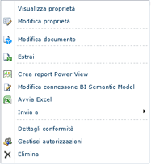
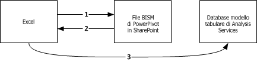
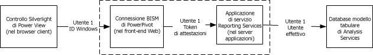

# Connessione BI Semantic Model (con estensione bism) di PowerPivot
  Una connessione BI Semantic Model (con estensione bism) è una connessione portatile che connette report di Excel o Power View a un database modello tabulare di Analysis Services o a un'istanza di Analysis Services in modalità multidimensionale. Chi ha familiarità con i file Office Data Connection (estensione odc) noterà una somiglianza con la modalità di definizione e di utilizzo di un file di connessione BISM.  
  
 La creazione e l'accesso a una connessione BISM avvengono tramite SharePoint. La creazione di connessioni BISM abilita i comandi di avvio veloce su una connessione BISM in una raccolta. I comandi di avvio veloce consentono di aprire una nuova cartella di lavoro di Excel o opzioni per la modifica del file della connessione. Se Reporting Services è installato sarà inoltre presente un comando per creare un report [!INCLUDE[ssCrescent](../../includes/sscrescent-md.md)] .  
  
   
  
##   Database supportati  
 Una connessione BISM punta a dati del modello tabulare. Per questi dati sono disponibili tre origini:  
  
-   Un database modello tabulare in esecuzione su un'istanza di Analysis Services autonoma in modalità server tabulare. Una distribuzione di un'istanza di Analysis Services autonoma è esterna alla farm. Per l'accesso a origini dati esterne alla farm sono necessarie autorizzazioni aggiuntive; informazioni in merito vengono fornite in questo argomento: [Create a BI Semantic Model Connection to a Tabular Model Database](../../analysis-services/power-pivot-sharepoint/create-a-bi-semantic-model-connection-to-a-tabular-model-database.md).  
  
-   [!INCLUDE[ssGemini](../../includes/ssgemini-md.md)] salvate in SharePoint. I database [!INCLUDE[ssGemini](../../includes/ssgemini-md.md)] incorporati nelle cartelle di lavoro di Excel sono considerati equivalenti ai database modello tabulare eseguiti in un server in modalità tabulare di Analysis Services autonomo. Se si usano già [!INCLUDE[ssGemini](../../includes/ssgemini-md.md)] per Excel e [!INCLUDE[ssGemini](../../includes/ssgemini-md.md)] per SharePoint, è possibile definire una connessione BI Semantic Model che punta alle cartelle di lavoro di [!INCLUDE[ssGemini](../../includes/ssgemini-md.md)] in una raccolta di SharePoint e compilare report [!INCLUDE[ssCrescent](../../includes/sscrescent-md.md)] che usano i dati [!INCLUDE[ssGemini](../../includes/ssgemini-md.md)] esistenti.  È possibile usare cartelle di lavoro create in SQL Server 2008 R2 o in versioni di [!INCLUDE[ssSQL11](../../includes/sssql11-md.md)] di [!INCLUDE[ssGemini](../../includes/ssgemini-md.md)] per Excel.  
  
-   Un modello di dati multidimensionali in un'istanza di Analysis Services.  
  
 Per un confronto tra le origini dati, vedere il contenuto della community che fornisce [informazioni su BI Semantic Model (BISM) di SQL Server 2012](http://www.mssqltips.com/sqlservertip/2818/understanding-the-sql-server-2012-bi-semantic-model-bism/).  
  
## Informazioni sulla sequenza di connessione per connessioni BISM  
 In questa sezione viene illustrato il comportamento della connessione tra le varie applicazioni client, quale l'applicazione desktop di Excel o lo strumento client di creazione report di Power View su SharePoint e un database modello tabulare all'interno o all'esterno della farm di SharePoint.  
  
 Tutte le connessioni a un database modello tabulare vengono eseguite tramite le credenziali dell'utente che sta richiedendo i dati. Tuttavia, i meccanismi di connessione variano a seconda se si tratta di una connessione interna alla farm, una connessione a hop singolo o doppio e se l'autenticazione Kerberos è abilitata. Per altre informazioni sulle connessioni autenticate tra origini dati SharePoint e back-end, vedere [Autenticazione hop doppio: perché NTLM non riesce e Kerberos funziona](http://go.microsoft.com/fwlink/?LinkId=237137).  
  
 **Connessione da Excel ai dati tabulari su una rete**  
  
 Quando un utente di Excel specifica una connessione BISM come origine dati, le informazioni di connessione nel file con estensione bism vengono scaricate nell'applicazione client che quindi pubblica la propria richiesta diretta nel database modello tabulare su Analysis Services. Per accedere alla connessione BISM, l'utente di Excel deve essere un utente di SharePoint con le autorizzazioni di lettura sul file di connessione con estensione bism. Una volta scaricate le informazioni di connessione, tutte le connessioni successive ignorano SharePoint, passando direttamente da Excel al database modello tabulare di back-end.  
  
 Nella figura seguente è illustrata tale sequenza di connessione. Inizia con una richiesta per la connessione con estensione bism, seguita dal download di informazioni di connessione al client e infine dalla connessione a hop singolo al database. La connessione viene eseguita utilizzando le credenziali di Windows dell'utente di Excel che ha le autorizzazioni di lettura sul database di Analysis Services. È una comunicazione a hop singolo, pertanto anche se è abilitata, l'autenticazione Kerberos non è richiesta per questo scenario.  
  
   
  
 **Connessione da Power View ai dati tabulari su una rete**  
  
 Quando un utente di SharePoint fa clic su una connessione BISM in una raccolta documenti, Power View (se installato) immediatamente avvia e apre una connessione al database modello tabulare.  
  
 Le connessioni tra Power View e un database modello tabulare seguono una sequenza di autenticazione a hop doppio dove l'identità utente viene passata dal client a SharePoint e quindi da SharePoint a un database modello tabulare di Analysis Services di back-end in esecuzione all'esterno della farm. La libreria client ADOMD.NET che gestisce la richiesta di connessione prova sempre l'autenticazione Kerberos al primo tentativo. Se Kerberos è configurato, l'identità utente è rappresentata sulla connessione al database modello tabulare e la connessione viene eseguita.  
  
 Se Kerberos non è configurato e la richiesta non riesce, Reporting Services effettua un secondo tentativo. In questo scenario, la libreria client si connette a Analysis Services usando l'identità del servizio Reporting Services e l'autenticazione NTLM. L'identità dell'utente di Power View viene passata sulla stringa di connessione usando il parametro **effectiveusername** .  
  
 Solo un membro del ruolo di amministratore di sistema sull'istanza di Analysis Services dispone delle autorizzazioni per effettuare una connessione usando il parametro **effectiveusername** e rappresentare un altro utente sull'istanza del server. Per questo motivo, l'account di esecuzione del servizio condiviso Reporting Services deve disporre di diritti amministrativi sull'istanza di Analysis Services.  Per le istruzioni per concedere le autorizzazioni amministrative all'account del servizio, vedere l'argomento [Creare una connessione BISM a un database modello tabulare](../../analysis-services/power-pivot-sharepoint/create-a-bi-semantic-model-connection-to-a-tabular-model-database.md).  
  
 Nell'illustrazione seguente viene mostrata una sequenza di connessione che utilizza la stessa identità utente di Windows per ogni connessione. Nell'ultima connessione a Analysis Services, la connessione viene eseguita dall'identità dell'applicazione del servizio Reporting Services, passando l'identità utente di Windows tramite **effectiveusername**.  
  
   
  
 **Connessione da Power View ai dati [!INCLUDE[ssGemini](../../includes/ssgemini-md.md)] in SharePoint**  
  
 Quando un utente di SharePoint fa clic su una connessione BISM che si risolve in una cartella di lavoro di [!INCLUDE[ssGemini](../../includes/ssgemini-md.md)] nella stessa farm, le connessioni si verificano all'interno del contesto dell'ambiente SharePoint. Un'applicazione del servizio [!INCLUDE[ssGemini](../../includes/ssgemini-md.md)] gestisce la richiesta di connessione che viene inoltrata all'istanza di Analysis Services nello stesso computer. L'istanza di Analysis Services estrae i dati [!INCLUDE[ssGemini](../../includes/ssgemini-md.md)] dalla cartella di lavoro e li carica. Tutte le connessioni successive sono gestite dalle applicazioni del servizio [!INCLUDE[ssGemini](../../includes/ssgemini-md.md)] nella farm.  
  
 In questo scenario, tutte le connessioni si verificano all'interno della stessa farm, pertanto non c'è richiesta di Kerberos o di delega vincolata.  
  
##   Attività correlate  
 [Aggiungere un tipo di contenuto Connessione BI Semantic Model a una raccolta &#40;Power Pivot per SharePoint&#41;](../../analysis-services/power-pivot-sharepoint/add bi semantic model connection content type to library.md)  
  
 [Creare una connessione BI Semantic Model a una cartella di lavoro di PowerPivot](../../analysis-services/power-pivot-sharepoint/create-a-bi-semantic-model-connection-to-a-power-pivot-workbook.md)  
  
 [Creare una connessione BISM a un database modello tabulare](../../analysis-services/power-pivot-sharepoint/create-a-bi-semantic-model-connection-to-a-tabular-model-database.md)  
  
 [Utilizzare una connessione BISM (BI Semantic Model) in Excel o Reporting Services](../../analysis-services/power-pivot-sharepoint/use-a-bi-semantic-model-connection-in-excel-or-reporting-services.md)  
  
## Vedere anche  
 [Determinare la modalità server di un'istanza di Analysis Services](../../analysis-services/instances/determine-the-server-mode-of-an-analysis-services-instance.md)   
 [Connetti ad Analysis Services](../../analysis-services/instances/connect-to-analysis-services.md)  
  
  