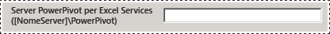
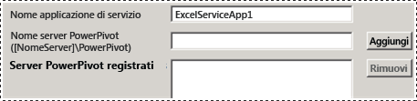
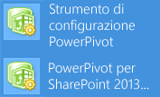
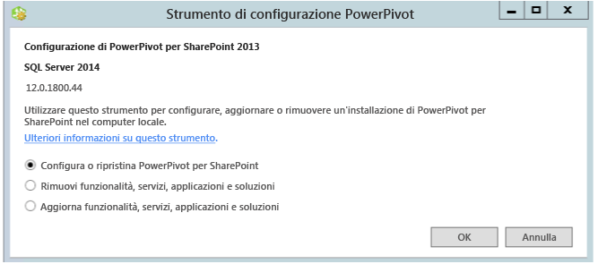

# Power Pivot Configuration Tools
[!INCLUDE[ssas-appliesto-sqlas](../../includes/ssas-appliesto-sqlas.md)]Configurare, ripristinare o rimuovere un [!INCLUDE[ssCurrent](../../includes/sscurrent-md.md)] [!INCLUDE[ssGeminiShort](../../includes/ssgeminishort-md.md)] con il [!INCLUDE[ssGemini](../../includes/ssgemini-md.md)] strumenti di configurazione.  
  
 L'Installazione guidata di [!INCLUDE[ssCurrent](../../includes/sscurrent-md.md)] non installa gli strumenti di configurazione [!INCLUDE[ssGemini](../../includes/ssgemini-md.md)] per SharePoint. Gli strumenti di configurazione saranno disponibili per il download nelle versioni future di [!INCLUDE[ssCurrent](../../includes/sscurrent-md.md)].  
  
 In questo argomento viene descritto l'utilizzo generale degli strumenti di [!INCLUDE[ssGemini](../../includes/ssgemini-md.md)] e le relative differenze.  
  
 **[!INCLUDE[applies](../../includes/applies-md.md)]**  SharePoint 2013  
  
 **Contenuto dell'argomento**  
  
-   [Requisiti per l'utilizzo degli strumenti di configurazione](#bkmk_requirements)  
  
-   [Due versioni dello strumento di configurazione](#bkmk_twoversions)  
  
-   [Panoramica dell'uso di uno strumento di configurazione Power Pivot](#bkmk_overview)  
  
-   [Avviare uno degli strumenti di configurazione Power Pivot](#bmkm_start_tool)  
  
##   Requisiti per l'utilizzo degli strumenti di configurazione  
  
-   È necessario essere un amministratore di farm.  
  
-   È necessario essere un amministratore del server nell'istanza di Analysis Services (solo SharePoint 2010).  
  
-   È necessario essere membro del ruolo db_owner nel database di configurazione della farm.  
  
-   Non esistono requisiti della porta TCP/IP per l'utilizzo degli strumenti di configurazione, pertanto non dovrebbe essere necessario configurare il firewall per poterli utilizzare. Nello strumento di configurazione è previsto che le applicazioni Web e i servizi condivisi siano disponibili come parte della piattaforma SharePoint. Potrebbe essere necessario configurare il firewall per il server [!INCLUDE[ssASnoversion](../../includes/ssasnoversion-md.md)] . Per altre informazioni, vedere [Configure the Windows Firewall to Allow Analysis Services Access](../../analysis-services/instances/configure-the-windows-firewall-to-allow-analysis-services-access.md).  
  
##   Due versioni dello strumento di configurazione  
 L'Installazione guidata [!INCLUDE[ssCurrent](../../includes/sscurrent-md.md)] consente di installare lo strumento di configurazione [!INCLUDE[ssGemini](../../includes/ssgemini-md.md)] per SharePoint 2010 e lo strumento di configurazione [!INCLUDE[ssGemini](../../includes/ssgemini-md.md)] per SharePoint 2013.  
  
 Gli strumenti possono essere utilizzati solo con un'istanza di [!INCLUDE[ssCurrent](../../includes/sscurrent-md.md)] o [!INCLUDE[ssSQL11SP1](../../includes/sssql11sp1-md.md)] di [!INCLUDE[ssGeminiShort](../../includes/ssgeminishort-md.md)]. Non utilizzarli con installazioni di [!INCLUDE[ssKilimanjaro](../../includes/sskilimanjaro-md.md)] .  
  
|nome|Versione supportata di SharePoint|Configurazione dettagliata|  
|----------|-------------------------------------|----------------------------|  
|[!INCLUDE[ssGemini](../../includes/ssgemini-md.md)] per SharePoint 2013|SharePoint 2013|[Configurare o ripristinare Power Pivot per SharePoint 2013 &#40;strumento di configurazione Power Pivot&#41;](../../analysis-services/power-pivot-sharepoint/configure-or-repair-power-pivot-for-sharepoint-2013.md)|  
|[!INCLUDE[ssGemini](../../includes/ssgemini-md.md)] Strumento di configurazione|SharePoint 2010 con SharePoint 2010 Service Pack 1 (SP1)|[Configurare o ripristinare Power Pivot per SharePoint 2010 (strumento di configurazione Power Pivot)](http://msdn.microsoft.com/en-us/d61f49c5-efaa-4455-98f2-8c293fa50046)|  
  
###   Diversità tra i due strumenti di configurazione  
 Le due versioni dello strumento di configurazione sono simili ma esistono differenze nei passaggi di configurazione eseguiti dai due strumenti. Le differenze sono dovute alle variazioni da SharePoint 2010 a SharePoint 2013 nonché alle differenze di architettura tra la versione SQL Server 2012 SP1 di [!INCLUDE[ssGemini](../../includes/ssgemini-md.md)] per SharePoint e le versioni precedenti di [!INCLUDE[ssGemini](../../includes/ssgemini-md.md)] per SharePoint.  
  
 La tabella seguente descrive le funzionalità nuove e modificate nello **strumento di configurazione [!INCLUDE[ssGemini](../../includes/ssgemini-md.md)] per SharePoint 2013**. La tabella descrive anche le funzionalità dello **strumento di configurazione [!INCLUDE[ssGemini](../../includes/ssgemini-md.md)]** che non sono presenti nello strumento di configurazione [!INCLUDE[ssGemini](../../includes/ssgemini-md.md)] per SharePoint 2013. Le righe della tabella sono nello stesso ordine delle schede negli strumenti di configurazione.  
  
|[!INCLUDE[ssGemini](../../includes/ssgemini-md.md)] per SharePoint 2013|[!INCLUDE[ssGemini](../../includes/ssgemini-md.md)] Strumento di configurazione|  
|--------------------------------------------------------------|-----------------------------------------------|  
|La pagina principale contiene una nuova opzione per server **[!INCLUDE[ssGemini](../../includes/ssgemini-md.md)] per Excel Services**. L'opzione supporta la nuova architettura con [!INCLUDE[ssASnoversion](../../includes/ssasnoversion-md.md)] in esecuzione all'esterno della farm di SharePoint. Configurare Excel Services per utilizzare uno o più server [!INCLUDE[ssASnoversion](../../includes/ssasnoversion-md.md)] in esecuzione in modalità SharePoint.   ||  
||Lo strumento 2010 include la pagina **Registrare SQL Server Analysis Services ([!INCLUDE[ssGemini](../../includes/ssgemini-md.md)]) sul server locale** per configurare un'istanza locale di [!INCLUDE[ssASnoversion](../../includes/ssasnoversion-md.md)]. Questa pagina non fa parte dello strumento 2013 perché non è presente alcuna istanza locale di [!INCLUDE[ssASnoversion](../../includes/ssasnoversion-md.md)].   |  
||La pagina **Creare applicazione del servizio [!INCLUDE[ssGemini](../../includes/ssgemini-md.md)]** contiene l'opzione aggiuntiva **Aggiorna le cartelle di lavoro per abilitare l'aggiornamento dei dati**. Questa opzione non è disponibile nello strumento 2013.   |  
|Lo strumento 2013 contiene una nuova pagina **Configura server [!INCLUDE[ssGemini](../../includes/ssgemini-md.md)]**. Questa pagina supporta la nuova architettura di [!INCLUDE[ssASnoversion](../../includes/ssasnoversion-md.md)] in esecuzione all'esterno della farm di SharePoint. Per impostazione predefinita, il nome del server digitato nella pagina principale nella casella di testo **Server [!INCLUDE[ssGemini](../../includes/ssgemini-md.md)] per Excel Services** viene elencato anche in **Configura server [!INCLUDE[ssGemini](../../includes/ssgemini-md.md)]**.   ||  
|Lo strumento 2013 contiene una nuova pagina **Registra componente aggiuntivo di [!INCLUDE[ssGemini](../../includes/ssgemini-md.md)] come Analisi utilizzo di Excel Services**. SharePoint 2010 Excel Services non tiene traccia dei dati di utilizzo per [!INCLUDE[ssGemini](../../includes/ssgemini-md.md)].||  
||Lo strumento 2010 include la pagina **Aggiungere MSOLAP.5 come provider attendibile[!INCLUDE[ssGemini](../../includes/ssgemini-md.md)] per registrare MSOLAP in modo da consentire a Excel Services in SharePoint 2010 di caricare i modelli** . Questa pagina non fa parte dello strumento 2013. SharePoint 2013 Excel Services non utilizza il provider MSOLAP per caricare i modelli.|  
  
##   Panoramica dell'uso di uno strumento di configurazione Power Pivot  
 All'avvio di uno strumento di configurazione [!INCLUDE[ssGemini](../../includes/ssgemini-md.md)] viene effettuata una valutazione dell'installazione esistente per determinare quali operazioni siano applicabili. In una nuova installazione, è disponibile solo l'attività di configurazione. Dopo la configurazione del server, verrà visualizzata l'attività di rimozione. Se si inizia con un'istanza di [!INCLUDE[ssKilimanjaro](../../includes/sskilimanjaro-md.md)] , l'aggiornamento sarà anche abilitato nell'elenco delle attività disponibili.  
  
 Se non si ha familiarità con Amministrazione centrale o Windows PowerShell, è possibile eseguire lo strumento di configurazione come alternativa per completare un'installazione di [!INCLUDE[ssGeminiShort](../../includes/ssgeminishort-md.md)] .  
  
 Inoltre, lo strumento è in grado di rilevare se la farm è configurata o se alcune funzionalità obbligatorie sono mancanti. Se i file di programma di SharePoint sono installati ma la farm non è configurata, lo strumento rende disponibili azioni per configurare sia la farm, sia l'installazione di [!INCLUDE[ssGeminiShort](../../includes/ssgeminishort-md.md)] .  
  
 Per altre informazioni su come configurare **e SharePoint con Windows PowerShell, esaminare la scheda** Script [!INCLUDE[ssGemini](../../includes/ssgemini-md.md)] . Per ulteriori informazioni, vedere quanto segue:  
  
-   [Configurazione di Power Pivot con Windows PowerShell](../../analysis-services/power-pivot-sharepoint/power-pivot-configuration-using-windows-powershell.md)  
  
-   [Informazioni di riferimento su PowerShell per Power Pivot per SharePoint](../../analysis-services/powershell/powershell-reference-for-power-pivot-for-sharepoint.md)  
  
> [!NOTE]  
>  Reporting Services non viene configurato tramite lo strumento. Se si aggiunge Reporting Services all'ambiente di SharePoint, è necessario installarlo e configurarlo separatamente. Per ulteriori informazioni, vedere quanto segue:  
>   
>  -   [Installare il primo server di report in modalità SharePoint](../../reporting-services/install-windows/install-the-first-report-server-in-sharepoint-mode.md).  
> -   [Installare la modalità SharePoint di Reporting Services per SharePoint 2010](http://msdn.microsoft.com/en-us/47efa72e-1735-4387-8485-f8994fb08c8c).  
  
##   Avviare uno degli strumenti di configurazione Power Pivot  
  
1.  Nella schermata **Start** digitare **powerpivot**.  
  
     Nella schermata **Start** digitare **powerpivot** o fare clic sul menu **Start** , scegliere **Tutti i programmi**, [!INCLUDE[ssCurrentUI](../../includes/sscurrentui-md.md)], **Strumenti di configurazione**, quindi fare clic su uno degli elementi seguenti:  
  
    -   **[!INCLUDE[ssGemini](../../includes/ssgemini-md.md)] Strumento di configurazione**.  
  
    -   **OR**  
  
    -   **[!INCLUDE[ssGemini](../../includes/ssgemini-md.md)] per SharePoint 2013**.  
  
       
  
     **Nota** : gli strumenti sono disponibili solo se [!INCLUDE[ssGeminiShort](../../includes/ssgeminishort-md.md)] è installato nel server locale.  
  
2.  All'avvio, gli strumenti di configurazione controllano lo stato dell'installazione e rendono disponibili le attività valide per l'installazione.  
  
3.  A seconda dello stato corrente dell'installazione, è possibile eseguire una o più delle attività seguenti:  
  
    1.  Fare clic su **Configurare o ripristinare [!INCLUDE[ssGemini](../../includes/ssgemini-md.md)] per SharePoint** per completare le attività di post-installazione o per ripristinare un'installazione.  
  
    2.  Fare clic su **Rimuovi funzionalità, servizi, applicazioni e soluzioni** per rimuovere funzionalità e soluzioni dalla farm.  
  
    3.  Fare clic su **Aggiorna funzionalità, servizi, applicazioni e soluzioni** per aggiornare funzionalità e soluzioni installate utilizzando una versione precedente di [!INCLUDE[ssGeminiShort](../../includes/ssgeminishort-md.md)].  
  
     Ad esempio, l'immagine illustra la pagina iniziale dello strumento configurazione [!INCLUDE[ssGemini](../../includes/ssgemini-md.md)] per SharePoint 2013.  
  
       
  
 Ogni attività è costituita da singole azioni relative ad alcuni aspetti della configurazione del server. Ad esempio, l'attività di configurazione include azioni per la distribuzione delle soluzioni, la creazione di un'applicazione del servizio [!INCLUDE[ssGemini](../../includes/ssgemini-md.md)] , l'attivazione delle funzionalità e la configurazione dell'aggiornamento dei dati. L'elenco delle azioni sarà diverso in base allo stato corrente dell'installazione. Se un'azione non è necessaria, viene esclusa dall'elenco attività.  
  
 Quando si fa clic su Esegui, lo strumento elabora tutte le azioni in modalità batch. Benché ogni azione sia visualizzata come elemento separato nell'elenco attività, tutte le azioni sono incluse insieme nel processo dell'attività. Vengono elaborate solo le azioni che superano un controllo di convalida. Potrebbe essere necessario aggiungere o modificare alcuni dei valori di input per superare il controllo di convalida.  
  
## Contenuto correlato  
 [Aggiornare PowerPivot per SharePoint](../../database-engine/install-windows/upgrade-power-pivot-for-sharepoint.md) Viene descritto il flusso di lavoro che aggiorna un'installazione esistente già presente in una farm.  
  
 [Disinstallare PowerPivot per SharePoint](../../sql-server/install/uninstall-power-pivot-for-sharepoint.md) Viene descritto il flusso di lavoro che rimuove servizi, soluzioni e pagine di applicazioni di [!INCLUDE[ssGemini](../../includes/ssgemini-md.md)] per SharePoint da una farm.  
  
 [Configurazione di Power Pivot con Windows PowerShell](../../analysis-services/power-pivot-sharepoint/power-pivot-configuration-using-windows-powershell.md)  
  
 [Amministrazione e configurazione del server PowerPivot in Amministrazione centrale](../../analysis-services/power-pivot-sharepoint/power-pivot-server-administration-and-configuration-in-central-administration.md)  
  
  
