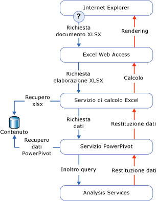

# Accesso ai dati PowerPivot
[!INCLUDE[ssas-appliesto-sqlas](../../includes/ssas-appliesto-sqlas.md)]In questo argomento vengono descritte le modalità con cui i dati vengono recuperati da un [!INCLUDE[ssGemini](../../includes/ssgemini-md.md)] cartella di lavoro pubblicata in una raccolta di SharePoint.  
  
 [!INCLUDE[ssGemini](../../includes/ssgemini-md.md)] vengono archiviati in una cartella di lavoro di Excel. La stringa di connessione è un URL di una cartella di lavoro in un sito di SharePoint.  
  
 [!INCLUDE[ssGemini](../../includes/ssgemini-md.md)] vengono spesso usati dalla cartella di lavoro che li contiene, ad esempio i dati sottostanti le tabelle pivot e i grafici pivot. In alternativa, i dati [!INCLUDE[ssGemini](../../includes/ssgemini-md.md)] possono essere anche usati come origine dati esterna, in cui una cartella di lavoro, un dashboard o un report si connette a un file di Excel (con estensione xlsx) separato in SharePoint e recupera i dati per l'utilizzo successivo. Gli strumenti client che in genere usano i dati [!INCLUDE[ssGemini](../../includes/ssgemini-md.md)] sono Excel, [!INCLUDE[ssCrescent](../../includes/sscrescent-md.md)], altri report Reporting Services e PerformancePoint.  
  
 Nel desktop il componente aggiuntivo di [!INCLUDE[ssGemini](../../includes/ssgemini-md.md)] usa AMO e ADOMD.NET per creare, elaborare ed eseguire query sui dati [!INCLUDE[ssGemini](../../includes/ssgemini-md.md)] nell'area di lavoro client.  
  
 In una farm di SharePoint Excel Services usa il provider OLE DB MSOLAP locale per connettersi ai dati [!INCLUDE[ssGemini](../../includes/ssgemini-md.md)] . Il provider invia la richiesta di connessione a un server [!INCLUDE[ssGemini](../../includes/ssgemini-md.md)] per SharePoint nella farm. In tale server vengono caricati i dati, viene eseguita la query e viene restituito il set di risultati.  
  
##   Esecuzione di query sui dati PowerPivot in SharePoint  
 Quando si visualizza una cartella di lavoro di [!INCLUDE[ssGemini](../../includes/ssgemini-md.md)] da una raccolta di SharePoint, i dati di [!INCLUDE[ssGemini](../../includes/ssgemini-md.md)] all'interno della cartella di lavoro vengono rilevati, estratti ed elaborati separatamente nelle istanze del server Analysis Services all'interno della farm, mentre Excel Services esegue il rendering del livello presentazione. È possibile visualizzare la cartella di lavoro completamente elaborata in una finestra del browser o in un'applicazione desktop di Excel 2010 che ha il componente aggiuntivo [!INCLUDE[ssGemini](../../includes/ssgemini-md.md)] .  
  
 Nel diagramma seguente viene illustrato come una richiesta di elaborazione query viene spostata all'interno della farm. Dal momento che i dati di [!INCLUDE[ssGemini](../../includes/ssgemini-md.md)] fanno parte di una cartella di lavoro di Excel 2010, si verifica una richiesta di elaborazione query quando un utente apre una cartella di lavoro di Excel da una raccolta di SharePoint e interagisce con una tabella o un grafico pivot che contiene dati di [!INCLUDE[ssGemini](../../includes/ssgemini-md.md)] .  
  
   
  
 I componenti di [!INCLUDE[ssGemini](../../includes/ssgemini-md.md)] per SharePoint ed Excel Services elaborano parti diverse dello stesso file (con estensione xlsx) della cartella di lavoro. Tramite Excel Services viene rilevata l'elaborazione di richieste e dati di [!INCLUDE[ssGemini](../../includes/ssgemini-md.md)] da un server [!INCLUDE[ssGemini](../../includes/ssgemini-md.md)] nella farm. Il server [!INCLUDE[ssGemini](../../includes/ssgemini-md.md)] alloca la richiesta a un'istanza di [!INCLUDE[ssGeminiSrv](../../includes/ssgeminisrv-md.md)] che consente di estrarre i dati dalla cartella di lavoro nella raccolta contenuto e di caricare i dati. I dati archiviati in memoria vengono uniti nuovamente nella cartella di lavoro di cui è stato eseguito il rendering e passati nuovamente a Excel Web Access per la presentazione in una finestra del browser.  
  
 Non tutti i dati nella cartella di lavoro di [!INCLUDE[ssGemini](../../includes/ssgemini-md.md)] vengono gestiti da [!INCLUDE[ssGemini](../../includes/ssgemini-md.md)] per SharePoint. Tramite Excel Services vengono elaborati i dati di celle e tabelle in un foglio di lavoro. Solo le tabelle e i grafici pivot e i filtri dei dati che non risultano allineati ai dati [!INCLUDE[ssGemini](../../includes/ssgemini-md.md)] vengono gestiti da [!INCLUDE[ssGemini](../../includes/ssgemini-md.md)] per SharePoint.  
  
## Vedere anche  
 [Connetti ad Analysis Services](../../analysis-services/instances/connect-to-analysis-services.md)   
 [Accesso ai dati di modello tabulare](../../analysis-services/tabular-models/tabular-model-data-access.md)  
  
  
