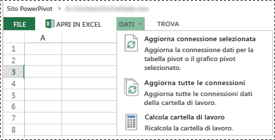
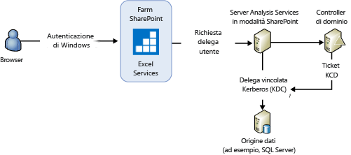
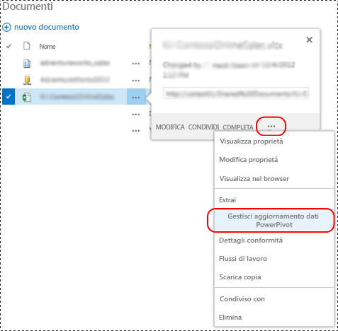
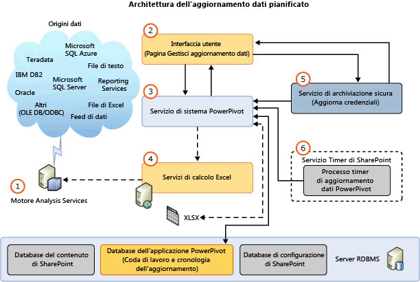
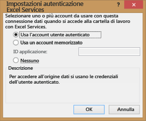

# Aggiornamento dati PowerPivot con SharePoint 2013
[!INCLUDE[ssas-appliesto-sqlas](../../includes/ssas-appliesto-sqlas.md)]La progettazione per l'aggiornamento di [!INCLUDE[ssGemini](../../includes/ssgemini-md.md)] modelli di dati in SharePoint 2013 viene utilizzato Excel Services come componente principale per caricare e aggiornare i modelli di dati in un'istanza di [!INCLUDE[ssCurrent](../../includes/sscurrent-md.md)] [!INCLUDE[ssASnoversion](../../includes/ssasnoversion-md.md)] in esecuzione in modalità SharePoint. Il server [!INCLUDE[ssASnoversion](../../includes/ssasnoversion-md.md)] viene eseguito esternamente alla farm di SharePoint. L'architettura in SharePoint 2013 Excel Services supporta sia l' **aggiornamento dati interattivo** che l' **aggiornamento dati pianificato**.  
  
 **[!INCLUDE[applies](../../includes/applies-md.md)]**  SharePoint 2013  
  
 **Contenuto dell'argomento:**  
  
-   [Interactive Data Refresh](#bkmk_interactive_refresh)  
  
-   [Autenticazione di Windows con connessioni dati della cartella di lavoro e aggiornamento dati interattivo](#bkmk_windows_auth_interactive_data_refresh)  
  
-   [Scheduled Data Refresh](#bkmk_scheduled_refresh)  
  
-   [Architettura dell'aggiornamento dati pianificato in SharePoint 2013](#bkmk_refresh_architecture)  
  
-   [Considerazioni aggiuntive sull'autenticazione](#datarefresh_additional_authentication)  
  
-   [Ulteriori informazioni](#bkmk_moreinformation)  
  
## Informazioni preliminari  
 SharePoint Server 2013 Excel Services gestisce l'aggiornamento dei dati per le cartelle di lavoro di Excel 2013 e attiva l'elaborazione del modello di dati in un server [!INCLUDE[ssCurrent](../../includes/sscurrent-md.md)] [!INCLUDE[ssASnoversion](../../includes/ssasnoversion-md.md)] in esecuzione in modalità SharePoint. In caso di cartelle di lavoro di Excel 2010, tramite Excel Services è inoltre possibile gestire il caricamento e il salvataggio delle cartelle di lavoro e dei modelli di dati. Tuttavia, Excel Services si basa sul servizio di sistema [!INCLUDE[ssGemini](../../includes/ssgemini-md.md)] per inviare i comandi di elaborazione al modello di dati. Nella tabella seguente sono riepilogati i componenti mediante i quali vengono inviati i comandi di elaborazione per l'aggiornamento dati in base alla versione della cartella di lavoro. L'ambiente considerato è una farm di SharePoint 2013 configurata per usare un server [!INCLUDE[ssCurrent](../../includes/sscurrent-md.md)] Analysis Services in modalità SharePoint.  
  
||||  
|-|-|-|  
||Cartelle di lavoro di Excel 2013|Cartelle di lavoro di Excel 2010|  
|Attivazione dell'aggiornamento dati|**Interattiva:** utente autenticato   **Pianificato:** [!INCLUDE[ssGemini](../../includes/ssgemini-md.md)] Servizio di sistema|[!INCLUDE[ssGemini](../../includes/ssgemini-md.md)] Servizio di sistema|  
|Caricamento della cartella di lavoro da database di contenuto|SharePoint 2013 Excel Services|SharePoint 2013 Excel Services|  
|Caricamento del modello di dati in un'istanza di Analysis Services|SharePoint 2013 Excel Services|SharePoint 2013 Excel Services|  
|Invio dei comandi di elaborazione all'istanza di Analysis Services|SharePoint 2013 Excel Services|[!INCLUDE[ssGemini](../../includes/ssgemini-md.md)] Servizio di sistema|  
|Aggiornamento dei dati della cartella di lavoro|SharePoint 2013 Excel Services|SharePoint 2013 Excel Services|  
|Salvataggio della cartella di lavoro e del modello di dati nel database di contenuto|**Interattivo:** N/D   **Pianificato:** SharePoint 2013 Excel Services|SharePoint 2013 Excel Services|  
  
 Nella tabella seguente sono riepilogate le funzionalità di aggiornamento supportate in una farm di SharePoint 2013 configurata per usare un server [!INCLUDE[ssCurrent](../../includes/sscurrent-md.md)] Analysis Services in modalità SharePoint:  
  
|Cartella di lavoro creata in|aggiornamento dati pianificato|Aggiornamento interattivo|  
|-------------------------|----------------------------|-------------------------|  
|2008 R2 [!INCLUDE[ssGemini](../../includes/ssgemini-md.md)] per Excel|Non supportato. Aggiornare la cartella di lavoro **(\*)**|Non supportato. Aggiornare la cartella di lavoro **(\*)**|  
|2012 [!INCLUDE[ssGemini](../../includes/ssgemini-md.md)] per Excel|Supportato|Non supportato. Aggiornare la cartella di lavoro **(\*)**|  
|Excel 2013|Supportato|Supportato|  
  
 **(\*)** Per altre informazioni, vedere [Aggiornare le cartelle di lavoro e l'aggiornamento dati pianificato &#40;SharePoint 2013&#41;](../../analysis-services/instances/install-windows/upgrade-workbooks-and-scheduled-data-refresh-sharepoint-2013.md).  
  
##   Interactive Data Refresh  
 L'aggiornamento dati interattivo o manuale in SharePoint Server Excel Services 2013 consente di aggiornare i modelli di dati con dati dell'origine dati originale. L'aggiornamento dati interattivo è disponibile dopo la configurazione di un'applicazione Excel Services registrando un server [!INCLUDE[ssASnoversion](../../includes/ssasnoversion-md.md)] in esecuzione in modalità SharePoint. Per altre informazioni, vedere [Gestire le impostazioni del modello di dati di Excel Services (SharePoint Server 2013)](http://technet.microsoft.com/library/jj219780.aspx) (http://technet.microsoft.com/library/jj219780.aspx).  
  
> [!NOTE]  
>  L'aggiornamento dati interattivo è disponibile solo per cartelle di lavoro create in Excel 2013. Se si prova ad aggiornare una cartella di lavoro di Excel 2010, in Excel Services viene visualizzato un messaggio di errore simile al seguente "Operazione[!INCLUDE[ssGemini](../../includes/ssgemini-md.md)] non riuscita. La cartella di lavoro è stata creata in una versione di Excel precedente, quindi non è possibile aggiornare [!INCLUDE[ssGemini](../../includes/ssgemini-md.md)] fino a quando il file non sarà aggiornato". Per altre informazioni sull'aggiornamento delle cartelle di lavoro, vedere [Aggiornare le cartelle di lavoro e l'aggiornamento dati pianificato &#40;SharePoint 2013&#41;](../../analysis-services/instances/install-windows/upgrade-workbooks-and-scheduled-data-refresh-sharepoint-2013.md).  
  
 **Punto chiave di interesse dell'aggiornamento interattivo:**  
  
-   L'aggiornamento dati interattivo viene eseguito solo per i dati nella sessione utente corrente. I dati non vengono salvati di nuovo automaticamente nell'elemento della cartella di lavoro nel database del contenuto di SharePoint.  
  
-   **Credenziali** : per l'aggiornamento dati interattivo è possibile usare l'identità dell'utente attualmente connesso come credenziali o credenziali archiviate per connettersi all'origine dati. Le credenziali utilizzate dipendono dalle impostazioni di autenticazione di Excel Services definite per la connessione della cartella di lavoro all'origine dati esterna.  
  
-   **Cartelle di lavoro supportate:**  cartelle di lavoro create in Excel 2013.  
  
 **Per aggiornare i dati:**  
  
-   Vedere i passaggi nell'illustrazione riportata di seguito.  
  
1.  In una raccolta documenti di SharePoint aprire la cartella di lavoro di [!INCLUDE[ssGemini](../../includes/ssgemini-md.md)] nel browser.  
  
2.  Nella finestra del browser fare clic sul menu **Dati** , quindi scegliere **Aggiorna connessione selezionata** o **Aggiorna tutte le connessioni**.  
  
3.  Con Excel Services il database [!INCLUDE[ssGemini](../../includes/ssgemini-md.md)] viene caricato, elaborato e successivamente sottoposto a query per aggiornare la cache della cartella di lavoro di Excel.  
  
4.  **Nota:** la cartella di lavoro aggiornata non viene salvata di nuovo automaticamente nella raccolta documenti.  
  
   
  
###   Autenticazione di Windows con connessioni dati della cartella di lavoro e aggiornamento dati interattivo  
 Tramite Excel Services viene inviato al server Analysis Services un comando di elaborazione per fare in modo che il server rappresenti un account utente. Per ottenere diritti di sistema sufficienti per eseguire il processo di delega di rappresentazione utente, è necessario il privilegio **Agire come parte del sistema operativo** nel server locale per l'account del servizio Analysis Services. Tramite il server Analysis Services deve inoltre essere possibile delegare le credenziali dell'utente alle origini dati. Il risultato della query viene inviato a Excel Services.  
  
 Esperienza utente tipica: quando un cliente seleziona "Aggiorna tutte le connessioni" in una cartella di lavoro di Excel 2013 contenente un modello [!INCLUDE[ssGemini](../../includes/ssgemini-md.md)] , viene visualizzato un messaggio di errore simile al seguente:  
  
-   **Aggiornamento dei dati esterni non riuscito:** si è verificato un errore durante l'uso del modello di dati nella cartella di lavoro. Riprovare. Non è possibile aggiornare i dati per una o più connessioni dati nella cartella di lavoro.  
  
 A seconda del provider di dati utilizzato, è possibile che vengano visualizzati messaggi simili ai seguenti nel log ULS.  
  
 **Con SQL Native Client:**  
  
-   Non è possibile creare una connessione esterna o eseguire una query. Messaggio provider - L'oggetto out-of-line "DataSource", che fa riferimento all'ID "20102481-39c8-4d21-bf63-68f583ad22bb", è stato specificato ma non è stato utilizzato. Errore OLE DB o ODBC:  Errore OLE DB oppure ODBC - Si è verificato un errore specifico dell'istanza o relativo alla rete durante il tentativo di stabilire una connessione a SQL Server. Server non trovato o non accessibile. Verificare che il nome dell'istanza sia corretto e che il server sia configurato in modo da consentire connessioni remote. Per ulteriori informazioni, vedere la documentazione online di SQL Server; 08001; Provider SSL - Il pacchetto di sicurezza richiesto non esiste; 08001; Il client non è in grado di effettuare la connessione; 08001; Crittografia non supportata dal client; 08001.  , ConnectionName: ThisWorkbookDataModel, cartella di lavoro: book1.xlsx.  
  
 **Con il provider Microsoft OLE DB per SQL Server:**  
  
-   Non è possibile creare una connessione esterna o eseguire una query. Messaggio provider: l'oggetto out-of-line "DataSource", che fa riferimento all'ID "6e711bfa-b62f-4879-a177-c5dd61d9c242", è stato specificato ma non è stato utilizzato. Errore OLE DB o ODBC, , ConnectionName: ThisWorkbookDataModel, cartella di lavoro: OLEDB Provider.xlsx.  
  
 **Con il provider di dati .NET Framework per SQL Server:**  
  
-   Non è possibile creare una connessione esterna o eseguire una query. Messaggio provider - L'oggetto out-of-line "DataSource", che fa riferimento all'ID "f5fb916c-3eac-4d07-a542-531524c0d44a", è stato specificato ma non è stato utilizzato.  Errori nel motore relazionale di alto livello. Durante l'utilizzo dell'interfaccia gestita IDbConnection si è verificata l'eccezione seguente: impossibile caricare il file o l'assembly "System.Transactions, Version=4.0.0.0, Culture=neutral PublicKeyToken=b77a5c561934e089" o una delle relative dipendenze. Non è stato fornito il livello richiesto di rappresentazione di client oppure il livello di rappresentazione fornito non è valido. Eccezione da HRESULT: 0x80070542.  , ConnectionName: ThisWorkbookDataModel, cartella di lavoro: NETProvider.xlsx.  
  
 **Riepilogo dei passaggi di configurazione** Per configurare il privilegio **Agire come parte del sistema operativo** nel server locale:  
  
1.  Nel server Analysis Services in esecuzione in modalità SharePoint aggiungere l'account del servizio Analysis Services al privilegio "Agire come parte del sistema operativo":  
  
    1.  Eseguire "`secpol.msc`".  
  
    2.  Fare clic su **Criteri di sicurezza locali**, selezionare **Criteri locali**, quindi scegliere **Assegnazione diritti utente**.  
  
    3.  Aggiungere l'account del servizio.  
  
2.  Riavviare Excel Services e il server Analysis Services.  
  
3.  La delega dall'account del servizio Excel Services o da Attestazioni del servizio token Windows (C2WTS) all'istanza di Analysis Services non è richiesta. Non è quindi necessaria alcuna configurazione per KCD da Excel Services o C2WTS al servizio Analysis Services per [!INCLUDE[ssGemini](../../includes/ssgemini-md.md)] . Se l'origine dati back-end si trova nello stesso server di un'istanza di [!INCLUDE[ssASnoversion](../../includes/ssasnoversion-md.md)] , la delega vincolata Kerberos non è necessaria. Tuttavia, l'account del servizio [!INCLUDE[ssASnoversion](../../includes/ssasnoversion-md.md)] deve disporre del privilegio Agisci come parte del sistema operativo.  
  
   
  
 Per altre informazioni, vedere [Agire come parte del sistema operativo](http://technet.microsoft.com/library/cc784323\(WS.10\).aspx) (http://technet.microsoft.com/library/cc784323(WS.10).aspx).  
  
##   Scheduled Data Refresh  
 **Punti chiave di interesse dell'aggiornamento dati pianificato:**  
  
-   È richiesta la distribuzione del componente aggiuntivo [!INCLUDE[ssGemini](../../includes/ssgemini-md.md)] per SharePoint. Per altre informazioni, vedere [Installare o disinstallare il componente aggiuntivo PowerPivot per &#40;SharePoint 2013&#41;](../../analysis-services/instances/install-windows/install-or-uninstall-the-power-pivot-for-sharepoint-add-in-sharepoint-2013.md).  
  
-   Un utente configura una pianificazione dell'aggiornamento per una cartella di lavoro. All'ora pianificata, con il servizio di sistema [!INCLUDE[ssGemini](../../includes/ssgemini-md.md)] viene inviata una richiesta a Excel Services per:  
  
    -   Caricare ed elaborare il database [!INCLUDE[ssGemini](../../includes/ssgemini-md.md)] .  
  
    -   Aggiornare la cartella di lavoro.  
  
    -   Salvare di nuovo la cartella di lavoro nel database di contenuto.  
  
-   **Credenziali:** vengono utilizzate le credenziali archiviate. Non usare l'identità dell'utente corrente.  
  
-   **Cartelle di lavoro supportate:** cartelle di lavoro create con il componente aggiuntivo [!INCLUDE[ssSQL11](../../includes/sssql11-md.md)][!INCLUDE[ssGemini](../../includes/ssgemini-md.md)] per Excel 2010 o con Excel 2013. Le cartelle di lavoro create in Excel 2010 con il componente aggiuntivo [!INCLUDE[ssKilimanjaro](../../includes/sskilimanjaro-md.md)][!INCLUDE[ssGemini](../../includes/ssgemini-md.md)] non sono supportate. Aggiornare la cartella di lavoro almeno al formato [!INCLUDE[ssSQL11](../../includes/sssql11-md.md)][!INCLUDE[ssGemini](../../includes/ssgemini-md.md)] . Per altre informazioni sugli aggiornamenti delle cartelle di lavoro, vedere [Aggiornare le cartelle di lavoro e l'aggiornamento dati pianificato &#40;SharePoint 2013&#41;](../../analysis-services/instances/install-windows/upgrade-workbooks-and-scheduled-data-refresh-sharepoint-2013.md).  
  
 Per visualizzare la pagina **Gestisci aggiornamento dati** :  
  
-   Vedere i passaggi nell'illustrazione riportata di seguito.  
  
1.  In una raccolta documenti di SharePoint fare clic su **Menu Apri** (**...**) per una cartella di lavoro di [!INCLUDE[ssGemini](../../includes/ssgemini-md.md)].  
  
2.  Fare clic sul secondo **Menu Apri** e quindi scegliere **Gestisci aggiornamento dati [!INCLUDE[ssGemini](../../includes/ssgemini-md.md)]**.  
  
3.  Nella pagina **Gestisci aggiornamento dati** fare clic su **Abilita** , quindi configurare la pianificazione dell'aggiornamento.  
  
4.  All'ora specificata, il servizio di sistema [!INCLUDE[ssGemini](../../includes/ssgemini-md.md)] invia una richiesta a Excel Services per:  
  
    -   Caricare ed elaborare il modello di dati [!INCLUDE[ssGemini](../../includes/ssgemini-md.md)] .  
  
    -   Aggiornare la cartella di lavoro.  
  
    -   Salvare di nuovo la cartella di lavoro nel database di contenuto.  
  
   
  
> [!TIP]  
>  Per informazioni sull'aggiornamento delle cartelle di lavoro da SharePoint Online, vedere [Refreshing Excel workbooks with embedded Power Pivot models from SharePoint Online (white paper)](http://technet.microsoft.com/library/jj992650.aspx) (Aggiornamento delle cartelle di lavoro di Excel con modelli Power Pivot incorporati da SharePoint Online) (http://technet.microsoft.com/library/jj992650.aspx).  
  
##   Architettura dell'aggiornamento dati pianificato in SharePoint 2013  
 Nell'illustrazione seguente è riepilogata l'architettura dell'aggiornamento dati in SharePoint 2013 e SQL Server 2012 SP1.  
  
   
  
||Description||  
|-|-----------------|-|  
|**(1)**|Motore Analysis Services|Server [!INCLUDE[ssCurrent](../../includes/sscurrent-md.md)][!INCLUDE[ssASnoversion](../../includes/ssasnoversion-md.md)] in esecuzione in modalità SharePoint. Il server viene eseguito esternamente alla farm di SharePoint.|  
|**(2)**|Interfaccia utente|L'interfaccia utente è costituita da due pagine: una per definire la pianificazione, l'altra per visualizzare la cronologia aggiornamento. L'accesso ai database dell'applicazione del servizio [!INCLUDE[ssGemini](../../includes/ssgemini-md.md)] non viene effettuato direttamente dalle pagine ma con il servizio di sistema [!INCLUDE[ssGemini](../../includes/ssgemini-md.md)] .|  
|**(3)**|[!INCLUDE[ssGemini](../../includes/ssgemini-md.md)] Servizio di sistema|Il servizio viene installato durante la distribuzione del componente aggiuntivo [!INCLUDE[ssGemini](../../includes/ssgemini-md.md)] per SharePoint.   Viene utilizzato per le operazioni seguenti:|  
|||Hosting del motore di pianificazione dell'aggiornamento mediante il quale vengono chiamate le API Excel Services per l'aggiornamento dati delle cartelle di lavoro di Excel 2013. In caso di cartelle di lavoro di Excel 2010, l'elaborazione del modello di dati viene effettuata direttamente dal servizio mediante il quale si continua però a rispondere in Excel Services per il caricamento del modello di dati e l'aggiornamento della cartella di lavoro.|  
|||Fornitura di metodi per componenti come le pagine dell'interfaccia utente per la comunicazione con il servizio di sistema.|  
|||Gestione delle richieste per l'accesso esterno a cartelle di lavoro come origine dati, ricevute attraverso il servizio Web [!INCLUDE[ssGemini](../../includes/ssgemini-md.md)] .|  
|||Gestione delle richieste di aggiornamento dati pianificato per i processi timer e le pagine di configurazione. Tramite il servizio vengono gestite le richieste per leggere i dati in ingresso e in uscita dal database dell'applicazione di servizio e per attivare l'aggiornamento dati con Excel Services.|  
|||Utilizzo dell'elaborazione e processo timer correlato.|  
|**(4)**|Servizi di calcolo Excel|Utilizzati per il caricamento dei modelli di dati.|  
|**(5)**|Servizio di archiviazione sicura|Se le impostazioni di autenticazione nella cartella di lavoro sono impostate su **Usa l'account utente autenticato** o **Nessuna**, per l'aggiornamento dati vengono utilizzate le credenziali archiviate nell'ID dell'applicazione di destinazione di archiviazione sicura. Per altre informazioni, vedere la sezione [Considerazioni aggiuntive sull'autenticazione](#datarefresh_additional_authentication) contenuta in questo argomento.|  
|**(6)**|[!INCLUDE[ssGemini](../../includes/ssgemini-md.md)] processo timer di aggiornamento dati|Imposta la connessione del servizio di sistema [!INCLUDE[ssGemini](../../includes/ssgemini-md.md)] con Excel Services per l'aggiornamento dei modelli di dati.|  
  
 [!INCLUDE[ssASnoversion](../../includes/ssasnoversion-md.md)] sono necessari librerie client e provider di dati appropriati affinché sia possibile accedere alle origini dati tramite il server [!INCLUDE[ssASnoversion](../../includes/ssasnoversion-md.md)] in modalità SharePoint.  
  
> [!NOTE]  
>  Dato che il servizio di sistema [!INCLUDE[ssGemini](../../includes/ssgemini-md.md)] non carica o salva più modelli [!INCLUDE[ssGemini](../../includes/ssgemini-md.md)] , la maggior parte delle impostazioni per memorizzare i modelli nella cache in un server applicazioni non si applica a una farm di SharePoint 2013.  
  
## Dati del log di aggiornamento dati  
 **Dati di utilizzo:** è possibile visualizzare i dati di utilizzo per l'aggiornamento dati nel dashboard di gestione [!INCLUDE[ssGemini](../../includes/ssgemini-md.md)] . Per visualizzare i dati di utilizzo:  
  
1.  Nel gruppo **Impostazioni generali applicazione** di Amministrazione centrale SharePoint fare clic su **Dashboard di gestione [!INCLUDE[ssGemini](../../includes/ssgemini-md.md)]**.  
  
2.  Nella parte inferiore del dashboard si notino **Aggiornamento dati: attività recente** e **Aggiornamento dati: errori recenti**.  
  
3.  Per altre informazioni sui dati di utilizzo e sulla relativa abilitazione, vedere [Power Pivot Management Dashboard and Usage Data](../../analysis-services/power-pivot-sharepoint/power-pivot-management-dashboard-and-usage-data.md).  
  
 **Dati del log di diagnostica:** è possibile visualizzare i dati del log di diagnostica di SharePoint correlati all'aggiornamento dati. Prima di tutto, verificare la configurazione della registrazione dei dati di diagnostica per il **servizio [!INCLUDE[ssGemini](../../includes/ssgemini-md.md)]** nella pagina **Monitoraggio** di Amministrazione centrale SharePoint. È possibile che sia necessario aumentare il livello di registrazione per l'evento meno critico nel log. Impostare, ad esempio, temporaneamente il valore su **Dettagliato** , quindi eseguire di nuovo le operazioni di aggiornamento dati.  
  
 Tra le voci di log sono incluse:  
  
-   L'**area** del **servizio [!INCLUDE[ssGemini](../../includes/ssgemini-md.md)]**.  
  
-   La categoria **Aggiornamento dati**.  
  
 Controllare **Configura registrazione diagnostica**. Per altre informazioni, vedere [Configurare e visualizzare i file di log di SharePoint e la registrazione diagnostica &#40;Power Pivot per SharePoint&#41;](../../analysis-services/power-pivot-sharepoint/configure-and-view-sharepoint-and-diagnostic-logging.md).
  
##   Considerazioni aggiuntive sull'autenticazione  
 Tramite le impostazioni della finestra di dialogo **Impostazioni autenticazione Excel Services** in Excel 2013 è possibile stabilire l'identità Windows utilizzata da Excel Services e [!INCLUDE[ssASnoversion](../../includes/ssasnoversion-md.md)] per l'aggiornamento dati.  
  
-   **Usa l'account utente autenticato**: in Excel Services l'aggiornamento dati viene eseguito usando l'identità dell'utente attualmente connesso.  
  
-   **Usa account archiviato**: si presuppone un ID dell'applicazione del servizio di archiviazione sicura di SharePoint, utilizzato da Excel Services per recuperare il nome utente e la password e consentire l'autenticazione dell'aggiornamento dati.  
  
-   **Nessuno**: viene utilizzato **Account servizio automatico** di Excel Services. L'account del servizio è associato a un proxy dell'archiviazione sicura. Configurare le impostazioni nella sezione **Dati esterni** della pagina **Impostazioni applicazioni Excel Services** .  
  
 Per aprire la finestra di dialogo delle impostazioni di autenticazione:  
  
1.  Fare clic sulla scheda **Dati** in Excel 2013.  
  
2.  Fare clic su **Connessioni** nella barra multifunzione.  
  
3.  Nella finestra di dialogo **Connessioni cartella di lavoro**selezionare la connessione e fare clic su **Proprietà**.  
  
4.  Nella finestra di dialogo **Proprietà connessione** fare clic su **Definizione**, quindi fare clic sul pulsante **Impostazioni di autenticazione** .  
  
   
  
 Per altre informazioni sull'autenticazione dell'aggiornamento dati e sull'utilizzo di credenziali, vedere il post del blog sull' [aggiornamento dei dati PowerPivot in SharePoint 2013](http://blogs.msdn.com/b/analysisservices/archive/2012/12/21/refreshing-powerpivot-data-in-sharepoint-2013.aspx).  
  
##   Ulteriori informazioni  
 [Risoluzione dei problemi relativi all'aggiornamento dati PowerPivot](http://social.technet.microsoft.com/wiki/contents/articles/3870.troubleshooting-powerpivot-data-refresh.aspx).  
  
 [Excel Services in SharePoint 2013](http://msdn.microsoft.com/library/sharepoint/jj164076\(v=office.15\)) (http://msdn.microsoft.com/library/sharepoint/jj164076 (v=office.15).  
  
## Vedere anche  
 [Installazione di Analisi Services in modalità Power Pivot](../../analysis-services/instances/install-windows/install-analysis-services-in-power-pivot-mode.md)  
  
  
