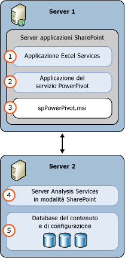

# Power Pivot per SharePoint (SSAS)
  Un server [!INCLUDE[ssASnoversion](../../includes/ssasnoversion-md.md)] in modalità [!INCLUDE[ssGemini](../../includes/ssgemini-md.md)] offre funzionalità di hosting nel server di dati [!INCLUDE[ssGemini](../../includes/ssgemini-md.md)] in una farm SharePoint. I dati [!INCLUDE[ssGemini](../../includes/ssgemini-md.md)] sono un modello di dati analitici che viene compilato con uno degli elementi seguenti:  
  
-   Componente aggiuntivo [!INCLUDE[ssGemini](../../includes/ssgemini-md.md)] per Excel 2010  
  
-   Excel 2013  
  
-   Excel 2016  
  
 **[!INCLUDE[applies](../../includes/applies-md.md)]**  [!INCLUDE[ssGeminiShort](../../includes/ssgeminishort-md.md)] 2016 | [!INCLUDE[ssGeminiShort](../../includes/ssgeminishort-md.md)] 2013  
  
 L'hosting nel server di tali dati richiede SharePoint, Excel Services e un'installazione di [!INCLUDE[ssGemini](../../includes/ssgemini-md.md)] per SharePoint. I dati vengono caricati nelle istanze di [!INCLUDE[ssGemini](../../includes/ssgemini-md.md)] per SharePoint, dove è possibile effettuare aggiornamenti a intervalli programmati tramite la funzionalità di aggiornamento dati di [!INCLUDE[ssGemini](../../includes/ssgemini-md.md)] fornita dal server per le cartelle di lavoro di Excel 2010 o da [!INCLUDE[ssGemini](../../includes/ssgemini-md.md)] per le cartelle di lavoro di Excel 2013 e 2016.  
  
## Power Pivot per SharePoint 2016  
 [!INCLUDE[ssCurrent](../../includes/sscurrent-md.md)] [!INCLUDE[ssGeminiShort](../../includes/ssgeminishort-md.md)] supporta l'utilizzo delle cartelle di lavoro di Excel di [!INCLUDE[msCoName](../../includes/msconame-md.md)] SharePoint 2016 e [!INCLUDE[offOnlineServer](../../includes/offonlineserver-md.md)] contenenti modelli di dati e report Power View di [!INCLUDE[ssRSnoversion](../../includes/ssrsnoversion-md.md)] .  
  
 All’interno di [!INCLUDE[offOnlineServer](../../includes/offonlineserver-md.md)] Excel include la funzionalità del modello di dati per abilitare l'interazione con una cartella di lavoro di [!INCLUDE[ssGemini](../../includes/ssgemini-md.md)] nel browser. Non è necessario distribuire il componente aggiuntivo [!INCLUDE[ssGemini](../../includes/ssgemini-md.md)] per SharePoint 2016 nella farm. È sufficiente installare un server [!INCLUDE[ssASnoversion](../../includes/ssasnoversion-md.md)] in modalità [!INCLUDE[ssGemini](../../includes/ssgemini-md.md)] e registrarlo con [!INCLUDE[offOnlineServer](../../includes/offonlineserver-md.md)].  
  
 Tramite la distribuzione del componente aggiuntivo [!INCLUDE[ssGemini](../../includes/ssgemini-md.md)] per SharePoint 2016 vengono abilitate le funzionalità aggiuntive nella farm di SharePoint in uso. Tra le funzionalità aggiuntive sono incluse la raccolta [!INCLUDE[ssGemini](../../includes/ssgemini-md.md)] e la pianificazione dell'aggiornamento dati.  
  
   
  
## Power Pivot per SharePoint 2013  
 [!INCLUDE[ssCurrent](../../includes/sscurrent-md.md)] [!INCLUDE[ssGeminiShort](../../includes/ssgeminishort-md.md)] supporta l'utilizzo delle cartelle di lavoro di Excel di [!INCLUDE[msCoName](../../includes/msconame-md.md)] SharePoint 2013 Excel Services contenenti modelli di dati e report Power View di [!INCLUDE[ssRSnoversion](../../includes/ssrsnoversion-md.md)] .  
  
 In Excel Services in SharePoint 2013 è inclusa la funzionalità del modello di dati per abilitare l'interazione con una cartella di lavoro di [!INCLUDE[ssGemini](../../includes/ssgemini-md.md)] nel browser. Non è necessario distribuire il componente aggiuntivo [!INCLUDE[ssGemini](../../includes/ssgemini-md.md)] per SharePoint 2013 nella farm. È sufficiente installare un server [!INCLUDE[ssASnoversion](../../includes/ssasnoversion-md.md)] in modalità SharePoint e registrarlo nelle impostazioni **Modello di dati** di Excel Services.  
  
 Tramite la distribuzione del componente aggiuntivo [!INCLUDE[ssGemini](../../includes/ssgemini-md.md)] per SharePoint 2013 vengono abilitate le funzionalità aggiuntive nella farm di SharePoint in uso. Tra le funzionalità aggiuntive sono incluse la raccolta [!INCLUDE[ssGemini](../../includes/ssgemini-md.md)] , la pianificazione dell'aggiornamento dati e il dashboard di gestione di [!INCLUDE[ssGemini](../../includes/ssgemini-md.md)] .  
  
   
  
##   Argomenti della sezione  
 [Amministrazione e configurazione del server PowerPivot in Amministrazione centrale](../../analysis-services/power-pivot-sharepoint/power-pivot-server-administration-and-configuration-in-central-administration.md)  
  
 [Configurazione di Power Pivot con Windows PowerShell](../../analysis-services/power-pivot-sharepoint/power-pivot-configuration-using-windows-powershell.md)  
  
 [Strumenti di configurazione di Power Pivot](../../analysis-services/power-pivot-sharepoint/power-pivot-configuration-tools.md)  
  
 [Autenticazione e autorizzazione di Power Pivot](../../analysis-services/power-pivot-sharepoint/power-pivot-authentication-and-authorization.md)  
  
 [Configurare le regole di integrità di Power Pivot](../../analysis-services/power-pivot-sharepoint/configure-power-pivot-health-rules.md)  
  
 [Dati di utilizzo e dashboard di gestione PowerPivot](../../analysis-services/power-pivot-sharepoint/power-pivot-management-dashboard-and-usage-data.md)  
  
 [Raccolta Power Pivot](http://msdn.microsoft.com/library/2a0db616-e08e-4062-aac8-979f8cad7794)  
  
 [Accesso ai dati PowerPivot](../../analysis-services/power-pivot-sharepoint/power-pivot-data-access.md)  
  
 [Aggiornamento dati Power Pivot](../../analysis-services/power-pivot-sharepoint/power-pivot-data-refresh.md)  
  
 [Feed di dati Power Pivot](../../analysis-services/power-pivot-sharepoint/power-pivot-data-feeds.md)  
  
 [Connessione BI Semantic Model &#40;con estensione bism&#41; di PowerPivot](../../analysis-services/power-pivot-sharepoint/power-pivot-bi-semantic-model-connection-bism.md)  
  
 **Nelle altre sezioni**  
  
## Argomenti aggiuntivi  
 [Aggiornare Power Pivot per SharePoint](../../database-engine/install-windows/upgrade-power-pivot-for-sharepoint.md)  
  
 [Installazione di Analisi Services in modalità Power Pivot](../../analysis-services/instances/install-windows/install-analysis-services-in-power-pivot-mode.md)  
  
 [Informazioni di riferimento su PowerShell per Power Pivot per SharePoint](../../analysis-services/powershell/powershell-reference-for-power-pivot-for-sharepoint.md)  
  
 [Esempi di topologie di licenza e costi per SQL Server 2016 Business Intelligence](http://msdn.microsoft.com/library/682b8711-407a-48d1-9807-415d4c24dad6)  
  
## Vedere anche  
 [Pianificazione e distribuzione di Power Pivot](http://go.microsoft.com/fwlink/?linkID=220972)   
 [Ripristino di emergenza per PowerPivot per SharePoint](http://go.microsoft.com/fwlink/p/?LinkId=389570)  
  
  

