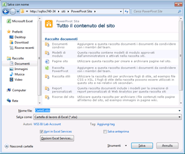

# Usare la Raccolta Power Pivot
[!INCLUDE[ssas-appliesto-sqlas](../../includes/ssas-appliesto-sqlas.md)]
  [!INCLUDE[ssGemini](../../includes/ssgemini-md.md)] La Raccolta è una speciale raccolta documenti di SharePoint che offre un'anteprima dettagliata e la gestione dei documenti per le cartelle di lavoro pubblicate di Excel e per i report di Reporting Services contenenti dati [!INCLUDE[ssGemini](../../includes/ssgemini-md.md)].  
  
> [!NOTE]  
>  A seconda della configurazione del server, si potrebbero visualizzare avvisi o messaggi di errore nell'area di anteprima per documenti specifici. I messaggi possono essere visualizzati quando una cartella di lavoro di Excel è impostata per aggiornare automaticamente i dati ad ogni apertura. I messaggi di avviso dell'aggiornamento dati vengono visualizzati come immagine di anteprima se Excel Services è configurato per mostrare i messaggi di errore Avvisa in caso di aggiornamento. Gli amministratori di farm o di servizi possono modificare le impostazioni di configurazione per consentire la visualizzazione di un'anteprima del foglio di lavoro effettivo. Per altre informazioni, vedere [Creare un percorso attendibile per i siti PowerPivot in Amministrazione centrale](../../analysis-services/power-pivot-sharepoint/create-a-trusted-location-for-power-pivot-sites-in-central-administration.md).  
  
##   Contenuto dell'argomento  
 [Prerequisiti](#prereq)  
  
 [Icone della Raccolta Power Pivot](#icons)  
  
 [Salvare una cartella di lavoro di Excel nella Raccolta Power Pivot](#add)  
  
 [Creare nuovi report o cartelle di lavoro in base a una cartella di lavoro di Power Pivot pubblicata](#newdocs)  
  
 [Aprire una cartella di lavoro o un report in modalità pagina intera](#view)  
  
 [Pianificare l'aggiornamento dati per cartelle di lavoro di Power Pivot nella Raccolta Power Pivot](#newdr)  
  
 [Eliminare una cartella di lavoro o un report nella Raccolta Power Pivot](#delete)  
  
 [Aggiornare un'immagine di anteprima](#image)  
  
 [Problemi noti](#bkmk_known_issues)  
  
##   Prerequisiti  
  
> [!NOTE]  
>  Con la raccolta di Power Pivot è richiesto Microsoft Silverlight.  Il browser Microsoft Edge non supporta Silverlight.   
> Per visualizzare il contenuto della raccolta in Edge, fare clic sulla scheda **Raccolta** nella raccolta di Power Pivot e quindi impostare la visualizzazione della raccolta documenti su **Tutti i documenti**.    
> Per cambiare la visualizzazione predefinita, fare clic sulla scheda **Raccolta** e quindi scegliere Modifica visualizzazione. Fare clic su "Imposta come visualizzazione predefinita" e quindi su OK per salvare la visualizzazione predefinita.  
>  Per altre informazioni sulle funzionalità supportate in Microsoft Edge, vedere il post di blog di Windows sulle [differenze tra Edge e i browser precedenti e sul supporto di ActiveX, VBScript e altri componenti](https://blogs.windows.com/msedgedev/2015/05/06/a-break-from-the-past-part-2-saying-goodbye-to-activex-vbscript-attachevent/).  
  
 Per un elenco completo dei prerequisiti, vedere [Creare e personalizzare la Raccolta PowerPivot](../../analysis-services/power-pivot-sharepoint/create-and-customize-power-pivot-gallery.md).  
  
##   Icone della Raccolta Power Pivot  
 Le icone forniscono un indicatore visivo della disponibilità del contenuto e dello stato.  
  
|Icona|Description|  
|----------|-----------------|  
||L'icona clessidra viene visualizzata quando viene generata un'immagine di anteprima di ogni pagina del documento. Aggiornare la pagina per visualizzare l'aggiornamento dell'immagine.|  
||L'icona pagine viene visualizzata quando una cartella di lavoro o un report contiene più pagine di quante non possano essere visualizzate nella Raccolta [!INCLUDE[ssGemini](../../includes/ssgemini-md.md)] . Per visualizzare tutte le pagine, è necessario usare un'applicazione client.|  
||L'icona di errore viene visualizzata quando non è stato possibile eseguire il rendering di un'immagine di anteprima per il documento. Il documento viene pubblicato nella raccolta, ma il relativo rendering non può essere eseguito nelle viste di Raccolta [!INCLUDE[ssGemini](../../includes/ssgemini-md.md)] personalizzate. Dovrebbe essere possibile visualizzare il documento in un'applicazione client, ad esempio il componente aggiuntivo [!INCLUDE[ssGemini](../../includes/ssgemini-md.md)] di Excel.|  
||L'icona contenuto non disponibile viene visualizzata quando non è possibile eseguire il rendering del documento caricato nella Raccolta [!INCLUDE[ssGemini](../../includes/ssgemini-md.md)] . I tipi di documento supportati includono cartelle di lavoro e report di [!INCLUDE[ssGemini](../../includes/ssgemini-md.md)] creati in Generatore report di SQL Server 2008 R2 Reporting Services.   Questa icona viene visualizzata anche se si ricicla un documento dal Cestino.   Se si ottiene questa icona per un documento che precedentemente disponeva di un'immagine di anteprima valida, è possibile aggiornare l'immagine modificando una proprietà del documento e salvando le modifiche.|  
||L'icona contenuto bloccato viene visualizzata quando le immagini di anteprima vengono disabilitate intenzionalmente per questo documento. [!INCLUDE[ssGemini](../../includes/ssgemini-md.md)] La Raccolta [!INCLUDE[ssGemini](../../includes/ssgemini-md.md)] non genera immagini di anteprima per le cartelle di lavoro di Excel che non contengono dati [!INCLUDE[ssGemini](../../includes/ssgemini-md.md)] o per cartelle di lavoro o report di Reporting Services che non soddisfano i requisiti per la generazione di snapshot. Per altre informazioni, vedere la sezione Prerequisiti contenuta in questo argomento.|  
  
##   Salvare una cartella di lavoro di Excel nella Raccolta Power Pivot  
 È possibile pubblicare le cartelle di lavoro di [!INCLUDE[ssGemini](../../includes/ssgemini-md.md)] nella raccolta usando tutte le tecniche di condivisione fornite da Excel 2010. Ad esempio, in Excel 2010 è possibile usare Salva con nome per specificare un percorso di SharePoint di una raccolta o parte di esso.  
  
1.  Salvare il file.  
  
2.  1.  **Excel 2010:** nel menu File fare clic su **Salva e invia**.  
  
    2.  Fare clic su **Salva in SharePoint**.  
  
    3.  Fare clic su **Opzioni pubblicazione** se si desidera usare Opzioni Excel Services per selezionare fogli o parametri singoli da pubblicare. Ad esempio, nella scheda Parametri in Opzioni Excel Services è possibile scegliere quali filtri dei dati visualizzare nella cartella di lavoro pubblicata.  
  
    1.  **Excel 2013:**  nel menu File fare clic su **Salva**.  
  
    2.  Fare clic su **Opzioni visualizzazione browser** se si desidera usare Opzioni Excel Services per selezionare fogli o parametri singoli da pubblicare. Ad esempio, nella scheda Parametri in Opzioni Excel Services è possibile scegliere quali filtri dei dati visualizzare nella cartella di lavoro pubblicata.  
  
3.  In Nome file nella finestra di dialogo Salva con nome immettere un URL completo o parziale per la raccolta [!INCLUDE[ssGemini](../../includes/ssgemini-md.md)] . Se si immette una parte dell'indirizzo URL, ad esempio il nome del server, è possibile esplorare il sito per trovare la Raccolta [!INCLUDE[ssGemini](../../includes/ssgemini-md.md)] . A tale scopo, scegliere **Salva** per aprire una connessione al server specificato.  
  
       
  
1.  Usando la finestra di dialogo Salva con nome, selezionare Raccolta [!INCLUDE[ssGemini](../../includes/ssgemini-md.md)] nel sito.  
  
2.  Fare clic su **Apri** per aprire la raccolta.  
  
3.  Fare clic su **Salva** per pubblicare la cartella di lavoro nella raccolta.  
  
 In una finestra del browser verificare che il documento venga visualizzato in Raccolta [!INCLUDE[ssGemini](../../includes/ssgemini-md.md)] . I documenti appena pubblicati saranno visualizzati nell'elenco. Le impostazioni della libreria determinano il punto in cui viene visualizzato il documento, ad esempio, ordinato in ordine crescente per data o in ordine alfabetico per nome. Potrebbe essere necessario aggiornare la finestra del browser per visualizzare le aggiunte più recenti.  
  
#### Caricare una cartella di lavoro in Raccolta Power Pivot  
 È inoltre possibile caricare una cartella di lavoro se si desidera partire da SharePoint e selezionare il file da pubblicare dal computer.  
  
1.  In un sito di SharePoint aprire Raccolta [!INCLUDE[ssGemini](../../includes/ssgemini-md.md)] .  
  
2.  Nella barra multifunzione Raccolta fare clic su **Documenti**.  
  
3.  In **Carica documento**selezionare un'opzione di caricamento, quindi immettere il nome e il percorso del file che si desidera caricare. Le impostazioni della raccolta determinano il punto in cui viene visualizzato il documento. Potrebbe essere necessario aggiornare la finestra del browser per visualizzare l'ultima aggiunta.  
  
##   Creare nuovi report o cartelle di lavoro in base a una cartella di lavoro di Power Pivot pubblicata  
 Per le cartelle di lavoro di [!INCLUDE[ssGemini](../../includes/ssgemini-md.md)] pubblicate nella raccolta [!INCLUDE[ssGemini](../../includes/ssgemini-md.md)] , è possibile creare cartelle di lavoro o report di Reporting Services aggiuntivi che usano la cartella di lavoro pubblicata come origine dati connessa.  
  
|||  
|-|-|  
||Fare clic sulla freccia giù del pulsante Nuovo report per avviare Generatore report o Excel 2010. [!INCLUDE[ssGemini](../../includes/ssgemini-md.md)] Nella Raccolta è necessario usare una delle viste predefinite (Teatro, Raccolta o Sequenza video) affinché il pulsante Nuovo report sia disponibile.|  
  
#### Creare report di Generatore report  
 La creazione di un nuovo report basato su una cartella di lavoro di [!INCLUDE[ssGemini](../../includes/ssgemini-md.md)] esistente nella raccolta richiede che Reporting Services sia configurato per l'integrazione con SharePoint per gli stessi siti che contengono la Raccolta [!INCLUDE[ssGemini](../../includes/ssgemini-md.md)] . Quando si seleziona l'opzione Crea report di Generatore report, Generatore report viene scaricato dal server di report e installato nella workstation locale al primo utilizzo. Un file di report del segnaposto viene creato per il nuovo report e viene salvato nella Raccolta [!INCLUDE[ssGemini](../../includes/ssgemini-md.md)] . Le informazioni di connessione nella cartella di lavoro di [!INCLUDE[ssGemini](../../includes/ssgemini-md.md)] vengono create automaticamente come nuova origine dati nel report. Come passaggio successivo, è possibile compilare i set di dati e il layout del report nell'area di lavoro di progettazione. Quando si usa Generatore report per assemblare il report, è possibile salvare le modifiche e il risultato finale nel documento del report nella raccolta. Per evitare la disconnessione dei dati in un secondo momento, assicurarsi di tenere i file di report e cartella di lavoro insieme nella stessa libreria.  
  
#### Apri nuova cartella di lavoro di Excel  
 Per creare una nuova cartella di lavoro di Excel da una esistente, è necessario che Excel e [!INCLUDE[ssGeminiClient](../../includes/ssgeminiclient-md.md)] siano già installati nel computer locale. Se si sceglie Apri nuova cartella di lavoro di Excel, viene avviato Excel, viene aperto un file (con estensione xlsx) della cartella di lavoro vuoto e vengono caricati in background i dati [!INCLUDE[ssGemini](../../includes/ssgemini-md.md)] come origine dati connessa. Nella nuova cartella di lavoro vengono usati solo i dati della finestra di [!INCLUDE[ssGemini](../../includes/ssgemini-md.md)] nella cartella di lavoro originale. I grafici o le tabelle pivot della cartella di lavoro originale vengono esclusi. La nuova cartella di lavoro crea collegamenti ai dati nella cartella di lavoro originale. I dati non vengono copiati nella nuova cartella di lavoro.  
  
##   Aprire una cartella di lavoro o un report in modalità pagina intera  
 Fare clic su qualsiasi immagine di anteprima visibile del documento visualizzato in anteprima per aprirlo in modalità pagina intera indipendentemente dall'anteprima della raccolta [!INCLUDE[ssGemini](../../includes/ssgemini-md.md)] . [!INCLUDE[ssGemini](../../includes/ssgemini-md.md)] saranno visualizzate in un browser. I report di Reporting Services verranno aperti nella Web part visualizzatore di report che fa parte di una distribuzione di Reporting Services in un server SharePoint.  
  
 Un modo alternativo per visualizzare la cartella di lavoro in un browser consiste nell'aprirla in Excel in una workstation client. È necessario disporre di Excel 2013 o Excel 2010 e del componente aggiuntivo [!INCLUDE[ssGeminiClient](../../includes/ssgeminiclient-md.md)] per visualizzare il file. È possibile usare Excel 2007 per aprire il file, ma non è possibile usarlo per la trasformazione dei dati tramite Pivot. Per questo motivo, Excel 2013 o Excel 2010 è consigliato sia per la visualizzazione sia per la creazione di dati [!INCLUDE[ssGemini](../../includes/ssgemini-md.md)] . Se non si dispone delle applicazioni necessarie, è necessario usare un browser per visualizzare la cartella di lavoro da SharePoint.  
  
##   Pianificare l'aggiornamento dati per cartelle di lavoro di Power Pivot nella Raccolta Power Pivot  
 [!INCLUDE[ssGemini](../../includes/ssgemini-md.md)] in una cartella di lavoro di Excel pubblicata a intervalli pianificati.  
  
|||  
|-|-|  
||Fare clic sul pulsante Gestisci aggiornamento dati per creare o visualizzare una pianificazione che recuperi i dati aggiornati dalle origini dati connesse. Per istruzioni su come creare una pianificazione, vedere [Pianificare un aggiornamento dati (Power Pivot per SharePoint)](http://msdn.microsoft.com/en-us/8571208f-6aae-4058-83c6-9f916f5e2f9b).|  
  
##   Eliminare una cartella di lavoro o un report nella Raccolta Power Pivot  
 Per eliminare un documento dalla raccolta, passare innanzitutto alla vista Tutti i documenti.  
  
1.  In un sito di SharePoint aprire Raccolta [!INCLUDE[ssGemini](../../includes/ssgemini-md.md)] .  
  
2.  Nella barra multifunzione fare clic su **Raccolta**.  
  
3.  In Gestione visualizzazioni, nell'elenco Vista corrente, fare clic sulla freccia in giù e selezionare Tutti i documenti.  
  
4.  Selezionare la cartella di lavoro o il report che si desidera eliminare.  
  
5.  In Gestisci in Documenti (File) fare clic sul pulsante **Elimina documento** .  
  
##   Aggiornare un'immagine di anteprima  
 Eseguire la procedura seguente per rigenerare un'immagine di anteprima per un documento nella Raccolta [!INCLUDE[ssGemini](../../includes/ssgemini-md.md)] .  
  
1.  Impostare la Raccolta [!INCLUDE[ssGemini](../../includes/ssgemini-md.md)] sulla vista Tutti i documenti. A tale scopo, fare clic su **Raccolta** nella barra multifunzione e impostare **Visualizzazione corrente** su **Tutti i documenti**.  
  
2.  Selezionare la cartella di lavoro o il report per il quale si desidera aggiornare l'immagine di anteprima.  
  
3.  Fare clic sulla freccia in giù visualizzata a destra, quindi selezionare **Modifica proprietà**.  
  
4.  Fare clic su **Salva**. Il salvataggio del documento forza il servizio snapshot a rigenerare l'immagine di anteprima.  
  
##   Problemi noti  
  
### Tipo di documento non supportato  
 Il tipo di contenuto **Documento Raccolta [!INCLUDE[ssGemini](../../includes/ssgemini-md.md)]** non è supportato. Se si abilita il tipo di contenuto **Documento Raccolta [!INCLUDE[ssGemini](../../includes/ssgemini-md.md)]** per una raccolta documenti e si prova a creare un nuovo documento di tale tipo, verrà visualizzato un messaggio di errore simile a uno dei seguenti:  
  
-   'Nuovo documento' richiede un'applicazione e un Web browser compatibili con Microsoft Sharepoint. Per aggiungere un documento alla raccolta documenti, fare clic sul pulsante 'Carica documento'.  
  
-   "L'indirizzo Internet http://[nome server]/testSite/PowerPivot Gallery/ReportGallery/Forms/Template.xlsx non è valido". "Microsoft Excel: impossibile accedere al file http://[nome server]/testSite/PowerPivot Gallery/ReportGallery/Forms/Template.xlsx". I motivi possibili sono diversi:  
  
 Il tipo di contenuto **Documento Raccolta [!INCLUDE[ssGemini](../../includes/ssgemini-md.md)]** non viene aggiunto automaticamente alle raccolte documenti. Questo problema non viene riscontrato a meno che non si abiliti manualmente il tipo di contenuto non supportato.  
  
## Vedere anche  
 [Creare un percorso attendibile per i siti PowerPivot in Amministrazione centrale](../../analysis-services/power-pivot-sharepoint/create-a-trusted-location-for-power-pivot-sites-in-central-administration.md)   
 [Eliminare una raccolta Power Pivot](../../analysis-services/power-pivot-sharepoint/delete-power-pivot-gallery.md)   
 [Creare e personalizzare la raccolta Power Pivot](../../analysis-services/power-pivot-sharepoint/create-and-customize-power-pivot-gallery.md)   
 [Pianificare un aggiornamento dati (Power Pivot per SharePoint)](http://msdn.microsoft.com/en-us/8571208f-6aae-4058-83c6-9f916f5e2f9b)  
  
  
