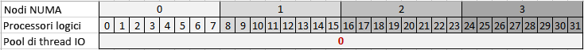
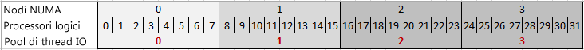
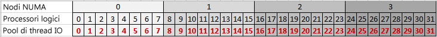

# Proprietà dei pool di thread
  [!INCLUDE[ssASnoversion](../../includes/ssasnoversion-md.md)] il multithreading viene usato per molte operazioni, con il conseguente miglioramento delle prestazioni complessive del server dovuto all'esecuzione di più processi in parallelo. Per gestire i thread in modo più efficiente, in [!INCLUDE[ssASnoversion](../../includes/ssasnoversion-md.md)] vengono usati i pool di thread per preallocare i thread e semplificarne la disponibilità per il processo successivo.  
  
 Ogni istanza di [!INCLUDE[ssASnoversion](../../includes/ssasnoversion-md.md)] mantiene il proprio set di pool di thread. Esistono differenze significative nel modo in cui i pool di thread vengono usati dalle istanze tabulari e da quelle multidimensionali. Ad esempio, solo le istanze multidimensionali usano il pool di thread **IOProcess** . Di conseguenza, la proprietà **PerNumaNode** , descritta in questo argomento, non è significativa per le istanze tabulari. Nella sezione [Guida di riferimento alle proprietà](#bkmk_propref) seguente, i requisiti di modalità sono indicati per ogni proprietà.
  
 In questo argomento sono incluse le sezioni seguenti:  
  
-   [Gestione di thread in Analysis Services](#bkmk_threadarch)  
  
-   [Guida di riferimento alle proprietà dei pool di thread](#bkmk_propref)  
  
-   [Impostazione di GroupAffinity per la creazione di affinità tra thread e processori in un gruppo di processori](#bkmk_groupaffinity)  
  
-   [Impostazione di PerNumaNode per la creazione di affinità tra thread di I/O e processori in un nodo NUMA](#bkmk_pernumanode)  
  
-   [Determinazione delle impostazioni correnti dei pool di thread](#bkmk_currentsettings)  
  
-   [Proprietà dipendenti o correlate](#bkmk_related)  
  
-   [Informazioni su MSMDSRV.INI](#bkmk_msmdrsrvini)  
  
> [!NOTE]  
>  La distribuzione tabulare nei sistemi NUMA non rientra nell'ambito di questo argomento. Sebbene le soluzioni tabulari possano essere distribuite correttamente nei sistemi NUMA, le caratteristiche di prestazioni della tecnologia di database in memoria usata dai modelli tabulari possono mostrare vantaggi limitati nelle architetture con scalabilità verticale accentuata. Per altre informazioni, vedere [Case study di Analysis Services: uso di modelli tabulari in una soluzione commerciale su vasta scala](http://msdn.microsoft.com/library/dn751533.aspx) e [Ridimensionamento hardware di una soluzione tabulare](http://go.microsoft.com/fwlink/?LinkId=330359).  
  
##   Gestione di thread in Analysis Services  
 [!INCLUDE[ssASnoversion](../../includes/ssasnoversion-md.md)] viene usato il multithreading per sfruttare le risorse di CPU disponibili mediante l'aumento del numero di attività eseguite in parallelo. Il motore di archiviazione è multithread. Esempi di processi multithread che vengono eseguiti nel motore di archiviazione includono l'elaborazione di oggetti in parallelo o la gestione di query discrete che siano state inviate al motore di archiviazione, nonché la restituzione di valori di dati richiesti da una query. Il motore delle formule, a causa della natura seriale dei calcoli che valuta, è a thread singolo. Ogni query viene eseguita principalmente su un solo thread, richiedendo e spesso restando in attesa dei dati restituiti dal motore di archiviazione. I thread di query hanno tempi di esecuzione più lunghi e vengono rilasciati solo al termine dell'esecuzione dell'intera query.  
  
 Per impostazione predefinita, in [!INCLUDE[ssSQL11](../../includes/sssql11-md.md)] e versioni successive, tramite [!INCLUDE[ssASnoversion](../../includes/ssasnoversion-md.md)] verranno usati tutti i processori logici disponibili, fino a 640 sui sistemi che eseguono edizioni superiori di Windows e SQL Server. All'avvio, il processo msmdsrv.exe verrà assegnato a uno specifico gruppo di processori, ma successivamente i thread potranno essere pianificati in qualsiasi processore logico, in qualsiasi gruppo di processori.  
  
 Un effetto collaterale dell'utilizzo di un numero elevato di processori consiste nel fatto che a volte si può verificare una riduzione del livello delle prestazioni, poiché i carichi di elaborazione e query sono distribuiti in un numero elevato di processori, con il conseguente aumento della contesa per le strutture dei dati condivisi. Questa situazione si può verificare in particolare nei sistemi avanzati che usano l'architettura NUMA, ma anche nei sistemi non NUMA che eseguono più applicazioni con elevate quantità di dati nello stesso hardware.  
  
 Per risolvere questo problema, è possibile impostare l'affinità tra tipi di operazioni di [!INCLUDE[ssASnoversion](../../includes/ssasnoversion-md.md)] e un set specifico di processori logici. La proprietà **GroupAffinity** consente di creare maschere di affinità personalizzate che specificano la risorsa di sistema da usare per ognuno dei tipi di pool di thread gestiti da [!INCLUDE[ssASnoversion](../../includes/ssasnoversion-md.md)].
 
È consigliabile SQL Server 2016 Cumulative Update 1 (CU1) o versioni successive per l'impostazione di **GroupAffinity** nelle istanze tabulari. 
  
 **GroupAffinity** è una proprietà che può essere impostata su uno dei pool di thread usati per i diversi carichi di lavoro di [!INCLUDE[ssASnoversion](../../includes/ssasnoversion-md.md)] :  
  
-   **ThreadPool \ Parsing \ Short**  è un pool di analisi per le richieste brevi. Le richieste che rientrano in un singolo messaggio di rete vengono considerate brevi. 
  
-   **ThreadPool \ Parsing \ Long**  è un pool di analisi per tutte le altre richieste che non rientrano in un singolo messaggio di rete. 
  
    > [!NOTE]  
    >  Per eseguire una query è possibile usare un thread di entrambi i pool di analisi. Le query che vengono eseguite rapidamente, ad esempio le richieste rapide di individuazione o annullamento, vengono talvolta eseguite immediatamente piuttosto che essere messe in coda nel pool di thread di query. 
  
-   **ThreadPool \ Query** è il pool di thread che esegue tutte le richieste che non sono gestite dal pool di thread di analisi. I thread inclusi in questo pool di thread eseguiranno tutti i tipi di operazioni, ad esempio i comandi di individuazione, MDX, DAX, DMX e DDL. A
  
-   **ThreadPool \ IOProcess** viene usato per i processi di I/O associati alle query del motore di archiviazione nel motore multidimensionale. Le operazioni eseguite da questi thread non dovrebbero avere dipendenze da altri thread. Tramite questi thread viene in genere eseguita l'analisi di un singolo segmento di una partizione e i dati del segmento vengono filtrati e aggregati. I thread**IOProcess** risentono in particolare delle configurazioni hardware NUMA. Di conseguenza, per questo pool di thread è disponibile la proprietà di configurazione **PerNumaNode** che può essere usata per ottimizzare le prestazioni, se necessario. 
  
-   **ThreadPool \ Process** viene usato per i processi di maggiore durata del motore di archiviazione, incluse le operazioni di aggregazione, indicizzazione e commit. I thread del pool di thread Processing vengono usati anche dalla modalità di archiviazione ROLAP.  

- **VertiPaq \ ThreadPool** è il pool di thread per l'esecuzione di analisi di tabelle in un modello tabulare.
  
 Per elaborare le richieste, è possibile che in [!INCLUDE[ssASnoversion](../../includes/ssasnoversion-md.md)] venga superato il limite massimo del pool di thread, richiedendo thread aggiuntivi qualora fossero necessari per completare l'attività. Tuttavia, alla fine dell'esecuzione dell'attività da parte di un thread, quest'ultimo viene semplicemente terminato, anziché essere restituito al pool di thread, qualora il numero corrente di thread è maggiore del limite massimo.  
  
> [!NOTE]  
>  Il superamento del numero massimo di pool di thread è una protezione richiamata solo quando si verificano determinate condizioni di deadlock. Per impedire la creazione di thread sfuggiti al controllo oltre il limite massimo, i thread vengono creati gradualmente (dopo un breve intervallo) dopo che il limite massimo viene raggiunto. Il superamento del numero di thread massimo può provocare un rallentamento nell'esecuzione dell'attività. Se i contatori delle prestazioni indicano che il numero di thread supera regolarmente le dimensioni massime del pool di thread, è possibile desumere che le dimensioni dei pool di thread sono troppo piccole per il livello di concorrenza richiesto dal sistema.  
  
 Per impostazione predefinita, le dimensioni del pool di thread sono determinate da [!INCLUDE[ssASnoversion](../../includes/ssasnoversion-md.md)]e sono basate sul numero di core. È possibile osservare i valori predefiniti selezionati esaminando il file msmdsrv.log dopo l'avvio del server. Come esercizio di ottimizzazione delle prestazioni, è possibile scegliere di aumentare le dimensioni del pool di thread, nonché di modificare altre proprietà, per migliorare le prestazioni di elaborazione o di query.  
  
##   Guida di riferimento alle proprietà dei pool di thread  
 In questa sezione vengono descritte le proprietà dei pool di thread individuate nel file msmdsrv.ini di ogni istanza di [!INCLUDE[ssASnoversion](../../includes/ssasnoversion-md.md)] . Una parte di queste proprietà è disponibile anche in SQL Server Management Studio.  
  
 Le proprietà sono elencate in ordine alfabetico.  
  
|Nome|Tipo|Description|Default|Informazioni aggiuntive|  
|----------|----------|-----------------|-------------|--------------|  
|**IOProcess** \ **Concurrency**|double|Valore a virgola mobile a precisione doppia con cui si determina l'algoritmo usato per impostare una destinazione nel numero di thread che possono essere inseriti in una coda contemporaneamente.|2.0|Proprietà avanzata che deve essere modificata solo sotto la supervisione del servizio di supporto tecnico [!INCLUDE[msCoName](../../includes/msconame-md.md)] .   La proprietà Concurrency viene usata per inizializzare i pool di thread che vengono implementati usando le porte di completamento I/O di Windows. Per altre informazioni, vedere [Porte di completamento I/O](http://msdn.microsoft.com/library/windows/desktop/aa365198\(v=vs.85\).aspx) .   Questa proprietà si applica solo ai modelli multidimensionali.|  
|**IOProcess** \ **GroupAffinity**|string|Matrice di valori esadecimali corrispondenti ai gruppi di processori nel sistema, usata per impostare l'affinità dei thread nel pool di thread IOProcess sui processori logici in ogni gruppo di processori.|none|È possibile usare questa proprietà per creare affinità personalizzate. La proprietà è vuota per impostazione predefinita.   Per altre informazioni, vedere [Impostare GroupAffinity per creare affinità fra thread e processori in un gruppo di processori](#bkmk_groupaffinity) .   Questa proprietà si applica solo ai modelli multidimensionali.|  
|**IOProcess** \ **MaxThreads**|int|Intero con segno a 32 bit che definisce il numero massimo di thread da includere nel pool di thread.|0|0 indica che le impostazioni predefinite vengono determinate dal server. Per impostazione predefinita, tramite il server questo valore viene impostato sul valore più elevato tra 64 e un valore pari a 10 volte il numero di processori logici. Ad esempio, in un sistema con 4 core con Hyper-Threading, il numero massimo di thread per il pool di thread è 80.   Se si imposta su un valore negativo, il valore in questione viene moltiplicato dal server per il numero di processori logici. Ad esempio, se è impostato su -10 in un server con 32 processori logici, il massimo è 320 thread.   Il valore massimo è soggetto ai processori disponibili per tutte le maschere di affinità personalizzate definite in precedenza. Ad esempio, se è già stata impostata l'affinità del pool di thread in modo da usare 8 dei 32 processori e ora si imposta MaxThreads su -10, il limite superiore per il pool di thread sarà 10 volte 8 o 80 thread.   I valori effettivi usati per questa proprietà dei pool di thread vengono scritti nel file di log msmdsrv al momento dell'avvio del servizio.   Ulteriori informazioni sull'ottimizzazione delle impostazioni del pool di thread sono disponibili nella pagina relativa alla [Guida operativa di Analysis Services](http://msdn.microsoft.com/library/hh226085.aspx).   Questa proprietà si applica solo ai modelli multidimensionali.|  
|**IOProcess** \ **MinThreads**|int|Intero con segno a 32 bit che definisce il numero minimo di thread da preallocare per il pool di thread.|0|0 indica che le impostazioni predefinite vengono determinate dal server. Per impostazione predefinita, il valore minimo è 1.   Se si imposta su un valore negativo, il valore in questione viene moltiplicato dal server per il numero di processori logici.   I valori effettivi usati per questa proprietà dei pool di thread vengono scritti nel file di log msmdsrv al momento dell'avvio del servizio.   Ulteriori informazioni sull'ottimizzazione delle impostazioni del pool di thread sono disponibili nella pagina relativa alla [Guida operativa di Analysis Services](http://msdn.microsoft.com/library/hh226085.aspx).   Questa proprietà si applica solo ai modelli multidimensionali.|  
|**IOProcess** \ **PerNumaNode**|int|Intero con segno a 32 bit che determina il numero dei pool di thread creati per il processo msmdsrv.|-1|I valori validi sono -1, 0, 1 e 2   -1 = Il server seleziona una diversa strategia per i pool di thread di I/O in base al numero di nodi NUMA. Nei sistemi con meno di 4 nodi NUMA, il comportamento del server è analogo a 0 (viene creato un solo pool di thread IOProcess per il sistema). Nei sistemi con 4 o più nodi, il comportamento è analogo a 1 (vengono creati pool di thread IOProcess per ogni nodo).   0 = Disabilita i pool di thread per nodo NUMA in modo che sia presente solo un pool di thread IOProcess usato dal processo msmdsrv.exe.   1 = Abilita un singolo pool di thread IOProcess per ogni nodo NUMA.   2 = Un singolo pool di thread IOProcess per ogni processore logico. Per i thread di ogni pool di thread viene creata un'affinità al nodo NUMA del processore logico, con il processore ideale impostato sul processore logico.   Per altre informazioni, vedere [Impostare PerNumaNode per creare affinità fra i thread I/O e i processori in un nodo NUMA](#bkmk_pernumanode) .   Questa proprietà si applica solo ai modelli multidimensionali.|  
|**IOProcess** \ **PriorityRatio**|int|Intero con segno a 32 bit che può essere usato per assicurarsi che i thread con priorità più bassa vengano talvolta eseguiti anche quando una coda con priorità più alta non è vuota.|2|Proprietà avanzata che deve essere modificata solo sotto la supervisione del servizio di supporto tecnico [!INCLUDE[msCoName](../../includes/msconame-md.md)] .   Questa proprietà si applica solo ai modelli multidimensionali.|  
|**IOProcess** \ **StackSizeKB**|int|Intero con segno a 32 bit che può essere usato per modificare l'allocazione di memoria durante l'esecuzione dei thread.|0|Proprietà avanzata che deve essere modificata solo sotto la supervisione del servizio di supporto tecnico [!INCLUDE[msCoName](../../includes/msconame-md.md)] .   Questa proprietà si applica solo ai modelli multidimensionali.|  
|**Parsing**  \ **Long** \ **Concurrency**|double|Valore a virgola mobile a precisione doppia con cui si determina l'algoritmo usato per impostare una destinazione nel numero di thread che possono essere inseriti in una coda contemporaneamente.|2.0|Proprietà avanzata che deve essere modificata solo sotto la supervisione del servizio di supporto tecnico [!INCLUDE[msCoName](../../includes/msconame-md.md)] .   La proprietà Concurrency viene usata per inizializzare i pool di thread che vengono implementati usando le porte di completamento I/O di Windows. Per altre informazioni, vedere [Porte di completamento I/O](http://msdn.microsoft.com/library/windows/desktop/aa365198\(v=vs.85\).aspx) .|  
|**Parsing**  \ **Long** \ **GroupAffinity**|string|Matrice di valori esadecimali corrispondenti ai gruppi di processori nel sistema, usata per impostare l'affinità dei thread di analisi sui processori logici in ogni gruppo di processori.|none|È possibile usare questa proprietà per creare affinità personalizzate. La proprietà è vuota per impostazione predefinita.   Per altre informazioni, vedere [Impostare GroupAffinity per creare affinità fra thread e processori in un gruppo di processori](#bkmk_groupaffinity) .|  
|**Parsing**  \ **Long** \ **NumThreads**|int|Proprietà a valore integer a 32 bit con segno che definisce il numero di thread che è possibile creare per comandi lunghi.|0|0 indica che le impostazioni predefinite vengono determinate dal server. Il comportamento predefinito consiste nell'impostare **NumThreads** su un valore assoluto o su 2 volte il numero di processori logici, a seconda del valore maggiore.   Se si imposta su un valore negativo, il valore in questione viene moltiplicato dal server per il numero di processori logici. Ad esempio, se è impostato su -10 in un server con 32 processori logici, il massimo è 320 thread.   Il valore massimo è soggetto ai processori disponibili per tutte le maschere di affinità personalizzate definite in precedenza. Ad esempio, se è già stata impostata l'affinità del pool di thread in modo da usare 8 dei 32 processori e ora si imposta NumThreads su -10, il limite superiore per il pool di thread sarà 10 volte 8 o 80 thread.   I valori effettivi usati per questa proprietà dei pool di thread vengono scritti nel file di log msmdsrv al momento dell'avvio del servizio.|  
|**Parsing**  \ **Long** \ **PriorityRatio**|int|Intero con segno a 32 bit che può essere usato per assicurarsi che i thread con priorità più bassa vengano talvolta eseguiti anche quando una coda con priorità più alta non è vuota.|0|Proprietà avanzata che deve essere modificata solo sotto la supervisione del servizio di supporto tecnico [!INCLUDE[msCoName](../../includes/msconame-md.md)] .|  
|**Parsing**  \ **Long** \ **StackSizeKB**|int|Intero con segno a 32 bit che può essere usato per modificare l'allocazione di memoria durante l'esecuzione dei thread.|0|Proprietà avanzata che deve essere modificata solo sotto la supervisione del servizio di supporto tecnico [!INCLUDE[msCoName](../../includes/msconame-md.md)] .|  
|**Parsing**  \ **Short** \ **Concurrency**|double|Valore a virgola mobile a precisione doppia con cui si determina l'algoritmo usato per impostare una destinazione nel numero di thread che possono essere inseriti in una coda contemporaneamente.|2.0|Proprietà avanzata che deve essere modificata solo sotto la supervisione del servizio di supporto tecnico [!INCLUDE[msCoName](../../includes/msconame-md.md)] .   La proprietà Concurrency viene usata per inizializzare i pool di thread che vengono implementati usando le porte di completamento I/O di Windows. Per altre informazioni, vedere [Porte di completamento I/O](http://msdn.microsoft.com/library/windows/desktop/aa365198\(v=vs.85\).aspx) .|  
|**Parsing**  \ **Short** \ **GroupAffinity**|string|Matrice di valori esadecimali corrispondenti ai gruppi di processori nel sistema, usata per impostare l'affinità dei thread di analisi sui processori logici in ogni gruppo di processori.|none|È possibile usare questa proprietà per creare affinità personalizzate. La proprietà è vuota per impostazione predefinita.   Per altre informazioni, vedere [Impostare GroupAffinity per creare affinità fra thread e processori in un gruppo di processori](#bkmk_groupaffinity) .|  
|**Parsing**  \ **Short** \ **NumThreads**|int|Proprietà integer a 32 bit con segno che definisce il numero di thread che è possibile creare per comandi brevi.|0|0 indica che le impostazioni predefinite vengono determinate dal server. Il comportamento predefinito consiste nell'impostare **NumThreads** su un valore assoluto o su 2 volte il numero di processori logici, a seconda del valore maggiore.   Se si imposta su un valore negativo, il valore in questione viene moltiplicato dal server per il numero di processori logici. Ad esempio, se è impostato su -10 in un server con 32 processori logici, il massimo è 320 thread.   Il valore massimo è soggetto ai processori disponibili per tutte le maschere di affinità personalizzate definite in precedenza. Ad esempio, se è già stata impostata l'affinità del pool di thread in modo da usare 8 dei 32 processori e ora si imposta NumThreads su -10, il limite superiore per il pool di thread sarà 10 volte 8 o 80 thread.   I valori effettivi usati per questa proprietà dei pool di thread vengono scritti nel file di log msmdsrv al momento dell'avvio del servizio.|  
|**Parsing**  \ **Short** \ **PriorityRatio**|int|Intero con segno a 32 bit che può essere usato per assicurarsi che i thread con priorità più bassa vengano talvolta eseguiti anche quando una coda con priorità più alta non è vuota.|0|Proprietà avanzata che deve essere modificata solo sotto la supervisione del servizio di supporto tecnico [!INCLUDE[msCoName](../../includes/msconame-md.md)] .|  
|**Parsing**  \ **Short** \ **StackSizeKB**|int|Intero con segno a 32 bit che può essere usato per modificare l'allocazione di memoria durante l'esecuzione dei thread.|64 * numero di processori logici|Proprietà avanzata che deve essere modificata solo sotto la supervisione del servizio di supporto tecnico [!INCLUDE[msCoName](../../includes/msconame-md.md)] .|  
|**Process** \ **Concurrency**|double|Valore a virgola mobile a precisione doppia con cui si determina l'algoritmo usato per impostare una destinazione nel numero di thread che possono essere inseriti in una coda contemporaneamente.|2.0|Proprietà avanzata che deve essere modificata solo sotto la supervisione del servizio di supporto tecnico [!INCLUDE[msCoName](../../includes/msconame-md.md)] .   La proprietà Concurrency viene usata per inizializzare i pool di thread che vengono implementati usando le porte di completamento I/O di Windows. Per altre informazioni, vedere [Porte di completamento I/O](http://msdn.microsoft.com/library/windows/desktop/aa365198\(v=vs.85\).aspx) .|  
|**Process** \ **GroupAffinity**|string|Matrice di valori esadecimali corrispondenti ai gruppi di processori nel sistema, usata per impostare l'affinità dei thread di elaborazione sui processori logici in ogni gruppo di processori.|none|È possibile usare questa proprietà per creare affinità personalizzate. La proprietà è vuota per impostazione predefinita.   Per altre informazioni, vedere [Impostare GroupAffinity per creare affinità fra thread e processori in un gruppo di processori](#bkmk_groupaffinity) .|  
|**Process** \ **MaxThreads**|int|Intero con segno a 32 bit che definisce il numero massimo di thread da includere nel pool di thread.|0|0 indica che le impostazioni predefinite vengono determinate dal server. Per impostazione predefinita, tramite il server questo valore viene impostato sul valore più elevato tra un valore assoluto pari a 64 e il numero di processori logici. Ad esempio, in un sistema con 64 core con Hyper-Threading abilitato (che determina 128 processori logici), il numero massimo di thread per il pool di thread è 128.   Se si imposta su un valore negativo, il valore in questione viene moltiplicato dal server per il numero di processori logici. Ad esempio, se è impostato su -10 in un server con 32 processori logici, il massimo è 320 thread.   Il valore massimo è soggetto ai processori disponibili per tutte le maschere di affinità personalizzate definite in precedenza. Ad esempio, se è già stata impostata l'affinità del pool di thread in modo da usare 8 dei 32 processori e ora si imposta MaxThreads su -10, il limite superiore per il pool di thread sarà 10 volte 8 o 80 thread.   I valori effettivi usati per questa proprietà dei pool di thread vengono scritti nel file di log msmdsrv al momento dell'avvio del servizio.   Ulteriori informazioni sull'ottimizzazione delle impostazioni del pool di thread sono disponibili nella pagina relativa alla [Guida operativa di Analysis Services](http://msdn.microsoft.com/library/hh226085.aspx).|  
|**Process** \ **MinThreads**|int|Intero con segno a 32 bit che definisce il numero minimo di thread da preallocare per il pool di thread.|0|0 indica che le impostazioni predefinite vengono determinate dal server. Per impostazione predefinita, il valore minimo è 1.   Se si imposta su un valore negativo, il valore in questione viene moltiplicato dal server per il numero di processori logici.   I valori effettivi usati per questa proprietà dei pool di thread vengono scritti nel file di log msmdsrv al momento dell'avvio del servizio.   Ulteriori informazioni sull'ottimizzazione delle impostazioni del pool di thread sono disponibili nella pagina relativa alla [Guida operativa di Analysis Services](http://msdn.microsoft.com/library/hh226085.aspx).|  
|**Process** \ **PriorityRatio**|int|Intero con segno a 32 bit che può essere usato per assicurarsi che i thread con priorità più bassa vengano talvolta eseguiti anche quando una coda con priorità più alta non è vuota.|2|Proprietà avanzata che deve essere modificata solo sotto la supervisione del servizio di supporto tecnico [!INCLUDE[msCoName](../../includes/msconame-md.md)] .|  
|**Process** \ **StackSizeKB**|int|Intero con segno a 32 bit che può essere usato per modificare l'allocazione di memoria durante l'esecuzione dei thread.|0|Proprietà avanzata che deve essere modificata solo sotto la supervisione del servizio di supporto tecnico [!INCLUDE[msCoName](../../includes/msconame-md.md)] .|  
|**Query**  \ **Concurrency**|double|Valore a virgola mobile a precisione doppia con cui si determina l'algoritmo usato per impostare una destinazione nel numero di thread che possono essere inseriti in una coda contemporaneamente.|2.0|Proprietà avanzata che deve essere modificata solo sotto la supervisione del servizio di supporto tecnico [!INCLUDE[msCoName](../../includes/msconame-md.md)] .   La proprietà Concurrency viene usata per inizializzare i pool di thread che vengono implementati usando le porte di completamento I/O di Windows. Per altre informazioni, vedere [Porte di completamento I/O](http://msdn.microsoft.com/library/windows/desktop/aa365198\(v=vs.85\).aspx) .|  
|**Query** \ **GroupAffinity**|string|Matrice di valori esadecimali corrispondenti ai gruppi di processori nel sistema, usata per impostare l'affinità dei thread di elaborazione sui processori logici in ogni gruppo di processori.|none|È possibile usare questa proprietà per creare affinità personalizzate. La proprietà è vuota per impostazione predefinita.   Per altre informazioni, vedere [Impostare GroupAffinity per creare affinità fra thread e processori in un gruppo di processori](#bkmk_groupaffinity) .|  
|**Query**  \ **MaxThreads**|int|Intero con segno a 32 bit che definisce il numero massimo di thread da includere nel pool di thread.|0|0 indica che le impostazioni predefinite vengono determinate dal server. Per impostazione predefinita, tramite il server questo valore viene impostato sul valore più elevato tra un valore assoluto pari a 10 e 2 volte il numero di processori logici. Ad esempio, in un sistema con 4 core con Hyper-Threading, il numero massimo di thread è 16.   Se si imposta su un valore negativo, il valore in questione viene moltiplicato dal server per il numero di processori logici. Ad esempio, se è impostato su -10 in un server con 32 processori logici, il massimo è 320 thread.   Il valore massimo è soggetto ai processori disponibili per tutte le maschere di affinità personalizzate definite in precedenza. Ad esempio, se è già stata impostata l'affinità del pool di thread in modo da usare 8 dei 32 processori e ora si imposta MaxThreads su -10, il limite superiore per il pool di thread sarà 10 volte 8 o 80 thread.   I valori effettivi usati per questa proprietà dei pool di thread vengono scritti nel file di log msmdsrv al momento dell'avvio del servizio.   Ulteriori informazioni sull'ottimizzazione delle impostazioni del pool di thread sono disponibili nella pagina relativa alla [Guida operativa di Analysis Services](http://msdn.microsoft.com/library/hh226085.aspx).|  
|**Query** \ **MinThreads**|int|Intero con segno a 32 bit che definisce il numero minimo di thread da preallocare per il pool di thread.|0|0 indica che le impostazioni predefinite vengono determinate dal server. Per impostazione predefinita, il valore minimo è 1.   Se si imposta su un valore negativo, il valore in questione viene moltiplicato dal server per il numero di processori logici.   I valori effettivi usati per questa proprietà dei pool di thread vengono scritti nel file di log msmdsrv al momento dell'avvio del servizio.   Ulteriori informazioni sull'ottimizzazione delle impostazioni del pool di thread sono disponibili nella pagina relativa alla [Guida operativa di Analysis Services](http://msdn.microsoft.com/library/hh226085.aspx).|  
|**Query** \ **PriorityRatio**|int|Intero con segno a 32 bit che può essere usato per assicurarsi che i thread con priorità più bassa vengano talvolta eseguiti anche quando una coda con priorità più alta non è vuota.|2|Proprietà avanzata che deve essere modificata solo sotto la supervisione del servizio di supporto tecnico [!INCLUDE[msCoName](../../includes/msconame-md.md)] .|  
|**Query**  \ **StackSizeKB**|int|Intero con segno a 32 bit che può essere usato per modificare l'allocazione di memoria durante l'esecuzione dei thread.|0|Proprietà avanzata che deve essere modificata solo sotto la supervisione del servizio di supporto tecnico [!INCLUDE[msCoName](../../includes/msconame-md.md)] .|  
|**VertiPaq** \ **CPUs**|int|Intero con segno a 32 bit che definisce il numero massimo di processori da usare per le query tabulari.|0|0 indica che le impostazioni predefinite vengono determinate dal server. Per impostazione predefinita, tramite il server questo valore viene impostato sul valore più elevato tra un valore assoluto pari a 10 e 2 volte il numero di processori logici. Ad esempio, in un sistema con 4 core con Hyper-Threading, il numero massimo di thread è 16.   Se si imposta su un valore negativo, il valore in questione viene moltiplicato dal server per il numero di processori logici. Ad esempio, se è impostato su -10 in un server con 32 processori logici, il massimo è 320 thread.   Il valore massimo è soggetto ai processori disponibili per tutte le maschere di affinità personalizzate definite in precedenza. Ad esempio, se è già stata impostata l'affinità del pool di thread in modo da usare 8 dei 32 processori e ora si imposta MaxThreads su -10, il limite superiore per il pool di thread sarà 10 volte 8 o 80 thread.   I valori effettivi usati per questa proprietà dei pool di thread vengono scritti nel file di log msmdsrv al momento dell'avvio del servizio.|  
  |**VertiPaq** \ **GroupAffinity**|string|Matrice di valori esadecimali corrispondenti ai gruppi di processori nel sistema, usata per impostare l'affinità dei thread di elaborazione sui processori logici in ogni gruppo di processori.|none|È possibile usare questa proprietà per creare affinità personalizzate. La proprietà è vuota per impostazione predefinita.   Per altre informazioni, vedere [Impostare GroupAffinity per creare affinità fra thread e processori in un gruppo di processori](#bkmk_groupaffinity) . Si applica solo ai modelli tabulari.| 
    
##   Impostazione di GroupAffinity per la creazione di affinità tra thread e processori in un gruppo di processori  
 **GroupAffinity** viene fornita per scopi di ottimizzazione avanzati. È possibile usare la proprietà **GroupAffinity** per impostare l'affinità tra i pool di thread di [!INCLUDE[ssASnoversion](../../includes/ssasnoversion-md.md)] e processori specifici; tuttavia, per la maggior parte delle installazioni, da parte di [!INCLUDE[ssASnoversion](../../includes/ssasnoversion-md.md)] viene eseguita la soluzione migliore laddove è possibile usare tutti i processori logici disponibili. Pertanto, l'affinità di gruppo non viene specificata per impostazione predefinita.  
  
 Se il test delle prestazioni indica la necessità di eseguire l'ottimizzazione della CPU, può essere consigliabile adottare un approccio di livello superiore, ad esempio usando Gestione risorse di Windows Server per impostare l'affinità tra i processori logici e un processo server. Questo tipo di approccio può risultare più semplice da implementare e gestire rispetto alla definizione di affinità personalizzate per i singoli pool di thread.  
  
 Se tale approccio risulta insufficiente, è possibile ottenere una maggiore precisione tramite la definizione di affinità personalizzate per i pool di thread. È più probabile che la personalizzazione delle impostazioni di affinità sia consigliata su sistemi multicore di grandi dimensioni (sia NUMA che non NUMA) in cui si verifichi una riduzione del livello delle prestazioni a causa della distribuzione dei pool di thread su un insieme troppo ampio di processori. Sebbene sia possibile impostare **GroupAffinity** su sistemi con meno di 64 processori logici, il vantaggio è irrilevante e può persino influire negativamente sulle prestazioni.  
  
> [!NOTE]  
>  **GroupAffinity** è vincolata da edizioni che limitano il numero di core usati da [!INCLUDE[ssASnoversion](../../includes/ssasnoversion-md.md)]. All'avvio, [!INCLUDE[ssASnoversion](../../includes/ssasnoversion-md.md)] usa le informazioni sull'edizione e le proprietà **GroupAffinity** per calcolare le maschere di affinità per ognuno dei pool di thread gestiti da [!INCLUDE[ssASnoversion](../../includes/ssasnoversion-md.md)]. Nell'edizione standard è possibile usare al massimo 24 core. Se si installa [!INCLUDE[ssASnoversion](../../includes/ssasnoversion-md.md)] Standard Edition in un sistema multicore di grandi dimensioni con più di 24 core, ne verranno usati solo 24 in [!INCLUDE[ssASnoversion](../../includes/ssasnoversion-md.md)] . Per altre informazioni sui limiti massimi del processore, vedere i limiti di scalabilità tra prodotti in [Funzionalità supportate dalle edizioni di SQL Server](https://msdn.microsoft.com/library/cc645993.aspx).  
  
### Sintassi  
 Il valore è esadecimale per ogni gruppo di processori; tale valore esadecimale rappresenta i processori logici che [!INCLUDE[ssASnoversion](../../includes/ssasnoversion-md.md)] tenta di usare per primi durante l'allocazione dei thread per un determinato pool di thread.  
  
 **Maschera di bit per i processori logici**  
  
 Ogni gruppo di processori può contenere al massimo 64 processori logici. La maschera di bit è pari a 1 (o 0) per ogni processore logico nel gruppo che viene usato (o non viene usato) da un pool di thread. Dopo avere calcolato la maschera di bit, occorre calcolare il valore esadecimale da usare per **GroupAffinity**.  
  
 **Gruppi con più processori**  
  
 I gruppi di processori vengono determinati all'avvio del sistema. **GroupAffinity** accetta valori esadecimali per ogni gruppo di processori in un elenco delimitato da virgole. Se sono presenti più gruppi di processori (fino a 10 nei sistemi di fascia superiore) è possibile ignorare i singoli gruppi specificando il valore 0x0. Ad esempio, in un sistema con quattro gruppi di processori (0, 1, 2, 3), si potrebbero escludere i gruppi 0 e 2 specificando 0x0 come primo e terzo valore.  
  
 `<GroupAffinity>0x0, 0xFF, 0x0, 0xFF</GroupAffinity>`  
  
### Passaggi per il calcolo della maschera di affinità per i processori  
 È possibile impostare **GroupAffinity** nel file msmdsrv.ini o nelle pagine delle proprietà del server in SQL Server Management Studio.  
  
1.  **Determinare il numero di processori e i gruppi di processori**  
  
     È possibile scaricare l' [utilità Coreinfo da Windows Sysinternals](http://technet.microsoft.com/sysinternals/cc835722.aspx).  
  
     Eseguire **coreinfo** per ottenere tali informazioni dalla sezione relativa al mapping tra processori logici e gruppi. Per ogni processore logico viene generata una riga separata.  
  
2.  Sequenza dei processori, da destra a sinistra: `7654 3210`  
  
     Nell'esempio vengono mostrati solo 8 processori (da 0 a 7), ma in ogni gruppo di processori vi possono essere fino a 64 processori logici, mentre nei sistemi server Windows più avanzati può essere presente un massimo di 10 gruppi di processori.  
  
3.  **Calcolare la maschera di bit per i gruppi di processori da usare**  
  
     `7654 3210`  
  
     Sostituire il numero con 0 o 1, a seconda che si desideri escludere o includere il processore logico. In un sistema con otto processori in cui si desideri usare i processori 7, 6, 5, 4 e 1 per Analysis Services, il calcolo potrebbe essere simile al seguente:  
  
     `1111 0010`  
  
4.  **Convertire il numero binario in un valore esadecimale**  
  
     Usando una calcolatrice o uno strumento di conversione, convertire il numero binario nell'equivalente esadecimale. In questo esempio, `1111 0010` viene convertito in `0xF2`.  
  
5.  **Immettere il valore esadecimale nella proprietà GroupAffinity**  
  
     Nel file msmdsrv.ini o nella pagina delle proprietà del server in Management Studio impostare **GroupAffinity** sul valore calcolato nel passaggio 4.  
  
> [!IMPORTANT]  
>  L'impostazione di **GroupAffinity** è un'attività manuale che include più passaggi. Quando si calcola **GroupAffinity**, verificare i calcoli con attenzione. Sebbene in [!INCLUDE[ssASnoversion](../../includes/ssasnoversion-md.md)] venga restituito un errore se l'intera maschera non è valida, se viene usata una combinazione di impostazioni valide e non valide, la proprietà verrà ignorata in [!INCLUDE[ssASnoversion](../../includes/ssasnoversion-md.md)] . Se ad esempio la maschera di bit include valori aggiuntivi, in [!INCLUDE[ssASnoversion](../../includes/ssasnoversion-md.md)] l'impostazione verrà ignorata, usando tutti i processori nel sistema. Non vengono visualizzati errori o avvisi quando si esegue questa azione, tuttavia è possibile controllare il file msmdsrv.log per informazioni sull'effettiva modalità di impostazione delle affinità.  
  
##   Impostazione di PerNumaNode per la creazione di affinità tra thread di I/O e processori in un nodo NUMA  
 Per le istanze multidimensionali di Analysis Services, è possibile impostare **PerNumaNode** nel pool di thread **IOProcess** per ottimizzare ulteriormente la pianificazione e l'esecuzione dei thread. Mentre **GroupAffinity** identifica semplicemente il set di processori logici da usare per un pool di thread specificato, **PerNumaNode** consente di specificare se devono essere creati più pool di thread; è quindi possibile impostare l'affinità tra tali pool di thread e determinati subset dei processori logici consentiti.  
  
> [!NOTE]  
>  In Windows Server 2012 usare Gestione attività per visualizzare il numero di nodi NUMA nel computer. Nella scheda Prestazioni di Gestione attività selezionare **CPU** , quindi fare clic con il pulsante destro del mouse sull'area del grafico per visualizzare i nodi NUMA. In alternativa, [scaricare l'](http://technet.microsoft.com/sysinternals/cc835722.aspx) utilità Coreinfo da Windows Sysinternals ed eseguire `coreinfo –n` per restituire i nodi NUMA e i processori logici in ogni nodo.  
  
 I valori validi per **PerNumaNode** sono -1, 0, 1, 2, come descritto nella sezione [Guida di riferimento alle proprietà dei pool di thread](#bkmk_propref) in questo argomento.  
  
### Impostazione predefinita (consigliato)  
 Nei sistemi in cui sono presenti nodi NUMA, è consigliabile usare l'impostazione predefinita PerNumaNode=-1, che consente a [!INCLUDE[ssASnoversion](../../includes/ssasnoversion-md.md)] di regolare il numero di pool di thread e la relativa affinità dei thread in base al numero dei nodi. Se il sistema dispone di meno di 4 nodi, tramite [!INCLUDE[ssASnoversion](../../includes/ssasnoversion-md.md)] vengono implementati i comportamenti descritti da **PerNumaNode**=0, mentre **PerNumaNode**=1 viene usato in sistemi con almeno 4 nodi.  
  
### Scelta di un valore  
 È inoltre possibile sostituire l'impostazione predefinita per usare un altro valore valido.  
  
 **Impostazione PerNumaNode=0**  
  
 I nodi NUMA vengono ignorati. Sarà disponibile un solo pool di thread IOProcess e verrà creata un'affinità tra tutti i thread di questo pool di thread e tutti i processori logici. Per impostazione predefinita (dove PerNumaNode=-1), si tratta dell'impostazione operativa se il computer dispone di meno di 4 nodi NUMA.  
  
   
  
 **Impostazione PerNumaNode=1**  
  
 I pool di thread IOProcess vengono creati per ogni nodo NUMA. L'utilizzo di pool di thread distinti migliora l'accesso coordinato alle risorse locali, ad esempio alla cache locale su un nodo NUMA.  
  
   
  
 **Impostazione PerNumaNode=2**  
  
 Questa impostazione è destinata a sistemi di fascia molto alta nei quali viene eseguita un'elevata quantità di carichi di lavoro di [!INCLUDE[ssASnoversion](../../includes/ssasnoversion-md.md)] . Questa proprietà imposta l'affinità del pool di thread IOProcess al livello di massima granularità, consentendo di creare pool di thread distinti e di impostarne l'affinità al livello del processore logico.  
  
 Nell'esempio seguente, in un sistema con 4 nodi NUMA e 32 processori logici l'impostazione di **PerNumaNode** su 2 produrrebbe 32 pool di thread IOProcess. Per i primi 8 pool di thread verrebbe creata un'affinità tra i thread e tutti i processori logici presenti nel nodo NUMA 0, ma con il processore ideale impostato su 0, 1, 2, fino a 7. Per i successivi 8 pool di thread verrebbe creata un'affinità con tutti i processori logici presenti nel nodo NUMA 1, con il processore ideale impostato su 8, 9, 10, fino a 15, e così via.  
  
   
  
 A questo livello di affinità, l'utilità di pianificazione tenta sempre di usare per primo il processore logico ideale all'interno del nodo NUMA preferito. Se il processore logico non è disponibile, l'utilità di pianificazione sceglie un altro processore all'interno dello stesso nodo o, se non sono disponibili altri thread, all'interno dello stesso gruppo di processori. Per altre informazioni ed esempi, vedere [Impostazioni di configurazione di Analysis Services 2012 (blog di Wordpress)](http://go.microsoft.com/fwlink/?LinkId=330387).  
  
###   Distribuzione del lavoro tra thread IOProcess  
 Quando si valuta se impostare la proprietà **PerNumaNode** , può essere utile conoscere come vengono utilizzati i thread **IOProcess** per prendere decisioni più pertinenti.  
  
 Si tenga presente che **IOProcess** viene usato per i processi di I/O associati alle query del motore di archiviazione nel motore multidimensionale.  
  
 Quando un segmento viene analizzato, tramite il motore viene identificata la partizione a cui appartiene il segmento e viene effettuato il tentativo di accodare il processo del segmento al pool di thread usato dalla partizione. In generale, le attività di tutti i segmenti che appartengono a una partizione verranno accodate allo stesso pool di thread. Nei sistemi NUMA, questo comportamento è particolarmente vantaggioso perché per tutte le analisi di una partizione verrà usata la memoria della cache del file system allocata in locale al nodo NUMA in questione.  
  
 Negli scenari seguenti vengono suggerite modifiche che talvolta possono migliorare le prestazioni delle query nei sistemi NUMA:  
  
-   Per gruppi di misure con poche partizioni, ad esempio con una soltanto, aumentare il numero di partizioni. L'utilizzo di una sola partizione causerà l'accodamento continuo di attività in un pool di thread (pool di thread 0) da parte del motore. Se si aggiungono più partizioni, tramite il motore sarà possibile usare pool di thread aggiuntivi.  
  
     In alternativa, se non è possibile creare partizioni aggiuntive, provare a impostare **PerNumaNode**=0 come modo per aumentare il numero di thread disponibili al pool di thread 0.  
  
-   Per i database in cui le analisi dei segmenti sono distribuite in modo uniforme tra più partizioni, impostando **PerNumaNode** su 1 o 2 è possibile migliorare le prestazioni di query dal momento che viene aumentato il numero complessivo di pool di thread **IOProcess** usati dal sistema.  
  
-   Per soluzioni con più partizioni, ma con una sola analisi eccessiva, provare a impostare **PerNumaNode**=0 per verificare un eventuale miglioramento delle prestazioni.  
  
 Sebbene sia nelle analisi delle dimensioni sia in quelle delle partizioni venga usato il pool di thread **IOProcess** , solo nelle analisi delle dimensioni viene usato il pool di thread 0. Ciò può generare un carico leggermente irregolare nel pool di thread in questione, ma lo sbilanciamento dovrebbe essere temporaneo, in quanto le analisi delle dimensioni tendono a essere molto veloci e rare.  
  
> [!NOTE]  
>  Quando si modifica una proprietà del server, si tenga presente che l'opzione di configurazione viene applicata a tutti i database in esecuzione nell'istanza corrente. Scegliere le impostazioni usate nei database più importanti o nel maggior numero di database. Non è possibile impostare l'affinità processori a livello di database, né è possibile impostare l'affinità tra singole partizioni e processori specifici.  
  
 Per altre informazioni sull'architettura del processo, vedere la sezione 2.2 nella [Guida alle prestazioni di SQL Server Analysis Services](http://www.microsoft.com/download/details.aspx?id=17303).  
  
##   Proprietà dipendenti o correlate  
 Come illustrato nella sezione 2.4 della [Guida operativa di Analysis Services](http://msdn.microsoft.com/library/hh226085.aspx), se si aumenta il pool di thread di elaborazione è necessario assicurarsi che i valori impostati per le impostazioni **CoordinatorExecutionMode** e per **CoordinatorQueryMaxThreads** consentano di usare completamente le dimensioni del pool di thread aumentato.  
  
 In Analysis Services viene usato un thread coordinatore, che raccoglie i dati necessari per completare le richieste di query o di elaborazione. Inizialmente, il coordinatore mette in coda un singolo processo per ogni partizione che deve essere toccata. Ognuno di questi processi continua quindi a mettere in coda altri processi, in base al numero complessivo di segmenti che devono essere analizzati nella partizione.  
  
 Il valore predefinito per **CoordinatorExecutionMode** è -4, vale a dire un limite di 4 processi in parallelo per core, vincolando in questo modo il numero totale di processi coordinatore che possono essere eseguiti in parallelo da una richiesta di sottocubo nel motore di archiviazione.  
  
 Il valore predefinito per **CoordinatorQueryMaxThreads** è 16, che limita il numero di processi del segmento eseguibili in parallelo per ogni partizione.  
  
##   Determinazione delle impostazioni correnti dei pool di thread  
 A ogni avvio del servizio, tramite [!INCLUDE[ssASnoversion](../../includes/ssasnoversion-md.md)] vengono restituite nel file msmdsrv.log le impostazioni del pool di thread corrente, inclusi i thread minimi e massimi, la maschera di affinità dei processori e la concorrenza.  
  
 L'esempio seguente è un estratto del file di log, che mostra le impostazioni predefinite per il pool di thread di query (MinThread=0, MaxThread=0, Concurrency=2) in un sistema con 4 core con Hyper-Threading abilitato. La maschera di affinità è 0xFF, valore che indica 8 processori logici. Si noti che gli zeri iniziali vengono aggiunti all'inizio della maschera. Gli zeri iniziali possono essere ignorati.  
  
 `"10/28/2013 9:20:52 AM) Message: The Query thread pool now has 1 minimum threads, 16 maximum threads, and a concurrency of 16.  Its thread pool affinity mask is 0x00000000000000ff. (Source: \\?\C:\Program Files\Microsoft SQL Server\MSAS11.MSSQLSERVER\OLAP\Log\msmdsrv.log, Type: 1, Category: 289, Event ID: 0x4121000A)"`  
  
 Tenere presente che l'algoritmo per impostare **MinThread** e **MaxThread** incorpora la configurazione di sistema, in particolare il numero di processori. Il post di blog seguente offre informazioni sulle modalità di calcolo dei valori: [Impostazioni di configurazione di Analysis Services 2012 (blog di Wordpress)](http://go.microsoft.com/fwlink/?LinkId=330387). Si noti che queste impostazioni e questi comportamenti sono soggetti a modifica nelle versioni future.  
  
 Nell'elenco seguente vengono illustrati esempi di altre impostazioni di maschere di affinità, per diverse combinazioni di processori:  
  
-   Affinità per processori 3-2-1-0 in sistemi con 8 core genera una maschera di bit: 00001111 e un valore esadecimale: 0xF  
  
-   Affinità per processori 7-6-5-4 in sistemi con 8 core genera una maschera di bit: 11110000 e un valore esadecimale: 0xF0  
  
-   Affinità per processori 5-4-3-2 in sistemi con 8 core genera una maschera di bit: 00111100 e un valore esadecimale: 0x3C  
  
-   Affinità per processori 7-6-1-0 in sistemi con 8 core genera una maschera di bit: 11000011 e un valore esadecimale: 0xC3  
  
 Tenere presente che nei sistemi con più gruppi di processori viene generata una maschera di affinità separata per ogni gruppo, in un elenco delimitato da virgole.  
  
##   Informazioni su MSMDSRV.INI  
 Il file msmdsrv.ini contiene le impostazioni di configurazione per un'istanza di [!INCLUDE[ssASnoversion](../../includes/ssasnoversion-md.md)] , che influisce su tutti i database in esecuzione in tale istanza. Non è possibile usare le proprietà di configurazione del server per ottimizzare le prestazioni di un solo database escludendo tutti gli altri. È tuttavia possibile installare più istanze di [!INCLUDE[ssASnoversion](../../includes/ssasnoversion-md.md)] e configurare ogni istanza per l'utilizzo di proprietà utili per i database che condividono caratteristiche o carichi di lavoro simili.  
  
 Tutte le proprietà di configurazione del server sono incluse nel file msmdsrv.ini. Subset delle proprietà in genere maggiormente soggette a modifica vengono visualizzate anche negli strumenti di amministrazione, ad esempio in SSMS.  
  
 Il contenuto del file msmdsrv.ini è identico sia per le istanze tabulari sia per quelle multidimensionali di [!INCLUDE[ssASnoversion](../../includes/ssasnoversion-md.md)]. Tuttavia, alcune impostazioni si applicano solo a una delle modalità. Le differenze di comportamento che dipendono dalla modalità del server sono indicate nella documentazione di riferimento della proprietà.  
  
> [!NOTE]  
>  Per istruzioni su come impostare le proprietà, vedere [Proprietà del server in Analysis Services](../../analysis-services/server-properties/server-properties-in-analysis-services.md).  
  
## Vedere anche  
 [Informazioni su processi e thread](http://msdn.microsoft.com/library/windows/desktop/ms681917\(v=vs.85\).aspx)   
 [Più processori](http://msdn.microsoft.com/library/windows/desktop/ms684251\(v=vs.85\).aspx)   
 [Gruppi di processori](http://msdn.microsoft.com/library/windows/desktop/dd405503\(v=vs.85\).aspx)   
 [Modifiche al Pool di Thread di Analysis Services in SQL Server 2012](http://blogs.msdn.com/b/psssql/archive/2012/01/31/analysis-services-thread-pool-changes-in-sql-server-2012.aspx)   
 [Impostazioni di analisi configurazione Services 2012 (Blog di Wordpress)](http://go.microsoft.com/fwlink/?LinkId=330387)   
 [Il supporto di sistemi che dispongono di più di 64 processori](http://msdn.microsoft.com/library/windows/hardware/gg463349.aspx)   
 [Guida operativa di SQL Server Analysis Services](http://go.microsoft.com/fwlink/?LinkID=225539)  
  
  
