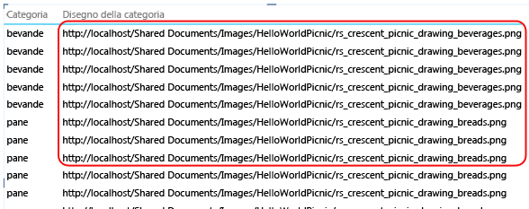
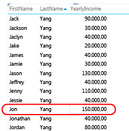
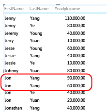
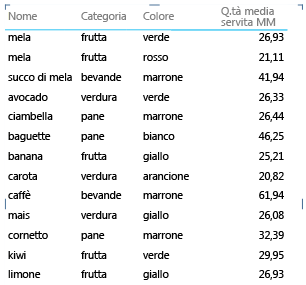
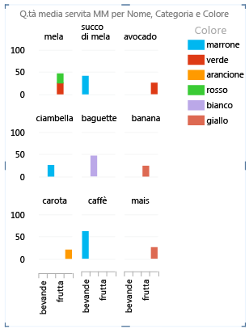
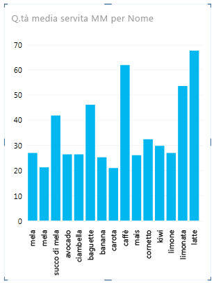

# Power View: configurare le proprietà comportamento tabella per i report
[!INCLUDE[ssas-appliesto-sqlas-aas](../../includes/ssas-appliesto-sqlas-aas.md)]Se si utilizza un modello tabulare come modello di dati per [!INCLUDE[ssCrescent](../../includes/sscrescent-md.md)], è possibile impostare le proprietà comportamento tabella che espongono righe di dettaglio a un livello più granulare. L'impostazione delle proprietà del comportamento delle tabelle comporta la modifica del comportamento di raggruppamento delle righe di dettaglio e offre una posizione predefinita migliore per le informazioni di identificazione quali nomi, ID foto o immagini del logo nei layout di sezioni, schede e grafici.  
  
 [!INCLUDE[ssCrescent](../../includes/sscrescent-md.md)] differisce dalle altre applicazioni di creazione report in quanto raggruppa automaticamente gli elementi durante la progettazione del report, tenendo conto di quali colonne sono state inserite nell'elenco dei campi del report rispetto al formato di presentazione usato. Nella maggior parte dei casi, il raggruppamento predefinito produce un risultato ottimale. Per alcune tabelle, tuttavia, principalmente quelle che contengono dati di dettaglio, il comportamento di raggruppamento predefinito prevede talvolta il raggruppamento di righe che non dovrebbero essere raggruppate. Per queste tabelle, è possibile impostare proprietà per modificare la modalità di valutazione dei gruppi.  
  
 È consigliabile impostare le proprietà del comportamento per le tabelle in cui le singole righe sono di interesse primario, ad esempio record dipendente o cliente. Al contrario, le tabelle che non traggono alcun beneficio da queste proprietà sono le tabelle di ricerca, ad esempio tabelle data, tabelle di categorie di prodotti o tabelle reparti che contengono un numero relativamente piccolo di righe e colonne o le tabelle di riepilogo che contengono righe che hanno un qualche interesse solo se riepilogate, ad esempio dati demografici riportati per sesso, età o località geografica. Per le tabelle di ricerca e di riepilogo, il comportamento di raggruppamento predefinito produce il risultato migliore.  
  
> [!NOTE]  
>  Le proprietà del comportamento delle tabelle interessano unicamente i modelli tabulari usati come modelli di dati in [!INCLUDE[ssCrescent](../../includes/sscrescent-md.md)]. Le proprietà del comportamento delle tabelle non sono supportate nei report pivot di Excel.  
  
 Di seguito sono elencate le proprietà del comportamento delle tabelle:  
  
-   **Identificatore di riga** : specifica una colonna che contiene solo valori univoci, consentendo l'uso di tale colonna come una chiave di raggruppamento interna.  
  
-   **Mantieni righe univoche** : specifica quali colonne forniscono valori che devono essere considerati come univoci anche se duplicati, ad esempio nome e cognome del dipendente, nei casi in cui due o più dipendenti abbiano lo stesso nome.  
  
-   **Etichetta predefinita** : specifica quale colonna fornisce un nome visualizzato per rappresentare i dati della riga, ad esempio nome del dipendente in un record dipendente.  
  
-   **Immagine predefinita** : specifica quale colonna fornisce un'immagine per rappresentare i dati della riga, ad esempio un ID foto in un record dipendente.  
  
> [!NOTE]  
>  Fare riferimento alla sezione seguente relativa alle ottimizzazioni dei layout rispetto a un determinato formato di presentazione:  [Ottimizzazione per layout specifici](#bkmk_optimizeforlayout).  
  
## Apertura della finestra di dialogo Comportamento tabella  
  
1.  In [!INCLUDE[ssBIDevStudioFull](../../includes/ssbidevstudiofull-md.md)]fare clic sulla tabella (scheda) per la quale si sta configurando un elenco di campi predefiniti.  
  
2.  Nella finestra **Proprietà** fare clic su **Fare clic per modificare** nella proprietà **Comportamento tabella**.  
  
3.  Nella finestra di dialogo **Comportamento tabella** impostare **Identificatore di riga**, quindi specificare le altre proprietà in questa finestra di dialogo.  
  
## Impostazione della proprietà Identificatore di riga  
 All'interno della tabella, l'identificatore di riga specifica una singola colonna che contiene solo valori univoci e nessun valore vuoto. La proprietà Identificatore di riga viene utilizzata per modificare il raggruppamento in modo che un gruppo non sia basato sulla composizione dei campi di una riga, ma piuttosto su una colonna fissa che viene sempre utilizzata per identificare in modo univoco una riga, indipendentemente dai campi utilizzati in un particolare layout di report.  
  
 L'impostazione di questa proprietà comporta la modifica del comportamento di raggruppamento predefinito dal raggruppamento dinamico basato sulle colonne presenti nell'area di disegno a un comportamento di raggruppamento fisso che riepiloga i dati in base all'identificatore di riga. La modifica del comportamento di raggruppamento predefinito è importante per layout di report come le matrici che altrimenti verrebbero raggruppati (o mostrerebbero i subtotali) per ogni colonna della riga.  
  
 In [!INCLUDE[ssCrescent](../../includes/sscrescent-md.md)]l'impostazione di un identificatore di riga abilita le proprietà aggiuntive seguenti: proprietà **Mantieni righe univoche** , proprietà **Etichetta predefinita** e proprietà **Immagine predefinita** .  
  
 È anche possibile usare **Identificatore di riga** come proprietà autonoma per poter eseguire le operazioni seguenti:  
  
-   Utilizzo di immagini binarie in un report. Rimuovendo l'ambiguità relativamente all'univocità delle righe, [!INCLUDE[ssCrescent](../../includes/sscrescent-md.md)] è in grado di determinare come assegnare immagini ed etichette predefinite per una determinata riga.  
  
-   Rimozione dei subtotali non desiderati da un report matrice. Il raggruppamento predefinito a livello di campo comporta la creazione di un subtotale per ciascun campo. Se si desidera disporre di un solo subtotale calcolato a livello di riga, l'impostazione dell'identificatore di riga produce questo risultato.  
  
 Non è possibile impostare un identificatore di riga per le tabelle contrassegnate come tabelle data. Per le tabelle data, l'identificatore di riga viene specificato quando si contrassegna la tabella. Per altre informazioni, vedere [Finestra di dialogo Contrassegna come tabella data &#40;SSAS&#41;](http://msdn.microsoft.com/library/698b5ef1-b79b-4d76-9847-39669b4f5bb9).  
  
## Impostazione della proprietà Mantieni righe univoche  
 Questa proprietà consente di specificare quali colonne contengono informazioni di identificazione, ad esempio un nome di dipendente o un codice prodotto, in modo da fare distinzione tra le righe. Nei casi in cui le righe sembrano identiche, ad esempio due clienti con lo stesso nome, le colonne specificate per questa proprietà vengono ripetute nella tabella del report.  
  
 A seconda delle colonne aggiunte a un report, è possibile che alcune righe vengano considerate identiche perché i valori contenuti in ogni riga sembrano uguali, ad esempio due clienti che si chiamano entrambi Jon Yang. Questa situazione potrebbe verificarsi perché le altre colonne che contengono elementi di differenziazione, ad esempio secondo nome, indirizzo o data di nascita, non sono presenti nell'area di disegno del report. In scenari di questo tipo, il comportamento predefinito prevede il raggruppamento delle righe apparentemente identiche in una sola riga, con il riepilogo di eventuali valori calcolati in un risultato più ampio dalle righe combinate.  
  
 Impostando la proprietà **Mantieni righe univoche** , è possibile specificare una o più colonne che devono sempre essere ripetute, anche in presenza di istanze duplicate, ogni volta che si aggiunge quella colonna all'area di disegno del report. I valori calcolati associati alla riga verranno allocati in base a ogni singola riga e non riportati in una sola riga. Quando si scelgono le colonne per la proprietà  **Mantieni righe univoche** , scegliere quelle che contengono valori univoci o quasi univoci.  
  
> [!NOTE]  
>  Poiché le colonne selezionate dall'utente finale possono influire sul raggruppamento, che modifica il contesto del filtro per i calcoli delle espressioni, i progettisti di modelli devono creare misure che restituiscano i risultati corretti. Per altre informazioni, vedere [Domande frequenti su Power View](http://go.microsoft.com/fwlink/?LinkId=220674).  
  
## Impostazione di un'etichetta predefinita  
 Questa proprietà consente di specificare un'etichetta che viene visualizzata nell'elenco di navigazione di un report di sezione. Se utilizzata con un'immagine predefinita, l'etichetta predefinita viene visualizzata sotto l'immagine. Senza un'immagine, l'etichetta predefinita viene visualizzata da sola. Quando si sceglie un'etichetta predefinita, scegliere la colonna che contiene la maggior parte delle informazioni sulla riga, ad esempio un nome.  
  
 In un layout di sezione, l'etichetta predefinita viene visualizzata nell'area del titolo sotto un'immagine, secondo la proprietà Immagine predefinita. Se ad esempio si dispone di un elenco di dipendenti, è possibile affiancare le informazioni sui dipendenti utilizzando l'ID foto come immagine predefinita e il nome del dipendente come etichetta predefinita. In una sezione l'etichetta predefinita viene visualizzata sotto l'immagine. Queste colonne vengono sempre visualizzate nella sezione, anche se non vengono selezionate in modo esplicito nell'elenco dei campi del report.  
  
## Impostazione di un'immagine predefinita  
 Questa proprietà consente di specificare un'immagine che viene visualizzata nell'elenco di navigazione di un report di sezione o nella parte anteriore di una scheda. Nel report, quando si seleziona la colonna che contiene l'immagine predefinita, quest'ultima viene visualizzata nell'elenco di navigazione del layout di un report di sezione o nella parte anteriore di una scheda. L'immagine predefinita deve essere data da contenuto visivo. Gli esempi includono un ID foto nella tabella dipendenti, un logo del cliente in una tabella clienti o la forma di un paese in una tabella geografica.  
  
> [!NOTE]  
>  Le immagini possono provenire da indirizzi URL o da un file di immagine in un server Web o da dati binari incorporati nella cartella di lavoro. Se l'immagine è basata su un URL, assicurarsi di impostare la colonna come un tipo di immagine in modo che [!INCLUDE[ssCrescent](../../includes/sscrescent-md.md)] possa recuperarla anziché visualizzare l'URL come dati di testo nel report.  
  
##   Ottimizzazione per layout specifici  
 In questa sezione vengono descritti gli effetti derivanti dall'impostazione delle proprietà del comportamento delle tabelle rispetto a un determinato formato di presentazione e alle caratteristiche dei dati. Se ad esempio si tenta di ottimizzare il layout di un report matrice, è possibile utilizzare queste informazioni per comprendere come migliorare la presentazione di una matrice utilizzando le proprietà del comportamento delle tabelle nel modello.  
  
### Immagini mancanti  
 Le proprietà impostate nel modello determinano se le immagini vengono visualizzate in un report o rappresentate come valori di testo.  
  
   
  
 Per impostazione predefinita, il testo nel modello viene interpretato come testo nel report. Se una colonna di testo è un indirizzo URL a un'immagine del report, ricordare di impostare la proprietà **URL immagine** in modo che [!INCLUDE[ssCrescent](../../includes/sscrescent-md.md)] possa recuperare il file di immagine. Per le immagini binarie, ricordare di impostare la proprietà **Identificatore di riga** .  
  
### Una o più righe mancanti nelle tabelle  
 Talvolta il comportamento di raggruppamento predefinito produce un risultato opposto a quello sperato. In particolare, le righe di dettaglio presenti nel modello non vengono visualizzate nel report. Per impostazione predefinita, [!INCLUDE[ssCrescent](../../includes/sscrescent-md.md)] raggruppa i dati in base alle colonne aggiunte nell'area di disegno. Se si aggiunge **Country Name** al report, ogni paese viene visualizzato una volta nell'area di disegno, anche se la tabella sottostante può contenere migliaia di righe che includono più istanze di ogni nome di paese. In questo caso, il comportamento di raggruppamento predefinito produce il risultato corretto.  
  
 Tuttavia, si consideri un esempio diverso in cui si desidera che vengano visualizzate più istanze di una riga perché di fatto le righe sottostanti contengono dati relativi a entità diverse. In questo esempio si supponga di avere due clienti con lo stesso nome, **Jon Yang**. Usando il comportamento di raggruppamento predefinito, solo un'istanza di **Jon Yang** verrà visualizzata nel report. Inoltre, poiché nell'elenco è presente solo un'istanza, la misura **Annual Income** corrisponde alla somma di tale valore per entrambi i clienti.  
  
   
  
 Per modificare il comportamento di raggruppamento predefinito, impostare le proprietà **Identificatore di riga** e **Mantieni righe univoche** . In **Mantieni righe univoche**scegliere la colonna Cognome in modo che questo valore venga ripetuto per una riga, anche se è già visualizzato in un'altra. Dopo aver modificato le proprietà e aver ripubblicato la cartella di lavoro, è possibile creare lo stesso report, ma questa volta verranno visualizzati entrambi i clienti con nome **Jon Yang**, con il valore di **Annual Income** allocato correttamente a ognuno di loro.  
  
   
  
### Il layout della matrice contiene troppi valori  
 Quando si presenta una tabella di dettagli in una matrice, il raggruppamento predefinito fornisce un valore riepilogato per ogni colonna. A seconda degli obiettivi è anche possibile che il livello di riepilogo sia eccessivo. Per modificare questo comportamento, è possibile impostare **Identificatore di riga**. Non è necessario impostare altre proprietà. L'impostazione della proprietà Identificatore di riga è sufficiente per modificare il raggruppamento in modo che i riepiloghi vengano calcolati per ogni riga in base al relativo identificatore di riga univoco.  
  
 Confrontare le immagini prima e dopo seguenti in cui viene illustrato l'effetto dell'impostazione di questa proprietà su un layout di matrice.  
  
 **Prima: raggruppamento predefinito basato sui campi nella matrice**  
  
   
  
 **Dopo: raggruppamento basato sull'identificatore di riga**  
  
   
  
### Nel grafico vengono mostrati troppo elementi e livelli sull'asse  
 I report del grafico che mostrano dati di dettaglio devono utilizzare l'identificatore di riga come un asse. Senza un identificatore di riga, l'asse è indeterminato e il layout che ne deriva non è che un'ipotesi che potrebbe non avere alcun significato. Per modificare questo comportamento, è possibile impostare **Identificatore di riga**. Non è necessario impostare altre proprietà. L'impostazione della proprietà Identificatore di riga è sufficiente per modificare il raggruppamento in modo che i riepiloghi vengano calcolati per ogni riga in base al relativo identificatore di riga univoco.  
  
 Confrontare le immagini prima e dopo seguenti in cui viene illustrato l'effetto dell'impostazione di questa proprietà su un layout di grafico. Si tratta dello stesso report, con campi e presentazione identici. L'unica differenza è data dall'immagine inferiore che mostra un report dopo l'impostazione di **Identificatore di riga** nella tabella Elementi.  
  
 **Prima: raggruppamento predefinito basato sui campi in un grafico**  
  
   
  
 **Dopo: raggruppamento basato sull'identificatore di riga (l'identificatore di riga diventa l'asse)**  
  
   
  
## Passaggi successivi  
 Dopo avere valutato le tabelle nel modello e avere impostato le proprietà del comportamento per le tabelle che contengono righe di dettaglio che devono sempre essere visualizzate come singoli elementi, è possibile ottimizzare ulteriormente il modello tramite proprietà o impostazioni aggiuntive.  
  
  
