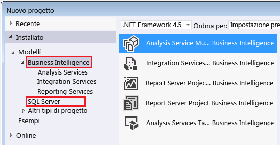

# Strumenti e applicazioni usati in Analysis Services
  È importante trovare le applicazioni e gli strumenti necessari per la creazione di modelli di Analysis Services e la gestione dei database associati in un'istanza di Analysis Services.  
  
## Strumenti di progettazione dei modelli di Analysis Services  
 I modelli tabulari e multidimensionali vengono creati sulla base di modelli di progetto in una soluzione compilata all'interno della shell di Visual Studio. Il modello di progetto offre strumenti di progettazione per la creazione di tabelle, relazioni, cubi, dimensioni e ruoli che compongono una soluzione di Analysis Services. La shell offre l'area di lavoro visiva, le pagine delle proprietà e il framework di comando all'interno del quale viene creato il progetto. Lo strumento di progettazione sia per la shell che per i modelli può essere scaricato gratuitamente dal Web.  
  
 I modelli usano un'impostazione del livello di compatibilità per determinare la disponibilità di funzionalità e la versione di Analysis Services che deve eseguire il modello.  La possibilità di specificare un determinato livello di compatibilità dipende in parte dalla progettazione del modello.  
  
 I modelli tabulari che usano le funzionalità più recenti di SQL Server 2016, ad esempio i file BIM in formato JSON tabulare e il filtro incrociato a due direzioni, devono essere creati al livello di compatibilità 1200, nella versione di SQL Server Data Tools per Visual Studio 2015 rilasciata contemporaneamente a SQL Server 2016 (il link di download è riportato di seguito).  
  
 Se è necessario un livello di compatibilità inferiore, ad esempio perché si desidera distribuire un modello in una versione precedente di Analysis Services, è comunque possibile usare lo strumento di progettazione modelli di SSDT per Visual Studio 2015. Le versioni più recenti dello strumento supportano la creazione di qualsiasi tipo di modello, tabulare o multidimensionale, a qualsiasi livello di compatibilità. Non è necessario conservare gli strumenti obsoleti per creare o modificare un modello precedente.  
  
### Scaricare lo strumento di progettazione modelli  
 [!INCLUDE[ssBIDevStudio](../includes/ssbidevstudio-md.md)], noto in precedenza come SQL Server Data Tools per Business Intelligence (SSDT-BI) e prima ancora come Business Intelligence Development Studio (BIDS), viene usato per creare i modelli di Analysis Services.  
  
||  
|-|  
|**[Download di SSDT per Visual Studio 2015](https://msdn.microsoft.com/mt429383)**|  
  
 È consigliabile usare SQL Server Data Tools per Visual Studio 2015 piuttosto che le versioni precedenti dello strumento di progettazione. La soluzione contiene modelli di progetto per tutti i tipi di contenuto di SQL Server, tra cui database relazionali, modelli di Analysis Services, report di Reporting Services e pacchetti di Integration Services.  
  
 SSDT viene eseguito nella shell di Visual Studio 2015. Se si usa Visual Studio 2015, l'installazione di SSDT aggiunge solo i modelli di progetto. Se Visual Studio 2015 non è ancora in uso, vengono installati sia la shell che i modelli.  
  
 Se si dispone di una versione precedente di SSDT-BI o BIDS installata nel computer, la versione più recente viene installata side-by-side alla versione precedente.  
  
 Dopo l'installazione di SSDT, i modelli di Business Intelligence vengono visualizzati nella finestra di dialogo Nuovo progetto.  
  
   
  
## Strumenti di amministrazione  
  
### Scaricare SQL Server Management Studio  
 Management Studio è lo strumento di amministrazione principale per tutte le funzionalità di SQL Server, compreso Analysis Services. Ora è un download separato.  
  
||  
|-|  
|**[Scaricare SQL Server Management Studio](https://msdn.microsoft.com/library/mt238290.aspx)**|  
  
 In SQL Server 2016 Management Studio include gli eventi estesi (XEvent) per Analysis Services, offrendo un'alternativa semplificata alle tracce di SQL Server Profiler usate per l'attività di monitoraggio e la diagnosi dei problemi del server. Per altre informazioni, vedere [Monitor Analysis Services with SQL Server Extended Events](../analysis-services/instances/monitor-analysis-services-with-sql-server-extended-events.md) .  
  
### SQL Server Profiler  
 Sebbene sia ufficialmente deprecato a favore di xEvents, SQL Server Profiler consente di monitorare facilmente connessioni, esecuzione di query MDX e altre operazioni del server. SQL Server Profiler viene installato per impostazione predefinita. È possibile trovarlo con le applicazioni di SQL Server in App in Windows Server 2012.  
  
### PowerShell  
 È possibile usare i comandi PowerShell per eseguire molte attività amministrative. Per altre informazioni, vedere [PowerShell scripting in Analysis Service](../analysis-services/instances/powershell-scripting-in-analysis-services.md) (Script di PowerShell in Analysis Services).  
  
### Strumenti della community e di terze parti  
 Controllare la [pagina codeplex di Analysis Services](http://sqlsrvanalysissrvcs.codeplex.com/) per esempi di codice della community. I [forum](http://social.msdn.microsoft.com/Forums/sqlserver/home?forum=sqlanalysisservices) possono essere utili per cercare consigli sugli strumenti di terze parti che supportano Analysis Services.  
  
## Vedere anche  
 [Livello di compatibilità di un database multidimensionale &#40;Analysis Services&#41;](../analysis-services/multidimensional-models/compatibility-level-of-a-multidimensional-database-analysis-services.md)   
 [Livello di compatibilità per i modelli tabulari in Analysis Services](../analysis-services/tabular-models/compatibility-level-for-tabular-models-in-analysis-services.md)  
  
  