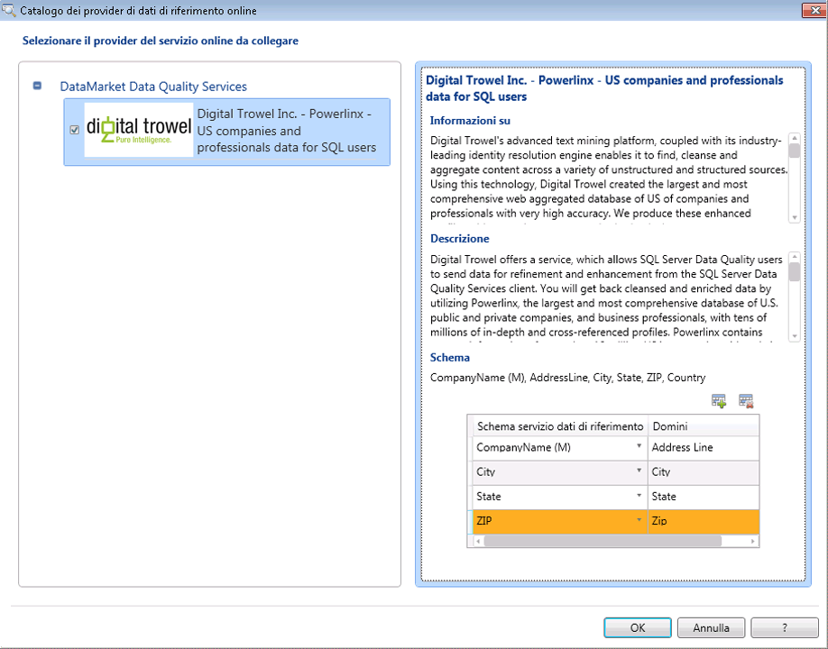

# Collegare un dominio o un dominio composito ai dati di riferimento

[!INCLUDE[appliesto-ss-xxxx-xxxx-xxx-md-winonly](../includes/appliesto-ss-xxxx-xxxx-xxx-md-winonly.md)]

  In questo argomento viene descritto come collegare domini/domini compositi in una Knowledge Base Data Quality a un servizio dati di riferimento in Windows Azure Marketplace per compilare le informazioni rispetto ai dati di alta qualità nei dati di riferimento. Ogni servizio dati di riferimento contiene uno schema (colonne di dati). Dopo aver collegato un dominio o un dominio composito a un servizio dati di riferimento, è necessario eseguire il mapping del dominio collegato o i singoli domini all'interno del dominio composito collegato alle colonne appropriate in uno schema del servizio dati di riferimento. Il collegamento di un dominio composito a un servizio dati di riferimento consente di collegare solo un dominio a un servizio dati di riferimento e quindi di eseguire il mapping dei singoli domini all'interno del dominio composito alle colonne appropriate nello schema del servizio dati di riferimento.  
  
> [!WARNING]  
>  Il dominio composito collegato a un servizio dati di riferimento è disponibile nell'elenco a discesa dei domini durante il mapping dei domini alle colonne nello schema del servizio dati di riferimento. Non eseguire il mapping del dominio composito a una colonna nello schema del servizio dati di riferimento; è necessario eseguire il mapping solo dei singoli domini all'interno di un dominio composito alle colonne appropriate nello schema del servizio dati di riferimento. In caso contrario, si verificherà un errore.  
  
 Uno schema di servizio dati di riferimento può contenere una colonna obbligatoria di cui è necessario eseguire il mapping con il dominio appropriato qualora si scegliesse di utilizzare il servizio dati di riferimento. La colonna obbligatoria in uno schema dati di riferimento viene identificata con "(M)" per il nome della colonna. Ad esempio, **AddressLine** è la colonna di schema obbligatoria in **Melissa Data – Address Data** e **CompanyName** è la colonna di schema obbligatoria in **Digital Trowel Inc. – Us companies and professional data for SQL users**.  
  
 In questo argomento, si creeranno quattro domini: **Riga indirizzo**, **Città**, **Stato**e **CAP**in un dominio composito, **Verifica indirizzo**, collegare il dominio composito al servizio dati di riferimento **Melissa Data – Controllo indirizzo** , quindi eseguire il mapping dei singoli domini all'interno del dominio composito alle colonne appropriate nello schema del servizio dati di riferimento.  
  
## Prima di iniziare  
  
###   Prerequisiti  
 È necessario avere configurato [!INCLUDE[ssDQSnoversion](../includes/ssdqsnoversion-md.md)] (DQS) per utilizzare i servizi dati di riferimento. Vedere [Configurare DQS per l'uso di dati di riferimento](../data-quality-services/configure-dqs-to-use-reference-data.md).  
  
###   Sicurezza  
  
#### Autorizzazioni  
 Per eseguire il mapping dei domini ai dati di riferimento, è necessario disporre del ruolo dqs_kb_editor nel database DQS_MAIN.  
  
##   Eseguire il mapping dei domini ai dati di riferimento da Melissa Data  
  
1.  [!INCLUDE[ssDQSInitialStep](../includes/ssdqsinitialstep-md.md)] [Eseguire l'applicazione Data Quality Client](../data-quality-services/run-the-data-quality-client-application.md).  
  
2.  Nella schermata iniziale del [!INCLUDE[ssDQSClient](../includes/ssdqsclient-md.md)] in **Gestione Knowledge Base**fare clic su **Nuova Knowledge Base**.  
  
3.  Nella schermata **Nuova Knowledge Base** digitare un nome per la nuova Knowledge Base, fare clic sull'attività **Gestione dominio** , quindi fare clic su **Crea**.  
  
4.  Nello schermata **Gestione dominio** fare clic sull'icona **Crea un dominio** per creare un dominio. Creare i quattro domini seguenti: **Riga indirizzo**, **Città**, **Stato**e **CAP**.  
  
5.  Fare clic sull'icona **Crea un dominio composito** per creare un dominio composito. Nella finestra di dialogo **Crea un dominio composito** digitare **Verifica indirizzo** nella casella **Nome dominio composito** e includervi tutti i domini creati nel passaggio 3. Fare clic su **OK**.  
  
6.  Nel riquadro **Dominio** sul lato sinistro selezionare il dominio composito facendo clic su **Verifica indirizzo**, quindi fare clic sulla scheda **Dati di riferimento** sul lato destro.  
  
7.  Fare clic sull'icona **Sfoglia** .  
  
8.  Nella finestra di dialogo **Catalogo dei provider di dati di riferimento online** :  
  
    1.  In **DataMarket Data Quality Services**selezionare la casella **Melissa Data - Controllo indirizzo** .  
  
    2.  Eseguire il mapping delle colonne del servizio dati di riferimento Melissa Data - Controllo indirizzo con i domini appropriati (Riga indirizzo, Città, Stato e CAP). Per eseguire il mapping delle colonne, selezionare una colonna del servizio dati di riferimento nella colonna **Schema servizio dati di riferimento** , quindi selezionare il dominio appropriato nella colonna **Dominio** . Per aggiungere più righe nella tabella, fare clic sull'icona **Aggiungi voce di schema** .  
  
    3.  Fare clic su **OK** per salvare le modifiche e chiudere la finestra di dialogo **Catalogo dei provider di dati di riferimento online** .  
  
           
  
        > [!NOTE]  
        >  -   Nella finestra di dialogo **Catalogo dei provider di dati di riferimento online** il nodo **DataMarket Data Quality Services** mostra tutti i provider del servizio dati di riferimento a cui è stata effettuata la sottoscrizione in Windows Azure Marketplace. Se in DQS sono stati configurati provider del servizio dati di riferimento di terze parti online, essi verranno visualizzati in un altro nodo denominato **Provider online diretti di terzi** (non disponibile ora poiché in DQS non è stato configurato alcun provider del servizio dati di riferimento di terze parti online).  
  
9. Si tornerà alla scheda **Dati di riferimento** . Nell'area **Impostazioni provider** modificare i valori nelle caselle seguenti, se necessario:  
  
    -   **Soglia di correzione automatica**: le correzioni del servizio dati di riferimento con livello di confidenza al di sopra di questi valori soglia verranno effettuate automaticamente. Immettere un valore nella notazione decimale del valore percentuale corrispondente. Ad esempio, digitare 0,9 per 90%.  
  
    -   **Candidati suggeriti**: numero di candidati suggeriti da visualizzare nel servizio dati di riferimento.  
  
    -   **Confidenza min**: i suggerimenti del servizio dati di riferimento con livello di confidenza al di sotto di questo valore verranno ignorati. Immettere un valore nella notazione decimale del valore percentuale corrispondente. Ad esempio, digitare 0,6 per 60%.  
  
10. Fare clic su **Fine** per pubblicare la Knowledge Base. Al termine della pubblicazione della Knowledge Base verrà visualizzato un messaggio di conferma.  
  
 È possibile utilizzare ora questa Knowledge Base per l'attività di pulizia in un progetto Data Quality per standardizzare e pulire gli indirizzi US nei dati di origine in base alle informazioni fornite da Melissa Data tramite Windows Azure Marketplace.  
  
##   Completamento: fasi successive all'esecuzione del mapping di un dominio ai dati di riferimento  
 Creare un progetto Data Quality ed eseguire l'attività di pulizia sui dati di origine che contengono gli indirizzi US confrontandolo con la Knowledge Base creata in questo argomento. Vedere [Pulire i dati mediante le informazioni dei dati di riferimento &#40;esterni&#41;](../data-quality-services/cleanse-data-using-reference-data-external-knowledge.md).  
  
## Vedere anche  
 [Servizi dati di riferimento in DQS](../data-quality-services/reference-data-services-in-dqs.md)   
 [Pulizia dei dati](../data-quality-services/data-cleansing.md)  
  
  
