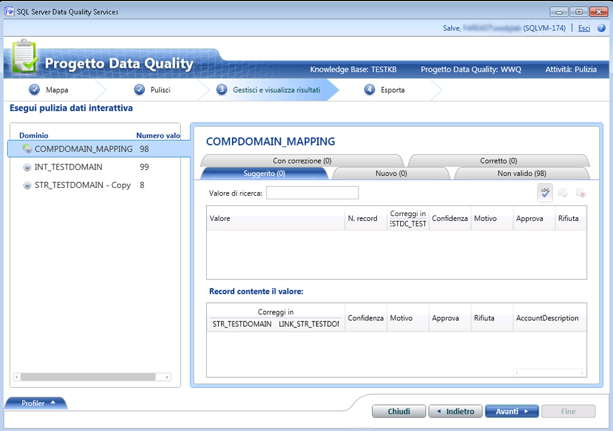

# Pulire i dati mediante le informazioni dei dati di riferimento (esterni)

[!INCLUDE[appliesto-ss-xxxx-xxxx-xxx-md-winonly](../includes/appliesto-ss-xxxx-xxxx-xxx-md-winonly.md)]

  In questo argomento viene descritto come pulire i dati utilizzando le informazioni dei provider di dati di riferimento. Mentre tutti i passaggi per l'esecuzione di un'attività di pulizia rimangono gli stessi per la pulizia dei dati mediante le informazioni dei provider di dati di riferimento, come descritto in [Pulire i dati mediante DQS &#40;informazioni interne&#41;](../data-quality-services/cleanse-data-using-dqs-internal-knowledge.md), in questo argomento vengono illustrate le informazioni specifiche per la pulizia dei dati mediante il servizio dati di riferimento in [!INCLUDE[ssDQSnoversion](../includes/ssdqsnoversion-md.md)] (DQS).  

> [!IMPORTANT]
> Questo articolo cita servizi dati di riferimento di terze parti che in precedenza erano disponibili in Azure DataMarket. DataMarket e i Servizi dati, inclusi ad esempio i dati di indirizzi Melissa, non sono più disponibili a partire dal 31/12/2016. Di conseguenza non è più possibile eseguire gli esempi di questo articolo con i servizi specificati di DataMarket. È comunque possibile usare servizi di dati di riferimento, disponibili direttamente online da provider di dati di riferimento terzi.
 
 Quando in DQS si utilizza la funzionalità del servizio dati di riferimento per pulire i dati, il processo di pulizia di DQS invia i valori di dominio di cui è stato eseguito il mapping al provider del servizio dati di riferimento come richiesta batch. Il servizio dati di riferimento risponde con le informazioni seguenti:  
  
-   Correzione suggerita  
  
-   Confidenza  
  
-   Informazioni aggiuntive sul dominio di cui è stato eseguito il mapping. I dati di riferimento possono inoltre standardizzare, analizzare o migliorare l'origine con dati aggiuntivi. Tali informazioni vengono fornite nei campi aggiuntivi della risposta.  
  
 Dopo avere ottenuto la risposta dal servizio dati di riferimento, durante l'attività di pulizia in DQS si verifica quanto segue:  
  
-   In base ai valori **Soglia di correzione automatica** e **Confidenza min** specificati durante l'esecuzione del mapping dei domini con il servizio dati di riferimento, i valori di dominio vengono suggeriti o corretti automaticamente in base al livello di confidenza.  
  
    > [!NOTE]  
    >  Durante la pulizia dei dati mediante le informazioni del servizio dati di riferimento vengono applicati i valori soglia specificati al momento dell'esecuzione del mapping di un dominio a un servizio dati di riferimento e non i valori specificati nella scheda **Impostazioni generali** della sezione **Configurazione** . Per informazioni su come specificare i valori soglia per la pulizia dei dati di riferimento, vedere il passaggio 9 in [Collegare un dominio o un dominio composito ai dati di riferimento](../data-quality-services/attach-domain-or-composite-domain-to-reference-data.md).  
  
-   I valori di dominio vengono suddivisi nelle categorie seguenti: **Suggeriti**, **Nuovi**, **Non validi**, **Con correzione**e **Corretti**.  
  
-   I dati aggiuntivi vengono aggiunti all'origine e le informazioni sono disponibili insieme ai dati puliti per l'esportazione.  
  
## Prima di iniziare  
  
###   Prerequisiti  
 È necessario avere eseguito il mapping dei domini richiesti in una Knowledge Base DQS al servizio dati di riferimento appropriato. La Knowledge Base deve inoltre contenere informazioni sul tipo di dati da pulire. Se si desidera pulire dati di origine che contengono indirizzi US, ad esempio, è necessario eseguire il mapping dei domini a un provider del servizio dati di riferimento che fornisce dati di alta qualità per gli indirizzi US. Per altre informazioni, vedere [Collegare un dominio o un dominio composito ai dati di riferimento](../data-quality-services/attach-domain-or-composite-domain-to-reference-data.md).  
  
###   Sicurezza  
  
####   Permissions  
 Per eseguire la pulizia dei dati è necessario disporre del ruolo dqs_kb_editor o dqs_kb_operator nel database DQS_MAIN.  
  
##   Pulire i dati mediante le informazioni dei dati di riferimento  
 Viene fatto riferimento allo stesso esempio di uso dei domini dei quali è stato eseguito il mapping nell'argomento precedente, [Collegare un dominio o un dominio composito ai dati di riferimento](../data-quality-services/attach-domain-or-composite-domain-to-reference-data.md), con il servizio Melissa Data in Microsoft Azure Marketplace. Vengono utilizzati gli stessi domini per pulire alcuni indirizzi US di esempio. I passaggi per pulire i dati sono uguali a quelli descritti in [Pulire i dati mediante DQS &#40;informazioni interne&#41;](../data-quality-services/cleanse-data-using-dqs-internal-knowledge.md). Eventuali differenze verranno indicate durante il processo, laddove necessario.  
  
1.  Creare un progetto Data Quality e selezionare l'attività **Pulizia** . Vedere [Create a Data Quality Project](../data-quality-services/create-a-data-quality-project.md).  
  
2.  Nella pagina **Mappa** eseguire il mapping dei 4 domini seguenti con le colonne appropriate nei dati di origine: **Riga indirizzo**, **Città**, **Stato**e **CAP**. Scegliere **Avanti**.  
  
    > [!NOTE]  
    >  Poiché il mapping di tutti e 4 i domini è stato eseguito all'interno del dominio composito **Verifica indirizzo** , la pulizia dei dati verrà eseguita a livello di dominio composito e non a livello di singolo dominio.  
  
3.  Nella pagina **Pulizia** eseguire il processo di pulizia computerizzato facendo clic su **Avvia**. Al termine del processo di pulizia, fare clic su **Avanti**.  
  
    > [!NOTE]  
    >  Nella pagina **Pulisci** vengono visualizzate le informazioni sui domini associati al servizio dati di riferimento nei due modi seguenti:  
    >   
    >  -   Sotto il pulsante **Start** viene visualizzato un messaggio simile al seguente: "I domini \<Domain1>, \<Domain2>,... \<DomainN> vengono puliti utilizzando il provider di servizi di dati di riferimento". In questo esempio verrà visualizzato il messaggio seguente: "La verifica dell'indirizzo del dominio viene pulita usando il provider del servizio dati di riferimento".  
    > -   L'icona  viene visualizzata nell'area **Profiler** per i domini associati al provider del servizio dati di riferimento. Nell'esempio l'icona verrà visualizzata per il dominio composito **Verifica indirizzo** .  
  
4.  Verificare i valori di dominio nella pagina **Gestisci e visualizza i risultati** . Il servizio dati di riferimento può visualizzare più suggerimenti, se disponibili, per un valore a seconda del numero massimo di suggerimenti specificato nella casella **Candidati suggeriti** durante l'esecuzione del mapping del dominio al servizio dati di riferimento. Per l'indirizzo US seguente vengono visualizzati, ad esempio, due suggerimenti:  
  
     **Valore originale:**  
  
    |Riga indirizzo|Città|State|CAP|  
    |------------------|----------|-----------|---------|  
    |1 msft way|Redmond||98052|  
  
     **Valori suggeriti:**  
  
    |Riga indirizzo|Città|State|CAP|  
    |------------------|----------|-----------|---------|  
    |1 Microsoft Way|Redmond|WA|98052|  
    |PO Box 1|Redmond|WA|98073|  
  
       
  
    > [!NOTE]  
    >  Per i domini compositi vengono evidenziati in un colore diverso anche i singoli domini corretti durante il processo di pulizia computerizzato. In questo caso, ad esempio, sono stati corretti i domini **Riga indirizzo** e **Stato** che pertanto vengono evidenziati in ciano.  
  
5.  Dopo avere verificato tutti i valori di dominio, fare clic su **Avanti** per esportare i dati.  
  
6.  Nella pagina **Esporta** si noterà che oltre alle informazioni normali dell'attività di pulizia per ogni dominio (Origine, Motivo, Confidenza e Stato), sono presenti informazioni aggiuntive fornite dal servizio dati di riferimento Melissa Data sui dati di indirizzo, ad esempio latitudine e longitudine dell'indirizzo, nome del comune, tipo di indirizzo (palazzo a molti piani, strada, ecc.) e così via.  
  
7.  Esportare i dati nella destinazione richiesta (SQL Server, CSV o Excel) e fare clic su **Fine** per chiudere il progetto.  
  
    > [!IMPORTANT]  
    >  Se si utilizza la versione a 64 bit di Excel, non è possibile esportare i dati puliti in un file di Excel. È possibile eseguire l'esportazione solo in un database di SQL Server o in un file con estensione csv.  
  
  
