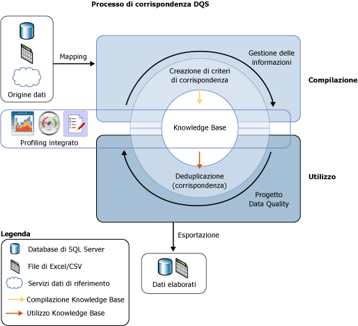

# Corrispondenza di dati
  Il processo di corrispondenza tra dati [!INCLUDE[ssDQSnoversion](../includes/ssdqsnoversion-md.md)] (DQS) consente di ridurre la duplicazione dei dati e di migliorarne l'accuratezza in un'origine dati. Il processo analizza il livello di duplicazione in tutti i record di una singola origine dati, restituendo le probabilità ponderate di una corrispondenza per ciascun set di record confrontato. È possibile quindi decidere quali record corrispondono ed eseguire le azioni appropriate sui dati di origine.  
  
 Il processo di corrispondenza DQS offre i vantaggi seguenti:  
  
-   L'individuazione delle corrispondenze consente di eliminare le differenze tra valori di dati che devono essere uguali, determinando il valore corretto e riducendo il numero di errori che può essere causato dalle differenze nei dati. Nomi e indirizzi, ad esempio, sono spesso i dati identificativi per un'origine dati, e più in particolare dati sul cliente, tuttavia tali dati possono subire modifiche e deteriorarsi nel tempo. L'esecuzione del processo di individuazione delle corrispondenze per identificare e correggere questi errori può semplificare notevolmente l'utilizzo e la manutenzione dei dati.  
  
-   L'individuazione delle corrispondenze consente di garantire l'uniformità di valori che risultano equivalenti, ma che sono stati immessi in formati o stili diversi.  
  
-   L'individuazione delle corrispondenze identifica le corrispondenze esatte e quelle approssimative, consentendo la rimozione dei dati duplicati in base al criterio che si è stabilito. È possibile definire il punto oltre cui una corrispondenza approssimativa non è più da considerarsi una corrispondenza effettiva. Si definiscono quindi i campi da valutare per la corrispondenza e quelli da escludere dalla valutazione.  
  
-   DQS consente di creare criteri di corrispondenza utilizzando un processo computerizzato, di modificarlo in modo interattivo in base ai risultati di corrispondenza e di aggiungerlo a una Knowledge Base riutilizzabile.  
  
-   È possibile reindicizzare dati copiati dall'origine alla tabella di staging oppure non reindicizzarli, a seconda dello stato dei criteri di corrispondenza e dei dati di origine. Le prestazioni potrebbero risultare migliorate se si evita la reindicizzazione.  
  
 È possibile eseguire il processo di corrispondenza insieme agli altri processi di pulizia dei dati per migliorare la qualità generale dei dati. È inoltre possibile eseguire la deduplicazione dei dati utilizzando la funzionalità DQS incorporata in Master Data Services. Per altre informazioni, vedere [Panoramica di Master Data Services &#40;MDS&#41;](../master-data-services/master-data-services-overview-mds.md).  
  
 Nella figura seguente viene illustrata la modalità di individuazione delle corrispondenze tra dati in DQS:  
  
   
  
##   Come eseguire la corrispondenza di dati  
 Come per altri processi correlati qualità dei dati in DQS, l'individuazione di corrispondenze tra dati viene eseguita compilando una Knowledge Base ed eseguendo un'attività corrispondente in un progetto di qualità dei dati osservando i passaggi seguenti:  
  
1.  Creare criteri di corrispondenza nella Knowledge Base  
  
2.  Eseguire un processo di deduplicazione in un'attività corrispondente che è parte di un progetto di qualità dei dati.  
  
###   Compilazione di criteri di corrispondenza  
 Preparare la Knowledge Base per l'esecuzione degli abbinamenti creando criteri di corrispondenza nella Knowledge Base stessa, così da definire la modalità con cui DQS assegna le probabilità di corrispondenza. I criteri di corrispondenza sono costituiti da una o più le regole di corrispondenza che identificano i domini che verranno utilizzati da DQS per la valutazione della corrispondenza tra due record e specificano l'importanza da assegnare a ciascun valore di dominio nella valutazione della corrispondenza stessa. Specificare nelle regole se i valori di dominio devono essere una corrispondenza esatta o se possono essere solo simili e specificare il livello di similitudine. Specificare inoltre se una corrispondenza di dominio è un prerequisito.  
  
 L'attività dei criteri di corrispondenza nella procedura guidata Gestione Knowledge Base analizza i dati di esempio applicando ogni regola di corrispondenza per confrontare record per volta in tutto l'intervallo di record. I record i cui punteggi di corrispondenza sono maggiori di un minimo specificato vengono raggruppati in cluster nei risultati di corrispondenza. Questi risultati di corrispondenza non vengono aggiunti alla Knowledge Base, vengono bensì utilizzati al fine di ottimizzare le regole di corrispondenza. La creazione di criteri di corrispondenza può essere un processo iterativo nel quale si modificano le regole di corrispondenza in base ai risultati di corrispondenza o a statistiche di profiling.  
  
 Per un dominio è possibile specificare che le stringhe di dati vengano normalizzate quando si caricano dati nel dominio dall'origine dati. Questo processo è costituito dalla sostituzione dei caratteri speciali con valori null o spazi, il che spesso rimuove la differenza tra due stringhe. Ciò può aumentare la precisione della corrispondenza e può spesso consentire a un risultato di corrispondenza di superare la soglia di corrispondenza minima, laddove senza normalizzazione tale risultato non raggiungerebbe tale soglia.  
  
> [!NOTE]  
>  I valori null nei campi corrispondenti di due record verranno considerati come una corrispondenza.  
  
 I criteri di corrispondenza vengono eseguiti su domini di cui è stato eseguito il mapping ai dati di esempio. È possibile specificare se i dati vanno o meno copiati dall'origine dati nella tabella di staging e reindicizzati quando si eseguono i criteri di corrispondenza. Ciò è possibile sia quando si compila la Knowledge Base che quando si esegue il progetto corrispondente. Le prestazioni possono risultare migliorate se si evita la reindicizzazione. La reindicizzazione non è necessaria se le condizioni seguenti sono vere: i criteri di corrispondenza non sono cambiati e non è stata aggiornata l'origine dati, né rieseguito il mapping dei criteri, né selezionata una nuova origine dati, né eseguito il mapping di uno o più nuovi domini.  
  
 Al momento della creazione, ogni regola di corrispondenza viene salvata nella Knowledge Base. Tuttavia, una Knowledge Base può essere disponibile per l'uso in un progetto Data Quality solo quando viene pubblicata. Inoltre, fino al momento della pubblicazione della Knowledge Base, le regole di corrispondenza presenti in quest'ultima non possono essere modificate da un utente diverso da quello che l'ha creata.  
  
###   Esecuzione di un progetto corrispondente  
 DQS esegue la deduplicazione dei dati confrontando ogni riga nei dati di origine con tutte le altre righe, utilizzando i criteri di corrispondenza definiti nella Knowledge Base e producendo una probabilità che le righe presentino una corrispondenza. Ciò è possibile in un progetto Data Quality dotato di un tipo di corrispondenza. L'individuazione delle corrispondenze è uno dei passaggi principali in un progetto Data Quality. È opportuno eseguirlo dopo la pulizia dei dati, in modo che il confronto possa avere luogo tra dati privi di errori. Prima di eseguire un processo di corrispondenza, è possibile esportare i risultati del progetto di pulizia in una tabella dati o in un file csv, quindi creare un progetto corrispondente nel quale si esegue il mapping dei risultati della pulizia ai domini del progetto corrispondente.  
  
 Un progetto di corrispondenza dei dati è costituito da un processo computerizzato e da un processo interattivo. Il progetto corrispondente applica le regole di corrispondenza nei criteri di corrispondenza all'origine dati da valutare. Tale processo consente di valutare le probabilità che due righe coincidano tramite un punteggio di corrispondenza. Verranno considerati corrispondenti solo i record con probabilità di corrispondenza maggiori di un valore impostato dall'amministratore dei dati nei criteri di corrispondenza.  
  
 Quando DQS esegue l'analisi di corrispondenza, viene creato un cluster di record che DQS considera corrispondenze. DQS identifica casualmente uno dei record in ogni cluster come record pivot o principale. L'amministratore dei dati verifica i risultati corrispondenti e rifiuta qualsiasi record che non rappresenti una corrispondenza appropriata per un cluster. L'amministratore dei dati seleziona quindi una regola di sopravvivenza che DQS utilizzerà per determinare il record che supererà il processo di corrispondenza e sostituirà i record corrispondenti. La regola di sopravvivenza può essere "Record pivot" (il valore predefinito), "Il record più completo e più lungo", "Record più completo" o "Record più lungo". DQS determina il record superstite (principale) in ogni cluster in base al record che più si avvicina a soddisfare il criterio o criteri della regola di sopravvivenza. Se più record in un cluster specifico sono conformi alla regola di sopravvivenza, DQS ne seleziona uno in modo casuale. DQS consente di visualizzare i cluster che presentano record comuni come un solo cluster mediante la selezione dell'opzione "Mostra cluster non sovrapposti". Per visualizzare i risultati in base questa impostazione, il processo di corrispondenza deve essere eseguito.  
  
 È possibile esportare i risultati del processo di corrispondenza in una tabella di SQL Server o in un file csv. È possibile esportare risultati della corrispondenza in due modi: record corrispondenti e record non corrispondenti, oppure record superstiti che includono solo il record superstite per un cluster nonché i risultati non corrispondenti. Nei record superstiti, se lo stesso record viene identificato come superstite per più cluster, tale record verrà esportato solo una volta.  
  
## Argomenti della sezione  
 È possibile eseguire le attività seguenti in relazione all'individuazione di corrispondenze in DQS:  
  
|||  
|-|-|  
|Creare e testare regole di corrispondenza in criteri di corrispondenza|[Creare criteri di corrispondenza](../data-quality-services/create-a-matching-policy.md)|  
|Eseguire l'individuazione delle corrispondenze in un progetto Data Quality|[Eseguire un progetto corrispondente](../data-quality-services/run-a-matching-project.md)|  
  
  
